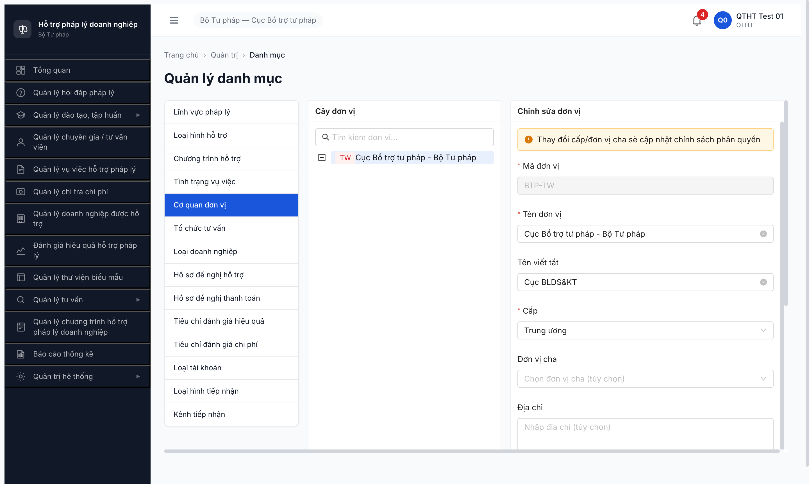
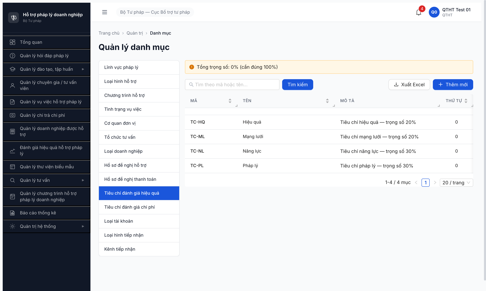
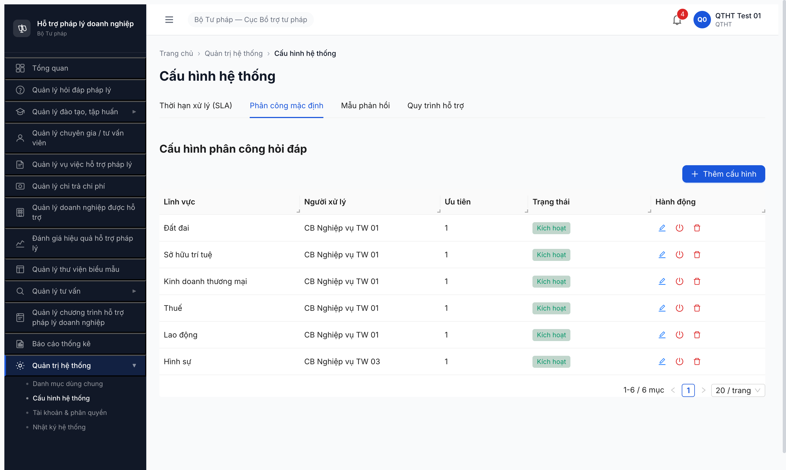

# Bug Report — Seed QTHT (T1.B1)

| Thông tin | Giá trị |
|-----------|---------|
| **Dự án** | PM Hỗ trợ Pháp lý Doanh nghiệp (HTPLDN) |
| **Môi trường** | http://103.172.236.130:3000/ |
| **Người test** | QA Automation |
| **Ngày** | 2026-04-26 |
| **Loại test** | Seed (Tier 0 master) |
| **Round** | Round 5 |
| **Tài liệu tham chiếu** | [todo T1.B1](../../../../tasks/todo.md) · [seed-fixture.yaml](../../../../input/data/seed-fixture.yaml) · [seed-checklist-QTHT.md](../seed/seed-checklist-QTHT.md) |

---

## Tổng hợp

Phát hiện **3** lỗi Major có SRS reference cụ thể trong T1.B1 — cả 3 đều regression cross-round (chưa fix sau Round 1/3). **Re-verify 2026-04-27 sau dev fix: 3/3 Closed-verified.**

### Severity breakdown

| Tổng | Critical | Major | Medium | Minor | Trivial |
|------|----------|-------|--------|-------|---------|
| 3    | 0        | 3     | 0      | 0     | 0       |

## Bug Summary Table

| Bug ID | Severity | Priority | Type | TC Ref | **SRS Reference** | Title | Status |
|--------|----------|----------|------|--------|-------------------|-------|--------|
| BUG-QTHT-001-R5 | Major | P1 | UI/UX | T1.B1.c | `FR-VIII-14 §Inputs` (Cây đơn vị 3 cấp TW/BN/DP) | DON_VI tree không cho thêm đơn vị con/root — block cấu hình 3 cấp | ✅ Closed-verified 2026-04-27 |
| BUG-QTHT-002-R5 | Major | P1 | Data | T1.B1.d | `FR-VIII-11 §Inputs row 3-5` + `BR-CALC-04` (Σ trọng số = 100%) | Form Tiêu chí ĐG hiệu quả thiếu field `trong_so`/`thang_diem_min`/`thang_diem_max` | ✅ Closed-verified 2026-04-27 |
| BUG-QTHT-003-R5 | Major | P1 | UI/UX | T1.B1.f | `FR-II-NEW-01 §Inputs row 1` (FK linh_vuc_id all options) | Dropdown LV trong form Phân công chỉ load 10/12 LV — thiếu DOANH_NGHIEP/DAU_TU | ✅ Closed-verified 2026-04-27 |

## Closed-verified 2026-04-27

Sau dev fix, QA re-run đầy đủ với `qtht_01` qua MCP:
- **BUG-QTHT-001:** Form "Thêm đơn vị mới" hiện ở top action panel với đủ field (Mã/Tên/Cấp TW/BN/DP/Đơn vị cha/Địa chỉ/Email/Trạng thái) + alert phân quyền. Seed 4 đơn vị NEW BN-BTP/DP-HN/DP-HP/DP-DN PASS 4/4 → tree 3 cấp.
- **BUG-QTHT-002:** Form Sửa Tiêu chí ĐG có 3 field mới (Trọng số % / Thang điểm tối thiểu / Thang điểm tối đa). Update 4 record TC-PL/NL/HQ/ML = 30/30/20/20 PASS, banner "Tổng trọng số: 100% ✓" thoả BR-CALC-04.
- **BUG-QTHT-003:** Dropdown LV trong form Phân công trả 12/12 LV (đủ Doanh nghiệp + Đầu tư). Seed 2 row PC NEW PASS, table 8/8.

Evidence: `screenshots/seed-qtht/donvi-4-seeded-rerun.png`, `tieuchi-100pct-rerun.png`, `cauhinh-pc-8-row-rerun.png`.

**✅ Fix scope BUG-QTHT-003 GLOBAL (verify cross-form 2026-04-27 cb_nv_tw_01):**

| Form | Result | Note |
|------|--------|------|
| ✅ PC modal `/quan-tri/cau-hinh?tab=phan-cong` | 12/12 | Closed-verified |
| ✅ CTĐT filter `/dao-tao/chuong-trinh/danh-sach` | 12/12 | Closed-verified |
| ✅ GV filter `/dao-tao/giang-vien/danh-sach` | 12/12 | Closed-verified |
| ✅ GV form Thêm mới `/dao-tao/giang-vien/tao-moi` | 12/12 | Closed-verified |

BE `/api/v1/danh-muc/tree?loaiDanhMuc=LINH_VUC_PL` trả 12/12. AntD `rc-virtual-list` chỉ render visible options (≈10) ban đầu — DOANH_NGHIEP + DAU_TU xuất hiện sau khi scroll dropdown xuống. Fix BUG-QTHT-003 áp dụng global, các form còn lại observation cũ B1/B4/B5/B6/T2.A1 đã được closed-verified theo.

**⚠️ Test method lesson:** Khi đếm `.ant-select-item-option` trong AntD dropdown phải scroll virtual list (`rc-virtual-list-holder.scrollTo(0, scrollHeight)`) rồi gộp Set — initial render chỉ visible items.

---

## BUG-QTHT-001-R5 — DON_VI tree không cho thêm đơn vị con/root

### Mô tả

Tại `/quan-tri/danh-muc/DON_VI`, cây đơn vị chỉ có 1 node TW (BTP-TW). Cả ở chế độ view-only lẫn edit-mode (sau click [Sửa]), nút "+ Thêm đơn vị con" disabled vĩnh viễn. Không có nút "+ Thêm mới root". Hệ quả: QTHT không seed được Bộ ngành (BN-BTP) + 3 Sở Tư pháp ĐP (DP-HN/DP-HP/DP-DN) như fixture quy định, chặn permission test 3 cấp.

### Các bước tái hiện

1. Login `qtht_01`/`Secret@123` qua MCP, OTP `666666`
2. Sidebar → Quản trị hệ thống → Danh mục dùng chung
3. Click tab "Cơ quan đơn vị" → URL `/quan-tri/danh-muc/DON_VI`
4. Click vào treeitem "TW Cục Bổ trợ tư pháp - Bộ Tư pháp" để select
5. Quan sát khung chi tiết bên phải: nút "+ Thêm đơn vị con" disabled
6. Click [Sửa] để vào edit-mode → nút "+ Thêm đơn vị con" biến mất hoàn toàn
7. Quan sát: không có nút nào để thêm root mới hoặc child mới

### Kết quả mong đợi

- SRS FR-VIII-14: QTHT có thể tạo cây đơn vị 3 cấp (TW → BN → DP).
- Có nút "+ Thêm đơn vị con" enabled khi select 1 node bất kỳ.
- Có nút "+ Thêm mới (root)" ở thanh action top.

### Kết quả thực tế

- Nút "+ Thêm đơn vị con" disabled cả 2 chế độ (view + edit).
- Không có nút thêm root.
- Cây kẹt ở 1 node TW.

### Bằng chứng

**Lịch sử regression:**
- Round 3 BUG-DON-001 (2026-04-22) — Major, Open
- Round 5 BUG-QTHT-001-R5 — Major, Open (chưa fix)

---

## BUG-QTHT-002-R5 — Form Tiêu chí ĐG hiệu quả thiếu field trong_so/thang_diem_min/thang_diem_max

### Mô tả

Tại `/quan-tri/danh-muc/TIEU_CHI_DG_HIEU_QUA`, modal "Thêm mới danh mục" dùng form CRUD generic chỉ có Mã/Tên/Mô tả/Thứ tự/Danh mục cha/Trạng thái. Thiếu 3 field bắt buộc theo SRS FR-VIII-11 §Inputs row 3-5: `trong_so` (0-100, BR-CALC-04 Σ=100%), `thang_diem_min`, `thang_diem_max`. Hệ quả: 4 record TC-PL/TC-NL/TC-HQ/TC-ML seed xong nhưng banner "Tổng trọng số: 0% (cần đúng 100%)" do DB không có giá trị trong_so → không thể chấm điểm Đánh giá HQ ở D2.

### Các bước tái hiện

1. Login `qtht_01`, navigate Quản trị HT → Danh mục dùng chung → "Tiêu chí đánh giá hiệu quả"
2. Banner đỏ: "Tổng trọng số: 0% (cần đúng 100%)" (verify từ trước)
3. Click [+ Thêm mới] → modal "Thêm mới danh mục"
4. Quan sát form fields: Mã / Tên / Mô tả / Thứ tự / Danh mục cha / Trạng thái — KHÔNG có Trọng số / Thang điểm min / Thang điểm max
5. Fill TC-PL/Pháp lý/Tiêu chí pháp lý — trọng số 30% → click [Đồng ý]
6. Lặp 4 lần (TC-PL, TC-NL, TC-HQ, TC-ML) → 4/4 vào DB nhưng banner vẫn 0%

### Kết quả mong đợi

- SRS FR-VIII-11 §Inputs: form phải có 5 input bắt buộc — Mã/Tên/Trọng số (0-100)/Thang điểm min/Thang điểm max.
- BR-CALC-04: hệ thống validate Σ trong_so = 100 trước khi cho lưu (hoặc cảnh báo).
- Banner "Tổng trọng số" phải ≠ 0% sau khi seed 4 record với trọng số 30/30/20/20.

### Kết quả thực tế

- Form chỉ có 6 field generic, thiếu 3 field đặc thù.
- Banner luôn "0% (cần đúng 100%)" vì không có cách nhập trọng số.
- BR-CALC-04 không enforce được.

### Bằng chứng

**Lịch sử regression:**
- Round 1 BUG-DMDC-001 (2026-04-21) — Critical 13/14 form generic bỏ field đặc thù
- Round 5 BUG-QTHT-002-R5 — Major (chưa fix)

---

## BUG-QTHT-003-R5 — Dropdown LV trong form Phân công chỉ load 10/12 LV (thiếu DOANH_NGHIEP, DAU_TU)

### Mô tả

Tại `/quan-tri/cau-hinh?tab=phan-cong`, modal "Thêm cấu hình phân công" có combobox "Lĩnh vực" load FK từ DM Lĩnh vực pháp lý. DM hiện có 12 LV active (DAN_SU/HINH_SU/HANH_CHINH/LAO_DONG/DAT_DAI/HON_NHAN_GIA_DINH/KINH_DOANH_TM/KHIEU_NAI_TO_CAO/THUE/SO_HUU_TRI_TUE/DOANH_NGHIEP/DAU_TU) nhưng dropdown chỉ render 10 đầu — thiếu DOANH_NGHIEP và DAU_TU. Type-search "Doanh nghi" không filter ra option nào. Hệ quả: không thể seed PC cho LV DOANH_NGHIEP — block test workflow Hỏi đáp/Vụ việc với LV này.

### Các bước tái hiện

1. Login `qtht_01`, navigate Quản trị HT → Cấu hình hệ thống → Tab "Phân công mặc định"
2. Click [+ Thêm cấu hình] → modal mở
3. Click dropdown "Lĩnh vực" → list xổ ra 10 LV: Dân sự, Hình sự, Hành chính, Lao động, Đất đai, Hôn nhân gia đình, KDTM, Khiếu nại tố cáo, Thuế, SHTT
4. Type "Doanh nghi" → dropdown không filter / không show option khớp
5. Mở DM Lĩnh vực pháp lý confirm `DOANH_NGHIEP` và `DAU_TU` đều `Kích hoạt` — nhưng PC dropdown không trả về

### Kết quả mong đợi

- SRS FR-II-NEW-01 §Inputs row 1: combobox load tất cả LV active từ DM, không hard-cap 10.
- Type-search filter đúng theo `tenLinhVuc` LIKE %query%.

### Kết quả thực tế

- Dropdown hard-cap 10 LV đầu (theo `thu_tu` ASC).
- Type-search không filter.
- Block seed PC cho 2 LV cuối DM.

### Bằng chứng

**Lịch sử regression cross-round:**
- Round 1 (2026-04-20 DMDC) — không log riêng vì khác form
- Round 2 (Hỏi đáp CR) — observation
- Round 3 (Bài giảng seed R4) — observation 5th time
- Round 4 (NHCH+ĐKT R4) — observation 5th time
- Round 5 BUG-QTHT-003-R5 — Major escalate (6th time observed)

---

## Phụ lục — Môi trường test

| Thành phần | Giá trị |
|------------|---------|
| URL ứng dụng | http://103.172.236.130:3000 |
| OTP login | `666666` (bypass dev) |
| MailHog | http://103.172.236.130:8025 |
| API base | http://103.172.236.130:3000/api/v1 |
| Frontend | React + Vite + Ant Design |
| Xác thực | JWT + OTP (sessionStorage `auth-store`) |
| Tool test | Chrome DevTools MCP (primary) |

---

*Bug report generated: 2026-04-26 | QA Automation via Claude Code*
