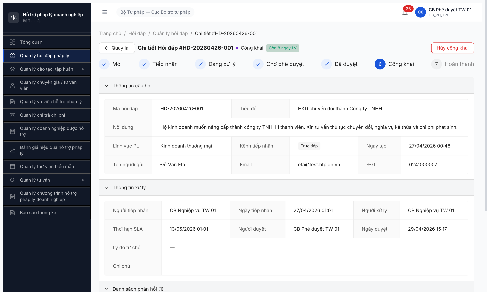
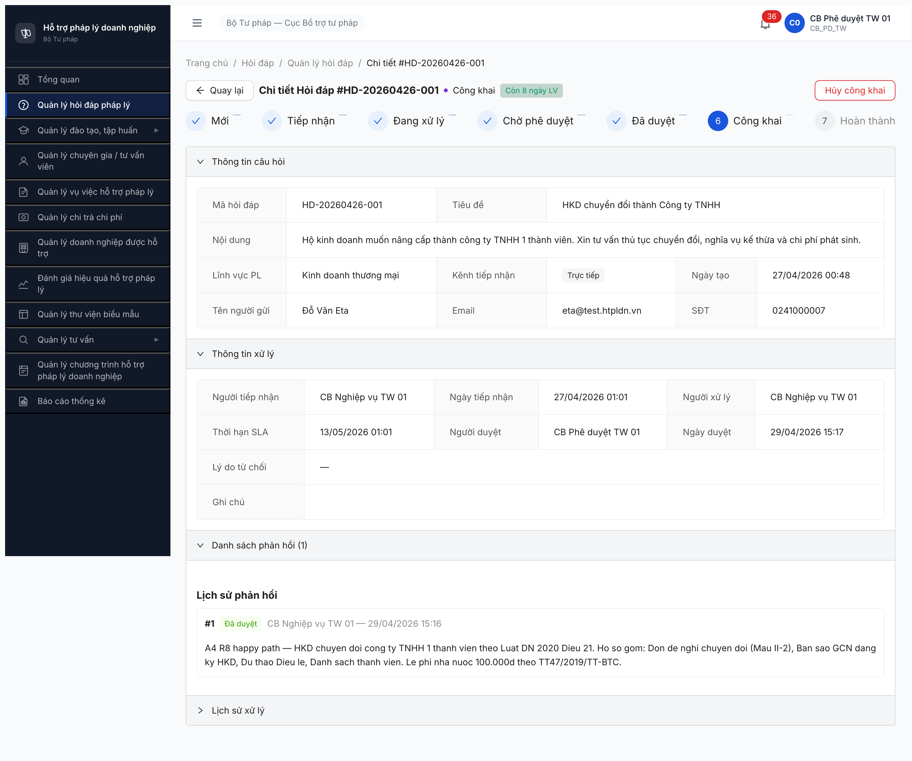

# Workflow Test Report — Hỏi đáp (SM-HOIDAP)

> 🔄 **POST-RESET 2026-05-01:** Dev reset toàn DB. Bảng kiểm tra workflow + bug summary dưới đây là **tham chiếu pre-reset** (R1-R10), KHÔNG phản ánh state hiện tại. Re-test workflow theo [post-reset-seed-plan.md](../../../../tasks/post-reset-seed-plan.md) Phase 3 sau khi seed lại Phase 1-2 xong. R11/R12 sẽ update lại bảng kiểm tra.

---

> **Module:** Hỏi đáp Pháp lý (FR-02) · **SRS:** [`02-thu-tu-module.md §⑦`](../../../../input/quy-trinh-nghiep-vu/02-thu-tu-module.md#L420-L483) · **Round:** R10 · **Date:** 2026-05-01 · **Tester:** QA Automation
> **Bug:** [`bug-report-flow-HOIDAP.md`](../bug-reports/bug-report-flow-HOIDAP.md)

---

## Kết luận

⚠️ **PASS-WITH-BUGS** — **11/12 bước PASS**. Bước 11 [Hủy công khai] PASS R10. Bước 12 [Đóng] PASS path từ DA_DUYET (R4) nhưng FAIL path từ CONG_KHAI (R10) — log BUG-FLOW-HOIDAP-005 Major: FE thiếu nút + BE 403 cho cả CB NV và CB PD.

> **TODO ambiguity SRS** ([line 465](../../../../input/quy-trinh-nghiep-vu/02-thu-tu-module.md#L465)): Master §C.1 không có `DA_PHAN_CONG` nhưng FR-II-06 set `trang_thai='DA_PHAN_CONG'` sau phân công. Bám Master → bảng dưới skip state đó.

---

## Bảng kiểm tra workflow

| # | Bước (transition) | Actor | Sample test | Status | Bug / Note |
|:-:|---|---|---|:-:|---|
| 1 | `— → MOI` (DN gửi qua Cổng PLQG/DVC, API inbound) | DN | — | ⏭ | Defer T4.16 API test |
| 2 | `— → MOI` (CB NV thêm tay UC10) | CB NV | HD-001..006 | ✅ | Seed R1 |
| 3 | `MOI → TIEP_NHAN` ([Tiếp nhận]) | CB NV | HD-001 | ✅ | R8 — POST `/tiep-nhan` 200 |
| 4 | `TIEP_NHAN → DANG_XU_LY` ([Phân công] UC15) | CB NV | HD-001 | ✅ | R8 — POST `/phan-cong` 200 (BUG-001 closed R3) |
| 5 | `DANG_XU_LY → DA_TRA_LOI` (Tích "Đã trả lời") | CB NV / TVV / NHT | HD-001 | ✅ | R8 — POST `/phan-hois` 201 (BUG-002 closed R8) |
| 6 | `DA_TRA_LOI → CHO_PHE_DUYET` (Auto BR-FLOW-01) | System | HD-001 | ✅ | R8 — auto trigger |
| 7 | `CHO_PHE_DUYET → DA_DUYET` (CB PD [Phê duyệt]) | CB PD | HD-001 | ✅ | R8 — POST `/phe-duyet` 200 |
| 8 | `CHO_PHE_DUYET → DANG_XU_LY` (CB PD [Từ chối] bounce) | CB PD | HD-005 | ✅ | R4 — POST `/tu-choi` 200, lý do 151 ký tự |
| 9 | `DA_DUYET → CONG_KHAI` ([Công khai] PLQG) | CB PD | HD-001 | ✅ | R9 — POST `/cong-khai` 200 (BUG-004 closed R9), `trangThaiDongBo: SUCCESS` |
| 10 | `MOI → HUY` ([Hủy yêu cầu]) | CB NV | HD-006 | ✅ | R4 — POST `/huy` 200 |
| 11 | `CONG_KHAI → DA_DUYET` ([Hủy công khai]) | CB PD | HD-001 | ✅ | R10 — POST `/huy-cong-khai` 200, version 8→9, `laCongKhai: false` |
| 12 | `DA_DUYET / CONG_KHAI → HOAN_THANH` ([Đóng]) | CB NV | HD-002 / HD-001 | 🟡 | DA_DUYET path ✅ R4 (HD-002 POST `/dong-ho-so` 200); CONG_KHAI path ❌ R10 — BUG-005 (FE 0 nút + BE 403 cho cả CB NV và CB PD) |

> Icon: ✅ pass · ❌ fail · ⏭ skip · 🚫 blocked · — chưa test

---

## Lịch sử round

| Round | Date | Kết quả tóm tắt |
|---|---|---|
| R1 | 26/04 | Seed 9 HD state `Mới` PASS. |
| R2 | 27/04 | Bước 2 PASS, Bước 3 FAIL — log BUG-001 Critical. |
| R3 | 28/04 | BUG-001 closed (FE alert + button disabled khi pool rỗng). Bước 3 block do thiếu seed PC. |
| R4 | 28/04 | Bước 3-5 + 7 + 10 + 11 PASS sau QTHT re-seed PC. Log BUG-002 Major + BUG-003 Medium. |
| R6 | 29/04 01:25 | BUG-002 + BUG-003 STILL OPEN. |
| R8 | 29/04 15:09 | BUG-002 + BUG-003 closed. Bước 6 [Công khai] FAIL 502 → log BUG-004 Major. |
| R9 | 01/05 12:53 | BUG-004 closed — POST `/cong-khai` 200, HD-001 advance `Đã duyệt → Công khai`. |
| R10 | 01/05 13:50 | Bước 11 PASS (Hủy công khai → Đã duyệt → re-public OK). Bước 12 path từ CONG_KHAI FAIL — log BUG-005 Major (FE thiếu nút + BE 403). |

---

## Bằng chứng

**R10 Bước 11 [Hủy công khai] ✅ PASS:**

```text
2026-05-01 13:48 — login cb_pd_tw_01:
POST /api/v1/hoi-daps/5850cd89-.../huy-cong-khai → 200
{
  "trangThai": "DA_DUYET",
  "version": 9,
  "laCongKhai": false,
  "trangThaiDongBo": null
}
```

**R10 Bước 12 [Đóng từ CONG_KHAI] ❌ FAIL:**



```text
2026-05-01 13:50 — login cb_nv_tw_01 (CB NV) AND cb_pd_tw_01 (CB PD):
POST /api/v1/hoi-daps/5850cd89-.../dong-ho-so → 403 ERR-PERM-SYS-00-01 "Forbidden"
JWT permissions: thiếu complete_hoi_dap / dong_hoi_dap
```

**R9 Bước 6 [Công khai PLQG] ✅ (giữ tham chiếu):**



---

*R10 | QA Automation via Claude Code*
