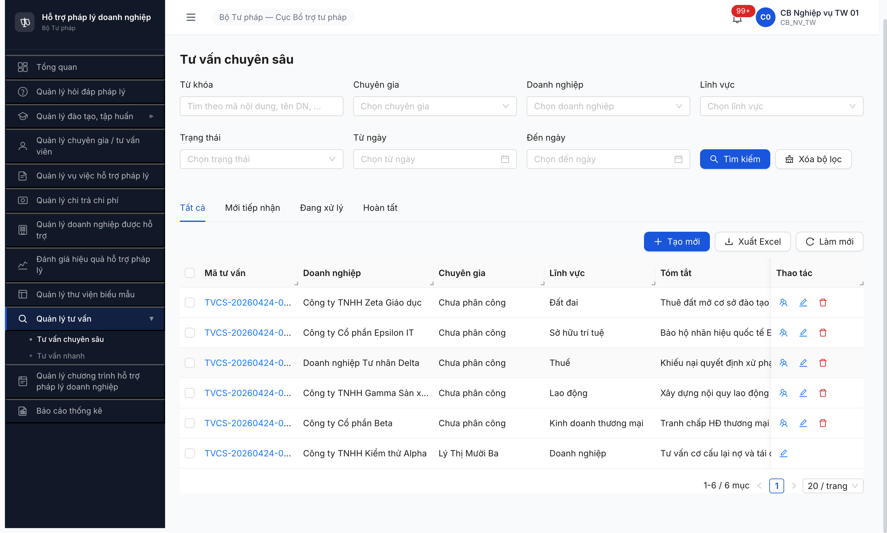

# Workflow Test Report — Tư vấn Chuyên sâu (SM-TVCS)

> 🔄 **POST-RESET 2026-05-01:** Dev reset toàn DB. Bảng kiểm tra workflow + bug summary dưới đây là **tham chiếu pre-reset** (R1-R10), KHÔNG phản ánh state hiện tại. Re-test workflow theo [post-reset-seed-plan.md](../../../../tasks/post-reset-seed-plan.md) Phase 3 sau khi seed lại Phase 1-2 xong. R11/R12 sẽ update lại bảng kiểm tra.

---

> **Module:** Tư vấn Chuyên sâu (FR-12) · **SRS:** [`02-thu-tu-module.md §⑧`](../../../../input/quy-trinh-nghiep-vu/02-thu-tu-module.md#L488-L546) · **Round:** R10 · **Date:** 2026-05-01 · **Tester:** QA Automation
> **Bug:** [`bug-report-flow-TVCS.md`](../bug-reports/bug-report-flow-TVCS.md)

---

## Kết luận

⚠️ **PASS-WITH-DATA-GAP** — **3/13 bước PASS** (Seed + B2 + B3 Phân công CG). Bước 4-12 🚫 **BLOCKED data gap** (KHÔNG phải app bug): TVV-0021 (Lý Thị Mười Ba — đã phân công cho TVCS-0001) không có TAI_KHOAN login linked qua FK `tai_khoan_id`. 4/4 bug app đã closed. Cần T1.B3d seed 9 cặp account-profile theo fixture v2.6.1 `cap_tai_khoan_cg_nht_r5`.

---

## Bảng kiểm tra workflow

| # | Bước (transition) | Actor | Sample test | Status | Bug / Note |
|:-:|---|---|---|:-:|---|
| 1 | `— → TIEP_NHAN` (DN gửi qua Cổng PLQG, API nhận) | DN | — | ⏭ | Defer T4.16 API test |
| 2 | `— → TIEP_NHAN` (CB NV thêm tay UC147) | CB NV | TVCS-0001..0006 | ✅ | Seed R1 |
| 3 | `TIEP_NHAN → PHAN_CONG` ([Phân công CG] UC147) | CB NV | TVCS-0001 | ✅ | R9 — POST `/phan-cong` 200 (BUG-003 closed R8 + BUG-004 closed R9) |
| 4 | `PHAN_CONG → DANG_TU_VAN` (CG [Chấp nhận]) | CG | TVCS-0001 | 🚫 | **DATA GAP T1.B3d**: TVV-0021 không có account login linked. Pool 3 CG csv (cg_01..03) khác đơn vị STP-AG/BG/BNI ≠ Cục BTTP TW |
| 5 | `PHAN_CONG → TIEP_NHAN` (CG [Từ chối]) | CG | — | 🚫 | Cascade #4 (data gap) |
| 6 | `PHAN_CONG → banner cảnh báo` (Auto: CG không phản hồi >2 ngày LV) | System | — | — | Chưa test, cần đợi 2 ngày + #4 trigger |
| 7 | `DANG_TU_VAN → HOAN_THANH` (CG tích "Hoàn thành" + ≥1 file VB TVPL) | CG | — | 🚫 | Cascade #4 |
| 8 | `HOAN_THANH → CHO_PHE_DUYET` (Auto BR-FLOW-01) | System | — | 🚫 | Cascade #7 |
| 9 | `CHO_PHE_DUYET → DA_DUYET` (CB PD [Phê duyệt]) | CB PD | — | 🚫 | Cascade #8 |
| 10 | `CHO_PHE_DUYET → DANG_TU_VAN` (CB PD [Từ chối] bounce) | CB PD | — | 🚫 | Cascade #8 |
| 11 | `PHAN_CONG → HUY` ([Hủy] khi CG chưa xác nhận) | CB NV | — | — | Chưa test, có thể test independent với CB NV TW |
| 12 | `DANG_TU_VAN → HUY` (DN yêu cầu hủy + CB PD cùng cấp duyệt) | CB NV | — | 🚫 | Cascade #4 |
| 13 | Công khai tư liệu PL đính kèm (BR-FLOW-07, không cần phê duyệt) | CB NV | — | — | Chưa test, defer |

> Icon: ✅ pass · ❌ fail · ⏭ skip · 🚫 blocked · — chưa test

---

## Lịch sử round

| Round | Date | Kết quả tóm tắt |
|---|---|---|
| R1 | 26/04 | Seed 6 TVCS state `Tiếp nhận` PASS. |
| R2 | 27/04 | FAIL — UI 0 nút workflow + cột Ngày bắt đầu `Invalid Date`. |
| R3 | 28/04 18:25 | BUG-001 + BUG-002 closed. Bước 2 block — dropdown CG empty. |
| R4 | 28/04 19:24 | Seed 1 CG ACTIVE+Công khai cùng lĩnh vực, modal vẫn empty. |
| R5 | 28/04 22:42 | FAIL — root-cause FE truyền sai enum `trangThai=HOAT_DONG`. Log BUG-003 Critical. |
| R6 | 29/04 01:35 | FAIL identical R5 sau dev claim "fix all Trụ A" lần 1. |
| R7 | 29/04 09:36 | FAIL identical R5 sau dev claim fix lần 2. Pool tăng 15 record nhưng FE chưa fix. |
| R8 | 29/04 15:12 | BUG-003 closed — FE truyền enum đúng, dropdown render 2 CG. POST `/phan-cong` FAIL 404 → log BUG-004 Critical. |
| R9 | 01/05 12:55 | BUG-004 closed — POST `/phan-cong` 200, TVCS-0001 advance `Tiếp nhận → Phân công`. |
| R10 | 01/05 14:30 | Test B4 [CG Chấp nhận] BLOCKED data gap. cg_01 inbox 0 records (TVV-0021 không có TAI_KHOAN linked). Path (b) tạo TVCS đơn vị STP-AG cũng fail (0 DN seed). Update fixture v2.6.1 + thêm task T1.B3d. P/Á A seed account QTHT BLOCKED 401 ERR-AUTH-LOGIN-01. |

---

## Bằng chứng (R9)



```text
2026-05-01 — login cb_nv_tw_01:
POST /api/v1/noi-dung-tu-van-cs/0b1391b1-.../phan-cong
Body: {"chuyenGiaId": "af8dba5d-...", "version": 1}
→ 200
{
  "trangThai": "PHAN_CONG",
  "version": 2,
  "chuyenGiaId": "af8dba5d-..."
}
```

---

## Data gap (R10) — không phải bug app

**Root cause:** Mismatch 2 pool entity:
- 8 CG profile TW (TVV-0019..0026 trong fixture variant 13-18 + 2 seed R4): có `TU_VAN_VIEN` đầy đủ, dropdown phân công OK. **Không có `TAI_KHOAN`** linked qua FK `tai_khoan_id`.
- 3 CG account login csv (`cg_01..03`): có `TAI_KHOAN`, login OK. Đơn vị STP-AG/BG/BNI ≠ Cục BTTP TW. **Không có `TU_VAN_VIEN`** profile.

**Fix:** task **T1.B3d** seed 9 cặp account-profile theo block `cap_tai_khoan_cg_nht_r5` (fixture v2.6.1). Hiện 🚫 BLOCKED đợi dev reset password QTHT (qtht_01/02/03/admin đều 401 ERR-AUTH-LOGIN-01).

Sau khi T1.B3d PASS → re-test full workflow A5 từ B4 → B12 trong R11.

---

*R10 | QA Automation via Claude Code*
