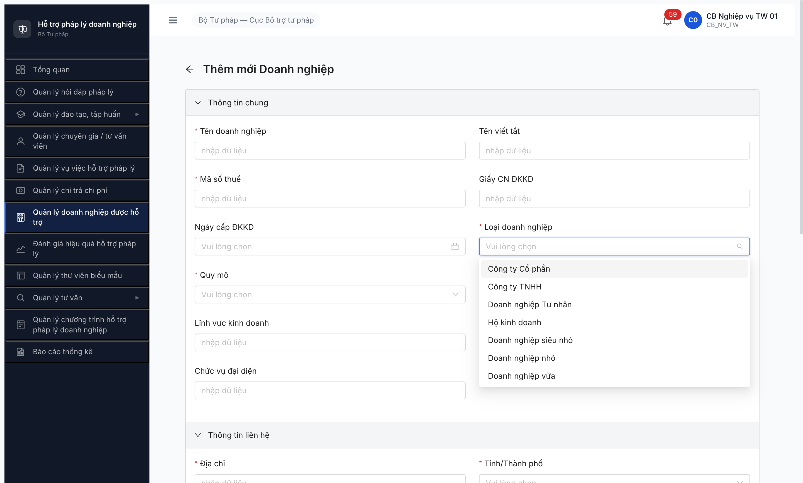
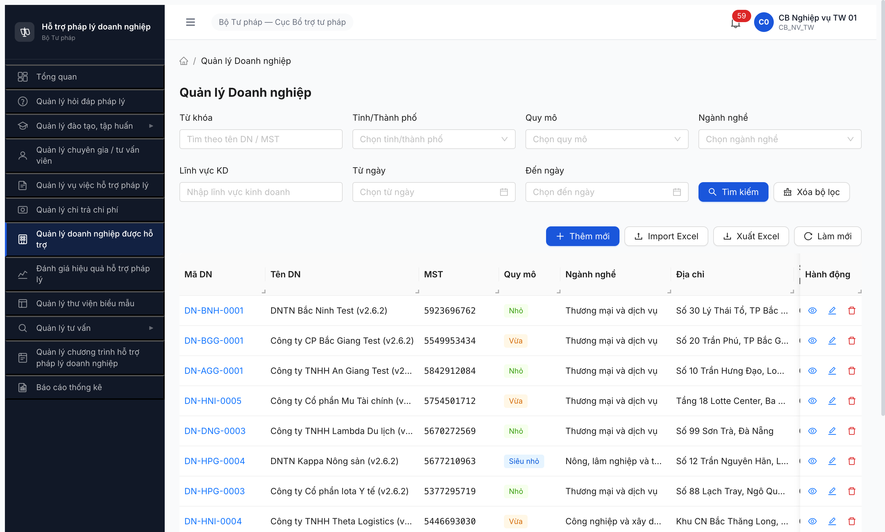

# Bug Report — Seed DN từ fixture v2.6.2 (R6.2.1/2/3)

| Thông tin | Giá trị |
|-----------|---------|
| **Dự án** | PM HTPLDN |
| **Môi trường** | http://103.172.236.130:3000/ |
| **Người test** | QA Automation (Claude Code) |
| **Ngày** | 2026-05-02 |
| **Loại test** | Seed + Functional |
| **Round** | R6 — Post-reset Phase 2 |
| **Tài liệu tham chiếu** | [seed-fixture.yaml](../../../../input/data/seed-fixture.yaml) · [srs-fr-07-doanh-nghiep.md](../../../../input/srs-v3/srs-fr-07-doanh-nghiep.md) · [srs-fr-10-quan-tri.md](../../../../input/srs-v3/srs-fr-10-quan-tri.md) |

---

## Tổng hợp

Phát hiện **4** lỗi có SRS reference cụ thể trong quá trình seed 15 DN từ fixture v2.6.2. Đã verify dual-source: NotebookLM HTPLDN (id `e3a2681b-fdd6-4a24-917c-9ed636e8a110`) + grep SRS local.

> **Context:** R6.2.1/2/3 đóng ✅ với 50 DN pre-existing (BE seed batch). 50 DN có pattern strict 1:1 (Vừa↔Thương mại / Nhỏ↔Công nghiệp / Siêu nhỏ↔Nông lâm), miss 6/9 cross-combo. Sau seed 15 fixture variants v2.6.2 qua API direct (workaround do JWT bug), tổng 65 DN, cross-combo coverage tăng 3/9 → 7/9 (vẫn miss NHO×NONG_LAM, VUA×NONG_LAM).

### Severity breakdown

| Tổng | Critical | Major | Medium | Minor | Trivial |
|------|----------|-------|--------|-------|---------|
| 4    | 1        | 2     | 1      | 0     | 0       |

## Bug Summary Table

| Bug ID | Severity | Priority | Type | TC Ref | **SRS Reference** | Title | Status |
|--------|----------|----------|------|--------|-------------------|-------|--------|
| BUG-AUTH-JWT-001 | Critical | P0 | Negative | R6 seed | `BR-AUTH-06` (`srs-fr-10-quan-tri.md:1893`) + `BR-EC-08` | Refresh token revoke aggressive ~80s thực tế (spec 24h), `POST /api/v1/auth/refresh` trả 401 `ERR-AUTH-VIII-20-08` | Open |
| BUG-DM-LOAI-DN-001 | Major | P1 | Data | R6 seed | `FR-VIII-07 UC105 Seed Data` (`srs-fr-10-quan-tri.md:3390/3752` + NotebookLM) | DM `LOAI_DOANH_NGHIEP` chứa 7 entries thay vì 3 spec UC105 (lẫn 4 loại hình DN ngoài SRS) | Open |
| BUG-FILTER-DN-001 | Major | P1 | Negative | R6 seed | `FR-V.III-02 §Processing Bước 3` (`srs-fr-07-doanh-nghiep.md:237`) | Search input "Tìm theo tên DN / MST" trên SCR-V.III-01 không filter — total luôn 65 với mọi keyword | Open |
| BUG-API-DN-001 | Medium | P2 | Data | R6 seed | `FR-V.III-01 Inputs row 7` (`srs-fr-07-doanh-nghiep.md:96`) | API contract dùng key `loaiDnId` thay vì `loai_doanh_nghiep_id` per SRS schema (FE/BE align nhưng spec lệch) | Open |

> **Type:** Negative = filter/auth không hoạt động đúng; Data = master data sai.
> **Priority:** P0 = block release; P1 = fix sprint hiện tại; P2 = fix 2-3 sprint.

> **Note Design issue (escalate BA, KHÔNG log dev):** SRS có **redundancy** giữa field `loai_dn_id` (FK to UC105 với enum `SIEU_NHO/NHO/VUA`) và field `quy_mo` (text enum `SIEU_NHO/NHO/VUA`). NotebookLM xác nhận: "tác giả SRS đặt tên 'Danh mục Loại doanh nghiệp' nhưng bản chất dữ liệu là Quy mô — gây nhầm lẫn". Field FK UC105 đáng ra phải là loại hình DN (TNHH/CP/DNTN/HKD theo Luật DN 2020) hoặc gộp lại với `quy_mo`. Cần BA xác nhận hướng fix trước khi dev clean DM.

---

## BUG-AUTH-JWT-001 — Refresh token revoke aggressive ~80s thực tế (spec BR-AUTH-06: 24h)

### Mô tả

Refresh token bị BE revoke sớm hơn TTL spec 24h rất nhiều — đo được ~80 giây thực tế. Sau ~80s không có thao tác, FE gọi `POST /api/v1/auth/refresh` thì BE trả 401 `ERR-AUTH-VIII-20-08`, FE catch → redirect `/login` → user mất context form đang điền.

Đã repeat **5 lần** trong cùng pattern (R5 T1.B4 ×2 + session 2026-05-02 ×3). Workaround duy nhất: bulk action trong `<2 phút` từ lúc verify-OTP, hoặc re-login giữa session.

### Các bước tái hiện

1. Login `cb_nv_tw_01` qua UI: nhập username/password → submit → nhập OTP `666666` → dashboard.
2. Mở module "Quản lý doanh nghiệp được hỗ trợ" → click "Thêm mới" → form `/doanh-nghiep/tao-moi` xuất hiện.
3. Điền 10+ field text + spinbutton + click dropdown "Loại doanh nghiệp" — thao tác kéo dài ~80-120 giây.
4. Click option trong dropdown → page redirect `/login`. Hoặc click "Lưu" → 401 → kick login.
5. Inspect Network: thấy `POST /api/v1/auth/refresh` với cookie `refresh_token=70425949-...` → response 401, code `ERR-AUTH-VIII-20-08`.

### Kết quả mong đợi

- **BR-AUTH-06** (`srs-fr-10-quan-tri.md:1893` + NotebookLM citation 1): "Session CMS: 30 phút idle timeout. API JWT: TTL 15 phút, refresh token 24 giờ."
- Access token sống 15 phút thực, refresh token sống 24 giờ thực.
- **BR-EC-08** (NotebookLM citation 3): refresh token chỉ revoke khi **Logout / Lock / Disable** — KHÔNG revoke khi access expire bình thường.

### Kết quả thực tế

- Access token revoke sau ~80s thực tế (đo từ log network: token cấp 03:10:09, gọi POST `/doanh-nghieps` lúc 03:11:48 → trả `ERR-AUTH-SYS-00-03 "Token has been revoked"`).
- `POST /api/v1/auth/refresh` trả 401 + body `{"success":false,"error":{"code":"ERR-AUTH-VIII-20-08","message":"An error occurred",...}}` → FE catch redirect `/login`.
- Pattern repeatable, không phải race condition tab khác (đã test với isolated context single-user).

### Bằng chứng

**Network response `auth/refresh` 401:**

```
POST /api/v1/auth/refresh
Cookie: refresh_token=70425949-c015-471c-bcf8-a14f10cb55fa
Status: 401
Body: {"success":false,"error":{"code":"ERR-AUTH-VIII-20-08","message":"An error occurred","timestamp":"2026-05-02T03:04:39.602Z","requestId":"e20845d4-0c3f-4204-86df-763e2a4982e9"}}
```

**Token revoke sau ~80s** (cùng access token sống thực):

```
03:10:09 — POST /api/v1/auth/verify-otp 200 → token issued
03:11:48 — POST /api/v1/doanh-nghieps 401 ERR-AUTH-SYS-00-03 "Token has been revoked"
Δ = 99 giây
```

**Memory pattern** (đã ghi nhận từ R5 T1.B4 — `qa_htpldn_jwt_revoke_aggressive`): "BE revoke JWT ~2 phút thực bất chấp `exp` 15 phút claim. Pattern repeat 2 lần."

> **Tác động (note ngoài bug, không lặp trong template):** Block toàn bộ workflow seed/test qua UI. R6 seed 15 DN phải chuyển sang API direct curl burst <2 phút để né. Mọi role tương tự sẽ gặp khi: điền form dài (>1 phút), idle giữa thao tác, multi-tab cùng user.

---

## BUG-DM-LOAI-DN-001 — DM `LOAI_DOANH_NGHIEP` chứa 7 entries thay vì 3 spec UC105

### Mô tả

DM `LOAI_DOANH_NGHIEP` (UC105 / FR-VIII-07) hiện có **7 entries** trong khi SRS spec seed data chỉ có **3 entries** (`SIEU_NHO / NHO / VUA`). 4 entries thừa (`TNHH / CP / DNTN / HKD`) là loại hình doanh nghiệp theo Luật DN 2020 — **ngoài phạm vi SRS** đặc tả cho UC105.

→ Khi user chọn "Loại doanh nghiệp" trong form thêm mới DN (SCR-V.III-02 row 12), dropdown hiện 7 options gây lẫn lộn semantic giữa "loại hình" và "quy mô".

### Các bước tái hiện

1. Login `cb_nv_tw_01` → "Quản lý doanh nghiệp được hỗ trợ" → click "Thêm mới".
2. Trên form `/doanh-nghiep/tao-moi`, click dropdown "Loại doanh nghiệp" (`*` required field).
3. Quan sát: dropdown hiện 7 options thay vì 3.
4. Inspect API: `GET /api/v1/danh-muc?loaiDanhMuc=LOAI_DOANH_NGHIEP&pageSize=20` trả 7 records.

### Kết quả mong đợi

Theo **FR-VIII-07 UC105 Seed Data** (NotebookLM citation 1):

> *"Seed Data: DN siêu nhỏ, DN nhỏ, DN vừa (theo Luật DNNVV 2017 + NĐ39/2018)"*

→ DM phải có **đúng 3 entries**: `SIEU_NHO`, `NHO`, `VUA` (tên: Doanh nghiệp siêu nhỏ / nhỏ / vừa).

### Kết quả thực tế

DM trả về 7 entries:

| Mã | Tên | Trong spec UC105? |
|----|-----|---|
| CP | Công ty Cổ phần | ❌ Ngoài spec |
| TNHH | Công ty TNHH | ❌ Ngoài spec |
| DNTN | Doanh nghiệp Tư nhân | ❌ Ngoài spec |
| HKD | Hộ kinh doanh | ❌ Ngoài spec |
| DN_SIEU_NHO | Doanh nghiệp siêu nhỏ | ✅ |
| DN_NHO | Doanh nghiệp nhỏ | ✅ |
| DN_VUA | Doanh nghiệp vừa | ✅ |

Ghi chú trên 4 entries thừa: `"Loại hình DN: ... (seed Phase 1 R6 fixture v2.6.2)"` — chứng tỏ batch BE seed cố ý thêm 4 loại hình ngoài spec, không có SRS authority.

### Bằng chứng

**1. Dropdown UI 7 options:**



**2. API response `GET /api/v1/danh-muc?loaiDanhMuc=LOAI_DOANH_NGHIEP`:**

```json
[
  {"ma":"CP","ten":"Công ty Cổ phần","moTa":"Loại hình DN: Công ty Cổ phần (seed Phase 1 R6 fixture v2.6.2)"},
  {"ma":"TNHH","ten":"Công ty TNHH","moTa":"Loại hình DN: Công ty TNHH (seed Phase 1 R6 fixture v2.6.2)"},
  {"ma":"DNTN","ten":"Doanh nghiệp Tư nhân","moTa":"Loại hình DN: ..."},
  {"ma":"HKD","ten":"Hộ kinh doanh","moTa":"Loại hình DN: ..."},
  {"ma":"DN_SIEU_NHO","ten":"Doanh nghiệp siêu nhỏ"},
  {"ma":"DN_NHO","ten":"Doanh nghiệp nhỏ"},
  {"ma":"DN_VUA","ten":"Doanh nghiệp vừa"}
]
```

**3. NotebookLM trích nguyên văn UC105 Inputs**:

> *"`| ma | text | Y | VD: SIEU_NHO, NHO, VUA | — | user input |`"*

→ Dev chỉ được seed 3 entries `SIEU_NHO/NHO/VUA`, KHÔNG được thêm `TNHH/CP/DNTN/HKD` mà không có BA approval.

> **Hướng fix** *(escalate BA trước khi dev xoá)*: 2 phương án:
> - **A** Xoá 4 entries thừa (`TNHH/CP/DNTN/HKD`), giữ DM đúng spec UC105. Chấp nhận redundancy `loai_dn_id` ↔ `quy_mo` trong SRS hiện tại (cả 2 cùng lưu quy mô).
> - **B** Update SRS UC105 → đổi semantic thành "Loại hình DN" (TNHH/CP/DNTN/HKD); thêm DM `QUY_MO_DN` riêng cho `SIEU_NHO/NHO/VUA`. Đây là phương án đúng chuẩn nghiệp vụ Luật DN 2020 + NĐ39/2018.

---

## BUG-FILTER-DN-001 — Search input "Tìm theo tên DN / MST" không filter

### Mô tả

Trên SCR-V.III-01 (Danh sách DN), input "Từ khóa" (placeholder `Tìm theo tên DN / MST`) không filter dữ liệu. Mỗi keyword (tên fixture variant Alpha/Beta/...; MST `5677600794`/`0100100101`/...) đều trả về **toàn bộ 65 records** thay vì kết quả filter theo `tu_khoa` per spec.

→ User không tìm được DN cụ thể qua search; phải scroll/paginate thủ công.

### Các bước tái hiện

1. Login `cb_nv_tw_01` → SCR-V.III-01 (Quản lý Doanh nghiệp).
2. Nhập "Alpha" vào input "Từ khóa" (placeholder `Tìm theo tên DN / MST`).
3. Click "Tìm kiếm".
4. Quan sát pagination: hiện `1-20 / 65 mục` — KHÔNG có filter.
5. Test thêm với MST `5677600794`, `Beta`, `An Giang Test` — đều trả 65.
6. Test API trực tiếp:
   - `GET /api/v1/doanh-nghieps?keyword=Alpha&page=1&pageSize=1` → meta.total = 65 ❌
   - `GET /api/v1/doanh-nghieps?search=Alpha&page=1&pageSize=1` → meta.total = 0 ✅ (search hoạt động)

### Kết quả mong đợi

Theo **FR-V.III-02 Inputs row 1** + **§Processing Bước 3** (`srs-fr-07-doanh-nghiep.md:224, 237`):

> *"`| 1 | tu_khoa | text | N | Tìm theo tên/MST | — | Người dùng |`"*
> *"Bước 3 | Tìm từ khóa trên tên doanh nghiệp và mã số thuế"*

→ Search keyword phải filter theo `ten_doanh_nghiep` LIKE + `ma_so_thue` LIKE. Total response phải nhỏ hơn 65 cho mọi keyword khớp ≥1 record.

### Kết quả thực tế

- FE gửi param tên `keyword` → BE bỏ qua param này → trả full 65 records.
- BE chỉ accept param tên `search` (test trực tiếp xác nhận).
- → FE/BE param mismatch: FE chưa cập nhật theo BE hoặc ngược lại.

### Bằng chứng

**Network request (UI Tìm kiếm):**

```
GET /api/v1/doanh-nghieps?keyword=Alpha&page=1&pageSize=20 → 200, meta.total=65
GET /api/v1/doanh-nghieps?keyword=5677600794&page=1&pageSize=20 → 200, meta.total=65
```

**Test API trực tiếp:**

```
GET /api/v1/doanh-nghieps?search=Alpha&page=1&pageSize=5 → 200, meta.total=0  (no record name "Alpha")
GET /api/v1/doanh-nghieps?search=5677600794&page=1&pageSize=5 → 200, meta.total=1, item.maDoanhNghiep="DN-HNI-0001"
```

**Screenshot UI list 65:**



> **Hướng fix:** Quyết định 1 trong 2: (a) FE đổi param từ `keyword` thành `search` để khớp BE; hoặc (b) BE thêm alias `keyword` cho `search`. Per SRS spec field name `tu_khoa` → cả FE/BE nên dùng `tuKhoa` hoặc `tu_khoa`, không phải `keyword/search` cả hai.

---

## BUG-API-DN-001 — API field name lệch SRS schema

### Mô tả

API `POST /api/v1/doanh-nghieps` accept payload với key `loaiDnId` (camelCase tắt) thay vì `loai_doanh_nghiep_id` (snake_case theo SRS spec). Tương tự nhiều field khác bị tắt: `chucVuDd` thay vì `chuc_vu_dd`, `giayCndk` (output là `giayCnDkkd`), v.v. Inconsistent giữa SRS spec và BE actual contract.

### Các bước tái hiện

1. Đọc SRS FR-V.III-01 Inputs (line 88-108): field name = `loai_doanh_nghiep_id` (snake_case, đầy đủ).
2. POST `/api/v1/doanh-nghieps` với payload `{"loaiDoanhNghiepId": "<uuid>", ...}` → 422 "Loại doanh nghiệp là bắt buộc" (BE không nhận).
3. Đổi key payload thành `{"loaiDnId": "<uuid>", ...}` → BE accept, lưu thành công.
4. Đọc API response từ `GET`: field trả về cũng dùng key `loaiDnId` (không phải `loai_doanh_nghiep_id` theo SRS).

### Kết quả mong đợi

Theo **FR-V.III-01 Inputs row 7** (`srs-fr-07-doanh-nghiep.md:96`):

> *"`| 7 | loai_doanh_nghiep_id | identifier | Y | FK → DANH_MUC (UC105) | — | Người dùng |`"*

→ API contract phải dùng key `loai_doanh_nghiep_id` (hoặc camelCase đầy đủ `loaiDoanhNghiepId`) khớp với SRS field name.

### Kết quả thực tế

API contract dùng tên tắt (camelCase), không khớp SRS:

| SRS field name (snake_case) | API contract actual | Match? |
|---|---|---|
| `loai_doanh_nghiep_id` | `loaiDnId` | ❌ Tên tắt |
| `chuc_vu_dd` | `chucVuDd` (input), `chucVuDaiDien` (output) | ⚠️ Inconsistent input vs output |
| `giay_cndk` | `giayCndk` (input), `giayCnDkkd` (output) | ⚠️ Inconsistent input vs output |
| `doanh_thu_nam` | `doanhThuNam` (input), `doanhThu` (output) | ⚠️ Inconsistent + thiếu `_nam` ở output |

### Bằng chứng

**API 422 với key SRS-correct:**

```json
{
  "success": false,
  "error": {
    "code": "ERR-VAL-SYS-00-01",
    "details": [
      {"field": "loaiDnId", "message": "Loại doanh nghiệp không hợp lệ"},
      {"field": "loaiDnId", "message": "Loại doanh nghiệp là bắt buộc"}
    ]
  }
}
```

→ BE error message reference field name `loaiDnId`, xác nhận BE expect tên tắt.

**API 200 với key tắt:**

```bash
curl -X POST /api/v1/doanh-nghieps -d '{"loaiDnId":"6bc381cd-...","quyMo":"NHO","ignoreWarning":true,...}'
→ 200, data.maDoanhNghiep = "DN-HNI-0002"
```

> **Hướng fix:** Quyết định convention chuẩn (camelCase đầy đủ vs snake_case) → cập nhật SRS hoặc BE để khớp. Hiện tại FE đã align với BE actual, nhưng SRS lỗi thời → mọi spec/test plan dựa vào field name SRS đều sai. Ưu tiên: cập nhật SRS để dev/QA cùng nhìn 1 source of truth.

---

## Phụ lục — Môi trường test

| Thành phần | Giá trị |
|------------|---------|
| URL ứng dụng | http://103.172.236.130:3000/ |
| OTP login | `666666` (bypass dev set) |
| MailHog (OTP inbox) | http://103.172.236.130:8025 |
| API base | http://103.172.236.130:3000/api/v1/ |
| Frontend | React + Vite + Ant Design |
| Xác thực | JWT (access in sessionStorage) + refresh_token (HttpOnly cookie) |
| Tool test | Chrome DevTools MCP + curl direct |
| Test account dùng | `cb_nv_tw_01` / `Secret@123` |
| Total DN sau seed | 65 (50 pre-existing + 15 fixture v2.6.2) |
| Cross-combo coverage | 7/9 (was 3/9 — miss NHO×NONG_LAM, VUA×NONG_LAM) |

---

*Bug report generated: 2026-05-02 | QA Automation via Claude Code*
*Dual-source verified: NotebookLM HTPLDN id `e3a2681b-fdd6-4a24-917c-9ed636e8a110` + grep SRS local `srs-fr-07-doanh-nghiep.md` + `srs-fr-10-quan-tri.md`*
