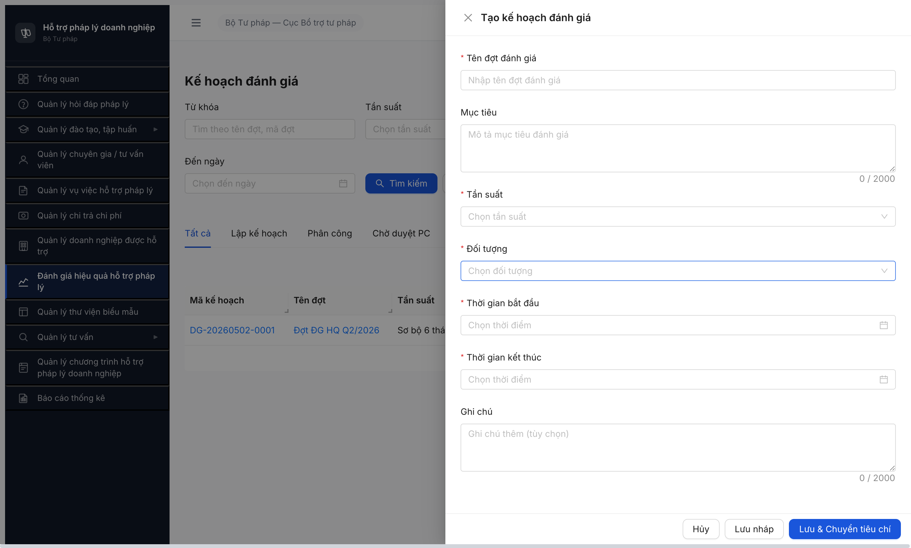

# Bug Report — Đánh giá Hiệu quả HTPLDN (FR-08)

| Thông tin | Giá trị |
|-----------|---------|
| **Dự án** | PM HTPLDN |
| **Môi trường** | http://103.172.236.130:3000/ |
| **Người test** | QA Automation via Chrome DevTools MCP |
| **Ngày** | 2026-05-02 |
| **Loại test** | Workflow |
| **Round** | R14 |
| **Tài liệu tham chiếu** | [`srs-fr-08-danh-gia.md`](../../../../input/srs-v3/srs-fr-08-danh-gia.md) (FR-VI-01/02/03 + SCR-VI-01), [workflow-test-report-DanhGiaHQ.md](../workflow/workflow-test-report-DanhGiaHQ.md) |

> **2-source verify:** Mỗi bug dưới đây được verify ở 2 nguồn — **(a)** grep nguyên văn SRS local `srs-fr-08-danh-gia.md`, **(b)** query NotebookLM HTPLDN (`e3a2681b-fdd6-4a24-917c-9ed636e8a110`, conversation `b6d0e339-aa0d-4f69-b46d-08a9f9175181`) — kết quả 2 nguồn khớp 100%.

---

## Tổng hợp

Phát hiện **5** lỗi có SRS reference cụ thể trong quá trình test workflow Đánh giá HQ 11 bước. 1 Medium navigation deviation + 1 Critical UI gap + 3 Critical/Major dropdown gọi sai endpoint/source. Test mới chạy được Bước 1 (Tạo đợt PASS) → các Bước 2-11 BLOCKED.

### Severity breakdown

| Tổng | Critical | Major | Medium | Minor | Trivial |
|------|----------|-------|--------|-------|---------|
| 5    | 2        | 2     | 1      | 0     | 0       |

## Bug Summary Table

| Bug ID | Severity | Priority | Type | TC Ref | **SRS Reference** | Title | Status |
|--------|----------|----------|------|--------|-------------------|-------|--------|
| BUG-FUNC-DG-002 | Critical | P0 | UI/UX | R6.4.D2 B1 back-fill | `srs-fr-08-danh-gia.md` line 790 (SCR-VI-01 row 33: "action-bar | Nút [+ Thêm tiêu chí] / [Nhập từ danh mục] | C08 | Thêm dòng mới / mở popup multi-select từ DM UC109 | click → add | Luôn") + line 186 (FR-VI-02 Processing row 3 "Thêm/sửa/xóa tiêu chí cho đợt đánh giá") + line 192 BR-CALC-04 | Tab "Tiêu chí" trong chi tiết kế hoạch không có nút [+ Thêm tiêu chí] / [Nhập từ danh mục] — không thể thêm/sửa/xóa tiêu chí | Open |
| BUG-FUNC-DG-003 | Critical | P0 | Workflow | R6.4.D2 B2 | `srs-fr-08-danh-gia.md` line 244 (FR-VI-03 Inputs row 2: "nguoi_danh_gia_id \| identifier \| Y \| FK → NGUOI_DUNG, cùng đơn vị \| — \| Chọn từ DS") + line 798 (SCR-VI-01 row 36 Tab 2: "Người ĐG (C10 searchable, CB cùng đơn vị)") | Dropdown "Người đánh giá" gọi sai API endpoint `chuyen-gia-tvvs` (404) thay vì entity NGUOI_DUNG/TAI_KHOAN cùng đơn vị | Open |
| BUG-FUNC-DG-004 | Major | P1 | Workflow | R6.4.D2 B2 | `srs-fr-08-danh-gia.md` line 246 (FR-VI-03 Inputs row 4: "linh_vuc_phu_trach \| identifier[] \| N \| FK → DANH_MUC (Lĩnh vực PL) \| — \| Multi-select") + line 798 (SCR-VI-01 row 36 Tab 2: cột "Lĩnh vực phụ trách (C10 multi-select từ UC99)") | Dropdown "Lĩnh vực" gọi API `/danh-mucs` với param sai key (`loaiDanhMuc=LINH_VUC_PL` → 404) | Open |
| BUG-FUNC-DG-005 | Major | P1 | Workflow | R6.4.D2 B2 | `srs-fr-08-danh-gia.md` line 245 (FR-VI-03 Inputs row 3: "vai_tro \| text \| Y \| DANH_GIA_VIEN / TRUONG_NHOM \| — \| Chọn") + line 798 (SCR-VI-01 row 36 Tab 2: "Vai trò (DANH_GIA_VIEN / TRUONG_NHOM, bắt buộc)") | Dropdown "Vai trò" hiện "Trống" thay vì 2 enum static TRUONG_NHOM/DANH_GIA_VIEN | Open |
| BUG-FUNC-DG-001 | Medium | P2 | UI/UX | R6.4.D2 B1 | `srs-fr-08-danh-gia.md` line 777 (SCR-VI-01 row 27: "[Hủy] [Lưu nháp] (→ NHAP) [Lưu & Chuyển tiêu chí] (→ lưu + mở Tab 1 chi tiết) \| click → save \| Khi mở form") | Button [Lưu & Chuyển tiêu chí] không navigate sang Tab Tiêu chí của đợt vừa tạo — chỉ đóng modal về danh sách | Open |

> **Chú thích Type:**
> - `Workflow` — chuyển trạng thái (state machine transition) hoặc dữ liệu phụ thuộc cho transition
> - `UI/UX` — giao diện, hiển thị, navigation, tương tác

> **Chú thích Severity:**
> - `Critical` — hệ thống/tính năng chính không dùng được, lộ dữ liệu, sai nghiệp vụ nghiêm trọng
> - `Major` — tính năng quan trọng lỗi nhưng có workaround
> - `Medium` — tính năng phụ lỗi, không block nghiệp vụ chính

---

## BUG-FUNC-DG-002 — Tab "Tiêu chí" trong chi tiết kế hoạch không có nút [+ Thêm tiêu chí] / [Nhập từ danh mục]

### Mô tả

Sau khi tạo đợt đánh giá (FR-VI-01), CB Nghiệp vụ TW (`cb_nv_tw_01`) mở chi tiết đợt → Tab "Tiêu chí" (Tab 1 SCR-VI-01). Tab hiện cảnh báo "Tổng trọng số: 0% (Tổng trọng số phải bằng 100%)" và bảng trống "Chưa có tiêu chí đánh giá", **không có button [+ Thêm tiêu chí] hay [Nhập từ danh mục]** ở action-bar dù SRS quy định bắt buộc luôn hiển thị. Người dùng không thể thêm tiêu chí cho đợt → Bước 3 transition `PHAN_CONG → CHO_DUYET_PC` không bao giờ pass được điều kiện chặn "tổng trọng số tiêu chí = 100%" (BR-CALC-04).

### Các bước tái hiện

1. Đăng nhập `cb_nv_tw_01 / Secret@123 / OTP 666666` tại `http://103.172.236.130:3000/login`.
2. Click sidebar "Đánh giá hiệu quả hỗ trợ pháp lý" → màn `/danh-gia/ke-hoach/danh-sach`.
3. Click row đợt đã tồn tại (vd `DG-20260502-0001` hoặc `DG-20260502-0002`) → mở chi tiết `/danh-gia/ke-hoach/{id}`.
4. Đọc Tab "Tiêu chí" (đang là tab default selected).
5. Quan sát: header `Tổng trọng số: 0% (Tổng trọng số phải bằng 100%)` (chữ đỏ); bảng 6 cột (STT/Tên/Nhóm/Trọng số/Điểm tối đa/Trạng thái), body 1 dòng "Chưa có tiêu chí đánh giá".
6. Tìm nút [+ Thêm tiêu chí] / [Nhập từ danh mục] ở header card, đầu/cuối table, ngoài tab — không có.

### Kết quả mong đợi

Theo `srs-fr-08-danh-gia.md` line 790 (SCR-VI-01 Tab 1 row 33):
> `| 33 | action-bar | Nút [+ Thêm tiêu chí] / [Nhập từ danh mục] | C08 | Thêm dòng mới / mở popup multi-select từ DM UC109 | click → add | Luôn |`

Tab "Tiêu chí" phải LUÔN hiển thị 2 nút action: `[+ Thêm tiêu chí]` (mở dòng inline editable) và `[Nhập từ danh mục]` (mở popup multi-select tham chiếu DM `TIEU_CHI_DANH_GIA` UC109). Đồng thời theo line 186 FR-VI-02 Processing row 3: "Thêm/sửa/xóa tiêu chí cho đợt đánh giá".

### Kết quả thực tế

Tab "Tiêu chí" chỉ render read-only — không có button thêm/sửa/xóa/import tiêu chí ở bất cứ vị trí nào trong tab. Đợt đã tạo bị kẹt vĩnh viễn ở `LAP_KE_HOACH` vì không có cách đẩy tổng trọng số = 100%. Workflow không thể tiến đến Bước 3 (Trình duyệt phân công). API `GET /api/v1/ke-hoach-danh-gias/{id}/tieu-chis` trả 200 với `data=[]` → BE có endpoint nhưng FE chưa wire UI gọi POST tương ứng.

### Bằng chứng


```text
Inspect HTML toàn bộ Tab "Tiêu chí" content:
<div class="ant-card-body">
  <div>Tổng trọng số: 0% (Tổng trọng số phải bằng 100%)</div>
  <table>
    <thead>STT | Tên tiêu chí | Nhóm tiêu chí | Trọng số | Điểm tối đa | Trạng thái</thead>
    <tbody><tr class="ant-table-placeholder"><td colspan="6">Chưa có tiêu chí đánh giá</td></tr></tbody>
  </table>
</div>
→ Không có <button>, <a>, [role=button] nào liên quan thêm tiêu chí (đối chiếu document.querySelectorAll('button')).
```

---

## BUG-FUNC-DG-003 — Dropdown "Người đánh giá" gọi sai API endpoint `chuyen-gia-tvvs` (404) thay vì entity NGUOI_DUNG/TAI_KHOAN cùng đơn vị

### Mô tả

Trong modal "Thêm người đánh giá" (Tab 2 Phân công của chi tiết kế hoạch), CB NV mở dropdown "Người đánh giá" — FE call `GET /api/v1/chuyen-gia-tvvs?pageSize=100&trangThai=HOAT_DONG` trả 404 `Cannot GET ...` → dropdown render Trống. SRS quy định nguồn dropdown là entity `NGUOI_DUNG` (alias `TAI_KHOAN` referenced) lọc cùng đơn vị, KHÔNG phải `CHUYEN_GIA_TVV` / `TU_VAN_VIEN`.

### Các bước tái hiện

1. Đăng nhập `cb_nv_tw_01`, mở chi tiết kế hoạch `DG-20260502-0002` (state Lập kế hoạch).
2. Click tab "Phân công" → bảng empty "Chưa có phân công đánh giá", có button [+ Thêm người đánh giá].
3. Click [+ Thêm người đánh giá] → modal "Thêm người đánh giá" mở lên.
4. Click dropdown "Người đánh giá" (placeholder "Tìm và chọn người đánh giá...").
5. Quan sát: dropdown render "Trống/Trống" (Ant Design Empty state). Toast lỗi đỏ góc trên phải: "Cannot GET /api/v1/chuyen-gia-tvvs?pageSize=100&trangThai=HOAT_DONG".

### Kết quả mong đợi

Theo `srs-fr-08-danh-gia.md` line 244 (FR-VI-03 Inputs row 2):
> `| 2 | nguoi_danh_gia_id | identifier | Y | FK → NGUOI_DUNG, cùng đơn vị | — | Chọn từ DS |`

Đồng thời line 798 (SCR-VI-01 row 36 Tab 2 — Phân công, cột "Người ĐG"): "C10 searchable, **CB cùng đơn vị**".

FE phải gọi endpoint trả về danh sách người dùng/tài khoản (vd `GET /api/v1/nguoi-dungs?donViId={current}` hoặc `GET /api/v1/tai-khoans?donViId={current}`) lọc theo đơn vị của user đang đăng nhập. KHÔNG được gọi `/chuyen-gia-tvvs` (entity TVV/CG là entity nghiệp vụ tư vấn, khác biệt hoàn toàn với entity người dùng nội bộ).

### Kết quả thực tế

FE call `GET /api/v1/chuyen-gia-tvvs?pageSize=100&trangThai=HOAT_DONG` → BE trả 404 `ERR-SYS-00-04-01 Cannot GET /api/v1/chuyen-gia-tvvs?pageSize=100&trangThai=HOAT_DONG`. Dropdown render empty → người dùng không chọn được "Người đánh giá" → form Thêm bị block ngay tại trường bắt buộc đầu tiên → không tạo được record `PHAN_CONG_DANH_GIA` → workflow `LAP_KE_HOACH → PHAN_CONG` không thực hiện được.

### Bằng chứng


```json
GET /api/v1/chuyen-gia-tvvs?pageSize=100&trangThai=HOAT_DONG
Response 404:
{
  "success": false,
  "error": {
    "code": "ERR-SYS-00-04-01",
    "message": "Cannot GET /api/v1/chuyen-gia-tvvs?pageSize=100&trangThai=HOAT_DONG",
    "timestamp": "2026-05-02T15:43:08.012Z"
  }
}
```

---

## BUG-FUNC-DG-004 — Dropdown "Lĩnh vực" gọi API `/danh-mucs` với param sai key (`loaiDanhMuc=LINH_VUC_PL` → 404)

### Mô tả

Cùng modal "Thêm người đánh giá", dropdown "Lĩnh vực" (multi-select, **không bắt buộc** N theo SRS) gọi `GET /api/v1/danh-mucs?loaiDanhMuc=LINH_VUC_PL&pageSize=100` trả 404. Param key `loaiDanhMuc` sai — BE expect `loai` (theo các module Hỏi đáp / Vụ việc đang dùng `?loai=LINH_VUC_PL` thành công).

### Các bước tái hiện

1. Theo các bước 1-4 của BUG-FUNC-DG-003.
5. Click dropdown "Lĩnh vực" (placeholder "Chọn lĩnh vực...").
6. Quan sát: dropdown render Trống. Toast lỗi đỏ: "Cannot GET /api/v1/danh-mucs?loaiDanhMuc=LINH_VUC_PL&pageSize=100".

### Kết quả mong đợi

Theo `srs-fr-08-danh-gia.md` line 246 (FR-VI-03 Inputs row 4):
> `| 4 | linh_vuc_phu_trach | identifier[] | N | FK → DANH_MUC (Lĩnh vực PL) | — | Multi-select |`

Đồng thời line 798 (SCR-VI-01 row 36 Tab 2): cột "Lĩnh vực phụ trách (C10 **multi-select từ UC99**)".

FE phải gọi endpoint trả options DM `LINH_VUC_PL` (đã seed 13 records ở R6.1.1) — theo pattern các module khác đã verified working: `GET /api/v1/danh-mucs?loai=LINH_VUC_PL&pageSize=100` → 200.

### Kết quả thực tế

FE truyền sai key `loaiDanhMuc` thay vì `loai` → BE 404 `ERR-SYS-00-04-01`. Dropdown empty → không thể chọn lĩnh vực phụ trách. SRS đánh dấu N=optional nên user vẫn có thể submit form mà không chọn lĩnh vực, nhưng:
- (a) Toast đỏ + dropdown empty là regression UX so với spec mong đợi 13 lĩnh vực hiển thị.
- (b) Nếu hệ thống có rule "gợi ý người ĐG theo lĩnh vực phụ trách" (line 798 Tab 2 — chú thích gợi ý ưu tiên), gap này cũng phá rule.

### Bằng chứng

Cùng screenshot với BUG-FUNC-DG-003 ([image/bug-dg-003-modal-2-api-404.png](image/bug-dg-003-modal-2-api-404.png)) — toast thứ 2 từ dưới lên hiện "Cannot GET /api/v1/danh-mucs?loaiDanhMuc=LINH_VUC_PL&pageSize=100".

```json
GET /api/v1/danh-mucs?loaiDanhMuc=LINH_VUC_PL&pageSize=100
Response 404:
{
  "success": false,
  "error": { "code": "ERR-SYS-00-04-01", "message": "Cannot GET /api/v1/danh-mucs?loaiDanhMuc=LINH_VUC_PL&pageSize=100" }
}

So sánh: GET /api/v1/danh-mucs?loai=LINH_VUC_PL&pageSize=100 (param đúng) → 200 (verified ở module Hỏi đáp/Vụ việc).
```

---

## BUG-FUNC-DG-005 — Dropdown "Vai trò" hiện "Trống" thay vì 2 enum static TRUONG_NHOM/DANH_GIA_VIEN

### Mô tả

Cùng modal "Thêm người đánh giá", dropdown "Vai trò" (bắt buộc Y) — bấm vào dropdown thấy nội dung "Trống/Trống" (empty state) thay vì 2 option static `TRUONG_NHOM` (Trưởng nhóm) và `DANH_GIA_VIEN` (Đánh giá viên) như SRS định nghĩa. Không có network call lỗi → FE bind sai source data (gọi API rỗng hoặc state init = []).

### Các bước tái hiện

1. Theo các bước 1-4 của BUG-FUNC-DG-003.
5. Click dropdown "Vai trò" (placeholder "Chọn vai trò").
6. Quan sát: dropdown panel render `<div class="ant-empty">Trống</div>`. Không có toast lỗi (khác BUG-DG-003/004).

### Kết quả mong đợi

Theo `srs-fr-08-danh-gia.md` line 245 (FR-VI-03 Inputs row 3):
> `| 3 | vai_tro | text | Y | DANH_GIA_VIEN / TRUONG_NHOM | — | Chọn |`

Đồng thời line 798 (SCR-VI-01 row 36 Tab 2): "Vai trò (DANH_GIA_VIEN / TRUONG_NHOM, bắt buộc)" + line 832 ràng buộc "ít nhất 1 TRUONG_NHOM".

Đây là **enum static** (kiểu text cứng theo NotebookLM verify), FE chỉ cần render 2 option fixed:
- `TRUONG_NHOM` → label "Trưởng nhóm"
- `DANH_GIA_VIEN` → label "Đánh giá viên"

Sau khi user chọn ≥1 người vai trò TRUONG_NHOM, button [Trình phê duyệt] mới enable (Tab 2 ràng buộc ≥1 Trưởng nhóm).

### Kết quả thực tế

Dropdown panel empty. FE đang bind source nhầm sang một API call rỗng hoặc constant array rỗng. User không chọn được vai trò → trường bắt buộc fail → form Thêm không submit được → cũng không có cách thoả mãn ràng buộc "≥1 TRUONG_NHOM" → workflow `LAP_KE_HOACH → PHAN_CONG` thêm 1 lớp block.

### Bằng chứng


```text
Inspect dropdown DOM:
.ant-select-dropdown:not(.ant-select-dropdown-hidden)
  .ant-empty: text "Trống"
→ Không có .ant-select-item-option nào.
→ Network log: KHÔNG có request nào liên quan vai-tro hay role-danh-gia → FE chưa fetch hay bind nguồn nào (khác hẳn dropdown Người ĐG + Lĩnh vực có toast 404).
```

---

## BUG-FUNC-DG-001 — Button [Lưu & Chuyển tiêu chí] không navigate sang Tab Tiêu chí của đợt vừa tạo, chỉ đóng modal về danh sách

### Mô tả

Trong modal "Tạo kế hoạch đánh giá" của FR-VI-01 (UC83), CB NV bấm button `[Lưu & Chuyển tiêu chí]` (button thứ 3 ở thanh hành động) — kỳ vọng theo SRS là "lưu + mở Tab 1 chi tiết" (tức điều hướng vào trang chi tiết của đợt vừa tạo, tab "Tiêu chí" được active sẵn để CB add tiêu chí ngay). Thực tế FE chỉ POST `/api/v1/ke-hoach-danh-gias` 201 + đóng modal về list view, không điều hướng sang tab chi tiết.

### Các bước tái hiện

1. Đăng nhập `cb_nv_tw_01`, vào màn `/danh-gia/ke-hoach/danh-sach`.
2. Click button [+ Tạo kế hoạch] góc trên bảng.
3. Modal "Tạo kế hoạch đánh giá" mở lên — fill 6 trường bắt buộc (Tên đợt / Mục tiêu / Tần suất / Đối tượng / Thời gian BĐ / Thời gian KT).
4. Click button [Lưu & Chuyển tiêu chí] (button cuối cùng bên phải thanh hành động).
5. Quan sát URL + view sau click.

### Kết quả mong đợi

Theo `srs-fr-08-danh-gia.md` line 777 (SCR-VI-01 row 27 Form tạo/sửa đợt — Thanh hành động):
> `| 27 | form | Thanh hành động | C22 | [Hủy] [Lưu nháp] (→ NHAP) [Lưu & Chuyển tiêu chí] (→ lưu + mở Tab 1 chi tiết) | click → save | Khi mở form |`

Hành vi mong đợi: lưu bản ghi với trạng thái khởi tạo + **navigate vào trang chi tiết của đợt vừa tạo** (`/danh-gia/ke-hoach/{newId}`) với **Tab 1 "Tiêu chí" được active** sẵn để CB NV bấm `[+ Thêm tiêu chí]` (xem BUG-DG-002) ngay sau khi tạo đợt.

### Kết quả thực tế

API `POST /api/v1/ke-hoach-danh-gias` trả 201 Created với record mới (vd `DG-20260502-0002`). Tuy nhiên FE chỉ đóng modal + reload danh sách, KHÔNG điều hướng sang `/danh-gia/ke-hoach/{newId}` → label button hứa hẹn "Chuyển tiêu chí" nhưng không thực sự chuyển. Người dùng phải tự click vào row của đợt mới ở danh sách để mở chi tiết. Hành vi này khác hành vi của button `[Lưu nháp]` ở chỗ nào? Hiện 2 button cùng kết quả → label "Chuyển tiêu chí" gây hiểu nhầm UX.

> **Workaround:** User click vào row vừa tạo trong list → tự vào chi tiết → tự chọn Tab Tiêu chí. Vì có workaround nên Severity Medium (không Critical).

### Bằng chứng



```text
Sau click [Lưu & Chuyển tiêu chí]:
- POST /api/v1/ke-hoach-danh-gias → 201 (record DG-20260502-0002 saved, trangThai=LAP_KE_HOACH)
- Modal đóng
- URL vẫn là /danh-gia/ke-hoach/danh-sach (KHÔNG đổi sang /danh-gia/ke-hoach/{newId})
- View: danh sách reload, hiện thêm row mới ở đầu

Kỳ vọng URL sau click: /danh-gia/ke-hoach/{newId} (vd /danh-gia/ke-hoach/5426dc15-ddf7-469b-8ee6-f1363c396795) + Tab "Tiêu chí" selected.
```

---

## Phụ lục — Môi trường test

| Thành phần | Giá trị |
|------------|---------|
| URL ứng dụng | http://103.172.236.130:3000/ |
| OTP login | `666666` (bypass dev đã bật mọi tài khoản) |
| MailHog (OTP inbox) | http://103.172.236.130:8025 |
| API base | http://103.172.236.130:3000/api/v1 |
| Frontend | React + Vite + Ant Design |
| Xác thực | JWT (Authorization Bearer) + httpOnly cookie + OTP. **Lưu ý:** BE revoke JWT aggressive ~2 phút bất chấp `exp` 15 phút (memory `qa_htpldn_jwt_revoke_aggressive`) — gây re-login nhiều lần khi test long-running |
| Tool test | Chrome DevTools MCP |
| Verify SRS | (a) grep `srs-fr-08-danh-gia.md` line 71-247 + 776-832 + 1066-1126 — (b) NotebookLM HTPLDN `e3a2681b-fdd6-4a24-917c-9ed636e8a110` conversation `b6d0e339-aa0d-4f69-b46d-08a9f9175181` — 2 nguồn khớp 100% |

---

*Bug report generated: 2026-05-02 | QA Automation via Claude Code | 2-source SRS verify (NotebookLM + local grep) per memory `feedback_bug_verify_notebooklm_local`*
