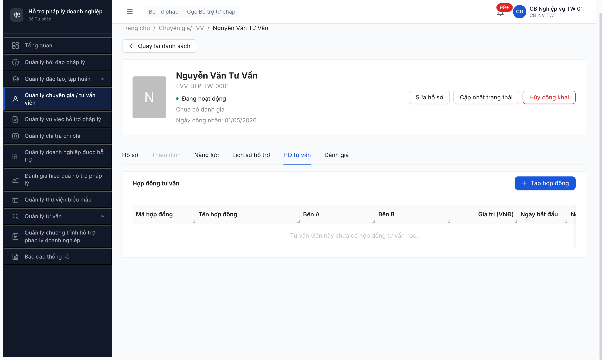

# Bug Report — Hợp đồng Tư vấn (R6.7.14)

| Thông tin | Giá trị |
|-----------|---------|
| **Dự án** | Phần mềm Hỗ trợ Pháp lý Doanh nghiệp (PM HTPLDN) |
| **Môi trường** | http://103.172.236.130:3000 |
| **Người test** | QA Automation (Claude Code via MCP Chrome DevTools) |
| **Ngày** | 2026-05-05 |
| **Loại test** | Functional + Workflow (Path 1 VV detail + Path 2 TVV detail + Permission) |
| **Round** | Round 6 |
| **Tài liệu tham chiếu** | [`srs-fr-14-hop-dong-tv.md`](../../../../input/srs-v3/srs-fr-14-hop-dong-tv.md) · [`workflow-test-report-HopDongTuVan.md`](../workflow/workflow-test-report-HopDongTuVan.md) |

---

## Tổng hợp

Phát hiện **4** lỗi có SRS reference cụ thể trong quá trình test R6.7.14 — Quản lý Hợp đồng Tư vấn (FR-X.3-01, UC163, sub-resource v2.1).

> **Rule log bug (feedback 2026-04-23):** Bug chỉ log khi có SRS reference cụ thể. Verified 2-source: grep nguyên văn `srs-fr-14-hop-dong-tv.md` local + cross-check NotebookLM HTPLDN `e3a2681b-fdd6-4a24-917c-9ed636e8a110` (R6.7.14 verified 2-source 2026-05-04 — xem todo.md).

### Severity breakdown

| Tổng | Critical | Major | Medium | Minor | Trivial |
|------|----------|-------|--------|-------|---------|
| 4    | 0        | 3     | 1      | 0     | 0       |

## Bug Summary Table

| Bug ID | Severity | Priority | Type | TC Ref | **SRS Reference** | Title | Status |
|--------|----------|----------|------|--------|-------------------|-------|--------|
| BUG-HDTV-001 | Major | P1 | UI/UX | R6.7.14 #5 | `FR-X.3-01 §Error Handling row E3 (ERR-HDTV-03)` | FE không hiển thị toast/notification khi BE return ERR-HDTV-03 → user click submit không thấy phản hồi | Open |
| BUG-HDTV-002 | Major | P1 | Data | R6.7.14 #7 | `FR-X.3-01 §Inputs row 10 (vu_viec_ids), §Processing Bước 6 (Liên kết vụ việc N:N)` | Tạo HĐ từ VV detail (path 1) không tự động link `vuViecIds` về VV nguồn | Open |
| BUG-HDTV-003 | Major | P1 | Data | R6.7.14 #8 | `FR-X.3-01 §Inputs row 5 (tvv_id FK), SCR-X3-01 row 6 (TVV dropdown)` | Form thiếu dropdown TVV (FK link) — Bên B là text free → tab "HĐ tư vấn" trong TVV detail luôn empty | Open |
| BUG-HDTV-004 | Medium | P2 | UI/UX | R6.7.14 #10 | `srs-fr-14-hop-dong-tv.md §3 line 241 v2.1: "HD Tu van (UC163) khong con la muc menu rieng. Truy cap tu (1) VV detail, (2) TVV detail"` | Tồn tại menu/route `/hop-dong-tv/danh-sach` riêng — vi phạm SRS v2.1 | Open |

> **Chú thích Type:** UI/UX = giao diện hiển thị · Data = toàn vẹn dữ liệu (link FK, sync N:M).

---

## BUG-HDTV-001 — FE không hiển thị toast khi BE return ERR-HDTV-03

> **Meta:** Major / P1 / UI/UX / Open / R6.7.14 #5 / `FR-X.3-01 §Error Handling row E3 (ERR-HDTV-03)`

### Mô tả

Khi cb_nv_tw_01 nhập form HĐ tư vấn với `Tổng thanh toán giai đoạn` (100M) > `Giá trị hợp đồng` (50M), click [Tạo mới], BE return HTTP 400 với code `ERR-HDTV-03` đúng SRS, nhưng FE KHÔNG hiển thị toast/notification/inline error nào → user thấy nút bấm không phản hồi, không biết tại sao form không submit thành công.

### Các bước tái hiện

1. Login `cb_nv_tw_01 / Secret@123`, OTP `666666` (BTP-TW).
2. Sidebar → "Quản lý vụ việc hỗ trợ pháp lý" → click VV000010 (state Đang xử lý).
3. Trên VV010 detail, expand accordion "HĐ tư vấn liên kết" → click [+ Tạo hợp đồng].
4. Modal mở. Nhập:
   - Tên hợp đồng: `HDTV-TEST-R6714-001`
   - Bên A: `Cục Bổ trợ tư pháp - Bộ Tư pháp`
   - Bên B: `TVV Nguyễn Văn Tư Vấn (TVV-BTP-TW-0001)`
   - Giá trị hợp đồng (VNĐ): `50000000` (50 triệu)
   - Thời gian thực hiện: `01/06/2026 - 31/12/2026`
5. Mở accordion "Thanh toán giai đoạn" → click [+ Thêm giai đoạn thanh toán].
6. Nhập:
   - Tên giai đoạn: `Giai đoạn 1`
   - Số tiền: `100000000` (100 triệu — vượt giá trị HĐ)
   - Ngày dự kiến: `30/06/2026`
7. Click [Tạo mới].
8. Quan sát: Modal vẫn ở trạng thái cũ, KHÔNG có toast / notification / inline error message hiển thị. Nút [Tạo mới] không disabled. Form không reset.

### Kết quả mong đợi

- Theo SRS `srs-fr-14-hop-dong-tv.md` line 158, Error Handling row E3: BE return `ERR-HDTV-03 — "Tổng thanh toán vượt giá trị hợp đồng"` (severity ERROR).
- FE phải hiển thị toast/notification màu đỏ với message từ BE response để user biết lỗi và sửa.

### Kết quả thực tế

- BE return đúng (verified `reqid=363` và `reqid=368` trong DevTools network):
  ```
  POST /api/v1/hop-dong-tu-vans → 400
  {"success":false,"error":{"code":"ERR-HDTV-03","message":"Tổng thanh toán vượt quá giá trị hợp đồng"}}
  ```
- Console không có error/warn message.
- DOM query `.ant-form-item-explain-error, .ant-message, .ant-notification, [role="alert"]` → trả mảng rỗng `[]`.
- → FE KHÔNG handle BE error response → user UX broken.

### Bằng chứng

**1. Ảnh chụp** *(form trống — minh hoạ FE có hiển thị inline error cho client-side validation, nhưng KHÔNG hiển thị error cho server-side `ERR-HDTV-03`)*:

![BUG-HDTV-001 — Form trống click [Tạo mới] hiển thị inline validation; nhưng khi BE return ERR-HDTV-03 thì không có toast/notification nào](image/bug-hdtv-001-fe-no-error-toast.png)

**2. API response (reqid=368):**

```json
{
  "success": false,
  "error": {
    "code": "ERR-HDTV-03",
    "message": "Tổng thanh toán vượt quá giá trị hợp đồng",
    "timestamp": "2026-05-05T02:43:55.524Z",
    "requestId": "cd0fa6f7-1b85-4da4-b45a-9d87b4188040"
  }
}
```

---

## BUG-HDTV-002 — Tạo HĐ từ VV detail không tự link vuViecIds

> **Meta:** Major / P1 / Data / Open / R6.7.14 #7 / `FR-X.3-01 §Inputs row 10 (vu_viec_ids), §Processing Bước 6 (Liên kết vụ việc N:N)`

### Mô tả

Khi cb_nv_tw_01 click [+ Tạo hợp đồng] từ section "HĐ tư vấn liên kết" của VV000010 detail, payload POST KHÔNG gửi `vuViecIds: ["e2000000-0000-4000-8000-000000000010"]`. Hệ quả: HD `HDTV-20260505-0001` được tạo thành công nhưng không có liên kết với VV010. Quay lại VV010 detail → section "HĐ tư vấn liên kết" vẫn empty.

### Các bước tái hiện

1. Login `cb_nv_tw_01 / Secret@123`, OTP `666666`.
2. Vào VV000010 detail → expand "HĐ tư vấn liên kết" → click [+ Tạo hợp đồng].
3. Điền form valid (giaTri=50M, soTien giai đoạn=30M, ngày 01/06-31/12/2026).
4. Click [Tạo mới] → POST `/api/v1/hop-dong-tu-vans` → 201 (HDTV-20260505-0001 created).
5. App navigate sang `/hop-dong-tv/danh-sach` → click sidebar "Quản lý vụ việc hỗ trợ pháp lý" → click VV000010.
6. Trên VV010 detail → expand "HĐ tư vấn liên kết".
7. Quan sát: Section vẫn render `"Vụ việc này chưa có hợp đồng tư vấn liên kết."` mặc dù vừa tạo HD từ chính VV này.

### Kết quả mong đợi

- Theo SRS line 88-89, Inputs row 10: `vu_viec_ids: identifier[] — FK[] -> VU_VIEC (many-to-many)` — phải gửi trong payload.
- SRS line 121, Processing Bước 6: `Liên kết vụ việc: tạo liên kết many-to-many`.
- Khi click "Tạo hợp đồng" từ VV detail context, FE phải tự động pre-fill `vuViecIds = [<current VV id>]` (hoặc cho phép user multi-select VV với pre-checked current VV).
- Sau Create thành công, GET `/api/v1/hop-dong-tu-vans?vuViecId=<vv_id>` phải trả ≥1 record.

### Kết quả thực tế

- Payload POST thực tế (verified `reqid=370`):
  ```json
  {
    "tenHopDong":"HDTV-TEST-R6714-001",
    "giaTriHopDong":50000000,
    "ngayBatDau":"2026-05-31T17:00:00.000Z",
    "ngayKetThuc":"2026-12-30T17:00:00.000Z",
    "mocTienDos":[],
    "thanhToans":[{"giaiDoan":"Giai đoạn 1","soTien":30000000,"ngayThanhToan":"2026-06-29T17:00:00.000Z"}]
  }
  ```
  → KHÔNG có field `vuViecIds`.
- Sau Create, GET `/api/v1/hop-dong-tu-vans?vuViecId=e2000000-0000-4000-8000-000000000010&page=1&pageSize=20` (VV010 section) → vẫn empty.
- Cột "Vụ việc" trong list `/hop-dong-tv/danh-sach` của HDTV-20260505-0001 = `0`.

### Bằng chứng

**1. Ảnh chụp:**


**2. Payload không có vuViecIds (reqid=370 request body):**

```json
{
  "tenHopDong": "HDTV-TEST-R6714-001",
  "soHopDong": "SO-HD-001/2026",
  "benA": "Cục Bổ trợ tư pháp - Bộ Tư pháp",
  "benB": "TVV Nguyễn Văn Tư Vấn (TVV-BTP-TW-0001)",
  "giaTriHopDong": 50000000,
  "trangThai": "DANG_THUC_HIEN",
  "ngayBatDau": "2026-05-31T17:00:00.000Z",
  "ngayKetThuc": "2026-12-30T17:00:00.000Z",
  "ngayKy": null,
  "mocTienDos": [],
  "thanhToans": [{"giaiDoan":"Giai đoạn 1","thuTu":1,"soTien":30000000,"ngayThanhToan":"2026-06-29T17:00:00.000Z","ghiChu":null}]
}
```

---

## BUG-HDTV-003 — Form thiếu dropdown TVV link FK tvv_id

> **Meta:** Major / P1 / Data / Open / R6.7.14 #8 / `FR-X.3-01 §Inputs row 5 (tvv_id FK -> TU_VAN_VIEN), SCR-X3-01 row 6 (TVV dropdown)`

### Mô tả

Form tạo HĐ tư vấn không có dropdown chọn TVV/CG. Field "Bên B" hiện là text input free, user phải gõ tay tên TVV. Hệ quả: BE không nhận được `tvv_id` (FK link) → HD không liên kết với entity TU_VAN_VIEN → tab "HĐ tư vấn" trong TVV detail luôn empty dù form Bên B đã ghi tên TVV chính xác.

### Các bước tái hiện

1. Login `cb_nv_tw_01`. Tạo HD HDTV-20260505-0001 với Bên B nhập text `TVV Nguyễn Văn Tư Vấn (TVV-BTP-TW-0001)`.
2. Sidebar → "Quản lý chuyên gia / tư vấn viên" → click "Nguyễn Văn Tư Vấn" (TVV-BTP-TW-0001).
3. Trên TVV detail page → click tab "HĐ tư vấn".
4. Quan sát: Tab render header "Hợp đồng tư vấn" + button [+ Tạo hợp đồng] + table 10 cột nhưng body trả `"Tư vấn viên này chưa có hợp đồng tư vấn nào."`.

### Kết quả mong đợi

- Theo SRS line 83, Inputs row 5: `tvv_id | identifier | N | FK -> TU_VAN_VIEN (liên kết nếu có) | người dùng chọn` → phải là dropdown chọn TVV (searchable, optional N).
- Theo SRS SCR-X3-01 row 6 (line 263): `Bên B (bắt buộc + TVV dropdown)` — yêu cầu rõ TVV dropdown.
- GET `/api/v1/hop-dong-tu-vans?tuVanVienId=<tvv_id>` (tab TVV detail) phải trả các HD mà TVV này là Bên B.

### Kết quả thực tế

- Form HĐ tư vấn (verified DOM query `input.ant-input-number-input` + textbox elements):
  - "Bên B" là `<textbox required value="TVV Nguyễn Văn Tư Vấn (TVV-BTP-TW-0001)">` (text free input).
  - Không có combobox/Select cho TVV.
- Payload POST `tuVanVienId: null` (verified response body reqid=370 trả `"tuVanVienId":null`).
- Tab "HĐ tư vấn" trong TVV-BTP-TW-0001 detail empty.

### Bằng chứng

**1. Ảnh chụp:**



**2. Response Create HDTV-20260505-0001 (reqid=370) — `tuVanVienId: null`:**

```json
{
  "data": {
    "id": "d4f44e17-d044-4647-9efb-9b1114bcf58f",
    "maHopDong": "HDTV-20260505-0001",
    "benB": "TVV Nguyễn Văn Tư Vấn (TVV-BTP-TW-0001)",
    "tuVanVienId": null
  }
}
```

---

## BUG-HDTV-004 — Tồn tại menu/route /hop-dong-tv/danh-sach riêng vi phạm SRS v2.1

> **Meta:** Medium / P2 / UI/UX / Open / R6.7.14 #10 / `srs-fr-14-hop-dong-tv.md §3 line 241 v2.1`

### Mô tả

Sau khi click [Tạo mới] thành công trong modal "Tạo hợp đồng tư vấn" mở từ VV010 detail, app KHÔNG đóng modal và quay về VV010 detail mà điều hướng sang URL `/hop-dong-tv/danh-sach` — page list HD độc lập với header "Hợp đồng tư vấn" + filter bar + table + button [+ Tạo hợp đồng]. Page này tồn tại như menu danh sách riêng, vi phạm thay đổi v2.1.

### Các bước tái hiện

1. Login `cb_nv_tw_01`. Vào VV000010 detail → "HĐ tư vấn liên kết" → click [+ Tạo hợp đồng].
2. Điền form valid → click [Tạo mới] → response 201 OK.
3. Quan sát: URL chuyển từ `/vu-viec/<id>` sang `/hop-dong-tv/danh-sach`. Page render header `Hợp đồng tư vấn` (level 4), filter bar (Từ khóa/Từ ngày/Đến ngày), tabs (Tất cả/Đang thực hiện/Hoàn thành/Tạm dừng/Hủy), table 10 cột với 2 record.
4. Cũng có thể navigate trực tiếp tới URL này (`http://103.172.236.130:3000/hop-dong-tv/danh-sach`) bằng `cb_nv_dp_01` (verified — page render với scope đúng đơn vị AG).

### Kết quả mong đợi

- Theo SRS `srs-fr-14-hop-dong-tv.md` §3 line 241 v2.1:
  > "Thay doi v2.1: HD Tu van (UC163) khong con la muc menu rieng. Truy cap tu: (1) Chi tiet Vu viec MH-05.3 -> tab/section 'HD tu van lien ket', (2) Chi tiet TVV MH-04.3 -> tab 'Lich su' -> HD. Noi dung MH-14.1 ben duoi giu lai de tham chieu element-level -- implement dang modal/drawer khi truy cap tu VV/TVV."
- → KHÔNG được tồn tại menu/route `/hop-dong-tv/danh-sach` ở navigation sidebar hoặc cho phép navigate trực tiếp.
- Sau khi click [Tạo mới] thành công trong modal, app phải đóng modal + refresh section "HĐ tư vấn liên kết" trong VV010 detail (giữ user ở context VV).

### Kết quả thực tế

- URL `/hop-dong-tv/danh-sach` accessible bởi cả `cb_nv_tw_01` (BTP-TW) và `cb_nv_dp_01` (STP-AG).
- Sau Create, app điều hướng sang URL này thay vì refresh section trong VV010 detail.
- Sidebar không có item "Hợp đồng tư vấn" riêng (đúng v2.1 partial), nhưng route `/hop-dong-tv/danh-sach` vẫn render thành công khi navigate trực tiếp + được dùng làm landing page sau Create.

### Bằng chứng

**1. Ảnh chụp:**


---

## Phụ lục — Môi trường test

| Thành phần | Giá trị |
|------------|---------|
| URL ứng dụng | http://103.172.236.130:3000 |
| OTP login | `666666` (bypass tạm) |
| MailHog (OTP inbox) | http://103.172.236.130:8025 |
| API base | http://103.172.236.130:3000/api/v1 |
| Frontend | React + Vite + Ant Design |
| Xác thực | JWT (Bearer) + OTP, JWT in-memory + httpOnly cookie session |
| Tool test | Chrome DevTools MCP (`mcp__chrome-devtools__*`) |
| Account dùng | cb_nv_tw_01 (TW), cb_nv_dp_01 (AG STP) |

---

*Bug report generated: 2026-05-05 09:55 | QA Automation via Claude Code MCP Chrome DevTools*
