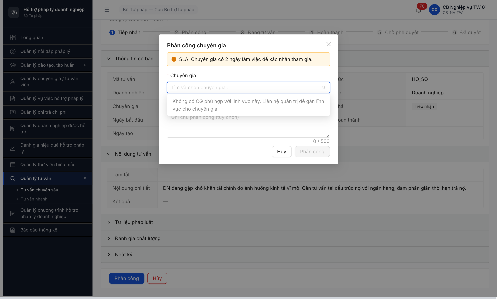
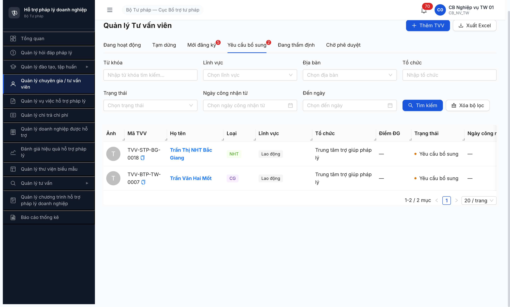

# Bug Report — Workflow Tư vấn Chuyên sâu (R6.4.A5)

| Thông tin | Giá trị |
|-----------|---------|
| **Dự án** | PM HTPLDN |
| **Môi trường** | http://103.172.236.130:3000/ |
| **Người test** | QA Automation (Claude Code via MCP Chrome DevTools) |
| **Ngày** | 2026-05-04 |
| **Loại test** | Workflow E2E (R17 retest — TVCS-002 FIXED) |
| **Round** | Round 17 |
| **Tài liệu tham chiếu** | [workflow-test-report-TVCS.md](../workflow/workflow-test-report-TVCS.md) · SRS FR-12 SM-TVCS §⑧ |

---

## Tổng hợp

Phát hiện **1 Major bug + 1 Critical Closed + 1 Observation** trong session test R6.4.A5 R11+R12 (sau verify SRS 2-source).

> **Re-verify SRS 2-source 2026-05-02 R12:**
> - **TVCS-002 (Major):** ✅ vi phạm SRS rõ ràng — `srs-fr-12 line 933` (action-bar PHAN_CONG quote nguyên văn `[Hủy yêu cầu]`) + `line 1199` (transition PHAN_CONG → HUY actor "CB NV hủy" guard "CG chưa xác nhận"). Giữ severity Major.
> - **FK-CG-001 (Observation, downgrade từ Critical):** ⚠️ KHÔNG vi phạm SRS rõ. `srs-fr-04 line 1057` field `tai_khoan_id FK → TAI_KHOAN(id)` Bắt buộc=N (Nullable). SRS KHÔNG có UC/form spec link FK qua UI. Là data setup gap — dev có thể gán qua DB script (như đã làm cho NHT R6.2.8). Move sang section Observations.

### Severity breakdown

| Tổng | Critical | Major | Medium | Minor | Trivial |
|------|----------|-------|--------|-------|---------|
| 0    | 0        | 0     | 0      | 0     | 0       |

> **R17 update:** Cả 2 bug đã CLOSED. TVCS-002 fixed 2026-05-04 R17 — button [Hủy yêu cầu] + modal + transition B10 PHAN_CONG → HUY PASS end-to-end. Còn lại OBS-FLOW-TVCS-003 (FK gap) trong file [`observations-flow-tvcs.md`](observations-flow-tvcs.md) — chưa fix.

## Bug Summary Table

| Bug ID | Severity | Priority | Type | TC Ref | **SRS Reference** | Title | Status |
|--------|----------|----------|------|--------|-------------------|-------|--------|
| ~~BUG-FUNC-TVCS-002~~ | Major | P1 | UI/UX | R6.4.A5 B10 | `srs-fr-12 line 933` (action-bar PHAN_CONG) + `line 1199` (transition PHAN_CONG → HUY) | Detail TVCS state PHAN_CONG KHÔNG có button [Hủy yêu cầu] — vi phạm SRS line 933 + 1199 | Closed |
| ~~BUG-FUNC-TVCS-001~~ | Critical | P0 | Data | R6.4.A5 B2 | `02-thu-tu-module.md §⑧ FR-12` line 533 + `R6.2.5` seed acceptance | Dropdown phân công CG trống — toàn bộ CG seed stuck ở MOI_DANG_KY/YEU_CAU_BO_SUNG → block toàn bộ workflow TVCS B2-B11 | Closed |

---

## ~~BUG-FUNC-TVCS-002~~ [CLOSED] — Detail TVCS state PHAN_CONG thiếu button [Hủy yêu cầu]

> **Meta:** Major / P1 / UI/UX / Closed 2026-05-04 R17. SRS `02-thu-tu-module.md §⑧ FR-12` line 541.
>
> **Re-test:** 2026-05-04 R17 — ✅ PASS (Closed-verified). Sau dev fix lần 3, login `cb_nv_tw_01` mở TVCS-20260501-0001 (PHAN_CONG): button "Hủy yêu cầu" (style outline đỏ) hiện ở footer detail page. Click button → modal "Hủy nội dung tư vấn" mở với field "Lý do hủy" (textarea required, max 1000 chars) + 2 button [Quay lại] + [Xác nhận hủy]. Nhập lý do "CG chưa xác nhận trong 2 ngày SLA. Hủy yêu cầu để phân công lại CG khác." → click [Xác nhận hủy]. Banner "Nội dung tư vấn đã bị hủy" + state badge đổi "Phân công" → "Hủy" + field "Trạng thái" cập nhật "Hủy". Transition B10 (`PHAN_CONG → HUY`) end-to-end PASS đúng SRS line 541 + 1199. Stepper 6 bước biến mất sau HUY (terminal state). Evidence: [r17-a5-tvcs-0001-cancel-btn-fixed.png](../screenshots/r17-a5-tvcs-0001-cancel-btn-fixed.png) + [r17-a5-tvcs-0001-cancel-modal-filled.png](../screenshots/r17-a5-tvcs-0001-cancel-modal-filled.png) + [r17-a5-tvcs-0001-state-huy-success.png](../screenshots/r17-a5-tvcs-0001-state-huy-success.png).
>
> **Re-test history:**
> - R12/R13/R14: ❌ Button missing.
> - R15 (2026-05-04): ❌ FAIL — dev claim fix lần 1, button vẫn missing. DOM scan 0 match `/Hủy/i`.
> - R16 (2026-05-04): ❌ FAIL — dev claim fix lần 2, button vẫn missing. Cải tiến nhỏ "Hình thức" enum → label.
> - R17 (2026-05-04): ✅ PASS — fix landed thật.

### Mô tả

Khi `cb_nv_tw_01` mở chi tiết TVCS-20260501-0001 ở state `PHAN_CONG` (vừa được phân công cho TVV-0009 sau B2 R12), **action bar / footer / menu KHÔNG có button [Hủy yêu cầu]**. Theo SRS line 541, transition B10 (`PHAN_CONG → HUY`) phải có button [Hủy yêu cầu] với guard "CG chưa xác nhận" cho actor `cb_nv_<cap>_01`. Hiện guard satisfy (cg_tw_01 chưa thể chấp nhận do FK gap BUG-FUNC-FK-CG-001) nhưng UI vẫn không expose action.

### Các bước tái hiện

1. Login `cb_nv_tw_01 / Secret@123 / OTP 666666`.
2. URL `/tv-chuyen-sau/danh-sach` → click button "edit" trên row TVCS-20260501-0001 (state "Phân công").
3. Trang detail mở: header "TVCS-20260501-0001" + state badge "Phân công" + stepper 6 bước.
4. **Quan sát:** Toàn detail page có **0 button** chứa text "Hủy" / "Hủy yêu cầu" / "Hủy phân công" (verified qua DOM scan: `Array.from(document.querySelectorAll('button')).filter(b => /Hủy/i.test(b.textContent))` → empty).
5. Verify list view: cột "Thao tác" của row TVCS-0001 chỉ có button "edit", không có "delete" / "Hủy" (so với 5 TVCS khác state TIEP_NHAN có cả edit + delete).

### Kết quả mong đợi

- Theo SRS line 541: state `PHAN_CONG`, actor `cb_nv_<cap>_01`, action [Hủy yêu cầu] với guard "CG chưa xác nhận" → state `HUY`.
- Detail page TVCS state PHAN_CONG phải hiện button [Hủy yêu cầu] (kèm modal confirm + lý do nếu BR yêu cầu).

### Kết quả thực tế

- 0 button [Hủy yêu cầu] trên detail page state PHAN_CONG.
- Cb_nv không có cách nào hủy TVCS đã phân công sai → nếu CG không nhận trong 2 ngày SLA, TVCS bị stuck PHAN_CONG vĩnh viễn (cron auto-banner ở B5 chỉ cảnh báo, không transition).

### Bằng chứng

![BUG-FUNC-TVCS-002 — Detail TVCS-0001 PHAN_CONG: stepper + thông tin nhưng không có button [Hủy yêu cầu]](../screenshots/r6-tvcs-0001-detail-no-cancel-btn.png)

```text
DOM scan trên detail page TVCS-0001 (state PHAN_CONG):
const cancelLike = Array.from(document.querySelectorAll('button'))
  .filter(b => /Hủy|Hủy yêu cầu|Hủy phân công/i.test(b.textContent))
  .map(b => b.textContent.trim());
→ [] (empty)

Total visible buttons trên detail page: 15 — toàn nav sidebar + accordion expand + breadcrumb,
KHÔNG có action bar cho transition PHAN_CONG.
```

---

## ~~BUG-FUNC-TVCS-001~~ [CLOSED] — Dropdown phân công CG trống do CG profile chưa advance state

> **Meta:** Critical / P0 / Data / Closed 2026-05-02 R12. SRS line 533 + R6.2.5 acceptance.
>
> **Re-test:** 2026-05-02 R12 — ✅ PASS (Closed-verified). Sau R6.4.A1-CG advance 4/4 CG (TVV-0009/0010/0011/0012) → DANG_HOAT_DONG, dropdown render đúng SRS line 533: TVCS-20260501-0001 (LV "Doanh nghiệp") modal Phân công CG hiện 1 option "Lý Thị Mười Ba — Doanh nghiệp" (TVV-0009 CG). Click + submit → toast "Đã phân công chuyên gia", state TVCS-0001: TIEP_NHAN → PHAN_CONG. Evidence: [r6-a5-tvcs-dropdown-cg-DN-fixed.png](../screenshots/r6-a5-tvcs-dropdown-cg-DN-fixed.png) + [r6-a5-tvcs-0001-phan-cong-CG-success.png](../screenshots/r6-a5-tvcs-0001-phan-cong-CG-success.png).

### Mô tả

Khi `cb_nv_tw_01` mở modal `Phân công chuyên gia` cho TVCS-20260501-0001 (LV "Doanh nghiệp"), dropdown chuyên gia trả về empty với message **"Không có CG phù hợp với lĩnh vực này. Liên hệ quản trị để gán lĩnh vực cho chuyên gia."** Tested cùng pattern cho LV khác trong 6 TVCS records, tất cả block giống nhau.

Root cause: BE filter `trang_thai=DANG_HOAT_DONG ∧ loai_tvv=CG` (đúng SRS line 533) trả 0 record vì cả 5 CG profile seeded R6.2.5 (TVV-BTP-TW-0007/0009/0010/0011/0012) đều stuck ở state `MOI_DANG_KY` (4 records) hoặc `YEU_CAU_BO_SUNG` (1 record). 6 TVV state DANG_HOAT_DONG đều có `loai_tvv=TVV` (không phải CG).

### Các bước tái hiện

1. Login `cb_nv_tw_01 / Secret@123 / OTP 666666`.
2. Mở module "Quản lý tư vấn" → submenu "Tư vấn chuyên sâu" → URL `/tv-chuyen-sau/danh-sach`.
3. Click row TVCS-20260501-0001 (DN "Công ty Cổ phần Phúc An 1", LV "Doanh nghiệp", state "Tiếp nhận").
4. Tại trang chi tiết, click button **[Phân công]**.
5. Modal `Phân công chuyên gia` mở. Click combobox `* Chuyên gia` → click vào input để open listbox.
6. **Quan sát:** Listbox empty, hiển thị message "Không có CG phù hợp với lĩnh vực này. Liên hệ quản trị để gán lĩnh vực cho chuyên gia."
7. Verify network: `GET /api/v1/tu-van-viens?pageSize=100&trangThai=DANG_HOAT_DONG&loaiTvv=CG&linhVucIds=bbbbbbbb-0000-4000-8000-00000000001a` → HTTP 200, response data array empty.
8. Verify cross-module ở "Quản lý chuyên gia / tư vấn viên":
   - Tab "Đang hoạt động" 6 — tất cả `loaiTvv=TVV` (TVV-0001..0006), không có CG.
   - Tab "Mới đăng ký 5" — 4 CG (TVV-0009 LV DN / 0010 LV HĐ / 0011 LV SHTT / 0012 LV ĐĐ) + 1 NHT BNI.
   - Tab "Yêu cầu bổ sung 2" — 1 CG (TVV-0007 LV LĐ) + 1 NHT BG.

### Kết quả mong đợi

- Theo SRS `02-thu-tu-module.md` line 533: dropdown lọc CG `DANG_HOAT_DONG` khớp `linhVuc=Doanh nghiệp` → trả ≥1 record.
- Theo R6.2.5 seed acceptance: 6 CG cover 6 LV (DN/HĐ/LĐ/SHTT/Thuế/ĐĐ) → mỗi LV ≥1 CG khả dụng.
- Workflow B2 phân công thành công, TVCS-0001 chuyển sang `PHAN_CONG`.

### Kết quả thực tế

- Dropdown rỗng — workflow B2 block hoàn toàn.
- Cascade impact: B3-B11 transitions cũng block (chuỗi 10 transition).
- Module FR-12 không có entry workflow nào pass được → Phase 4 Trụ A bị mất R6.4.A5 cho R11.

### Bằng chứng





```text
API request:
GET /api/v1/tu-van-viens?pageSize=100&trangThai=DANG_HOAT_DONG&loaiTvv=CG&linhVucIds=bbbbbbbb-0000-4000-8000-00000000001a
HTTP 200
Response: { "success": true, "data": [], "meta": {...} }

UI message:
"Không có CG phù hợp với lĩnh vực này. Liên hệ quản trị để gán lĩnh vực cho chuyên gia."

CG profile actual state breakdown (verified UI tabs):
- TVV-BTP-TW-0007 (CG, LV Lao động): YEU_CAU_BO_SUNG
- TVV-BTP-TW-0009 (CG, LV Doanh nghiệp): MOI_DANG_KY
- TVV-BTP-TW-0010 (CG, LV Hợp đồng): MOI_DANG_KY
- TVV-BTP-TW-0011 (CG, LV Sở hữu trí tuệ): MOI_DANG_KY
- TVV-BTP-TW-0012 (CG, LV Đất đai): MOI_DANG_KY

Required state per SRS line 533:
"Dropdown chọn CG từ TU_VAN_VIEN với: Chỉ lấy CG đang DANG_HOAT_DONG ..."
```

---

## Observations (KHÔNG phải bug)

> **Đã tách sang file riêng:** [observations-flow-tvcs.md](observations-flow-tvcs.md) — chứa OBS-FLOW-TVCS-001 (TVV-0008 missing) + OBS-FLOW-TVCS-002 (field Hình thức không match SRS) + OBS-FLOW-TVCS-003 (FK gap data setup).

---

## Phụ lục — Môi trường test

| Thành phần | Giá trị |
|------------|---------|
| URL ứng dụng | http://103.172.236.130:3000/ |
| OTP login | `666666` (bypass tạm — verified) |
| MailHog (OTP inbox) | http://103.172.236.130:8025 |
| API base | http://103.172.236.130:3000/api/v1 |
| Frontend | React + Vite + Ant Design |
| Xác thực | JWT + OTP |
| Tool test | Chrome DevTools MCP |

---

*Bug report generated: 2026-05-02 | QA Automation via Claude Code*
