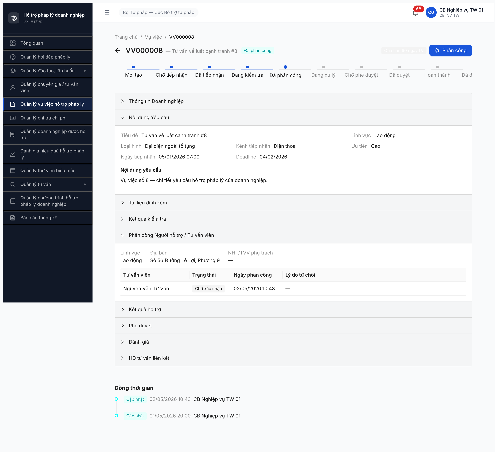

# Bug Report — Workflow Vụ việc (R6.4.A3)

| Thông tin | Giá trị |
|-----------|---------|
| **Dự án** | PM HTPLDN |
| **Môi trường** | http://103.172.236.130:3000/ |
| **Người test** | QA Automation (Claude Code via MCP Chrome DevTools) |
| **Ngày** | 2026-05-02 (R7) · 2026-05-01 (R6) |
| **Loại test** | Workflow E2E |
| **Round** | Round 7 (latest) — Round 6 archived |
| **Tài liệu tham chiếu** | [workflow-test-report-VuViec.md](../workflow/workflow-test-report-VuViec.md) · SRS FR-05 SM-VUVIEC §UC59 |

---

## Tổng hợp

**0 bug có SRS reference cụ thể** trong session test R6.4.A3 (cả R6 + R7).

> **Rule log bug (feedback 2026-04-23):** Bug chỉ log khi có SRS reference cụ thể. R7 phát hiện 3 quan sát (1 từ R6 vẫn còn, 2 mới) — KHÔNG log bug vì:
> 1. Hai trong 3 quan sát là **data setup gap** + **BE behavior cần BA verify**, không phải code bug rõ ràng.
> 2. Một quan sát R6 đã được R7 chứng minh là **expected behavior** (filter `trangThai=DANG_HOAT_DONG` đúng SRS).
>
> Đã ghi vào section "Observations" dưới + workflow-test-report.

### Severity breakdown

| Tổng | Critical | Major | Medium | Minor | Trivial |
|------|----------|-------|--------|-------|---------|
| 0    | 0        | 0     | 0      | 0     | 0       |

## Bug Summary Table

| Bug ID | Severity | Priority | Type | TC Ref | **SRS Reference** | Title | Status |
|--------|----------|----------|------|--------|-------------------|-------|--------|
| — | — | — | — | — | — | (Không có bug log trong session R6+R7 A3) | — |

---

## Observations (chưa map SRS — không log thành bug)

### OBS-FLOW-VUVIEC-001 — [RESOLVED R7] Dropdown "Phân công TVV" trống khi pool chưa "Đang hoạt động"

> **Status: RESOLVED 2026-05-02 R7** — Confirmed expected behavior. Sau R6.4.A1 PASS (pool 6 TVV TW DANG_HOAT_DONG), R7 retest dropdown trả 2 record (TVV-BTP-TW-0001 + TW-0006 LV Lao động) → BE filter `trangThai=DANG_HOAT_DONG` đúng SRS UC59 BR-CALC-05. R6 observation = data dependency, không phải code bug.

**R6 hiện tượng cũ:** Modal "Phân công TVV" mở dropdown rỗng dù DB có 9 profile (6 TVV + 2 CG + 1 NHT). API `GET /vu-viecs/{id}/goi-y-tvv?limit=20` trả `data:[]` vì pool toàn `MOI_DANG_KY`.

**R7 verify:** API call sau A1 PASS → `data:[2]`. Behavior correct.

---

### OBS-FLOW-VUVIEC-006 — [NEW R9 2026-05-02 14:15] BE limit `CAU_HINH_PHAN_CONG` chỉ work cho HOI_DAP, ignore VU_VIEC/TU_VAN_CS

**Hiện tượng:** Tại R6.4.A1.5 (cấu hình PC TVV cho VV), phát hiện 2 BE limitation:

**Bug 1 — Vai trò NHT bị reject (ERR-CH-03):**
```
POST /api/v1/cau-hinh-phan-congs
Body: {"linhVucId":"...","nguoiXuLyId":"<tvv_tw_01 ID>","loaiYeuCau":"VU_VIEC",...}
→ HTTP 400 ERR-CH-03 "Tài khoản 'Tư vấn viên TW 01' không có vai trò xử lý hỏi đáp (chỉ chấp nhận CB nghiệp vụ, TVV hoặc CG)"
```
- tvv_tw_01..06 hiện vai trò **NHT** (đặt R8 để pass A3 Bước 4 — NHT có sidebar Quản lý vụ việc, TVV/CG không có).
- BE filter accepted roles = [CB_NV_*, TVV, CG] → exclude NHT.
- **Mâu thuẫn**: A3 dropdown `goi-y-tvv` LẠI accept NHT (đã verify R8/R9 12/12 PASS với tvv_tw_xx vai trò NHT).
- **Cần BA verify**: SRS quy định role nào valid cho `nguoiXuLyId` trong CAU_HINH_PHAN_CONG?

**Bug 2 — Hardcode `loaiYeuCau=HOI_DAP` (silent BE override):**
```
POST /api/v1/cau-hinh-phan-congs
Body: {"linhVucId":"...","nguoiXuLyId":"<cg_tw_01>","loaiYeuCau":"VU_VIEC",...}
→ HTTP 201 success, response.data.loaiYeuCau = "HOI_DAP" (KHÔNG phải VU_VIEC như request)
```
- Tested với enum VU_VIEC + TAT_CA → cả 2 đều save thành HOI_DAP.
- Tested TU_VAN_CS → reject ERR-CH-01 "đã tồn tại" (vì record HOI_DAP duplicate).
- → **BE đã hardcode** loaiYeuCau=HOI_DAP, ignore field từ request body.
- UI tab "Phân công mặc định" GET `?loaiYeuCau=HOI_DAP` only — confirm chỉ implement HD scope.

**Vi phạm SRS:**
- §3.4.3.48 entity `CAU_HINH_PHAN_CONG` field `loai_yeu_cau` enum 4 giá trị (HOI_DAP/VU_VIEC/TU_VAN_CS/TAT_CA).
- Dòng 105: "Khi CB NV phân công cho yêu cầu thuộc FR-02 Hỏi đáp / FR-05 Vụ việc / FR-12 Tư vấn chuyên sâu, hệ thống đọc bảng này".
- → BE chưa implement đa loại như SRS.

**Repro steps:**
1. Login `qtht_01` → SCR-VIII-06 Tab "Phân công mặc định" → tab chỉ hiện HD configs.
2. POST `/cau-hinh-phan-congs` với `loaiYeuCau=VU_VIEC` → response saved HOI_DAP.
3. Verify GET `?loaiYeuCau=VU_VIEC` → trả 0 records.
4. Verify GET `?pageSize=100` → tất cả records loaiYeuCau=HOI_DAP.

**Bằng chứng:**
```json
// POST request
{"linhVucId":"bbbbbbbb-...000013","nguoiXuLyId":"<cg_tw_01>","loaiYeuCau":"VU_VIEC","uuTien":1,"donViId":"<BTP-TW>"}

// Response (HTTP 201)
{"success":true,"data":{"id":"7a8a3821-...","loaiYeuCau":"HOI_DAP","linhVuc":{"ten":"Lao động"},"nguoiXuLy":{"hoTen":"Chuyên gia TW 01"}}}
                              ^^^^^^^^^^^^^^^^^^^^^^ ← BE override

// NHT role test
POST + nguoiXuLyId=tvv_tw_01 NHT
→ HTTP 400 {"error":{"code":"ERR-CH-03","message":"Tài khoản '...' không có vai trò xử lý hỏi đáp (chỉ chấp nhận CB nghiệp vụ, TVV hoặc CG)"}}
```

---

### OBS-FLOW-VUVIEC-005 — [PARTIALLY RESOLVED R8 2026-05-02] PHAN_CONG snapshot pattern — fix retroactive cần BE update

> **Update R8 13:08:** Hypothesis CONFIRMED qua test 2 VV. **VV000028 phân công SAU FK link → Bước 4 PASS HTTP 201**. **VV000008 phân công TRƯỚC FK link → Bước 4 vẫn fail ERR-PERM-VI-10-01.** PHAN_CONG record là snapshot at creation, BE không re-evaluate FK runtime. Cho VV mới phân công sau setup R6.2.7-TW: ✅ workflow PASS. Cho VV cũ (VV000008): cần BE fix để re-evaluate FK runtime, hoặc workaround re-phân công (state DA_PHAN_CONG block re-assign HTTP 409).


**Hiện tượng (R8):** Sau R6.2.7-TW PASS (6 TK `tvv_tw_01..06` tạo + activate + role NHT + FK link entity TVV-BTP-TW-0001..06), tvv_tw_01 login OK, access VV000008 OK. POST API `/api/v1/vu-viecs/{id}/nhan-phan-cong` trả `HTTP 403 ERR-PERM-VI-10-01 "Không phải người được phân công"`.

**Diagnostic:**
- VV000008 state `DA_PHAN_CONG`, gán cho TVV-BTP-TW-0001 (entity id `1e7b8dfb-...`) tại R7 lúc 03:43.
- TVV entity TW-0001 → `taiKhoanId = f0d5ad81-...` (tvv_tw_01 account, link tại R8 lúc 05:42, **sau** Bước 3 phân công).
- JWT tvv_tw_01: vai trò NHT, permission có `nhan-phan-cong_vu_viec` ✅
- Detail API `/vu-viecs/{id}` trả `_links: {tiep-nhan: {...}}` thay vì `{nhan-phan-cong: {...}}` mong đợi cho state DA_PHAN_CONG → BE state machine link generator có thể wrong cho NHT actor.

**Hypothesis:** BE check Bước 4 dùng denormalized snapshot `PHAN_CONG.tu_van_vien_user_id` (account ID lưu lúc Bước 3 phân công). Tại R7 03:43 khi tạo PHAN_CONG record, TVV entity TW-0001 chưa có `tai_khoan_id` (FK link sau ở R8 05:42) → snapshot lưu `null` → BE check `JWT.sub == null` → fail.

**Workaround chưa verify:** re-phân công VV000008 sau khi FK link đã có (force fresh PHAN_CONG record).

**Cần BA verify:** SRS spec Bước 4 BE check pattern:
- Có cho phép FK link sau phân công không?
- Hoặc strict: phân công chỉ valid khi TVV đã có tài khoản trước?

**Bằng chứng:**

```json
// JWT tvv_tw_01 (decoded)
{"sub":"f0d5ad81-...","vaiTro":["NHT"],"donViId":"BTP-TW","permissions":["nhan-phan-cong_vu_viec","tu-choi-phan-cong_vu_viec",...]}

// API call
POST /api/v1/vu-viecs/e2000000-...-008/nhan-phan-cong
Authorization: Bearer <tvv_tw_01 JWT>
Body: {}
→ HTTP 403
{"success":false,"error":{"code":"ERR-PERM-VI-10-01","message":"Không phải người được phân công","timestamp":"2026-05-02T05:48:21.720Z","requestId":"4f631051-..."}}

// VV detail _links (state DA_PHAN_CONG)
"_links":{"tiep-nhan":{"href":"/api/v1/vu-viecs/.../tiep-nhan","method":"POST"}}
// Expected (per SRS Bước 4): "_links":{"nhan-phan-cong":{...},"tu-choi-phan-cong":{...}}

// FK confirmation (verified post-PATCH)
GET /api/v1/tu-van-viens/1e7b8dfb-... → "taiKhoanId":"f0d5ad81-..."
```

---

### OBS-FLOW-VUVIEC-002 — [PARTIALLY RESOLVED R8] TVV TW pool seed không có tài khoản login → block Bước 4 SM-VUVIEC

> **Update R8 2026-05-02:** Setup gap RESOLVED qua task R6.2.7-TW (tạo 6 TK `tvv_tw_01..06` vai trò NHT + link FK). Tuy nhiên Bước 4 vẫn block do BE issue mới — xem OBS-005.

**Hiện tượng:** Sau Bước 3 PASS (R7 02/05 10:43), VV000008 advance state `DA_PHAN_CONG` với TVV-BTP-TW-0001 (Nguyễn Văn Tư Vấn). SRS Bước 4 (`DA_PHAN_CONG → DANG_XU_LY`) yêu cầu actor `tvv_01 / nht_01` login + click "Xác nhận tham gia". Tuy nhiên TVV-BTP-TW-0001..6 (seed bởi R6.4.A1 vào DB) KHÔNG có tài khoản login tương ứng trong `users.csv`.

**Diagnostic:**
```
Login attempt: tvv_btp_tw_01 / Secret@123
→ POST /api/v1/auth/login
→ HTTP 401 ERR-AUTH-LOGIN-01 "Tên đăng nhập hoặc mật khẩu không đúng."
```

`users.csv` 34 accounts hiện chỉ có:
- `tvv_01` (AG, đơn vị STP-AG, ĐP)
- `tvv_02` (BG, đơn vị STP-BG, ĐP)
- `tvv_03` (BNI, đơn vị STP-BNI, ĐP)

KHÔNG có account TVV cấp TW khớp với 6 TVV-BTP-TW-0001..6 đã active sau A1.

cb_nv_tw_01 JWT permissions không bao gồm `xac-nhan-tham-gia_vu_viec` → cb_nv không có quyền override Bước 4 thay TVV.

**Đây có phải bug không?** **CÒN AMBIGUOUS** — cần BA confirm:
1. **Nếu seed task R6.4.A1 thiếu tạo TK login cho TVV TW** → setup gap (không log bug, chỉ thêm seed task R8). Recommend: tạo `tvv_btp_tw_01..06` + link FK `TU_VAN_VIEN.tai_khoan_id`.
2. **Nếu SRS spec TVV cấp TW không cần login (chỉ TVV ĐP cần login)** → BE bug ở `goi-y-tvv` filter — không nên gợi ý TW TVV cho VV thuộc DN ĐP. Cần verify SRS BR-AUTH-10 strict.
3. **Nếu cb_nv được phép override Bước 4** → thiếu permission `xac-nhan-tham-gia_vu_viec` trong vai trò CB_NV_TW. Cần verify SRS phân quyền.

**Repro steps R7:**
1. Login `cb_nv_tw_01 / Secret@123 / OTP 666666`
2. Navigate `/vu-viec/e2000000-0000-4000-8000-000000000008` (state Đang kiểm tra)
3. Click `[Phân công]` → Modal mở
4. Click dropdown → 2 TVV gợi ý (TW-0001, TW-0006)
5. Chọn `TVV-BTP-TW-0001` → click `[Xác nhận]` → ✅ HTTP 201, state advance `DA_PHAN_CONG`
6. Logout cb_nv → thử login `tvv_btp_tw_01 / Secret@123`
7. **Quan sát:** HTTP 401 ERR-AUTH-LOGIN-01. Account không tồn tại.

**Bằng chứng:**



```json
// POST /phan-cong response (reqid=1522)
{
  "success": true,
  "data": {
    "maVuViec": "VV000008",
    "trangThai": "DA_PHAN_CONG",
    "ngayPhanCong": "2026-05-02T03:43:46.999Z",
    "version": 3
  }
}

// Login TVV TW thử nghiệm
POST /api/v1/auth/login {"username":"tvv_btp_tw_01","password":"Secret@123"}
→ HTTP 401 {"success":false,"error":{"code":"ERR-AUTH-LOGIN-01"}}
```

---

### OBS-FLOW-VUVIEC-003 — [NEW R7] Filter địa bàn (BR-AUTH-10) — TW TVV gợi ý cho VV thuộc DN cấp ĐP

**Hiện tượng:** VV000008 (DN "Hộ kinh doanh An Khang 8", `donViId=00000000-0000-4000-8002-000000000008` cấp ĐP — Sở TP). Dropdown `goi-y-tvv` trả 2 TVV cấp TW (TVV-BTP-TW-0001/0006, đơn vị BTP-TW). SRS BR-AUTH-10 spec "Địa bàn phù hợp (cùng Sở TP — lọc kép)" — về lý thuyết phải lọc TVV cùng đơn vị với DN.

**Hypothesis:** BE filter có exception cho cb_nv_tw_01 (role TW có scope toàn quốc) → trả TW TVV thay vì strict cùng Sở TP. Hoặc BR-AUTH-10 chỉ áp dụng cho cb_nv_dp/cb_nv_bn role, không áp dụng cho TW.

**Cần BA verify:** quote nguyên văn SRS FR-V.I-09 §3.4.5.x BR-AUTH-10 — có exception cho TW role không, hay strict cùng đơn vị áp dụng cho mọi role.

**API evidence:**
```json
// goi-y-tvv response trả TW TVV cho VV thuộc DN cấp ĐP
{
  "data": [
    {"maTvv": "TVV-BTP-TW-0001", "loaiTvv": "TVV", ...},  // TW
    {"maTvv": "TVV-BTP-TW-0006", "loaiTvv": "TVV", ...}   // TW
  ],
  "meta": {"total": 2, "linhVucId": "..."}  // không có trường địa bàn lọc
}

// VU_VIEC.donViId from POST /phan-cong response
"donViId": "00000000-0000-4000-8002-000000000008"  // ĐP — Sở TP
```

---

### OBS-FLOW-VUVIEC-004 — [NEW R7] `nguoiHoTroId` null trong response sau POST /phan-cong

**Hiện tượng:** Response POST `/vu-viecs/{id}/phan-cong` trả `nguoiHoTroId: null` dù request body gửi `tvvId` valid và state advance OK (`DA_PHAN_CONG`).

**Hypothesis:** BE lưu phân công ở entity `PHAN_CONG` riêng (theo SRS §3.4.5 accordion `PHAN_CONG`), không denormalize vào `VU_VIEC.nguoi_ho_tro_id` cho đến khi TVV xác nhận tham gia (Bước 4 → DANG_XU_LY). UI top header hiển thị `NHT/TVV phụ trách: —` consistent với hypothesis này. Sau khi TVV xác nhận, BE có thể update `nguoi_ho_tro_id`.

**Không log bug** — chờ verify BR. Cần BA verify reporting/dashboard query có dùng `nguoi_ho_tro_id` riêng không.

---

## Phụ lục — Môi trường test

| Thành phần | Giá trị |
|------------|---------|
| URL ứng dụng | http://103.172.236.130:3000/ |
| OTP login | `666666` (bypass dev) |
| MailHog | http://103.172.236.130:8025/ |
| API base | http://103.172.236.130:3000/api/v1/ |
| Frontend | React + Vite + Ant Design |
| Xác thực | JWT + OTP (BE revoke ~2 phút thực bất chấp `exp` 15 phút — memory `qa_htpldn_jwt_revoke_aggressive`) |
| Tool test | Chrome DevTools MCP |

---

*Bug report generated: 2026-05-02 10:50 R7 | QA Automation via Claude Code*
