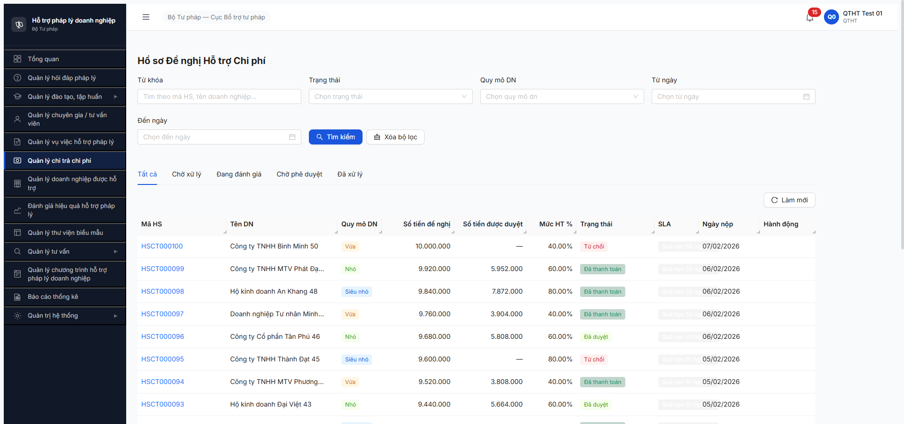

# Bug Report — Chi trả Chi phí (R6.7.12 functional negative/perm/edge)

| Thông tin | Giá trị |
|-----------|---------|
| **Dự án** | PM HTPLDN |
| **Môi trường** | http://103.172.236.130:3000/ |
| **Người test** | QA Automation (Claude Code via MCP Chrome DevTools + API direct) |
| **Ngày** | 2026-05-05 |
| **Loại test** | Functional negative + permission + edge (R6.7.12) |
| **Round** | R20 |
| **Tài liệu tham chiếu** | [`functional-test-report-ChiTra.md`](../functional/functional-test-report-ChiTra.md) · [`output/funtion/7.6-chi-tra-chi-phi.md`](../../../funtion/7.6-chi-tra-chi-phi.md) |

---

## Tổng hợp

Phát hiện **1** lỗi có SRS reference cụ thể — BR-CALC-01 calculation bug. 3 obs Minor (UI heading + empty state + pagination consistency) gộp vào functional report, KHÔNG log thành bug entry độc lập theo rule "bug phải có SRS clause cụ thể".

### Severity breakdown

| Tổng | Critical | Major | Medium | Minor | Trivial |
|------|----------|-------|--------|-------|---------|
| 1    | 0        | 1     | 0      | 0     | 0       |

## Bug Summary Table

| Bug ID | Severity | Priority | Type | TC Ref | **SRS Reference** | Title | Status |
|--------|----------|----------|------|--------|-------------------|-------|--------|
| BUG-CT-CALC-001 | Major | P1 | Calculation | CT-007/008/009/010 | `BR-CALC-01 NĐ55 — Mức hỗ trợ theo quy mô DN` (Siêu nhỏ 100% trần 3M, Nhỏ 30% trần 5M, Vừa 10% trần 10M) | Cột "Mức HT %" trên list HSCT hiển thị 40/60/80% sai hoàn toàn so với BR-CALC-01 | Open |

---

## BUG-CT-CALC-001 — Cột "Mức HT %" trên list HSCT hiển thị sai BR-CALC-01

### Mô tả

Trang Quản lý Chi trả → list 100 HSCT hiển thị cột "Mức HT %" với 3 giá trị 40/60/80%, KHÔNG khớp BR-CALC-01 (NĐ55). Theo spec: Siêu nhỏ phải 100% (trần 3M), Nhỏ phải max 30% (trần 5M), Vừa phải max 10% (trần 10M). Cột hiện tại hiển thị quy mô Vừa = 40%, Nhỏ = 60%, Siêu nhỏ = 80% — gấp 4-8 lần spec, gây sai số tiền duyệt + over-spend ngân sách hỗ trợ DN.

### Các bước tái hiện

1. Login `qtht_01` / `Secret@123` / OTP `666666`.
2. Sidebar → "Quản lý chi trả chi phí" → URL `/chi-tra/danh-sach`.
3. Quan sát cột "Mức HT %" + cột "Quy mô DN" trên 20 record page 1.
4. Verify pattern lặp lại trên 100 record (page 2-5).

### Kết quả mong đợi

Theo `BR-CALC-01 NĐ55`:

| Quy mô DN | Mức HT mong đợi | Trần năm |
|---|---:|---:|
| Siêu nhỏ | **100%** | 3.000.000 đ |
| Nhỏ | **max 30%** | 5.000.000 đ |
| Vừa | **max 10%** | 10.000.000 đ |

### Kết quả thực tế

Cột "Mức HT %" lặp lại 3 giá trị fixed:

| Quy mô DN observed | Mức HT actual | Sai số vs spec |
|---|---:|---|
| Siêu nhỏ | **80.00%** | thấp hơn 20% so với 100% |
| Nhỏ | **60.00%** | gấp **2×** spec 30% |
| Vừa | **40.00%** | gấp **4×** spec 10% |

Sample 4 record HSCT page 1:
- HSCT000100 / DN Vừa → 40.00% (so_tien_de_nghi 10.000.000 → so_tien_duyet `—` vì state Từ chối, nhưng nếu duyệt sẽ tính 40% × 10M = 4M, vượt trần 10M sẽ chấp nhận; spec đúng 10% × 10M = 1M)
- HSCT000099 / DN Nhỏ → 60.00% (de_nghi 9.920.000 → duyet 5.952.000 = 60% × 9.92M, spec 30% × 9.92M = 2.976M, vượt **2×**)
- HSCT000098 / DN Siêu nhỏ → 80.00% (de_nghi 9.840.000 → duyet 7.872.000 = 80% × 9.84M, vượt trần 3M chấp nhận, spec 100% × 9.84M nhưng cap 3M = 3M, **observed 7.872M = vượt trần 2.6×**)

### Bằng chứng



```text
GET /api/v1/ho-so-chi-tras?page=1&pageSize=20  → 200, total=100

Sample data structure (suy luận từ UI):
{
  "maHoSo": "HSCT000098",
  "tenDoanhNghiep": "Hộ kinh doanh An Khang 48",
  "quyMoDn": "SIEU_NHO",      ← spec: 100%
  "phiTuVan": 9840000,
  "soTienDeNghi": 9840000,
  "soTienDuyet": 7872000,     ← thực tế 80% × 9.84M (nên là min(100% × 9.84M, 3M trần năm) = 3.000.000)
  "mucHoTroPhanTram": 80      ← seed/calc SAI
}
```

### So sánh (BR-CALC-01 expected vs observed) — *Authorization-style table for clarity*

| Quy mô | Spec % | Observed % | Spec trần năm | de_nghi sample | Spec duyệt | Observed duyệt | Δ |
|---|---:|---:|---:|---:|---:|---:|---|
| Siêu nhỏ | 100% | 80% | 3.000.000 | 9.840.000 | 3.000.000 (cap) | 7.872.000 | **+162%** vượt |
| Nhỏ | 30% | 60% | 5.000.000 | 9.920.000 | 2.976.000 | 5.952.000 | **+100%** gấp đôi |
| Vừa | 10% | 40% | 10.000.000 | 10.000.000 | 1.000.000 | (record từ chối) | n/a — nhưng nếu duyệt sẽ vượt 4× |

---

## Phụ lục — Môi trường test

| Thành phần | Giá trị |
|------------|---------|
| URL ứng dụng | http://103.172.236.130:3000/ |
| OTP login | `666666` (dev bypass) |
| API base | http://103.172.236.130:3000/api/v1 |
| Frontend | React + Vite + Ant Design |
| Xác thực | JWT + OTP |
| Tool test | Chrome DevTools MCP + Python urllib (API direct) |

---

*Bug report generated: 2026-05-05 | QA Automation via Claude Code*
