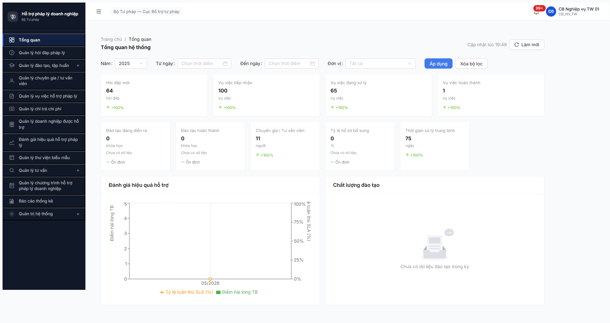
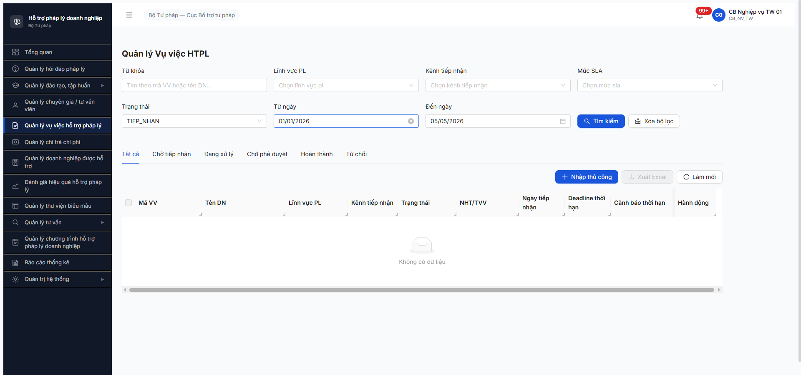
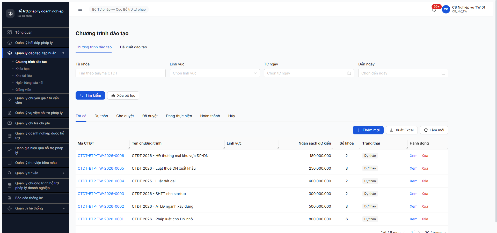
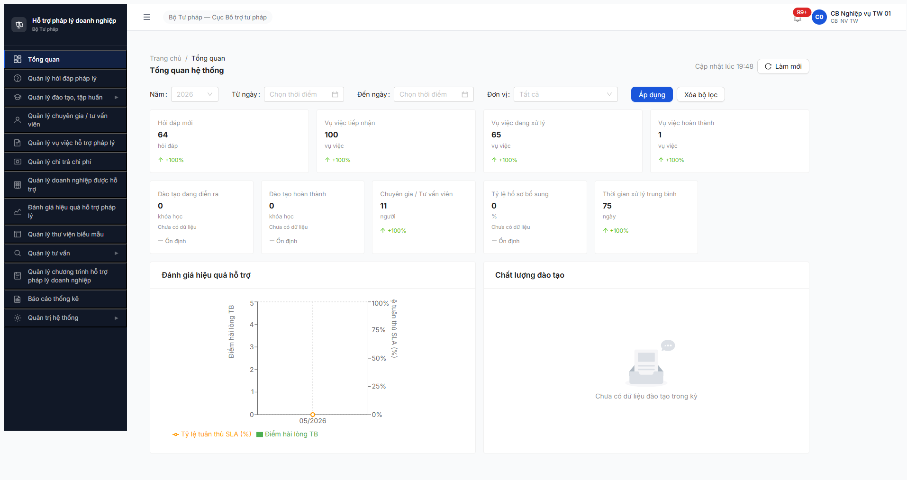

# Bug Report — Dashboard (Module 7.1, R6.7.7)

| Thông tin | Giá trị |
|-----------|---------|
| **Dự án** | PM HTPLDN — Phần mềm Hỗ trợ Pháp lý Doanh nghiệp |
| **Môi trường** | http://103.172.236.130:3000/ |
| **Người test** | QA Automation (Claude Code via Chrome DevTools MCP) |
| **Ngày** | 2026-05-05 → 2026-05-06 |
| **Loại test** | Functional / Authorization / Cross-module |
| **Round** | Round 6 — Day 3 (R6.7.7 Dashboard 34 TC) |
| **Tài liệu tham chiếu** | [test-strategy §7.1](../../../test-strategy.md#71-module-dashboard-11-fr) · [funtion/7.1-dashboard.md](../../../funtion/7.1-dashboard.md) · [functional-test-report-Dashboard.md](../functional/functional-test-report-Dashboard.md) |

---

## Tổng hợp

Phát hiện **5** bug có SRS reference cụ thể trong session R6.7.7 Dashboard.

### Severity breakdown

| Tổng | Critical | Major | Medium | Minor | Trivial |
|------|----------|-------|--------|-------|---------|
| 5    | 1        | 3     | 1      | 0     | 0       |

## Bug Summary Table

| Bug ID | Severity | Priority | Type | TC Ref | **SRS Reference** | Title | Status |
|--------|----------|----------|------|--------|-------------------|-------|--------|
| BUG-DASH-001 | Major | P0 | Workflow | DASH-010 | `SCR-I-01 row "Năm" + spec DASH-010` | Đổi Năm dropdown KHÔNG auto-set tu_ngay/den_ngay | Open |
| BUG-DASH-002 | Major | P0 | Workflow | DASH-017 | `FR-I-02/03/04 + spec DASH-017 drill-down §Workflow` | Drill-down KPI Vụ việc dùng literal `TIEP_NHAN` không match enum module | Open |
| BUG-DASH-003 | Critical | P0 | Workflow | DASH-018 | `FR-I-05/06 + spec DASH-018 drill-down §Workflow` | Drill-down KPI Đào tạo redirect sai sang module Chương trình đào tạo | Open |
| BUG-DASH-004 | Major | P0 | Data | DASH-029 | `FR-I-02/03/04 + BR-AUTH-08 + §Ghi chú thực thi DASH-028..031` | Cross-module count Dashboard ≠ Module 7.5 Vụ việc list | Open |
| BUG-DASH-005 | Medium | P1 | UI/UX | DASH-017 (sub) | `SCR-V-01 (module 7.5) Trạng thái filter` | Filter dropdown Trạng thái Vụ việc hiển thị literal enum `TIEP_NHAN` | Open |

> **Chú thích Type:** Workflow / Permission / Data / UI/UX / Negative / Edge / Happy / Performance.
> **Chú thích Severity:** Critical / Major / Medium / Minor / Trivial.
> **Chú thích Priority:** P0 / P1 / P2 / P3 / P4.

---

## BUG-DASH-001 — Đổi Năm dropdown KHÔNG auto-set tu_ngay/den_ngay theo năm chọn

### Mô tả

User cb_nv_tw_01 ở Dashboard đổi dropdown Năm sang 2025 (hoặc 2024, 2023, ...). Frontend KHÔNG auto-set `tu_ngay = 01/01/2025` và `den_ngay = 31/12/2025` như spec DASH-010 yêu cầu — date inputs trở về **trống** (placeholder "Chọn thời điểm"). Khi click "Áp dụng", API gửi `nam=2025` nhưng giữ nguyên date range mặc định `tuNgay=2026-01-01&denNgay=2026-05-05`. KPI không thay đổi (BE prefer date range, nam param không có hiệu lực filter).

### Các bước tái hiện

1. Login `cb_nv_tw_01` / `Secret@123`, OTP `666666`. Chờ Dashboard load (3 API 200).
2. Quan sát: Năm = 2026, Từ ngày = 01/01/2026 (default), Đến ngày = 05/05/2026 (default), KPI VV-TN = 100.
3. Click dropdown "Năm" → chọn **2025**.
4. Quan sát Từ ngày + Đến ngày inputs.
5. Click "Áp dụng".
6. Quan sát Network request `/api/v1/dashboard?...` và KPI hiển thị.

### Kết quả mong đợi

- Sau bước 3 (chọn Năm=2025): tự động set `Từ ngày = 01/01/2025`, `Đến ngày = 31/12/2025` (vì 2025 là năm cũ — spec DASH-010 ghi rõ "auto set 31/12 nếu năm cũ").
- Sau bước 5 (Áp dụng): API gửi `nam=2025&tuNgay=2025-01-01&denNgay=2025-12-31`, KPI reload theo dữ liệu năm 2025.

### Kết quả thực tế

- Sau bước 3: Năm=2025 selected ✓ NHƯNG date inputs **trống** — placeholder "Chọn thời điểm" hiển thị.
- Sau bước 5: API request `reqid=618 GET /api/v1/dashboard?nam=2025&tuNgay=2026-01-01&denNgay=2026-05-05 [200]` — date range giữ nguyên 2026.
- KPI VV-TN vẫn = 100 (data 2026), không thay đổi mặc dù chọn năm 2025.

### Bằng chứng

**1. Ảnh chụp:**



**2. API request (Network tab):**

```
reqid=618 GET http://103.172.236.130:3000/api/v1/dashboard?nam=2025&tuNgay=2026-01-01&denNgay=2026-05-05 [200]
reqid=619 GET http://103.172.236.130:3000/api/v1/dashboard/chart/hieu-qua-ho-tro?nam=2025&tuNgay=2026-01-01&denNgay=2026-05-05 [200]
reqid=620 GET http://103.172.236.130:3000/api/v1/dashboard/chart/chat-luong-dao-tao?nam=2025&tuNgay=2026-01-01&denNgay=2026-05-05 [200]
```

---

## BUG-DASH-002 — Drill-down KPI Vụ việc dùng literal `TIEP_NHAN` không match enum module

### Mô tả

Từ Dashboard click KPI "Vụ việc tiếp nhận: 100" → drill-down URL `/vu-viec/danh-sach?trangThai=TIEP_NHAN`. Module Vụ việc 7.5 nhận query param này, set filter dropdown thành **literal `TIEP_NHAN`** (không phải enum hợp lệ của VU_VIEC) → table hiển thị **"Không có dữ liệu"** mặc dù tab "Tất cả" có 100 mục với states thực tế là `ĐÃ_PHÂN_CÔNG`, `ĐANG_XỬ_LÝ`, `CHỜ_PHÊ_DUYỆT`, `YÊU_CẦU_BỔ_SUNG`, .... Enum `TIEP_NHAN` không tồn tại trong state machine VU_VIEC.

### Các bước tái hiện

1. Login `cb_nv_tw_01`, vào Dashboard. Quan sát KPI "Vụ việc tiếp nhận: 100".
2. Click KPI card "Vụ việc tiếp nhận".
3. Quan sát URL + filter dropdown + table.
4. Click tab "Tất cả" để xác nhận count tổng.

### Kết quả mong đợi

- Sau bước 2: URL `/vu-viec/danh-sach?trang_thai=...` (theo spec snake_case) hoặc nhóm trạng thái multi-value.
- Module 7.5 hiển thị danh sách vụ việc thuộc nhóm "tiếp nhận" với count khớp KPI = 100.
- Filter dropdown hiển thị label localized (vd "Tiếp nhận" hoặc "Đã phân công" tùy state).

### Kết quả thực tế

- URL: `/vu-viec/danh-sach?trangThai=TIEP_NHAN&tuNgay=2026-01-01&denNgay=2026-05-05` (camelCase, single literal).
- Filter dropdown Trạng thái = `TIEP_NHAN` (raw enum, không localized).
- Tab "Tất cả" selected (không phải tab "Chờ tiếp nhận"), table EMPTY: "Trống / Không có dữ liệu".
- Click tab "Tất cả" (xóa filter) → 100 mục với state thực: `Đã phân công`, `Đang xử lý`, `Chờ phê duyệt`, `Yêu cầu bổ sung`. Không có VV nào có state literal `TIEP_NHAN`.

### Bằng chứng

**1. Ảnh chụp:**



**2. URL chứng minh:**

```
http://103.172.236.130:3000/vu-viec/danh-sach?trangThai=TIEP_NHAN&tuNgay=2026-01-01&denNgay=2026-05-05
```

---

## BUG-DASH-003 — Drill-down KPI Đào tạo redirect sai sang module Chương trình đào tạo

### Mô tả

Click KPI "Đào tạo đang diễn ra: 0 khóa học" trên Dashboard → URL ban đầu là `/dao-tao/khoa-hoc?trangThai=DANG_DIEN_RA` (đúng path spec) NHƯNG app **redirect** ngay sang `/dao-tao/chuong-trinh/danh-sach` (Chương trình đào tạo, là **PARENT entity** của Khóa học, KHÔNG phải Khóa học). Page hiển thị heading "Chương trình đào tạo" với 6 chương trình "Dự thảo" — hoàn toàn khác mục đích KPI Khóa học.

### Các bước tái hiện

1. Login `cb_nv_tw_01`, vào Dashboard.
2. Click KPI "Đào tạo đang diễn ra: 0 khóa học".
3. Quan sát URL + heading + sidebar sub-menu.

### Kết quả mong đợi

- URL ổn định ở `/dao-tao/khoa-hoc?trang_thai=DANG_DIEN_RA` (theo spec FR-I-05/06).
- Page hiển thị heading "Khóa học" với danh sách KHOA_HOC đang diễn ra.
- Sidebar sub-menu nhấn mạnh tab "Khóa học".

### Kết quả thực tế

- URL initial: `/dao-tao/khoa-hoc?trangThai=DANG_DIEN_RA` (camelCase).
- Sau redirect: `/dao-tao/chuong-trinh/danh-sach` — Chương trình đào tạo (PARENT entity).
- Heading: "Chương trình đào tạo" với 6 mục Dự thảo (CTDT-BTP-TW-2026-0001..0006).
- Sub-menu sidebar mới hiện 5 sub-tab (Chương trình đào tạo, Khóa học, Kho tài liệu, Ngân hàng câu hỏi, Giảng viên) — Khóa học là tab riêng, KHÔNG phải landing page.

### Bằng chứng

**1. Ảnh chụp:**



**2. Sequence URL:**

```
1. Click KPI "Đào tạo đang diễn ra: 0 khóa học"
2. URL = /dao-tao/khoa-hoc?trangThai=DANG_DIEN_RA&tuNgay=2026-01-01&denNgay=2026-05-05
3. AuthGuard / Router redirect → URL = /dao-tao/chuong-trinh/danh-sach
4. Heading rendered: "Chương trình đào tạo" (parent entity, sai mục đích)
```

---

## BUG-DASH-004 — Cross-module count Dashboard ≠ Module 7.5 Vụ việc list

### Mô tả

Số liệu Dashboard KPI Vụ việc **không khớp** count tab tương ứng ở module 7.5 Vụ việc list — chênh lệch nghiêm trọng cả 2 chiều, không thể giải thích bằng filter date đơn thuần. Spec DASH-029 yêu cầu KPI grouped count = count tab module list (cùng kỳ + đơn vị).

### Các bước tái hiện

1. Login `cb_nv_tw_01` / `Secret@123` / OTP `666666`. Vào Dashboard.
2. Đọc KPI: "Vụ việc tiếp nhận: 100", "Vụ việc đang xử lý: 65", "Vụ việc hoàn thành: 1".
3. Navigate `/vu-viec/danh-sach` (qua sidebar hoặc click KPI).
4. Click tab "Tất cả" → đọc pagination count.
5. Click tab "Đang xử lý" → đọc count.
6. Click tab "Hoàn thành" → đọc count.

### Kết quả mong đợi

Count Dashboard KPI khớp count Module tab (cùng filter kỳ 2026-01-01 → 2026-05-05, scope toàn quốc):

| KPI | Count expected (Module tab) |
|-----|-----|
| VV tiếp nhận = 100 | tab "Tất cả" hoặc nhóm tiếp nhận = 100 |
| VV đang xử lý = 65 | tab "Đang xử lý" = 65 |
| VV hoàn thành = 1 | tab "Hoàn thành" = 1 |

### Kết quả thực tế

| KPI Dashboard | Số | Module 7.5 tab | Số (no date filter ở module) | Δ |
|---|---|---|---|---|
| VV tiếp nhận | 100 | "Tất cả" | 100 | 0 ✓ |
| VV đang xử lý | 65 | "Đang xử lý" | **14** | **−51** ✗ |
| VV hoàn thành | 1 | "Hoàn thành" | **18** | **+17** ✗ |

### Bằng chứng

**1. Ảnh chụp Dashboard KPI:**



**2. Ảnh chụp Module Vụ việc tab Tất cả (100 mục):**

(Ảnh đã capture trong session - xem file `DASH-029-FAIL-vuviec-tiepnhan-empty.png` cho state empty với filter literal)

**3. Counts từ snapshot evaluate_script:**

```json
// Tab "Tất cả": "1-20 / 100 mục"
// Tab "Đang xử lý": "1-14 / 14 mục"
// Tab "Hoàn thành": "1-18 / 18 mục"
```

**4. Hai khả năng root cause (cần BE/FE xác nhận):**

a. **Date filter scope khác:** Dashboard mặc định filter `tuNgay=2026-01-01&denNgay=2026-05-05` (~5 tháng kỳ này). Module list KHÔNG filter date mặc định → count all-time. Nếu align date filter, có thể khớp.

b. **State grouping khác:** Dashboard "Đang xử lý" có thể bao gồm nhóm `DANG_XU_LY + CHỜ_PHÊ_DUYỆT + YÊU_CẦU_BỔ_SUNG`; tab module chỉ filter exact `DANG_XU_LY`. Tương tự "Hoàn thành" có thể group khác — Dashboard chỉ count `HOAN_THANH` strict (1), tab module có thể bao gồm `HOAN_THANH + DA_PHE_DUYET` (18).

---

## BUG-DASH-005 — Filter dropdown Trạng thái Module Vụ việc hiển thị literal enum `TIEP_NHAN`

### Mô tả

Khi từ Dashboard drill-down vào module Vụ việc với param `trangThai=TIEP_NHAN`, filter dropdown "Trạng thái" hiển thị raw enum value `TIEP_NHAN` (uppercase, snake_case) thay vì Vietnamese label "Tiếp nhận". UX lỗi — user nhìn thấy code system thay vì text Tiếng Việt.

### Các bước tái hiện

1. Login `cb_nv_tw_01`, vào Dashboard.
2. Click KPI "Vụ việc tiếp nhận: 100" → navigate sang module Vụ việc.
3. Quan sát filter dropdown "Trạng thái".

### Kết quả mong đợi

Dropdown hiển thị label localized: "Tiếp nhận" (hoặc state cụ thể như "Đã phân công"/"Đang xử lý" nếu Dashboard truyền enum chuẩn).

### Kết quả thực tế

Dropdown hiển thị literal `TIEP_NHAN` (raw enum, không localized).

### Bằng chứng


> Cùng ảnh với BUG-DASH-002 — bug này là sub-issue UI/UX của BUG-DASH-002.

---

## Phụ lục — Môi trường test

| Thành phần | Giá trị |
|------------|---------|
| URL ứng dụng | http://103.172.236.130:3000/ |
| OTP login | `666666` (bypass tạm — dev đã set) |
| MailHog (OTP inbox) | http://103.172.236.130:8025 (giữ làm fallback) |
| API base | http://103.172.236.130:3000/api/v1 |
| Frontend | React + Vite + Ant Design |
| Xác thực | JWT (localStorage `auth-store`) + OTP email (bypass `666666`) |
| Tool test | Chrome DevTools MCP (`mcp__chrome-devtools__*`) — verified per CLAUDE.md tool routing |

---

## Phụ lục — Observations (out-of-SRS, KHÔNG log thành bug)

Các quan sát sau không có SRS clause cụ thể nên không log thành bug, ghi nhận trong functional report:

1. **OBS-DASH-A:** Năm dropdown KHÔNG có search input + dropdown Đơn vị TW không có option "Tất cả" explicit (chỉ là default state khi không chọn). Spec SCR-I-01 row "Đơn vị" chưa rõ về behavior này.
2. **OBS-DASH-B:** URL sync chỉ truyền `?nam=...` sau Áp dụng — không sync `tuNgay/denNgay/donVi`. Bookmark/share URL không khôi phục đầy đủ filter. Spec SCR-I-01 chưa định nghĩa rõ field nào sync URL.
3. **OBS-DASH-C:** BE filter prefer date range over `nam` param — đổi nam=2020 nhưng giữ date range 2026 → BE trả data 2026. Spec chưa định nghĩa precedence khi cả 2 param có giá trị mâu thuẫn.
4. **OBS-DASH-D:** Drill-down query param dùng camelCase (`trangThai`) trong khi spec funtion/7.1-dashboard.md ghi snake_case (`trang_thai`). Inconsistency với pattern API params (vốn là camelCase trong project này).
5. **OBS-DASH-E:** Tab indicator ở module list KHÔNG sync với drill-down filter — drill-down `trangThai=MOI` chỉ set dropdown filter, KHÔNG select tab "Mới".
6. **OBS-DASH-F:** `auth-store` lưu trong `localStorage` (CLAUDE.md ghi nhầm là `sessionStorage`). Cần update doc.

---

*Bug report generated: 2026-05-06 | QA Automation via Claude Code (MCP Chrome DevTools)*
