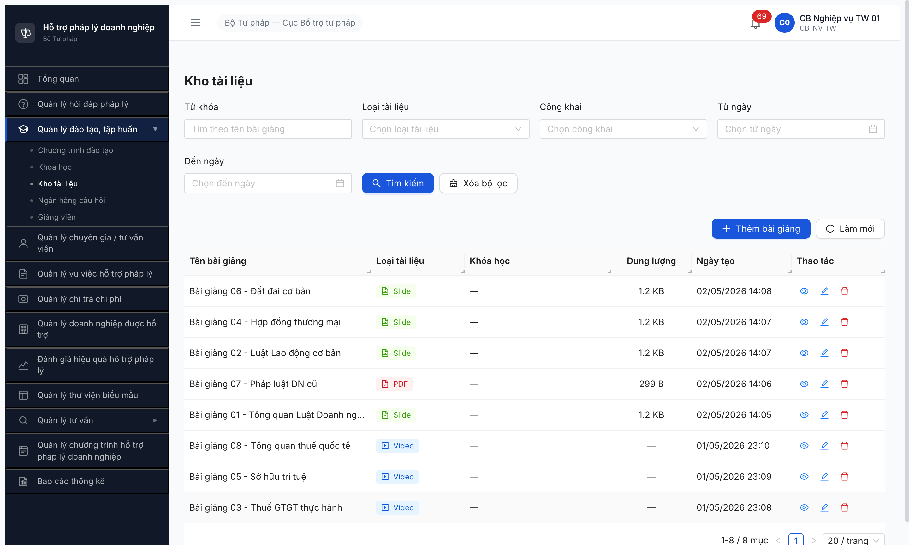

# Bug Report — Seed Bài giảng (R6.3.9)

| Thông tin | Giá trị |
|-----------|---------|
| **Dự án** | PM HTPLDN |
| **Môi trường** | http://103.172.236.130:3000/ |
| **Người test** | QA Automation via Claude Code |
| **Ngày** | 2026-05-02 |
| **Loại test** | Seed entry-state (Bài giảng `Kích hoạt`) |
| **Round** | R6 round 2 (re-test sau dev fix) |
| **Tài liệu tham chiếu** | [FR-III-07 UC26](../../../../input/srs-v3/srs-fr-03-dao-tao.md) · [seed-fixture.yaml > bai_giang_variants](../../../../input/data/seed-fixture.yaml) · [seed-checklist-baigiang.md](../seed/seed-checklist-baigiang.md) |

---

## Tổng hợp

Phát hiện **1** bug có SRS reference cụ thể trong R6 round 1 (2026-05-01). Re-test R6 round 2 (2026-05-02) sau dev fix → **CLOSED**.

### Severity breakdown

| Tổng | Critical | Major | Medium | Minor | Trivial |
|------|----------|-------|--------|-------|---------|
| 1    | 0        | 1     | 0      | 0     | 0       |

## Bug Summary Table

| Bug ID | Severity | Priority | Type | TC Ref | **SRS Reference** | Title | Status |
|--------|----------|----------|------|--------|-------------------|-------|--------|
| ~~BUG-FUNC-BAIGIANG-001~~ | Major | P1 | Negative | R6.3.9 | `FR-III-07 §Processing Bước 5-6` + `§Inputs row 4` | POST `/api/v1/bai-giangs` 422 khi upload `.pptx`/`.pdf` (loại SLIDE/PDF) | ~~Open~~ → CLOSED 2026-05-02 R6 |

---

## ~~BUG-FUNC-BAIGIANG-001~~ [CLOSED] — POST `/api/v1/bai-giangs` 422 khi upload SLIDE/PDF

> **Re-test:** 2026-05-02 R6 round 2 — ✅ PASS (Closed-verified). 5 SLIDE + 1 PDF seed PASS toàn bộ via UI MCP. Toast "Tạo bài giảng thành công" hiển thị mỗi lần. Table render 8/8 records (4 Slide + 1 PDF + 3 Video).

### Mô tả

Trong R6 round 1 (2026-05-01), khi cb_nv_tw_01 tạo Bài giảng loại SLIDE (upload `.pptx`) hoặc PDF (upload `.pdf`) qua SCR-III-03 [Thêm bài giảng], BE trả 422 Unprocessable Entity → 5/8 variant không seed được. 3 Video (BG 03/05/08) PASS bình thường. R6 round 2 sau dev fix: 5/5 SLIDE+PDF PASS.

### Các bước tái hiện

1. Login `cb_nv_tw_01` / `Secret@123` / OTP `666666`
2. Sidebar → Quản lý đào tạo, tập huấn → Kho tài liệu (`/dao-tao/bai-giang/danh-sach`)
3. Click [Thêm bài giảng] → modal Thêm bài giảng mở
4. Nhập Tên, Mô tả; Loại tài liệu = `Slide`; upload file `.pptx` (≤ 20MB); click [Tạo mới]
5. (Round 1) Quan sát: BE trả 422, toast lỗi xuất hiện, record không vào DB
6. (Round 2) Quan sát: BE trả 200/201, toast "Tạo bài giảng thành công", record vào DB

### Kết quả mong đợi

- Theo SRS FR-III-07 §Processing Bước 5-6: BE tạo bản ghi `BAI_GIANG` + upload file vào storage khi file ≤ 20MB và đúng định dạng `.pptx`/`.pdf` (FR-III-07 §Inputs row 4 ràng buộc).
- Toast thành công, record xuất hiện trên list, file_url trả về.

### Kết quả thực tế

- **R6 round 1 (2026-05-01):** BE trả 422 cho mọi SLIDE/PDF upload, dù file hợp lệ. Chỉ 3 VIDEO (không upload file, dùng `url_youtube`) PASS.
- **R6 round 2 (2026-05-02):** BE trả 201 thành công, record + file_url lưu DB, table render 8/8. Bug đã được dev fix.

### Bằng chứng

**1. Ảnh chụp** (sau dev fix — 8/8 records, 4 Slide + 1 PDF + 3 Video):



**2. Per-filter verify (Closed-verified):**

```json
{
  "total": 8,
  "types": { "Slide": 4, "PDF": 1, "Video": 3 },
  "list": [
    "Bài giảng 06 - Đất đai cơ bản (Slide)",
    "Bài giảng 04 - Hợp đồng thương mại (Slide)",
    "Bài giảng 02 - Luật Lao động cơ bản (Slide)",
    "Bài giảng 07 - Pháp luật DN cũ (PDF)",
    "Bài giảng 01 - Tổng quan Luật Doanh nghiệp (Slide)",
    "Bài giảng 08 - Tổng quan thuế quốc tế (Video)",
    "Bài giảng 05 - Sở hữu trí tuệ (Video)",
    "Bài giảng 03 - Thuế GTGT thực hành (Video)"
  ]
}
```

---

## Phụ lục — Môi trường test

| Thành phần | Giá trị |
|------------|---------|
| URL ứng dụng | http://103.172.236.130:3000/ |
| OTP login | `666666` (bypass dev) |
| MailHog (OTP inbox) | http://103.172.236.130:8025 |
| API base | http://103.172.236.130:3000/api/v1 |
| Frontend | React + Vite + Ant Design |
| Xác thực | JWT + OTP |
| Tool test | Chrome DevTools MCP |

---

*Bug report generated: 2026-05-02 14:10 | QA Automation via Claude Code*
