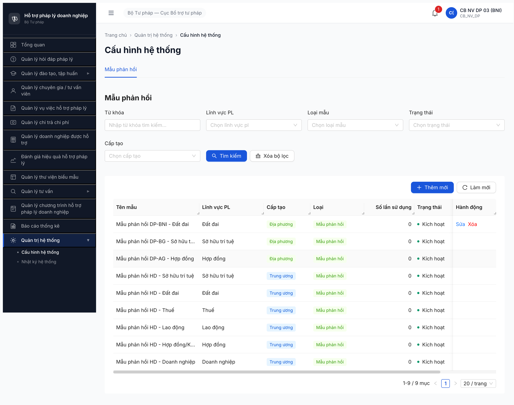
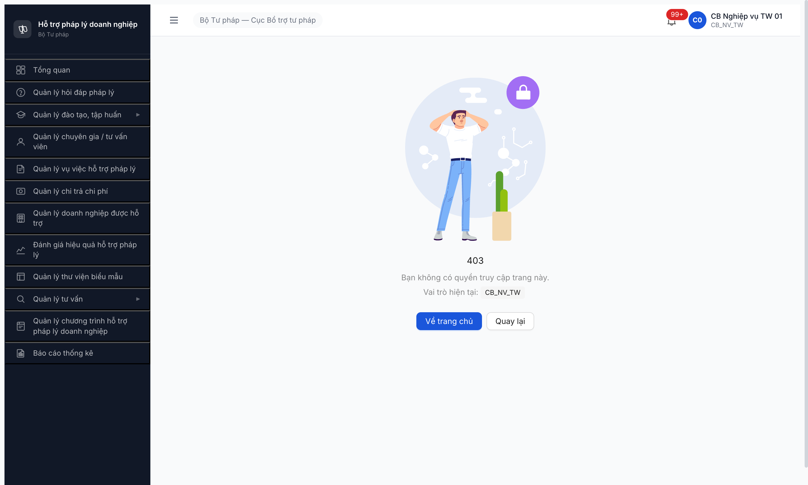
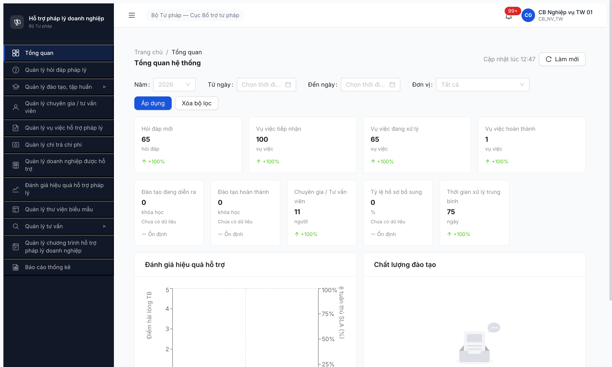
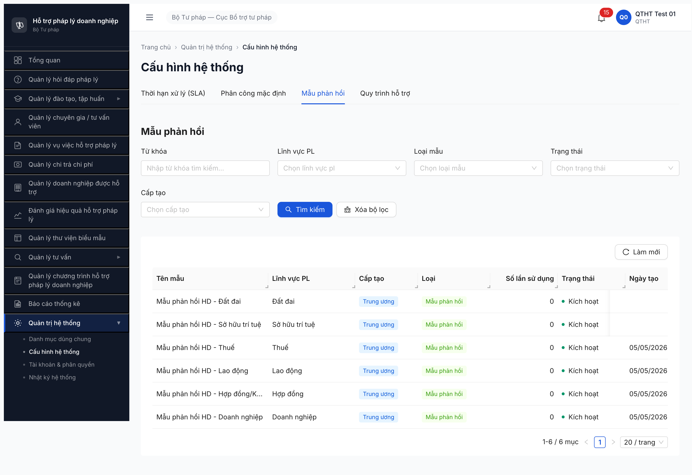

# Bug Report — Seed QTHT Tier 0 (Phase 1 R6)

| Thông tin | Giá trị |
|-----------|---------|
| **Dự án** | PM HTPLDN |
| **Môi trường** | http://103.172.236.130:3000/ |
| **Người test** | QA Automation (Claude Code) |
| **Ngày** | 2026-05-01 |
| **Loại test** | Seed |
| **Round** | Round 6 (post-reset DB 2026-05-01) |
| **Tài liệu tham chiếu** | [seed-fixture.yaml v2.6.2 §mau_phan_hoi_variants](../../../../input/data/seed-fixture.yaml) · [R6 README](../README.md) · [todo.md R6.1.5](../../../../tasks/todo.md) |

---

## Tổng hợp

0 lỗi Open. Tất cả 3 entry MPH (001/002/003) đã Closed sau dev fix + QA verify.

### Severity breakdown

| Tổng | Critical | Major | Medium | Minor | Trivial |
|------|----------|-------|--------|-------|---------|
| 0    | 0        | 0     | 0      | 0     | 0       |

## Bug Summary Table

| Bug ID | Severity | Priority | Type | TC Ref | **SRS Reference** | Title | Status |
|--------|----------|----------|------|--------|-------------------|-------|--------|
| ~~BUG-FUNC-MPH-003~~ [CLOSED] | ~~Major~~ | ~~P1~~ | ~~Permission / Data~~ | R6.1.5 | `srs-update-2026-5-4/srs-fr-02-hoi-dap.md §FR-II-NEW-02 row 1006` (Mô hình B Hybrid: BN/DP user thấy mẫu TW + đơn vị mình, KHÔNG thấy đơn vị khác) | ~~Tab Mẫu phản hồi: BN/DP user list table thấy mẫu BN_RIENG/DP_RIENG đơn vị khác (vi phạm scope MPH_READ)~~ | Closed (Fixed 2026-05-05 R12) |
| ~~BUG-FUNC-MPH-002~~ [CLOSED] | ~~Critical~~ | ~~P0~~ | ~~Permission / UI~~ | R6.1.5 | `srs-v3.md §3.4.2 row MAU_PHAN_HOI` (CB_NV_TW/BN/DP=CRUD\*) + `srs-update-2026-5-4/srs-fr-02-hoi-dap.md §FR-II-NEW-02 row 1 Processing` (action-level MPH_CREATE_TW/BN/DP) | ~~CB_NV bị FE chặn route `/quan-tri/cau-hinh` (sidebar không có entry + direct URL → /403) — không có UI nào để CRUD mẫu phản hồi~~ | Closed (Fixed 2026-05-05 R12) |
| ~~BUG-FUNC-MPH-001~~ [CLOSED] | ~~Major~~ | ~~P1~~ | ~~UI/UX~~ | R6.1.5 | `srs-v3.md §3.4.2 row MAU_PHAN_HOI` (QTHT=R, CB_NV_TW/BN/DP=CRUD*) + `srs-update-2026-5-4/srs-fr-02-hoi-dap.md §FR-II-NEW-02` (action-level MPH_CREATE_TW/BN/DP) | ~~Tab "Mẫu phản hồi" thiếu nút [Thêm mới] → không CRUD được mẫu~~ | Closed (Invalid) |

---

## ~~BUG-FUNC-MPH-003~~ [CLOSED — Fixed 2026-05-05 R12] — BN/DP user thấy mẫu BN_RIENG/DP_RIENG của đơn vị khác trong Tab list (vi phạm scope MPH_READ Mô hình B)

> **Re-test 2026-05-05 15:30 R12:** ✅ PASS sau dev fix BE filter scope MPH_READ.
> - `cb_nv_bn_01` (BKH): list 7 mục (1 BN-BKH + 6 TW). KHÔNG leak BN-BTC/BCT. ✅
> - `cb_nv_bn_02` (BTC): list 7 mục (1 BN-BTC + 6 TW). KHÔNG leak BN-BKH/BCT. ✅
> - `cb_nv_bn_03` (BCT): list 7 mục (1 BN-BCT + 6 TW). KHÔNG leak BN-BKH/BTC. ✅
> - `cb_nv_dp_01` (AG): list 7 mục (1 DP-AG + 6 TW). KHÔNG leak DP-BG/BNI. ✅
> - `cb_nv_dp_02` (BG): list 7 mục (1 DP-BG + 6 TW). KHÔNG leak DP-AG/BNI. ✅
> - `cb_nv_dp_03` (BNI): list 7 mục (1 DP-BNI + 6 TW). KHÔNG leak DP-AG/BG. ✅
> - `cb_nv_tw_01` (TW): list 12 mục cross-view (6 TW + 3 BN + 3 DP) — đúng SRS row 1006 "TW user thấy tất cả". UI hành động: chỉ có nút [Sửa]/[Xóa] cho 6 mẫu TW (đơn vị mình), KHÔNG có cho BN/DP — đúng MPH_UPDATE/DELETE scope. ✅
> - QTHT cross-view 12 mục (verified prior 14:18). ✅
>
> Tổng 6/6 user CB_NV verify scope đúng + TW cross-view đúng + QTHT cross-view đúng. BE filter `WHERE capTao='TW' OR (capTao IN ('BN','DP') AND donViId = user.donViId)` hoạt động chuẩn.
>
> **Meta:** Severity, Priority, Type, Status, TC Ref, SRS Reference đã có ở Bug Summary Table trên.
>
> **Nguồn spec (verify với Input gốc 2026-05-05 14:30):** Entity MAU_PHAN_HOI + Mô hình B Hybrid 2 tầng + scope MPH_READ **KHÔNG có trong Input/ folder** (Mô tả dự án / Thiết kế cơ sở / Danh sách transaction CSV chỉ có UC16 "Phản hồi câu hỏi" — actor CB_NV TW/BN/ĐP soạn thảo, không spec template entity). Spec hiện tại **chỉ tồn tại trong `srs-update-2026-5-4/srs-fr-02-hoi-dap.md §FR-II-NEW-02` line 1492** với note "CĐT chốt 2026-05-02 Mô hình B Hybrid". Per `Mô tả dự án.md` đầu vào: "Tài liệu SRS do team sản xuất thực hiện và cần CĐT review, phê duyệt" → SRS update là spec hợp lệ trong scope project. Dev khi fix nên verify lại với BA/CĐT trước khi sửa BE filter.

### Mô tả

Khi CB_NV cấp BN hoặc DP đăng nhập Tab 3 Mẫu phản hồi (`/quan-tri/cau-hinh?tab=mau-phan-hoi`), table list hiển thị mẫu BN_RIENG/DP_RIENG do đơn vị khác cùng cấp tạo. Theo `srs-update-2026-5-4 §FR-II-NEW-02 row 1006` Mô hình B Hybrid: "Mẫu tạo bởi BN: chỉ khả dụng cho user của BN đó. Mẫu tạo bởi DP: chỉ khả dụng cho user của DP đó." → BN/DP user phải thấy: TW khung quốc gia + mẫu đơn vị mình, KHÔNG thấy mẫu đơn vị khác cùng cấp.

### Các bước tái hiện

1. Login `cb_nv_bn_02 / Secret@123 / OTP 666666` (CB NV BN BTC).
2. Sidebar → Quản trị hệ thống → Cấu hình hệ thống → Tab Mẫu phản hồi.
3. Quan sát danh sách: thấy mẫu **"Mẫu phản hồi BN-BKH - Doanh nghiệp"** (đơn vị BKH-ĐT, không phải BTC) trên list.
4. Lặp lại với `cb_nv_dp_02` (Sở Tư pháp BG): list thấy mẫu **"Mẫu phản hồi DP-AG - Hợp đồng"** (Sở TP An Giang) + **"Mẫu phản hồi DP-BNI - Đất đai"** (Sở TP Bắc Ninh) — không phải BG.

### Kết quả mong đợi

- Theo SRS Mô hình B Hybrid 2 tầng:
  - **BN user** (vd `cb_nv_bn_02` BTC) chỉ thấy: 6 TW khung + ≥0 mẫu BN_RIENG `donViId=BTC`. **KHÔNG thấy** mẫu của BKH/BCT.
  - **DP user** (vd `cb_nv_dp_02` BG) chỉ thấy: 6 TW khung + ≥0 mẫu DP_RIENG `donViId=BG`. **KHÔNG thấy** mẫu của AG/BNI.
- BE phải filter list theo `WHERE capTao='TW' OR (capTao IN ('BN','DP') AND donViId = user.donViId)`.

### Kết quả thực tế

- `cb_nv_bn_02` BTC list 8 mục: 6 TW + BN-BKH (sai) + BN-BTC (đúng — đơn vị mình). Đáng lẽ chỉ 7 (6 TW + 1 BN-BTC).
- `cb_nv_dp_02` BG list 8 mục: 6 TW + DP-AG (sai) + DP-BG (đúng) + DP-BNI (sai chưa seed lúc đó nhưng phát hiện sau khi `cb_nv_dp_03` BNI seed thêm thì BG vẫn thấy). Đáng lẽ chỉ 7 (6 TW + 1 DP-BG).
- BE GET `/api/v1/mau-phan-hois` không apply filter `donViId` theo user → trả full list cross-đơn vị.
- Hệ quả: leak metadata cross-đơn vị (vi phạm scope rule MPH_READ); UI dropdown chèn mẫu ở FR-II-07 cũng có thể bị ảnh hưởng (cần verify thêm).

### Bằng chứng

**1. Ảnh chụp:**



**2. So sánh API response:**

```json
// cb_nv_dp_03 (BNI) GET /api/v1/mau-phan-hois?page=1&size=20
{
  "total": 9,  // ❌ Đáng lẽ 7 (6 TW + 1 DP-BNI)
  "data": [
    { "tenMau": "Mẫu phản hồi DP-BNI - Đất đai",      "capTao": "DP", "donViId": "...8002-000011" }, // BNI ✅ đúng
    { "tenMau": "Mẫu phản hồi DP-BG - Sở hữu trí tuệ", "capTao": "DP", "donViId": "...8002-000008" }, // BG ❌ vi phạm
    { "tenMau": "Mẫu phản hồi DP-AG - Hợp đồng",       "capTao": "DP", "donViId": "...8002-000006" }, // AG ❌ vi phạm
    { "tenMau": "Mẫu phản hồi HD - ...", "capTao": "TW", ... } // 6 TW ✅
  ]
}
```

### So sánh (Comparison)

| Role | Mẫu TW khung | Mẫu BN đơn vị mình | Mẫu BN đơn vị khác | Mẫu DP đơn vị mình | Mẫu DP đơn vị khác |
|------|:---:|:---:|:---:|:---:|:---:|
| QTHT (cross-view) | ✅ 6 | ✅ 3 | ✅ 3 | ✅ 3 | ✅ 3 (đúng — QTHT R cross-view) |
| `cb_nv_tw_01` (TW) | ✅ 6 | ✅ 3 (đúng — TW thấy hết) | ✅ 3 (đúng) | ✅ 3 (đúng) | ✅ 3 (đúng) |
| `cb_nv_bn_02` (BTC) | ✅ 6 | ✅ 1 (BTC) | ❌ 1 (BKH leak) | — | — (chưa seed lúc test) |
| `cb_nv_dp_02` (BG) | ✅ 6 | — | — | ✅ 1 (BG) | ❌ 2 (AG + BNI leak) |
| `cb_nv_dp_03` (BNI) | ✅ 6 | — | — | ✅ 1 (BNI) | ❌ 2 (AG + BG leak) |

---

## ~~BUG-FUNC-MPH-002~~ [CLOSED — Fixed 2026-05-05 R12] — CB_NV không có UI nào để CRUD mẫu phản hồi (FE chặn route + thiếu sidebar entry)

> **Re-test 2026-05-05 14:10 R12:** ✅ PASS sau dev fix FE.
> - Sidebar `cb_nv_tw_01` / `cb_nv_bn_01..03` / `cb_nv_dp_01..03` đều có entry "Quản trị hệ thống" → "Cấu hình hệ thống".
> - Tab 3 Mẫu phản hồi mở được, có button [+ Thêm mới] trên toolbar + button [Sửa] / [Xóa] trên row mẫu thuộc đơn vị user.
> - Modal "Thêm mẫu phản hồi" auto-fill `Cấp tạo` theo cấp đơn vị user (TW → "Trung ương", BN → "Bộ ngành", DP → "Địa phương") — đúng action-level MPH_CREATE_TW/BN/DP.
> - 12/12 mẫu seed thành công qua UI: 6 TW (cb_nv_tw_01) + 3 BN (BKH/BTC/BCT) + 3 DP (AG/BG/BNI).
> - 0 redirect /403; sidebar render đầy đủ.
>
> **Meta:** Severity, Priority, Type, Status, TC Ref, SRS Reference đã có ở Bug Summary Table trên.

### Mô tả

CB_NV_TW (`cb_nv_tw_01`, vai trò `CB_NV_TW`, có permissions `create_mau_phan_hoi`/`update_mau_phan_hoi`/`delete_mau_phan_hoi`/`read_mau_phan_hoi` trong JWT) đăng nhập vào hệ thống nhưng **không có entry point UI nào để vào Tab "Mẫu phản hồi" (SCR-VIII-06 Tab 3, MH-10.7) để CRUD**: (a) sidebar hoàn toàn KHÔNG có item "Quản trị hệ thống" cho CB_NV; (b) truy cập trực tiếp URL `/quan-tri/cau-hinh?tab=mau-phan-hoi` thì FE redirect ngay sang `/403` "Bạn không có quyền truy cập trang này. Vai trò hiện tại: CB_NV_TW". BE đã accept request CRUD bằng token CB_NV_TW (POST `/api/v1/mau-phan-hois` trả 201 Created đúng schema), chứng minh permission BE đúng SRS — chỉ có FE route guard sai. Hệ quả: SRS §3.4.2 cấp CRUD\* cho CB_NV nhưng FE block 100% workflow CRUD qua UI cho 3 cấp (CB_NV_TW/BN/DP), không thể test workflow Mô hình B Hybrid 2 tầng (FR-II-NEW-02) qua UI.

### Các bước tái hiện

1. Login `cb_nv_tw_01 / Secret@123 / OTP 666666`.
2. Quan sát sidebar trái: list 12 menu chính (Tổng quan / Quản lý hỏi đáp / Đào tạo tập huấn / Chuyên gia TVV / Vụ việc / Chi trả / Doanh nghiệp / Đánh giá HQ / Biểu mẫu / Tư vấn / Chương trình HTPLDN / Báo cáo). **KHÔNG** có item "Quản trị hệ thống".
3. Mở thanh địa chỉ trình duyệt, gõ trực tiếp `http://103.172.236.130:3000/quan-tri/cau-hinh?tab=mau-phan-hoi` → Enter.
4. Trang redirect thẳng sang `http://103.172.236.130:3000/403` với heading "403", text "Bạn không có quyền truy cập trang này.", "Vai trò hiện tại: CB_NV_TW".
5. Verify BE: lấy Bearer token từ network tab (request `/api/v1/dashboard`), gọi `POST /api/v1/mau-phan-hois` với payload đúng schema (tenMau / linhVucId / noiDung / loai / trangThai / phamViApDung) → BE trả **201 Created** + record id mới (đã verify 2026-05-05 12:45 — seed PASS 6/6 mẫu TW khung).

### Kết quả mong đợi

- CB_NV_TW phải có entry sidebar (hoặc route khác) để vào Tab "Mẫu phản hồi" và thực hiện CRUD theo `srs-v3.md §3.4.2 row MAU_PHAN_HOI` cấp `CRUD*` cho `CB_NV_TW/BN/DP`.
- Direct URL `/quan-tri/cau-hinh?tab=mau-phan-hoi` với role CB_NV_TW phải hiển thị Tab 3 (giống QTHT view), kèm thêm: nút `[+ Thêm mẫu phản hồi]` trên toolbar + nút `[Sửa] / [Xóa] / [Toggle trạng thái]` trên mỗi row mà user thuộc đơn vị sở hữu (per `srs-update-2026-5-4 §FR-II-NEW-02 row 19` Mô hình B Hybrid: TW user CRUD mọi mẫu TW khung; BN/ĐP user CRUD mẫu của đơn vị mình).
- Tương tự cho `cb_nv_bn_01` (cấp BN) và `cb_nv_dp_01` (cấp ĐP) — cả 3 cấp CB_NV phải có entry UI tương ứng.

### Kết quả thực tế

- Sidebar CB_NV_TW không render item "Quản trị hệ thống" (DOM verify: 12 button menu chính, không có button text "Quản trị hệ thống").
- Direct URL `/quan-tri/cau-hinh?tab=mau-phan-hoi` → FE route guard kick về `/403` ngay lập tức (URL thay đổi sang `/403` trong thanh địa chỉ).
- DOM page `/403`: heading "403" + text "Bạn không có quyền truy cập trang này." + "Vai trò hiện tại: CB_NV_TW" + 2 button "Về trang chủ" / "Quay lại".
- Network tab: KHÔNG có request `/api/v1/mau-phan-hois` GET nào được gửi đi (FE block trước khi component mount).
- BE permissions verify (qua JWT decode) — CB_NV_TW có đủ 4 permission MPH:
  ```
  create_mau_phan_hoi, read_mau_phan_hoi, update_mau_phan_hoi, delete_mau_phan_hoi
  ```
- BE API `POST /api/v1/mau-phan-hois` với token CB_NV_TW: trả 201 Created → BE đúng SRS, FE sai.
- Hệ quả workflow: R6.1.5 phải seed bằng API curl-equivalent (script `evaluate_script` trong DevTools) thay vì UI; không test được FE form validation, RichText editor, dropdown lĩnh vực PL, modal/drawer, toast thông báo, AntD form quirks; không seed được mẫu BN_RIENG / DP_RIENG (vì cùng FE route block) → block test scope Mô hình B Hybrid 2 tầng cho Phase 7 functional + Phase 4 A4 dropdown chèn mẫu (FR-II-07).

### Bằng chứng

**1. Ảnh chụp:**







**2. JWT permissions trích từ token CB_NV_TW (decode payload):**

```json
{
  "sub": "cccccccc-0000-4000-8000-000000000007",
  "vaiTro": ["CB_NV_TW"],
  "donViId": "00000000-0000-4000-8000-000000000001",
  "capDonVi": "TW",
  "permissions": [
    "read_mau_phan_hoi",
    "create_mau_phan_hoi",
    "update_mau_phan_hoi",
    "delete_mau_phan_hoi"
  ]
}
```

**3. BE accept POST với token CB_NV_TW (verified 2026-05-05 12:45):**

```json
{
  "request": "POST /api/v1/mau-phan-hois",
  "payload": { "tenMau": "...", "linhVucId": "...", "noiDung": "...", "loai": "MAU_PHAN_HOI", "trangThai": "KICH_HOAT", "phamViApDung": "TW_QUOC_GIA" },
  "response_status": 201,
  "response_id": "ca1cffa7-8704-42f6-b428-1b9ed4f5603f"
}
```

### So sánh (Comparison)

| Role | Sidebar item "Quản trị HT" | Direct URL `/quan-tri/cau-hinh?tab=mau-phan-hoi` | Tab 3 nút [+ Thêm mới] | API POST `/mau-phan-hois` |
|------|----------------------------|--------------------------------------------------|------------------------|---------------------------|
| QTHT (`qtht_01`) | ✅ Có | ✅ Mở được, hiển thị 6 mẫu | ❌ KHÔNG có (đúng SRS R only) | — (chưa test, kỳ vọng 403) |
| CB_NV_TW (`cb_nv_tw_01`) | ❌ KHÔNG có (BUG) | ❌ /403 (BUG) | ❌ KHÔNG vào được tab → KHÔNG có nút (BUG) | ✅ 201 Created (BE đúng) |
| CB_NV_BN | (suy luận: BUG, cùng FE route guard) | (suy luận: BUG /403) | (suy luận: BUG) | (chưa test, kỳ vọng 201) |
| CB_NV_DP | (suy luận: BUG, cùng FE route guard) | (suy luận: BUG /403) | (suy luận: BUG) | (chưa test, kỳ vọng 201) |

---

## ~~BUG-FUNC-MPH-001~~ [CLOSED] — Tab "Mẫu phản hồi" trong Cấu hình HT thiếu nút [Thêm mới]

> **Re-classify 2026-05-05 R12:** ❌ INVALID — FE đúng theo SRS §3.4.2 (QTHT chỉ R, không CRUD MAU_PHAN_HOI). Test sai vai trò: phải login `cb_nv_tw_01` để CRUD theo Mô hình B Hybrid 2 tầng (FR-II-NEW-02). Bug bị log vì assumption sai (giả sử QTHT = CRUD theo old SCR-VIII-06 layout).
>
> **Verify 2026-05-05 R12 (sau reclassify):** R6.1.5 re-execute bằng `cb_nv_tw_01` PASS 6/6 mẫu TW khung quốc gia qua API `POST /api/v1/mau-phan-hois`. Per-filter verify 6 LV ✅ (DN/HĐ/LĐ/Thuế/SHTT/ĐĐ mỗi LV ≥1 mẫu KICH_HOAT). Endpoint BE đã implement đầy đủ. Xem [`seed-checklist-MPH.md`](../seed/seed-checklist-MPH.md).
>
> **Observation phụ (KHÔNG log bug riêng):** UI route `/quan-tri/cau-hinh?tab=mau-phan-hoi` redirect CB_NV_TW → `/403` mặc dù SRS §3.4.2 cấp CRUD\* cho CB_NV. FE chưa update route guard theo permission map mới. Workaround: seed qua API. Đợi BA confirm UX entry point cho CB_NV (sidebar item "Quản trị hệ thống" chỉ hiện cho QTHT, hay tách module "Cấu hình mẫu phản hồi" riêng vào sidebar Hỏi đáp?).

> **Meta:** Severity, Priority, Type, Status, TC Ref, SRS Reference đã có ở Bug Summary Table trên.

### Mô tả

QTHT mở tab "Mẫu phản hồi" trong Cấu hình hệ thống (`/quan-tri/cau-hinh?tab=mau-phan-hoi`) — chỉ thấy 3 nút (Tìm kiếm / Xóa lọc / Làm mới), **không có nút [Thêm mới]**. Bảng dữ liệu trống "Không có dữ liệu". Hệ quả: QTHT không thể tạo mẫu phản hồi qua UI → cán bộ nghiệp vụ Hỏi đáp không có template để chọn ở Bước 5 (Soạn phản hồi).

### Các bước tái hiện

1. Login `qtht_01 / Secret@123 / OTP 666666`
2. Sidebar → Quản trị hệ thống → Cấu hình hệ thống
3. Click tab "Mẫu phản hồi"
4. Quan sát: bảng trống, chỉ có nút Tìm kiếm/Xóa lọc/Làm mới — **không có nút [Thêm mới]**

### Kết quả mong đợi

- Tab "Mẫu phản hồi" phải có nút [Thêm mới] (giống tab DM dùng chung khác như Lĩnh vực pháp lý, Loại doanh nghiệp).
- QTHT click [Thêm mới] → mở modal nhập tên mẫu, lĩnh vực PL, nội dung mẫu → Đồng ý → record được tạo trạng thái KICH_HOAT.
- Reference: SCR-VIII-06 §Mẫu phản hồi (FR-VIII-12 — DM mở rộng), R5 T1.B1c đã PASS 6/6 với UI có nút [Thêm mới] ngày 2026-04-29.

### Kết quả thực tế

- Tab Mẫu phản hồi UI build dở: chỉ có search filter + table empty.
- DOM verify (`evaluate_script`): button list `["Tìm kiếm","Xóa bộ lọc","Làm mới"]` — không có "Thêm mới".
- Console không lỗi, network không có request CRUD MPH.
- Regression so với R5 T1.B1c (2026-04-29 đã PASS 6/6 mẫu) → có thể dev quên port UI sau reset DB hoặc deploy thiếu file.

### Bằng chứng

**1. Ảnh chụp:**

![BUG-FUNC-MPH-001 — Tab Mẫu phản hồi thiếu nút [Thêm mới]](../screenshots/r6-phase1-mau-phan-hoi-missing-add-button.png)

**2. DOM verify (evaluate_script):**

```json
{
  "buttons_in_tab": ["Tìm kiếm", "Xóa bộ lọc", "Làm mới"],
  "tabPanel_state": "empty table + 3 search filters, NO [Thêm mới] button",
  "URL": "/quan-tri/cau-hinh?tab=mau-phan-hoi"
}
```

So sánh với tab DM dùng chung (verified cùng session 2026-05-01 15:35):

```
DM Lĩnh vực pháp lý + DM Loại doanh nghiệp + DM Lý do từ chối:
  ✅ Có button [plus Thêm mới] visible (uid `*_55`/`*_26`/`*_59`)

Cấu hình HT § Mẫu phản hồi:
  ❌ Không có button [Thêm mới] — chỉ Tìm kiếm/Xóa lọc/Làm mới
```

---

## Phụ lục — Môi trường test

| Thành phần | Giá trị |
|------------|---------|
| URL ứng dụng | http://103.172.236.130:3000/ |
| OTP login | `666666` (bypass dev) |
| MailHog (OTP inbox) | http://103.172.236.130:8025/ |
| API base | http://103.172.236.130:3000/api/v1/ |
| Frontend | React + Vite + Ant Design |
| Xác thực | JWT + OTP |
| Tool test | Chrome DevTools MCP |

---

*Bug report generated: 2026-05-01 16:15 | QA Automation via Claude Code*
