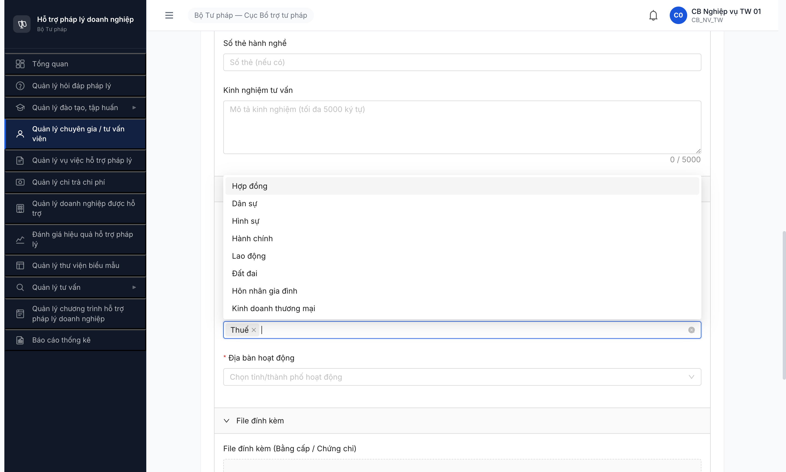
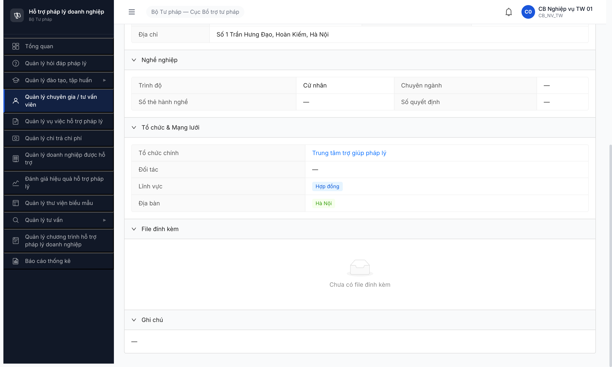
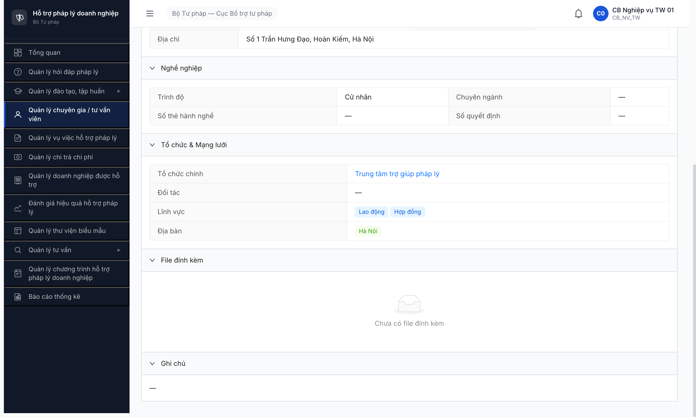

# Bug Report — Seed TVV/CG (Phase 2 R6.2.4-2.6)

| Thông tin | Giá trị |
|-----------|---------|
| **Dự án** | PM HTPLDN |
| **Môi trường** | http://103.172.236.130:3000/ |
| **Người test** | QA Automation (Claude Code) |
| **Ngày** | 2026-05-01 |
| **Loại test** | Seed |
| **Round** | Round 6 (post-reset DB 2026-05-01) |
| **Tài liệu tham chiếu** | [seed-fixture.yaml v2.6.2 §tvv_variants](../../../../input/data/seed-fixture.yaml) · [SCR-IV-02 Form Thêm TVV](../../../../input/srs-v3/srs-fr-04-chuyen-gia-tvv.md) |

---

## Tổng hợp

Phát hiện **2** bug UI khi seed TVV. Cả 2 đã được dev fix và verify CLOSED ngày 2026-05-01 19:20.

### Severity breakdown

| Tổng | Critical | Major | Medium | Minor | Trivial |
|------|----------|-------|--------|-------|---------|
| 2    | 0        | 2     | 0      | 0     | 0       |

## Bug Summary Table

| Bug ID | Severity | Priority | Type | TC Ref | **SRS Reference** | Title | Status |
|--------|----------|----------|------|--------|-------------------|-------|--------|
| ~~BUG-FUNC-TVV-002~~ | Major | P1 | UI/UX | R6.2.4 | `FR-IV-01 Inputs §linh_vuc_ids` + DM `LINH_VUC_PL` 13 records (FR-VIII-01) | Dropdown "Lĩnh vực pháp luật" SCR-IV-02 cap 10/13 LV — miss Doanh nghiệp, SHTT, Đầu tư | **Closed** |
| ~~BUG-FUNC-TVV-001~~ | Major | P1 | UI/UX | R6.2.4 | `SCR-IV-02 Form Thêm TVV §Lĩnh vực pháp luật` (FR-IV-01 Inputs row "linh_vuc_ids" — multi-select array) | Multi-select Lĩnh vực pháp luật mất option giữa khi click ≥2 option trong cùng phiên dropdown mở | **Closed** |

> **Re-test 2026-05-01 19:20 R6:** Cả 2 bug verify ✅ PASS sau dev fix.
> - **TVV-002:** Dropdown trả đủ 13/13 LV. Verify bằng scroll virtual list 30px step + 50ms pause: gom đủ Hợp đồng / Dân sự / Hình sự / Hành chính / Lao động / Đất đai / Hôn nhân gia đình / Kinh doanh thương mại / Khiếu nại tố cáo / Thuế / **Sở hữu trí tuệ / Doanh nghiệp / Đầu tư** (3 LV trước miss).
> - **TVV-001:** Click 3 option liên tiếp trong cùng phiên dropdown mở → giữ đủ `["Lao động", "Thuế", "Sở hữu trí tuệ"]`, không mất option giữa.

---

## ~~BUG-FUNC-TVV-002~~ [CLOSED] — Dropdown Lĩnh vực pháp luật cap 10/13 LV

> **Re-test:** 2026-05-01 19:20 R6 — ✅ PASS (Closed-verified). Dropdown trả đủ 13/13 LV qua scroll virtual list. 3 LV trước miss (SHTT/Doanh nghiệp/Đầu tư) đã hiện.

> **Meta:** Severity Major, Priority P1, Type UI/UX, Status Closed, TC R6.2.4, SRS FR-IV-01 + FR-VIII-01.

### Mô tả

Dropdown "Lĩnh vực pháp luật" trong form Thêm TVV (SCR-IV-02) chỉ render **10 options** mặc dù DM LINH_VUC_PL hiện tại có **13 records active**. 3 LV miss: **Doanh nghiệp, Sở hữu trí tuệ, Đầu tư**. Scroll virtual list về cuối + search input đều không bring back 3 LV thiếu.

### Các bước tái hiện

1. Login `cb_nv_tw_01` → Quản lý Chuyên gia/Tư vấn viên → [+ Thêm TVV]
2. Click dropdown "Lĩnh vực pháp luật"
3. Quan sát options visible

### Kết quả mong đợi

Dropdown hiển thị đầy đủ 13 LV active từ DM `LINH_VUC_PL`: Hợp đồng, Dân sự, Hình sự, Hành chính, Lao động, Đất đai, Hôn nhân gia đình, Kinh doanh thương mại, Khiếu nại tố cáo, Thuế, Sở hữu trí tuệ, Doanh nghiệp, Đầu tư.

### Kết quả thực tế

Dropdown chỉ render 10/13 LV. Miss: Doanh nghiệp (DOANH_NGHIEP), Sở hữu trí tuệ (SO_HUU_TRI_TUE), Đầu tư (DAU_TU).

```json
{
  "DM_LINH_VUC_PL_active_records": 13,
  "dropdown_visible_options": ["Hợp đồng","Dân sự","Hình sự","Hành chính","Lao động","Đất đai","Hôn nhân gia đình","Kinh doanh thương mại","Khiếu nại tố cáo","Thuế"],
  "missing": ["Doanh nghiệp","Sở hữu trí tuệ","Đầu tư"]
}
```

Test mitigation đã thử (đều fail):
- Scroll virtual list `rc-virtual-list-holder` về bottom → vẫn 10 options
- Type search "Doanh" vào search input → dropdown không filter, vẫn 10 LV nguyên bản

### Bằng chứng



---

## ~~BUG-FUNC-TVV-001~~ [CLOSED] — Multi-select Lĩnh vực pháp luật mất option giữa

> **Re-test:** 2026-05-01 19:20 R6 — ✅ PASS (Closed-verified). Click 3 option liên tiếp giữ đủ `["Lao động", "Thuế", "Sở hữu trí tuệ"]`, không mất option giữa.

> **Meta:** Severity Major, Priority P1, Type UI/UX, Status Closed, TC R6.2.4, SRS SCR-IV-02 + FR-IV-01.

### Mô tả

Khi mở dropdown "Lĩnh vực pháp luật" và click ≥2 option liên tiếp trong cùng phiên dropdown mở, AntD multi-select chỉ giữ lại option **đầu tiên** và option **cuối cùng** — option ở giữa bị skip dù click event đã fire. Reproducible 100%.

### Các bước tái hiện

1. Login `cb_nv_tw_01 / Secret@123 / OTP 666666`
2. Sidebar → Quản lý Chuyên gia/Tư vấn viên → button [+ Thêm TVV]
3. Fill các field bắt buộc khác (Họ tên, CCCD, Email, SĐT, Địa chỉ, Ngày sinh, Giới tính, Trình độ, Tổ chức, Địa bàn).
4. Click dropdown "Lĩnh vực pháp luật" → click "Lao động" → click "Hợp đồng" liên tiếp (KHÔNG đóng dropdown giữa 2 click).
5. Click [Lưu]
6. Quan sát detail TVV vừa tạo: tab Hồ sơ → field Lĩnh vực

### Kết quả mong đợi

- Tất cả option click trong cùng phiên dropdown mở phải được lưu vào `linh_vuc_ids` array.
- Detail TVV phải hiện ≥2 LV nếu user click 2 option.
- Đúng spec fixture `tvv_variants[1].linh_vuc_ids: [LAO_DONG, HOP_DONG]` (2 LV per TVV).

### Kết quả thực tế

- Detail TVV-0001 (UUID `1e7b8dfb-0fa5-4028-9e70-3309433ab977`) chỉ hiện **1 LV "Hợp đồng"** sau khi click 2 option (Lao động + Hợp đồng) liên tiếp.
- DOM verify (`evaluate_script` lúc 2 option đã click): chỉ option cuối có class `ant-select-item-option-selected`, option đầu/giữa không có class selected.
- Reproducible khi click 3 option: chọn được option đầu + cuối, **skip option ở giữa** (xác nhận với click sequence Hợp đồng → Lao động → Thuế: chỉ Hợp đồng + Thuế selected, mất Lao động).

**Workaround đã verify (R6.2.4 R1):** mỗi click option phải close dropdown (Escape) → reopen dropdown → click option tiếp. Sau workaround, detail TVV-0001 hiện đủ 2 LV "Lao động" + "Hợp đồng".

### Bằng chứng

**1. Ảnh chụp:**





**2. DOM verify (evaluate_script):**

```json
// Lần 1 — click 2 option liên tiếp KHÔNG close dropdown
{
  "before_click": ["Hợp đồng selected"],
  "click_sequence": ["Lao động", "Hợp đồng"],
  "after": {
    "selected_count": 1,
    "selected_text": ["Hợp đồng"],
    "missing": "Lao động (clicked nhưng không apply)"
  }
}

// Lần 2 — click 3 option liên tiếp (Hợp đồng → Lao động → Thuế)
{
  "click_sequence": ["Lao động", "Thuế"],
  "after": {
    "selected": ["Hợp đồng", "Thuế"],
    "missing": "Lao động (option giữa)"
  }
}

// Workaround — close-reopen mỗi click
{
  "step1_click_close_reopen": "Lao động",
  "after": ["Hợp đồng", "Lao động"],
  "passes": true
}
```

---

## Phụ lục — Môi trường test

| Thành phần | Giá trị |
|------------|---------|
| URL ứng dụng | http://103.172.236.130:3000/ |
| OTP login | `666666` (bypass dev) |
| MailHog (OTP inbox) | http://103.172.236.130:8025/ |
| API base | http://103.172.236.130:3000/api/v1/ |
| Frontend | React + Vite + Ant Design |
| Xác thực | JWT + OTP |
| Tool test | Chrome DevTools MCP |

---

*Bug report generated: 2026-05-01 16:55 | QA Automation via Claude Code*
