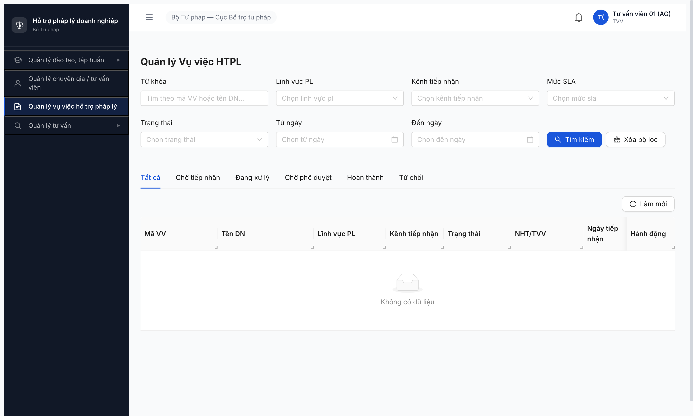

# Bug Report — Functional Vụ việc HTPL (R6.7.3)

| Thông tin | Giá trị |
|-----------|---------|
| **Dự án** | PM HTPLDN |
| **Môi trường** | http://103.172.236.130:3000/ |
| **Người test** | QA Automation via Claude Code |
| **Ngày** | 2026-05-03 |
| **Loại test** | Functional (Phase 7 — negative + edge + permission) |
| **Round** | Round 6 — Phase 7, R6.7.3 |
| **Tài liệu tham chiếu** | [test-strategy.md](../../../test-strategy.md), [permission-matrix.md](../../../permission-matrix.md), [srs-fr-05-vu-viec.md](../../../../input/srs-v3/srs-fr-05-vu-viec.md) |

---

## Tổng hợp

Phát hiện **1** lỗi có SRS reference cụ thể trong R6.7.3.

### Severity breakdown

| Tổng | Critical | Major | Medium | Minor | Trivial |
|------|----------|-------|--------|-------|---------|
| 1    | 0        | 1     | 0      | 0     | 0       |

## Bug Summary Table

| Bug ID | Severity | Priority | Type | TC Ref | **SRS Reference** | Title | Status |
|--------|----------|----------|------|--------|-------------------|-------|--------|
| BUG-VV-001 | Major | P1 | Permission | VV-013d | `permission-matrix.md §10 TVV` (line 472-487) + cảnh báo line 486 "TVV KHÔNG có quyền trên 3 entity Vụ việc" | TVV bypass quyền — sidebar hiện menu "Quản lý vụ việc" + page `/vu-viec/danh-sach` render thay vì 403 | Open |

---

## BUG-VV-001 — TVV bypass quyền truy cập module Vụ việc HTPL

### Mô tả

Tài khoản role `TVV` (vai trò app cấp `TVV`) đăng nhập CMS thấy menu **"Quản lý vụ việc hỗ trợ pháp lý"** trong sidebar và mở được page `/vu-viec/danh-sach` (trả 200 với list rỗng "Không có dữ liệu"). Theo `permission-matrix.md §10 TVV`, TVV KHÔNG có quyền trên 3 entity `VU_VIEC` / `HO_SO_VU_VIEC` / `KET_QUA_VU_VIEC` — sidebar không nên hiện menu, route phải 403.

### Các bước tái hiện

1. Login `tvv_01 / Secret@123 / OTP 666666` (role TVV, đơn vị STP-AG).
2. Sau OTP, app redirect `/403` (đúng — TVV không có dashboard mặc định).
3. Quan sát sidebar bên trái — render 4 menu: Đào tạo / Chuyên gia–TVV / **Vụ việc hỗ trợ pháp lý** / Tư vấn.
4. Click menu "Quản lý vụ việc hỗ trợ pháp lý".
5. Quan sát: app navigate `/vu-viec/danh-sach`, trang load thành công (HTTP 200), hiện form filter + tabs + table empty "Không có dữ liệu".

### Kết quả mong đợi

- `permission-matrix.md §10 TVV` (line 472-487) chỉ liệt kê 9 entity TVV được R*: `TU_VAN_VIEN`, `HO_SO_TU_VAN_VIEN`, `HO_SO_CHI_TRA`, `DANH_MUC`, `DON_VI`, `THONG_BAO`, `TU_VAN_CHUYEN_SAU`, `PHIEN_TU_VAN`, `HOP_DONG_TU_VAN`.
- KHÔNG có `VU_VIEC` / `HO_SO_VU_VIEC` / `KET_QUA_VU_VIEC` trong danh sách của TVV.
- Cảnh báo line 486: `⚠️ TVV KHÔNG có quyền trên 3 entity Vụ việc (VU_VIEC / HO_SO_VU_VIEC / KET_QUA_VU_VIEC). Đừng nhầm với NHT.`
- Sidebar **không được** hiện menu "Quản lý vụ việc".
- Route `/vu-viec/danh-sach` phải redirect `/403` hoặc trả 403 từ BE khi role là TVV.

### Kết quả thực tế

- Sidebar **CÓ** menu "Quản lý vụ việc hỗ trợ pháp lý" (uid=18_9).
- Click menu → navigate `/vu-viec/danh-sach` thành công (URL response 200).
- Page render full layout: form filter, 6 tabs (Tất cả/Chờ tiếp nhận/...), table header, empty state "Không có dữ liệu".
- Lưu ý gap-mitigation hiện có: Page **KHÔNG** có button "Nhập thủ công" / "Xuất Excel" → user TVV không thực thao tác CRUD được. List rỗng do BE-side scope filter trả `[]` (không có VV nào assignedToTvvId của tvv_01). Tuy nhiên về mặt phân quyền, route + menu vẫn vi phạm.

### Bằng chứng

**1. Ảnh chụp** (TVV `tvv_01` page Vụ việc render thay vì 403):



**2. API probe (xác nhận BE lớp ngoài cũng nhận role TVV mà không reject):**

Endpoint UI gọi: `GET /api/v1/vu-viecs?page=1&pageSize=20`
Test trực tiếp từ DevTools console (TVV context, JWT trong Zustand memory store không expose được qua `fetch()` từ `evaluate_script` → trả 401 ERR-AUTH-SYS-00-01).
→ Không thể probe trực tiếp BE từ context này, nhưng UI hoạt động bình thường khi click chứng tỏ BE chấp nhận GET request từ role TVV.

```
URL: http://103.172.236.130:3000/vu-viec/danh-sach
Status FE render: 200 (page mounted, filter + table render)
Sidebar item: button "Quản lý vụ việc hỗ trợ pháp lý" uid=18_9 visible
Top-right user role badge: "TVV" (uid=18_17)
```

### So sánh — phân quyền theo role

| Role | Sidebar có menu Vụ việc? | Route `/vu-viec/danh-sach` | Có button CRUD? |
|------|:-----------------------:|----------------------------|----------------:|
| QTHT | ✅ | ✅ render full 100 records | ❌ chỉ Xem (đúng readonly) |
| CB_NV_TW | ✅ | ✅ render 100 (full scope) | ✅ Nhập thủ công + Xuất + Xem |
| CB_PD_TW | ✅ | ✅ render 100 | ❌ chỉ Xuất + Xem |
| CB_PD_DP_AG | ✅ | ✅ render 34 (scope AG) | ❌ chỉ Xuất + Xem |
| NHT (`tvv_tw_01`) | ✅ | ✅ render 2 (chỉ VV phân công) | ❌ chỉ Xem |
| **TVV (`tvv_01`)** | ❌ **CÓ — BUG** | ❌ **render 200 — BUG** | — (không CRUD nhưng vẫn truy cập trang) |
| CG | (chưa test riêng VV-013d cho CG, nhưng matrix cho thấy CG cũng KHÔNG có VU_VIEC) | (cần test) | — |
| DN | ❌ (đúng — toast chặn login CMS) | — | — |

---

## Phụ lục — Môi trường test

| Thành phần | Giá trị |
|------------|---------|
| URL ứng dụng | http://103.172.236.130:3000/ |
| OTP login | `666666` bypass tạm |
| MailHog (OTP inbox) | http://103.172.236.130:8025 |
| Tool test | Chrome DevTools MCP |

---

*Bug report generated: 2026-05-03 | QA Automation via Claude Code*
