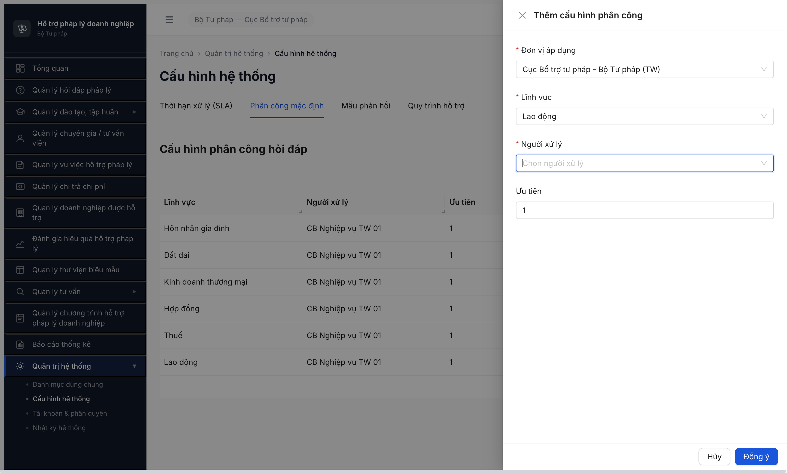

# Seed Checklist — Cấu hình Phân công Đợt 2 TVV (R6.4.A1.5)

**Ngày:** 2026-05-02 10:30 • **Tài khoản:** `qtht_01` • **Trạng thái mong đợi:** `Kích hoạt`
**Màn:** SCR-VIII-03 — Cấu hình hệ thống / tab Phân công mặc định • **Đường dẫn:** `/quan-tri/cau-hinh?tab=phan-cong`
**Dữ liệu mẫu:** [seed-fixture.yaml > cau_hinh_phan_cong_variants.dot_2_tvv_backfill](../../../../input/data/seed-fixture.yaml)
**SRS:** FR-VIII-03 — Cấu hình phân công · srs-fr-04 line 1057 (TVV.tai_khoan_id Nullable)

---

## Downstream consumer × filter

| Task downstream | Đọc filter | Số record cần | Status |
|-----------------|------------|---------------|:---:|
| R6.4.A3 VV phân công TVV ưu tiên | `linhVuc=X ∧ uuTien=2 ∧ nguoi_xu_ly.loai_tk=TVV` cho 6 LV | ≥1 PC TVV/LV × 6 LV | 🚫 0/6 |
| R6.4.A4 HD phân công TVV fallback | `linhVuc=X ∧ uuTien=2 ∧ trangThai=KICH_HOAT` | ≥1 / 6 LV | 🚫 0/6 |

**Acceptance gate:** mỗi LV có ≥1 PC với `nguoi_xu_ly` = TVV TW (loaiTk=TVV) ưu tiên 2 → seed PC chỉ chọn được TVV nếu TVV có TAI_KHOAN active.

---

## Kết quả: 🚫 BLOCKED 0/6 — 6 TVV TW 0001..0006 không có tài khoản login

Dropdown "Người xử lý" trong form Thêm cấu hình PC KHÔNG list 6 TVV TW (Nguyễn Văn Tư Vấn, Trần Thị Tư Vấn, Lê Văn Chuyên Gia, Phạm Thị Đào Tạo, Hoàng Văn Năm, Vũ Văn Sáu). Chỉ có 3 TVV ĐP (AG/BG/BNI) pre-seed. 6 TVV TW chưa được cấp TAI_KHOAN qua SCR-VIII-02 → `tai_khoan_id = null` → endpoint `/api/v1/tai-khoan?trangThai=HOAT_DONG` không trả về.

**Bug:** không log — đây không phải bug FE/BE. Workflow đúng SRS srs-fr-04 line 1057 (TVV.tai_khoan_id Nullable, không auto-create khi TVV active). Đây là **missing seed prerequisite**.

**Phân loại lỗi (Rule 9):** SELECTOR/DATA — dropdown filter đúng spec, data nguồn (TAI_KHOAN cho 6 TVV TW) chưa seed.

---

## Bằng chứng

### 1. Dropdown "Người xử lý" search "Nguyễn Văn Tư Vấn" → Trống



### 2. Dropdown search "Tư vấn viên" — chỉ 3 TVV ĐP

```json
["Tư vấn viên 02 (BG)","Tư vấn viên 03 (BNI)","Tư vấn viên 01 (AG)"]
```

### 3. Endpoint backing dropdown `/api/v1/tai-khoan?trangThai=HOAT_DONG&pageSize=100` (reqid=189, status 200)

Trong response 28 account, KHÔNG có username `tvv_tw_*` hoặc tên TVV TW. Có:
- 6 CG TW: `cg_tw_01..06` (loaiTaiKhoanTen=`Chuyên gia`)
- 3 NHT: `nht_ag_01`, `nht_dn_01`, `nht_hp_01`
- 3 CG ĐP: `cg_01..03`
- 3 TVV ĐP: dropdown trả tên `Tư vấn viên 01..03 (AG/BG/BNI)` — pre-seed từ DB
- CB/QTHT/DN: đầy đủ

→ Confirm 6 TVV TW (loaiTvv=TVV, indices 1..6) trong table TU_VAN_VIEN ĐÃ tồn tại + state DANG_HOAT_DONG sau R6.4.A1, nhưng `tai_khoan_id` null.

### 4. Bảng PC hiện tại — chỉ 6 row Đợt 1 CB-only


---

## Bảng dữ liệu seed (KHÔNG TIẾN HÀNH)

| # | Lĩnh vực | Người xử lý dự kiến | maTvv | UUID | Có vào kho? |
|---|----------|--------------------|-------|------|:-----------:|
| 1 | Lao động | Nguyễn Văn Tư Vấn | TVV-BTP-TW-0001 | fd76f004 | 🚫 |
| 2 | Thuế | Trần Thị Tư Vấn | TVV-BTP-TW-0002 | 63640ce9 | 🚫 |
| 3 | Hợp đồng | Lê Văn Chuyên Gia | TVV-BTP-TW-0003 | 09ef865d | 🚫 |
| 4 | Doanh nghiệp | Phạm Thị Đào Tạo | TVV-BTP-TW-0004 | 5bd3b075 | 🚫 |
| 5 | Sở hữu trí tuệ | Hoàng Văn Năm | TVV-BTP-TW-0005 | 6e9dfdf5 | 🚫 |
| 6 | Đất đai | Vũ Văn Sáu | TVV-BTP-TW-0006 | df8f6a64 | 🚫 |

**Tổng:** 0 vào kho / 6 bị chặn (toàn bộ chặn ở bước chọn Người xử lý — TVV không xuất hiện).

---

## Phản biện claim "FK ready" trong workflow-test-report-TVV.md

[workflow-test-report-TVV.md:142](../workflow/workflow-test-report-TVV.md) viết:
> ✅ R6.4.A1.5 (PC Đợt 2 TVV) — 6 TVV `tai_khoan_id != null` (FK link verified R6.2.7+8) + state `DANG_HOAT_DONG` → đủ điều kiện cấu hình PC

**Sai:** R6.2.7+8 chỉ verify FK cho **6 CG accounts** (`cg_tw_01..06` link tới TU_VAN_VIEN.loaiTvv=CG indices 13..18) + 3 NHT. KHÔNG seed account cho 6 TVV chính (loaiTvv=TVV indices 1..6).

Memory fixture comment đã warn rõ:
> ⚠️ TU_VAN_VIEN.tai_khoan_id là FK Nullable — TVV active KHÔNG tự động có TAI_KHOAN. Trước khi seed Đợt 2, QTHT phải verify từng TVV có `tai_khoan_id != null`. Nếu null → cấp TK qua SCR-VIII-02 trước.

---

## Việc cần làm tiếp — chờ user quyết định

Có 3 phương án để unblock A1.5:

**(a)** Seed 6 account login `tvv_tw_01..06` qua SCR-VIII-02 (Tài khoản & phân quyền) + link sang 6 TVV TW 0001..0006. Sau đó retry seed 6 PC Đợt 2 → unblock A3/A4 PC TVV ưu tiên. **Tăng scope** — task gốc R6.4.A1.5 không bao gồm seed account.

**(b)** Skip A1.5 — chấp nhận chỉ có PC Đợt 1 CB-only (6 row hiện tại). A4 (HD) vẫn chạy được vì auto-assign về `cb_nv_tw_01` (uu_tien=1). A3 (VV phân công) sẽ KHÔNG có TVV ưu tiên 2 trong dropdown → mất scope test "phân công ưu tiên TVV".

**(c)** Replace 6 TVV → 6 CG (cg_tw_01..06 đã có account) làm Người xử lý uu_tien=2. **Semantic mismatch** — spec A4 step 2 đề cập "phân công TVV ưu tiên", CG ≠ TVV về role/scope.

**Đề xuất (a)** vì phù hợp acceptance gate combinatorial split (memory feedback_seed_acceptance_strict_split). Cần user duyệt vì là scope expansion.

---

## Ảnh chụp

- [Dropdown search Nguyễn Văn Tư Vấn → Trống](../screenshots/r6-4-a1-5-dropdown-no-tvv-tw.png)
- [PC table chỉ 6 row Đợt 1](../screenshots/r6-4-a1-5-pc-table-only-dot1.png)

---

*2026-05-02 10:30 — QA chạy bằng Chrome DevTools MCP*
