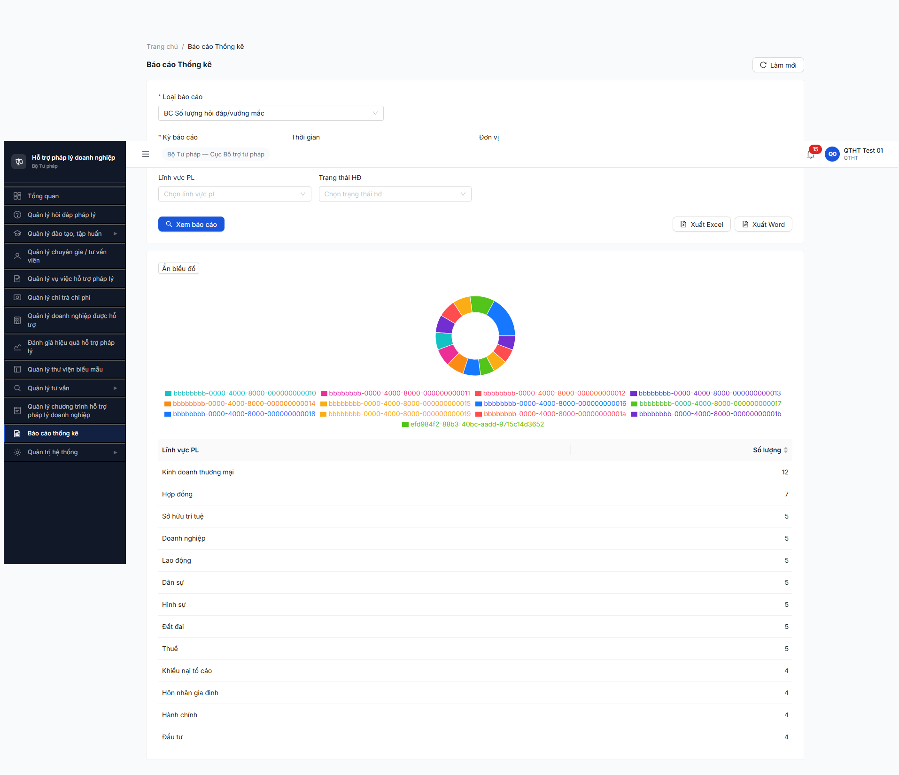
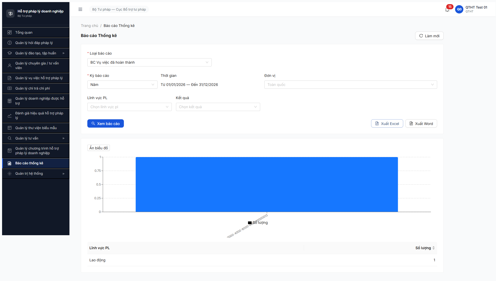

# Workflow Test Report — Báo cáo Thống kê Export Excel HD/VV (R6.5.4)

> **Module:** Báo cáo Thống kê (M11) · FR-12 (Phase 5 verification) · **SRS:** [`02-thu-tu-module.md §⑫`](../../../../input/quy-trinh-nghiep-vu/02-thu-tu-module.md) · **Round:** R20 · **Date:** 2026-05-05 · **Tester:** QA Automation (Claude Code via MCP Chrome DevTools)
> **Bug:** [`bug-report-flow-bao-cao.md`](../bug-reports/bug-report-flow-bao-cao.md) — 1 Critical + 1 Minor Open

---

## Kết luận

❌ **FAIL — 4/6 bước PASS, 2/6 FAIL**. Cả BC HD lẫn BC04 VV load data + render UI đúng, nhưng nút [Xuất Excel] tải về **JSON wrap NestJS StreamableFile** thay vì xlsx binary. Toàn bộ tính năng Xuất Excel/Word của module Báo cáo không dùng được. Log BUG-BC-EXPORT-001 Critical P0.

> Note 2026-05-05: BC04 mapping = "BC Vụ việc đã hoàn thành" (theo thứ tự dropdown HD→VV, BC04 là item thứ 4). BC liên quan HD = "BC Số lượng hỏi đáp/vướng mắc" (item 1, test song song để xác nhận pattern bug toàn module).

---

## Bảng kiểm tra workflow

| # | Bước (verify) | Actor | Sample test | Status | Bug / Note |
|:-:|---|---|---|:-:|---|
| 1 | Navigate Báo cáo Thống kê | qtht_01 | URL `/bao-cao` | ✅ | Form 2 dropdown required + 2 filter optional render OK |
| 2 | Chọn BC HD + Kỳ Năm + [Xem báo cáo] | qtht_01 | `/api/v1/bao-cao/hoi-dap?kyBaoCao=NAM` 200 | ✅ | 70 records (Kinh doanh TM 12, HĐ 7, SHTT/DN/LĐ/DS/HS/ĐĐ/Thuế 5 mỗi loại, KNTC/HNGĐ/HC/ĐT 4 mỗi loại) |
| 3 | Click [Xuất Excel] BC HD | qtht_01 | `POST /bao-cao/export` 200 → file 9408 B | ❌ | **BUG-BC-EXPORT-001** — file là JSON `{success,data:{logger:{context:StreamableFile},stream:{...buffer:[80,75,3,4...]}}}` không phải xlsx |
| 4 | Chọn BC04 "VV đã hoàn thành" + [Xem báo cáo] | qtht_01 | `/api/v1/bao-cao/vu-viec-hoan-thanh?kyBaoCao=NAM` 200 | ✅ | 1 record (Lao động 1) — đúng VV000051 từ R6.4.A3 |
| 5 | Click [Xuất Excel] BC04 | qtht_01 | `POST /bao-cao/export` 200 → file 7932 B | ❌ | **BUG-BC-EXPORT-001** cùng pattern — JSON wrap, hex `7b227375` = `{"su` thay vì `504B0304` (PK ZIP magic) |
| 6 | Verify pie chart legend label | qtht_01 | DOM legend text | ❌ | **BUG-BC-LEGEND-001** Minor — raw UUID `bbbbbbbb-...` thay vì "Kinh doanh thương mại" / "Lao động" |

> Icon: ✅ pass · ❌ fail · ⏭ skip · 🚫 blocked · — chưa test

---

## Lịch sử round

| Round | Date | Kết quả tóm tắt (1 dòng) |
|---|---|---|
| R20 | 05/05 | FAIL — BC load + UI OK; export Excel cả HD lẫn BC04 VV trả JSON wrap StreamableFile thay vì xlsx binary. 1 Critical + 1 Minor Open. |

---

## Bằng chứng





```text
POST /api/v1/bao-cao/export → 200
Content-Type: application/json; charset=utf-8                  ← SAI
Body BC HD (9408 B): {"success":true,"data":{"options":{},"logger":{"context":"StreamableFile",...},"stream":{"_readableState":{"buffer":[{"type":"Buffer","data":[80,75,3,4]}, ...]}}}}
Body BC04 VV (7932 B): cùng pattern, total xlsx bytes trong stream buffer = 1910

GET /api/v1/bao-cao/hoi-dap?kyBaoCao=NAM&tuNgay=2026-01-01&denNgay=2026-12-31      200
GET /api/v1/bao-cao/vu-viec-hoan-thanh?kyBaoCao=NAM&tuNgay=2026-01-01&denNgay=2026-12-31  200

Console: 1 warn blob HTTPS (download blob URL — không liên quan bug)
```

### Root cause analysis

BE NestJS controller đã return `StreamableFile` đúng (bytes Excel hợp lệ trong `_readableState.buffer`), nhưng response interceptor toàn cục của project bao mọi response thành `{success, data, meta}` envelope (cùng pattern memory `qa_htpldn_api_wrap_bug` từ session trước). Interceptor `JSON.stringify` object `StreamableFile` thay vì pipe stream xuống response body.

Hệ quả: Header `Content-Type` bị set thành `application/json` thay vì `application/vnd.openxmlformats-officedocument.spreadsheetml.sheet`, body là JSON serialized object không thể parse thành Excel.

### Fix recommendation (cho dev — không thuộc scope file bug, ghi tại verification report theo template hiện hành)

1. **BE:** Exclude `StreamableFile` khỏi response interceptor — kiểm tra `instanceof StreamableFile` đầu interceptor → return raw, bỏ qua envelope wrap.
2. **BE:** Set explicit header trong controller:
   - `@Header('Content-Type', 'application/vnd.openxmlformats-officedocument.spreadsheetml.sheet')`
   - `@Header('Content-Disposition', 'attachment; filename="bao-cao-{loai}-{date}.xlsx"')`
3. **Test sau fix:** Re-run R6.5.4 verify file mở được trong Excel + sheet ≥1 hàng data + cell value khớp UI bảng.

---

*R20 | QA Automation (Claude Code via MCP Chrome DevTools)*
