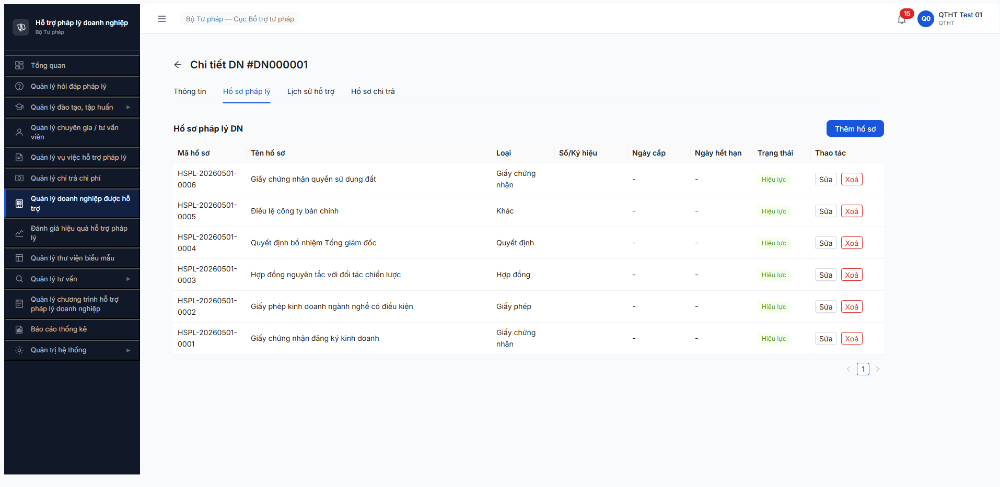
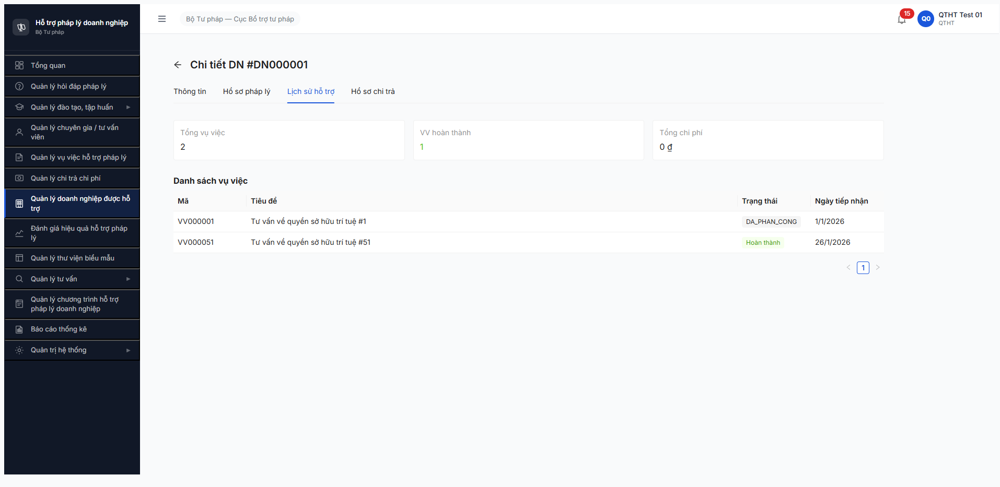
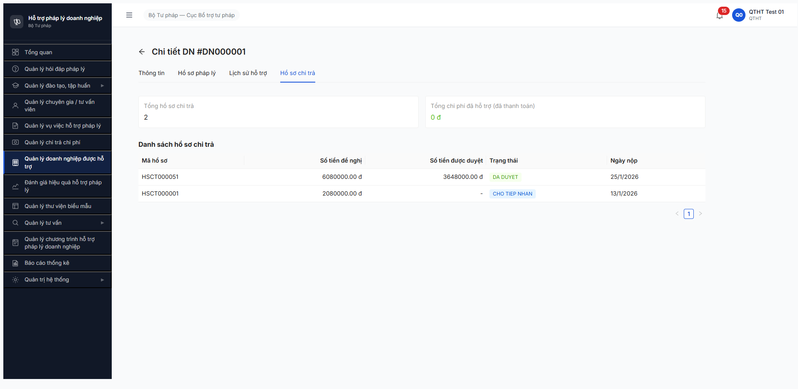

# Workflow Test Report — Cross-module link Doanh nghiệp (R6.5.2)

> **Module:** Quản lý Doanh nghiệp (M9) sub-tabs HSPL / VV / Chi trả · FR-X (Phase 5 verification) · **SRS:** [`02-thu-tu-module.md §⑨`](../../../../input/quy-trinh-nghiep-vu/02-thu-tu-module.md) · **Round:** R20 · **Date:** 2026-05-05 · **Tester:** QA Automation (Claude Code via MCP Chrome DevTools)
> **Bug:** chưa log — 5 obs trong report (1 Medium, 3 Minor, 1 Need-clarify)

---

## Kết luận

✅ **PASS — 3/3 tab cross-module PASS** trên DN000001 (Công ty Cổ phần Phúc An 1, An Giang). Cross-module FK `doanhNghiepId` filter hoạt động chuẩn cho cả 3 sub-resource (HSPL, VV, HSCT). Console sạch (0 error/warn).

> Note 2026-05-05: Task verification thuộc Phase 5 R6.5.2, không phải workflow state machine — bảng dưới mapping mỗi tab thành 1 "bước verify" thay vì transition. Acceptance theo todo.md = ≥1 record/tab.

---

## Bảng kiểm tra workflow

| # | Bước (verify) | Actor | Sample test | Status | Bug / Note |
|:-:|---|---|---|:-:|---|
| 1 | Login `qtht_01` + navigate Quản lý DN | qtht_01 | URL `/doanh-nghiep/danh-sach` | ✅ | — |
| 2 | Mở DN detail | qtht_01 | UUID `e0000000-0000-4000-8000-000000000001` (DN000001) | ✅ | OBS-DN-SEARCH-01 — search keyword "DN000001" trả 0 records dù record tồn tại |
| 3 | Tab #2 Hồ sơ pháp lý — load ≥1 record | qtht_01 | 6 record `HSPL-20260501-0001..0006` cover 5 loại × HIEU_LUC | ✅ | — |
| 4 | Tab #3 Lịch sử hỗ trợ — KPI + danh sách VV ≥1 | qtht_01 | KPI Tổng=2 / HT=1; VV000001 + VV000051 | ✅ | OBS-DN-TAB3-ENUM-01 — VV000001 raw enum `DA_PHAN_CONG`, VV000051 đã dịch |
| 5 | Tab #4 Hồ sơ chi trả — KPI + danh sách HSCT ≥1 | qtht_01 | Tổng=2; HSCT000051 DA_DUYET + HSCT000001 CHO_TIEP_NHAN | ✅ | OBS-DN-TAB4-FORMAT-01 — số tiền `6080000.00 đ` raw + state raw enum |
| 6 | Verify network FK filter `doanhNghiepId` | — | 3 sub-resource API call 200 | ✅ | — |
| 7 | Verify console sạch | — | `list_console_messages` types=[error,warn] | ✅ | 0 messages |

> Icon: ✅ pass · ❌ fail · ⏭ skip · 🚫 blocked · — chưa test

---

## Lịch sử round

| Round | Date | Kết quả tóm tắt (1 dòng) |
|---|---|---|
| R20 | 05/05 | PASS 3/3 tab DN000001 (HSPL 6 / VV 2 / HSCT 2). 5 obs UI polish. |

---

## Bằng chứng







```text
GET /api/v1/doanh-nghieps/e0000000-0000-4000-8000-000000000001                 200
GET /api/v1/ho-so-phap-ly-dns?doanhNghiepId=e0000000-...&pageSize=100          200
GET /api/v1/vu-viecs?doanhNghiepId=e0000000-...&pageSize=100                   200
GET /api/v1/ho-so-chi-tras?doanhNghiepId=e0000000-...&pageSize=100             200

Console: 0 error / 0 warn
```

### Observation chi tiết (chưa log bug riêng)

1. **OBS-DN-SEARCH-01** — Medium · Search keyword "DN000001" trên list page trả 0 records, record tồn tại (verify qua UUID navigate). Có vẻ filter không cover field `ma_dn`.
2. **OBS-DN-TAB3-ENUM-01** — Minor · Cột Trạng thái VV inconsistent: raw enum `DA_PHAN_CONG` vs label "Hoàn thành" cùng 1 cột.
3. **OBS-DN-TAB4-FORMAT-01** — Minor · Số tiền raw `6080000.00 đ` (thiếu thousand separator), trạng thái `DA DUYET` / `CHO TIEP NHAN` raw enum thay vì "Đã duyệt" / "Chờ tiếp nhận".
4. **OBS-DN-KPI-AGG-01** — Need-clarify · KPI "Tổng chi phí đã hỗ trợ" = 0đ dù HSCT000051 đã DA_DUYET 3.648.000đ; chưa rõ logic cộng KPI ở state nào (DA_DUYET vs DA_THANH_TOAN). Đợi clarify FR-06.
5. **OBS-DN-TAB1-DUPLICATE-LABEL** — Minor · Tab #1 có 2 trường semantic trùng: "Loại DN: Doanh nghiệp nhỏ" + "Quy mô: Nhỏ".

---

*R20 | QA Automation (Claude Code via MCP Chrome DevTools)*
