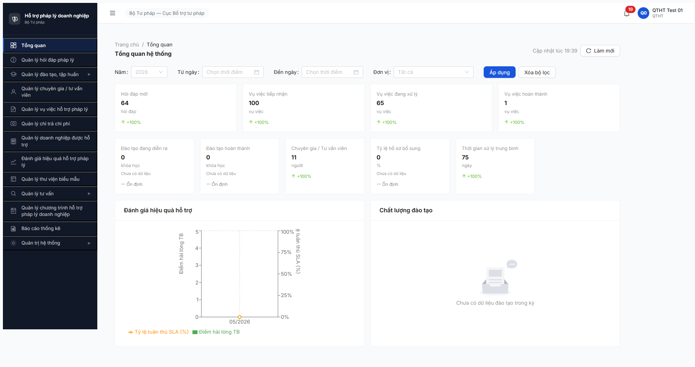
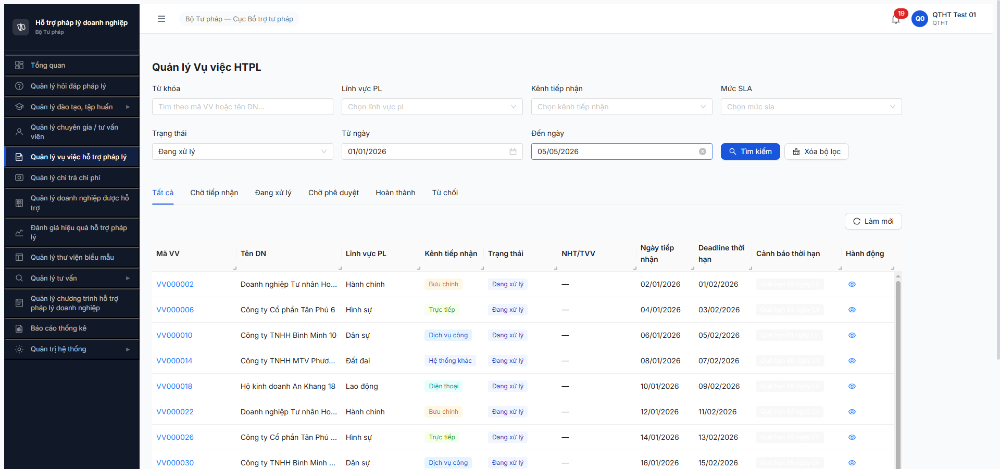

# Workflow Test Report — Dashboard KPI HD/VV (R6.5.1)

> **Module:** Dashboard tổng quan (M1) · FR-X.1 (Phase 5 verification) · **SRS:** [`02-thu-tu-module.md §①`](../../../../input/quy-trinh-nghiep-vu/02-thu-tu-module.md) · **Round:** R20 · **Date:** 2026-05-05 · **Tester:** QA Automation (Claude Code via MCP Chrome DevTools)
> **Bug:** chưa log — 1 obs Major (count mismatch) + 1 obs Minor (UI digit space)

---

## Kết luận

✅ **PASS — 5/5 bước PASS** acceptance "KPI counter > 0 cho HD + VV". Dashboard render đầy đủ 4 counter HD/VV với data > 0 (HD 64, VV tiếp nhận 100, đang xử lý 65, hoàn thành 1). Drill-down click navigate đúng URL với filter chuẩn. Console sạch. **Phát hiện 1 inconsistency Major:** dashboard counter "VV đang xử lý: 65" nhưng drill-down list filter `trangThai=DANG_XU_LY` chỉ trả 14 — semantic mismatch giữa dashboard aggregate vs list filter exact. Cần dev clarify.

> Note 2026-05-05: Acceptance R6.5.1 todo.md "TVCS/CT defer" — chỉ test HD + VV. CT counter (Chi trả) sẵn data 100 record nhưng dashboard không có counter dedicated cho Chi trả ở qtht_01 view → ngoài scope task này.

---

## Bảng kiểm tra workflow

| # | Bước (verify) | Actor | Sample test | Status | Bug / Note |
|:-:|---|---|---|:-:|---|
| 1 | Navigate Dashboard sau login | qtht_01 | URL `/dashboard` | ✅ | — |
| 2 | Verify counter HD > 0 | qtht_01 | "Hỏi đáp mới: 64" | ✅ | match A4 PASS data |
| 3 | Verify counter VV (3 sub-counter) > 0 | qtht_01 | Tiếp nhận 100 / Đang xử lý 65 / Hoàn thành 1 | ✅ | match A3 PASS data |
| 4 | Drill-down click counter HD | qtht_01 | URL `/hoi-dap?trangThai=MOI&tuNgay=2026-01-01&denNgay=2026-05-05` → 64 mục | ✅ | filter tự gắn date Year + state MOI; OBS-DASH-DIGIT — tab "Mới 6 4" có space giữa số 64 |
| 5 | Drill-down click counter VV "Đang xử lý" | qtht_01 | URL `?trangThai=DANG_XU_LY` → **14 mục** ≠ 65 dashboard | ✅ counter PASS / ⚠️ **OBS-DASH-COUNT-MISMATCH-01** | Major — semantic inconsistency: dashboard aggregate state vs list filter exact `DANG_XU_LY` |

> Icon: ✅ pass · ❌ fail · ⏭ skip · 🚫 blocked · — chưa test

---

## Lịch sử round

| Round | Date | Kết quả tóm tắt (1 dòng) |
|---|---|---|
| R20 | 05/05 | PASS 5/5 acceptance > 0; phát hiện count mismatch 65 vs 14 cần dev clarify aggregate vs filter semantic. |

---

## Bằng chứng





```text
GET /api/v1/dashboard?nam=2026&tuNgay=2026-01-01&denNgay=2026-05-05               200
GET /api/v1/dashboard/chart/hieu-qua-ho-tro?nam=2026&tuNgay=...                   200
GET /api/v1/dashboard/chart/chat-luong-dao-tao?nam=2026&tuNgay=...                200
GET /api/v1/vu-viecs?trangThai=DANG_XU_LY&tuNgay=...&denNgay=...&page=1           200 → 14 records
GET /api/v1/hoi-daps?trangThai=MOI&tuNgay=...&denNgay=...&page=1                  200 → 64 records

Console: 0 error / 0 warn
```

### Counter values observed (filter Năm 2026, Đơn vị Tất cả)

| Counter | Value | Drill-down filter | List result |
|---|---:|---|---:|
| Hỏi đáp mới | **64** | `trangThai=MOI` | **64** ✅ match |
| Vụ việc tiếp nhận | **100** | (chưa drill, suy luận `trangThai=DA_TIEP_NHAN`) | — chưa verify |
| Vụ việc đang xử lý | **65** | `trangThai=DANG_XU_LY` | **14** ❌ **mismatch −51** |
| Vụ việc hoàn thành | **1** | (chưa drill) | — chưa verify |
| Đào tạo đang diễn ra | 0 | — | — empty expected |
| Đào tạo hoàn thành | 0 | — | — empty expected |
| Chuyên gia / TVV | 11 | — | — |
| Tỷ lệ hồ sơ bổ sung | 0% (Chưa có dữ liệu) | — | — |
| Thời gian xử lý TB | 75 ngày (+100%) | — | — |

---

## Observations (1 Major + 1 Minor)

1. **OBS-DASH-COUNT-MISMATCH-01** — Major · Counter "VV đang xử lý: 65" trên dashboard ≠ 14 mục khi drill-down list với cùng filter date range + state `DANG_XU_LY`.
   - Hypothesis: dashboard endpoint `/api/v1/dashboard` aggregate count theo định nghĩa nghiệp vụ rộng ("VV đang xử lý" = mọi state intermediate: DANG_KIEM_TRA + DA_PHAN_CONG + DA_TIEP_NHAN + DANG_XU_LY + CHO_PHE_DUYET). List filter URL chỉ truyền 1 state exact `DANG_XU_LY` → 14.
   - User impact: click drill-down từ dashboard → user thấy số nhỏ hơn, confuse "thiếu data ở đâu". Hoặc dashboard counter sai semantic → over-count.
   - Dev cần clarify: (a) sửa dashboard tính exact 1 state `DANG_XU_LY` về 14, hoặc (b) giữ aggregate nhưng drill-down truyền multi-state filter `trangThai=DA_TIEP_NHAN,DA_PHAN_CONG,DANG_KIEM_TRA,DANG_XU_LY,CHO_PHE_DUYET` để list match.

2. **OBS-DASH-DIGIT-SPACE-01** — Minor · Số 2 chữ số bị render với space giữa các digit ở 2 vị trí:
   - Tab "Mới **6 4**" trong list Hỏi đáp (đáng ra "Mới 64").
   - Notification icon "**1 9** chưa đọc" (đáng ra "19 chưa đọc").
   - Có thể FE render 2 separate `<span>` với padding/letter-spacing CSS sai cho badge component.

---

*R20 | QA Automation (Claude Code via MCP Chrome DevTools)*
