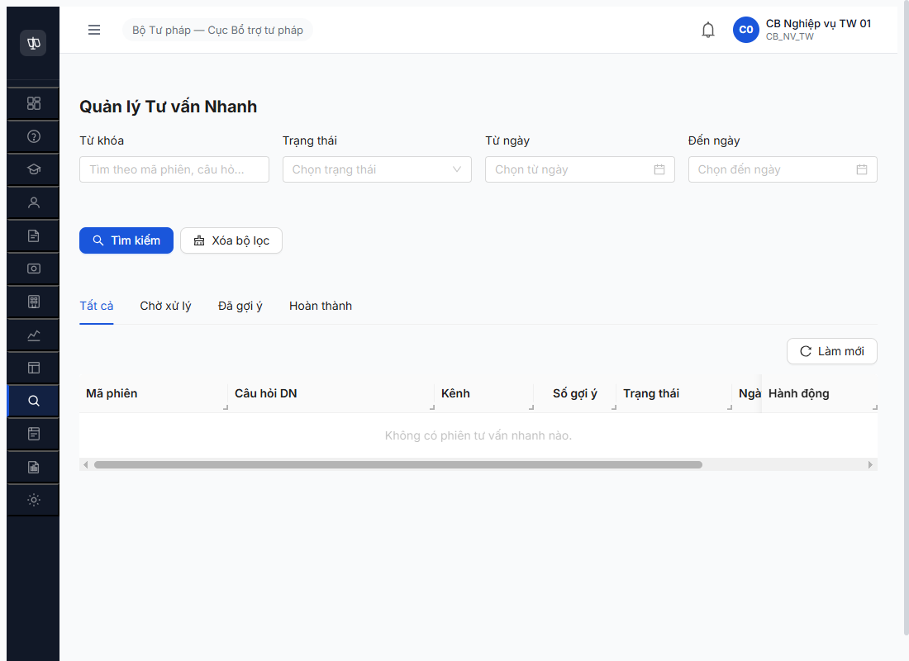

# Workflow Test Report — TV nhanh Monitor (R6.E4)

> **Module:** Quản lý Tư vấn Nhanh (M13.A) · FR-13 · **SRS:** [`02-thu-tu-module.md §⑬-A`](../../../../input/quy-trinh-nghiep-vu/02-thu-tu-module.md) · **Round:** R20 · **Date:** 2026-05-06 · **Tester:** QA Automation (Claude Code via MCP Chrome DevTools)
> **Bug:** chưa log — verdict ⚠️ PARTIAL do upstream defer, không phải bug.

---

## Kết luận

⚠️ **PARTIAL — 4/5 bước PASS, 1/5 BLOCK by-design.** Menu route accessible (URL chuẩn `/tv-nhanh/danh-sach`, không phải `/tu-van/tu-van-nhanh` như đoán ban đầu), UI list page render đúng (form filter + 4 tab Tất cả/Chờ xử lý/Đã gợi ý/Hoàn thành + 8 cột bảng + empty state "Không có phiên tư vấn nhanh nào"). Endpoint `GET /api/v1/tu-van-nhanhs` 200 working. **Không thể đạt acceptance "≥1 record" qua CMS UI/API** — POST trả `401 ERR-AUTH-MTLS-02 mTLS client certificate fingerprint missing` (đúng spec FR-13: phiên TV nhanh PUBLIC chỉ tạo từ Cổng PLQG qua mTLS). Cần R6.6.3 Cổng PLQG external integration để seed.

> Note 2026-05-06: Acceptance todo R6.E4 ban đầu = "menu render OK + ≥1 record". Sau test: menu render PASS + record=0 do BE policy. Việc seed phiên là scope R6.6.3 (Cổng PLQG mTLS) hoặc R6.6.2 (auto-feed BE BR-FLOW-10) — không phải scope monitor R6.E4.

---

## Bảng kiểm tra workflow

| # | Bước (verify) | Actor | Sample test | Status | Bug / Note |
|:-:|---|---|---|:-:|---|
| 1 | Sidebar parent "Quản lý tư vấn" có submenu | cb_nv_tw_01 | DOM inspect — submenu có 3 items: TV chuyên sâu / Kho câu hỏi / TV nhanh | ✅ | a11y tree ẩn submenu collapsed, DOM eval xác nhận có |
| 2 | Click submenu "Tư vấn nhanh" → navigate | cb_nv_tw_01 | URL `/tv-nhanh/danh-sach` (không phải đoán `/tu-van/tu-van-nhanh` 404) | ✅ | OBS-TVNH-URL — URL slug khác convention các module khác (`/hoi-dap`, `/vu-viec/danh-sach`, `/chi-tra/danh-sach`); TV nhanh dùng `/tv-nhanh/...` (viết tắt) |
| 3 | List page render — empty state đúng | cb_nv_tw_01 | "Không có phiên tư vấn nhanh nào" + 8 cột (Mã phiên / Câu hỏi DN / Kênh / Số gợi ý / Trạng thái / Ngày gửi / Ngày cập nhật / Hành động) | ✅ | Form filter đầy đủ: Từ khóa + Trạng thái + Date range + 4 tab |
| 4 | API `GET /api/v1/tu-van-nhanhs` accessible | cb_nv_tw_01 | 200 với empty list | ✅ | Endpoint thật khác đoán: `tu-van-nhanhs` plural (không phải `tu-van-nhanh` / `phien-tu-van-nhanh` etc.) |
| 5 | Seed 1 phiên via UI/API | cb_nv_tw_01 | POST `/api/v1/tu-van-nhanhs` → 401 ERR-AUTH-MTLS-02 | 🚫 by-design | KHÔNG có button [Thêm mới] trong UI; POST require mTLS client cert (Cổng PLQG only) — đúng FR-13 spec |

> Icon: ✅ pass · ❌ fail · ⏭ skip · 🚫 blocked · — chưa test

---

## Lịch sử round

| Round | Date | Kết quả tóm tắt (1 dòng) |
|---|---|---|
| R20 | 06/05 | PARTIAL — menu route + UI + GET endpoint ✅; seed BLOCKED by-design (mTLS required, Cổng PLQG only). Cần R6.6.3 unblock. |

---

## Bằng chứng



```text
GET /api/v1/tu-van-nhanhs?page=1&pageSize=20                                    200 (empty list)
GET /api/v1/tu-van-nhanh / tu-van-nhanhs / tv-nhanh / tv-nhanhs / phien-...     404 (alternative endpoint guesses, all wrong)
POST /api/v1/tu-van-nhanhs (cb_nv_tw_01 JWT)                                    401 ERR-AUTH-MTLS-02
   error.code: ERR-AUTH-MTLS-02
   error.message: "mTLS client certificate fingerprint missing"

Console: 0 error / 0 warn

Sidebar buttons (CB_NV_TW visible):
- Quản lý tư vấn ▶ → Tư vấn chuyên sâu / Kho câu hỏi / Tư vấn nhanh
- Mạng lưới Tư vấn viên ▶ → TVV/Chuyên gia / Tổ chức tư vấn / Người hỗ trợ pháp lý
- Quản lý đào tạo ▶ → CTĐT / KH / Kho TL / NHCH / Giảng viên
- Quản trị hệ thống ▶ → Cấu hình hệ thống

Page action buttons (visible to CB_NV_TW on TV nhanh list):
- Tìm kiếm / Xóa bộ lọc / Làm mới
- KHÔNG có Thêm mới / Tạo phiên / Import (confirmed expected per FR-13)
```

### Endpoint policy verified

| Method | Endpoint | Auth | Status | Use case |
|---|---|---|---|---|
| GET | `/api/v1/tu-van-nhanhs` | JWT (CMS user) | 200 | CB nghiệp vụ xem danh sách phiên |
| POST | `/api/v1/tu-van-nhanhs` | mTLS (Cổng PLQG only) | 401 if no cert | DN gửi câu hỏi qua external portal |

→ Confirms FR-13 design: TV nhanh PUBLIC = entry point cho DN, không có manual create từ CMS.

---

## Observations

1. **OBS-TVNH-URL-CONVENTION-01** Minor — URL slug `/tv-nhanh` (viết tắt) không nhất quán với các module khác dùng tên đầy đủ (`/hoi-dap`, `/vu-viec`, `/chi-tra`, `/doanh-nghiep`). Sidebar text hiển thị "Tư vấn nhanh" nhưng route lại viết tắt. Dev có thể cân nhắc rename thành `/tu-van-nhanh/danh-sach` cho consistency. Severity Minor — không block UX.

2. **OBS-TVNH-A11Y-SUBMENU-01** Minor — Submenu trong sidebar "Quản lý tư vấn" + "Mạng lưới TVV" + "Đào tạo" + "Quản trị HT" đều render trong DOM nhưng `display: hidden` khi parent collapsed → a11y tree ẩn item con, screen reader không reach được nếu sidebar không expand. CSS pattern có thể cần `aria-hidden="true"` hoặc explicit role="menu". Severity Minor — UX accessibility gap.

---

## Liên đới với task khác

- **R6.6.2 Workflow TV nhanh nhập tay** ⏳: cần KHO_CAU_HOI để keyword search; cần BE auto-feed BR-FLOW-10 — chưa unblock.
- **R6.6.3 Workflow TV nhanh PUBLIC** ⏳: cần mTLS Cổng PLQG external integration — chính là path để seed ≥1 phiên cho R6.E4.
- **R6.7.11 TV nhanh 39 TC** ⏳: cascade từ R6.6.2 + R6.4.D3 (Kho QA UI defer).

→ R6.E4 sẽ tự auto-PASS khi R6.6.3 unblock + ≥1 phiên đầu tiên seed thành công qua Cổng PLQG.

---

*R20 | QA Automation (Claude Code via MCP Chrome DevTools)*
