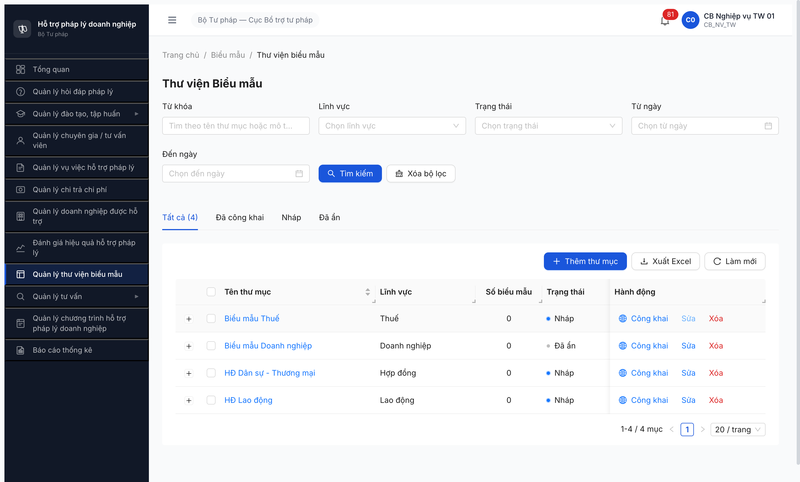

# Workflow Test Report — Biểu mẫu (FR-VII-03)

> **Module:** Thư mục biểu mẫu (`THU_MUC_BIEU_MAU` cascade `BIEU_MAU`) · **SRS:** [`srs-fr-09 §SM-BIEUMAU + §FR-VII-03`](../../../../input/srs-v3/srs-fr-09-bieu-mau.md) · **Round:** R11 · **Date:** 2026-05-02 · **Tester:** QA Automation
> **Bug:** không có

---

## Kết luận

✅ **PASS** — **3/3 transition PASS**. Cover toàn bộ SM-BIEUMAU `NHAP → CONG_KHAI ⟷ AN` theo SRS FR-VII-03 §Processing Công khai/Hủy công khai. Không có bug app.

> **TODO ambiguity SRS:** SM-BIEUMAU dòng 47-50 spec workflow cho thư mục (UC94 FR-VII-03). Workflow cho từng `BIEU_MAU` riêng lẻ KHÔNG có UI riêng — cascade theo thư mục cha. Theo SRS line 80 `trang_thai NHAP/CONG_KHAI` cho thư mục, line 251 output cũng thư mục. Test scope khớp design.

---

## Bảng kiểm tra workflow

| # | Bước (transition) | Actor | Sample test | Status | Bug / Note |
|:-:|---|---|---|:-:|---|
| 0 | Seed thư mục state `NHAP` (R6.3.7 đã pass phase 3) | `cb_nv_tw_01` | 4 thư mục: Thuế / DN / HĐ DS-TM / HĐ LĐ | ✅ | R6.3.7 PASS 4/4 trước R11 |
| 1 | `NHAP → CONG_KHAI` ([Công khai] → modal confirm → "Công khai thư mục này lên Cổng PLQG?") | `cb_nv_tw_01` | Thư mục "Biểu mẫu Doanh nghiệp" `e8f7a198-...` (chứa 1 BM `BM-20260501-003`) | ✅ | Sync = "Đã đồng bộ", button đổi `[Công khai] → [Ẩn]` |
| 2 | `CONG_KHAI → AN` ([Ẩn] → modal "Ẩn thư mục khỏi Cổng PLQG?") | `cb_nv_tw_01` | Cùng thư mục DN | ✅ | Sync vẫn "Đã đồng bộ", button đổi `[Ẩn] → [Công khai]` |
| 3 | `AN → CONG_KHAI` (re-publish, [Công khai] lại) | `cb_nv_tw_01` | Cùng thư mục DN | ✅ | Sync giữ "Đã đồng bộ", button đổi `[Công khai] → [Ẩn]`. Cover edge `⟷` của SM |

> Icon: ✅ pass · ❌ fail · ⏭ skip · 🚫 blocked · — chưa test

---

## Lịch sử round

| Round | Date | Kết quả tóm tắt (1 dòng) |
|---|---|---|
| R11 | 2026-05-02 | PASS 3/3 transition SM-BIEUMAU. Workflow Nháp → Công khai → Ẩn → Công khai (re-publish) verified. |

---

## Bằng chứng (R11)

**Bước 1 — `NHAP → CONG_KHAI`** *(thư mục DN từ "Nháp" → "Đã công khai" + Sync "Đã đồng bộ")*:

**Bước 2 — `CONG_KHAI → AN`** *(thư mục DN từ "Đã công khai" → "Đã ẩn", button đổi)*:

**Bước 3 — `AN → CONG_KHAI`** *(re-publish, thư mục DN từ "Đã ẩn" → "Đã công khai")*:

---

*R11 | QA Automation via Claude Code*
