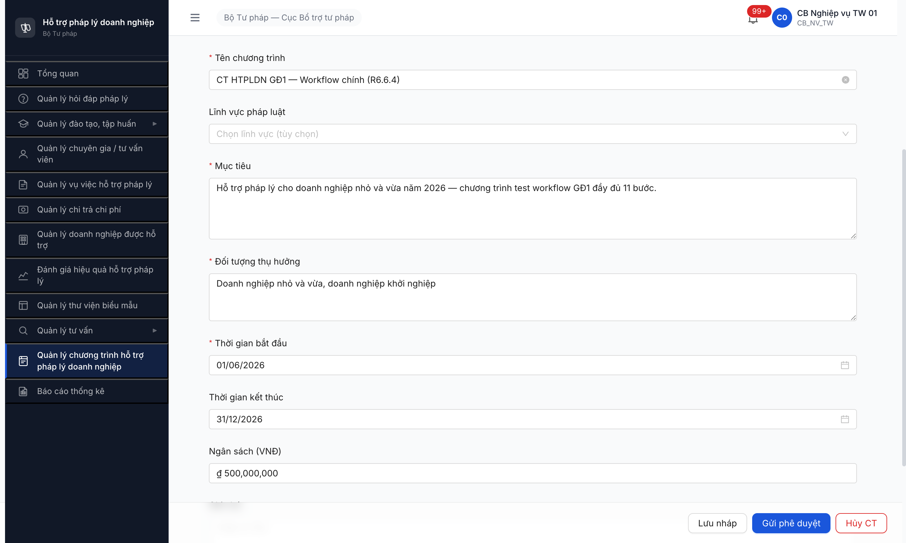
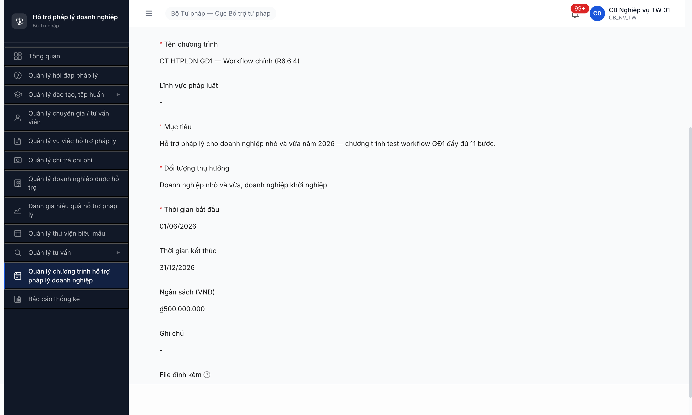
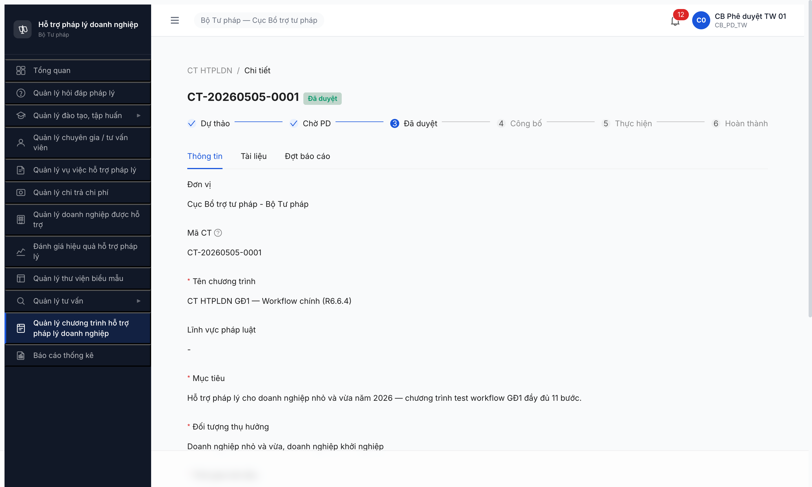
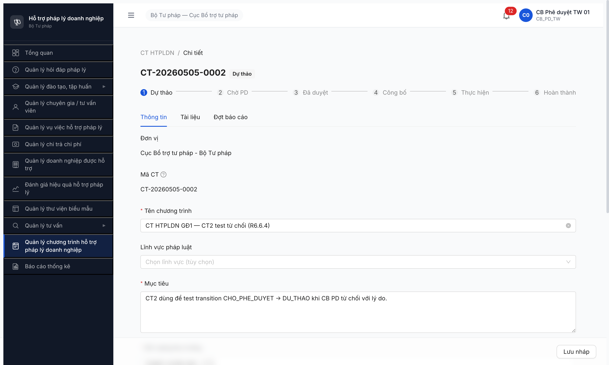
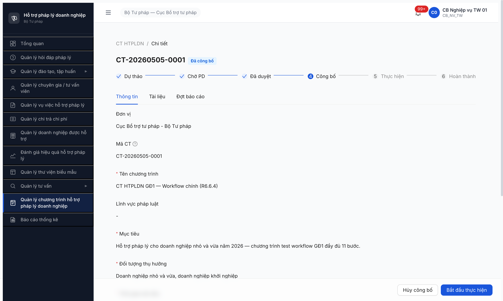
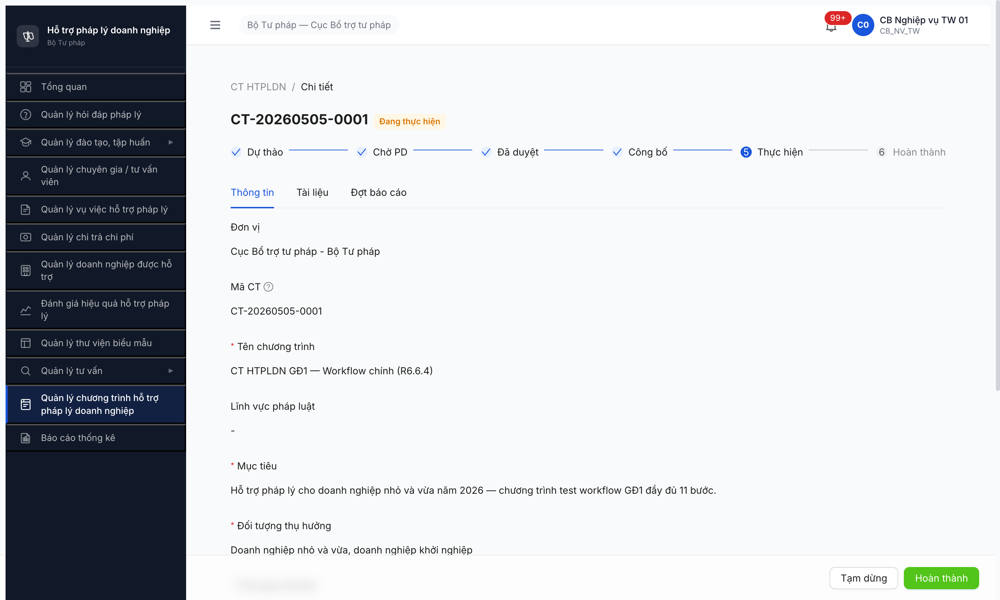
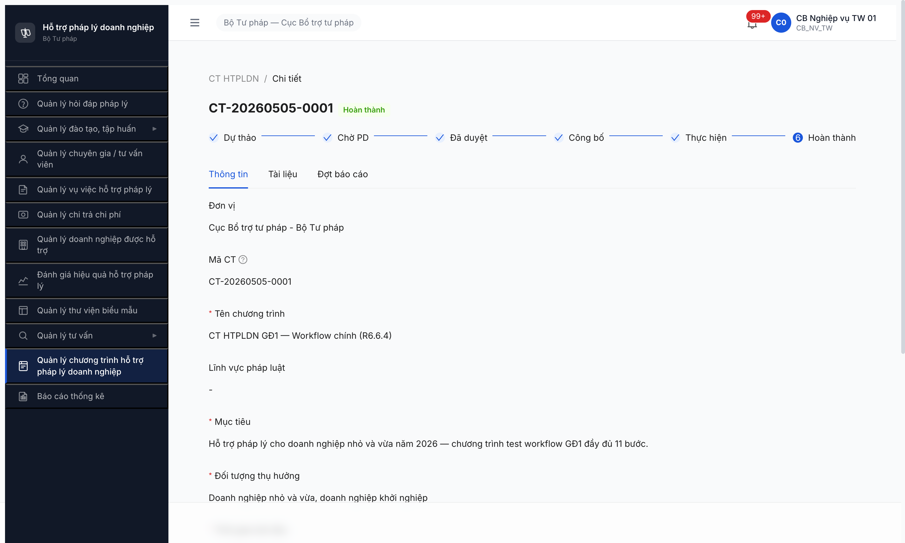
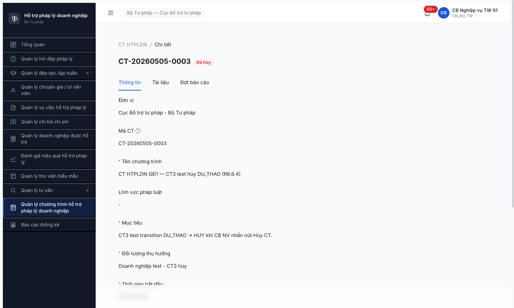
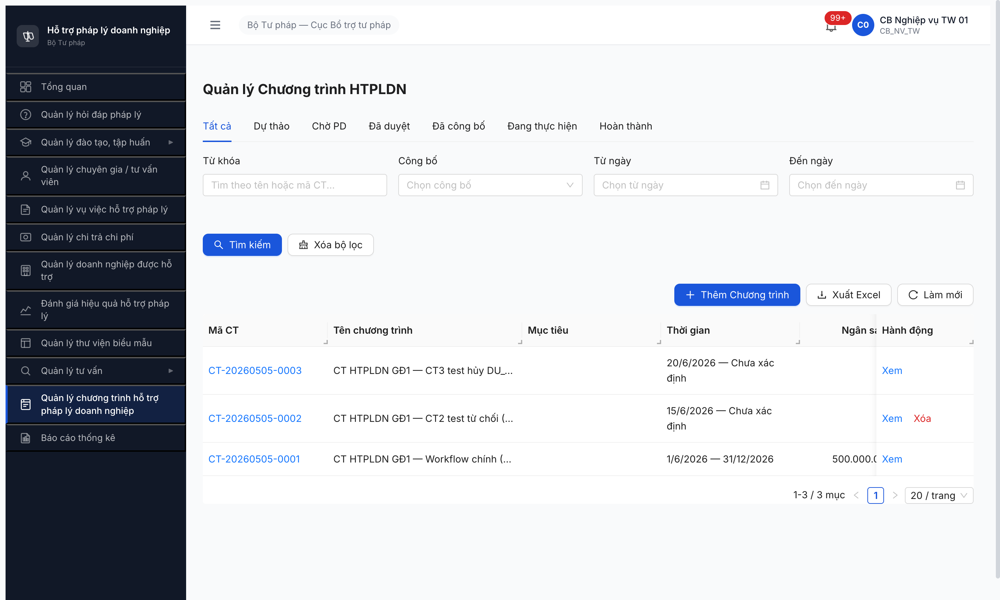

# Workflow Test Report — Chương trình HTPLDN GĐ1

> **Module:** Quản lý Chương trình HTPLDN GĐ1 (FR-XI-01..05 / UC164-168 / SM-KH-CTHTPL) · **SRS:** [`02-thu-tu-module.md §⑤`](../../../input/quy-trinh-nghiep-vu/02-thu-tu-module.md#L289-L342) + [`srs-fr-15-ct-htpldn.md §FR-XI-01..05`](../../../input/srs-v3/srs-fr-15-ct-htpldn.md) · **Round:** R6.6.4 · **Date:** 2026-05-05 · **Tester:** QA Automation (Claude Code via MCP)
> **Bug:** không có bug FR scope workflow.

---

## Kết luận

✅ **PASS — 11/11 bước (100%)**. Toàn bộ state machine SM-KH-CTHTPL transition theo SRS §⑤ + FR-XI-01..05. 3 CT seed (CT1 main flow + CT2 reject + CT3 cancel) đạt state cuối: CT1 `HOAN_THANH`, CT2 `DU_THAO` (sau reject), CT3 `HUY`. **R6.6.5 unblock — đã có ≥1 CT GĐ1 đi qua DANG_THUC_HIEN** (CT1).

> Output dự kiến của task R6.6.4 (`≥1 CT GĐ1 state DANG_THUC_HIEN`) đã đạt → unblock R6.6.5 (Đợt BC GĐ2 cần CT đã trải qua trạng thái này) + R6.7.15 (Functional CT HTPLDN có ≥1 record state cuối để test KPI/perm/edge).

---

## Bảng kiểm tra workflow

> Copy đầy đủ 11 transition từ SRS `02-thu-tu-module.md §⑤ SM-CHUONG_TRINH_HTPL`. Mỗi transition 1 row.

| # | Bước (transition) | Actor | Sample test | Status | Bug / Note |
|:-:|---|---|---|:-:|---|
| 1 | `— → DU_THAO` (Tạo CT thủ công UC164, [Tạo chương trình]) | `cb_nv_tw_01` | CT-20260505-0001 | ✅ | Form 9 trường + auto sinh mã `CT-{YYYYMMDD}-{SEQ}`. Đơn vị auto từ user. |
| 2 | `DU_THAO → CHO_PHE_DUYET` ([Gửi phê duyệt]) | `cb_nv_tw_01` | CT-20260505-0001 | ✅ | Stepper bước 1 check. Submit trực tiếp. |
| 3 | `CHO_PHE_DUYET → DA_DUYET` ([Phê duyệt]) | `cb_pd_tw_01` | CT-20260505-0001 | ✅ | Modal "Phê duyệt chương trình?" → Đồng ý. Stepper bước 2 check. BR-AUTH-05 cùng cấp TW PASS. |
| 4 | `CHO_PHE_DUYET → DU_THAO` ([Từ chối] + lý do ≥10 ký tự) | `cb_pd_tw_01` | CT-20260505-0002 | ✅ | Modal có textarea Lý do từ chối required (BR-FLOW-04). Lý do test 102 ký tự PASS. State quay về Dự thảo. |
| 5 | `DA_DUYET → DA_CONG_BO` ([Công bố lên Cổng PLQG]) | `cb_nv_tw_01` | CT-20260505-0001 | ✅ | Modal "Công bố lên Cổng PLQG?" → Đồng ý. State Đã công bố + stepper bước 3 check. (FR-XII-15 push API ngoài scope smoke.) |
| 6 | `DA_CONG_BO → DA_DUYET` ([Hủy công bố]) | `cb_nv_tw_01` | CT-20260505-0001 | ✅ | Modal "Hủy công bố?" → Đồng ý. Toast "Đã hủy công bố". State quay về Đã duyệt. |
| 7 | `DA_DUYET → DANG_THUC_HIEN` ([Bắt đầu thực hiện]) | `cb_nv_tw_01` | CT-20260505-0001 | ✅ | Modal "Bắt đầu thực hiện? Sau đó có thể tạo đợt báo cáo." → Đồng ý. Stepper bước 4 check, Thực hiện active. |
| 8 | `DANG_THUC_HIEN → TAM_DUNG` ([Tạm dừng] + lý do) | `cb_nv_tw_01` | CT-20260505-0001 | ✅ | Modal có textarea Lý do tạm dừng required (max 500). State Tạm dừng. |
| 9 | `TAM_DUNG → DANG_THUC_HIEN` ([Tiếp tục]) | `cb_nv_tw_01` | CT-20260505-0001 | ✅ | Modal "Tiếp tục chương trình?" → Đồng ý. State quay về Đang thực hiện. |
| 10 | `DANG_THUC_HIEN → HOAN_THANH` ([Hoàn thành]) | `cb_nv_tw_01` | CT-20260505-0001 | ✅ | Modal "Hoàn thành chương trình?" → Đồng ý. Stepper 5 bước check, bước 6 Hoàn thành active. Không còn action button. |
| 11 | `DU_THAO → HUY` ([Hủy CT] + xác nhận) | `cb_nv_tw_01` | CT-20260505-0003 | ✅ | Modal "Hủy chương trình? Hành động này không thể hoàn tác." → Đồng ý. State Đã hủy. |

---

## Lịch sử round

| Round | Date | Kết quả tóm tắt (1 dòng) |
|---|---|---|
| R6.6.4 | 2026-05-05 | PASS 11/11 transitions. 3 CT seed cuối (HOAN_THANH/DU_THAO/HUY). Unblock R6.6.5 + R6.7.15. |

---

## Tài khoản dùng

| Username | Vai trò | Cấp | Dùng cho bước |
|---|---|---|---|
| `cb_nv_tw_01` | CB_NV_TW (Cán bộ Nghiệp vụ TW) | TW | 1, 2, 5, 6, 7, 8, 9, 10, 11 |
| `cb_pd_tw_01` | CB_PD_TW (Cán bộ Phê duyệt TW) | TW | 3 (CT1), 4 (CT2) |

Đa-role test áp dụng pattern isolated context riêng cho từng tài khoản (`r6-6-4-cb-nv-tw-01` vs `r6-6-4-cb-pd-tw-01`) — không logout/login lại trong cùng tab.

---

## Bằng chứng

### B1 — CT1 created `DU_THAO`

### B2 — CT1 `CHO_PHE_DUYET`

### B3 — CT1 `DA_DUYET` (cb_pd_tw_01 phê duyệt)

### B4 — CT2 `DU_THAO` sau từ chối

### B5 — CT1 `DA_CONG_BO`

### B7 — CT1 `DANG_THUC_HIEN`

### B10 — CT1 `HOAN_THANH` (5 step check)

### B11 — CT3 `HUY` (Đã hủy)

### List danh sách 3 CT cuối round

---

## Output cho task downstream

| Task | Trạng thái sau R6.6.4 | Lý do |
|---|---|---|
| **R6.6.5** Workflow CT HTPLDN GĐ2 Đợt BC | ⏳→🟢 unblock 1 phần (vẫn block bởi R6.6.1 7 bug Open) | Đủ ≥1 CT GĐ1 state DANG_THUC_HIEN/HOAN_THANH (CT1) làm upstream tạo Đợt BC. |
| **R6.7.15** Functional CT HTPLDN (42 TC) | ⏳→🟢 unblock | Menu OK + 3 CT đa state (HOAN_THANH/DU_THAO/HUY) đủ test negative + perm + edge. |
| **R6.E2** CT HTPLDN GĐ1 monitor | ✅ done | 3 CT data tồn tại, không còn data=0. |

---

*R6.6.4 | 2026-05-05 | QA Automation (Claude Code via Chrome DevTools MCP, isolated context multi-role)*
