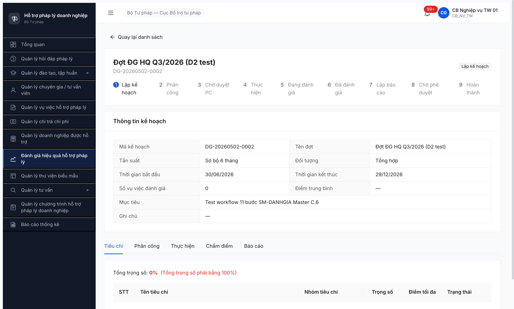
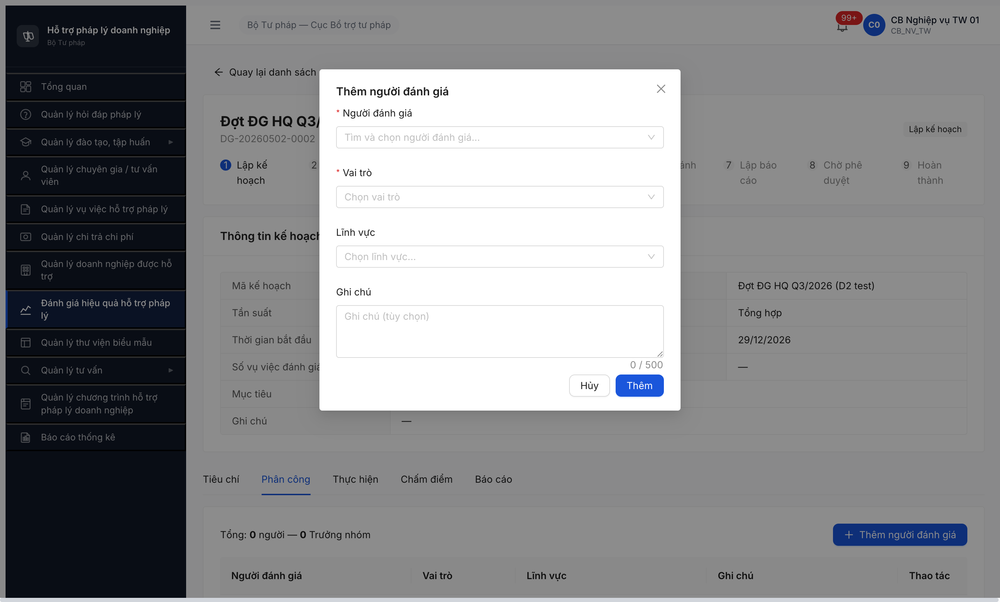
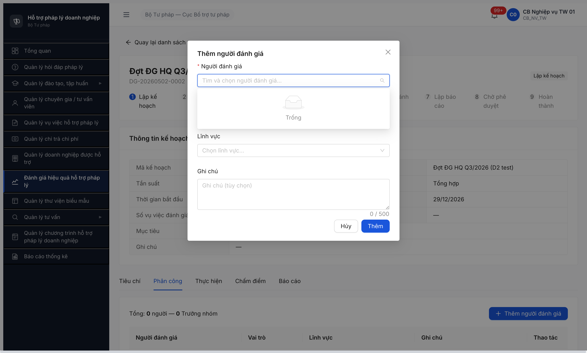

# Workflow Test Report — Đánh giá Hiệu quả HTPLDN (FR-08)

> **Module:** FR-08 Đánh giá Hiệu quả (Nhóm VI) · **SRS:** [`srs-fr-08-danh-gia.md`](../../../../input/srs-v3/srs-fr-08-danh-gia.md) — FR-VI-01 (UC83 Lập KH, line 71-150) + FR-VI-02 (UC84 Tiêu chí, line 151-220) + FR-VI-03 (UC85 Phân công, line 221-290) + SCR-VI-01 (line 735-832) + SM-DANHGIA (line 1066-1102) · **Round:** R14 · **Date:** 2026-05-02 · **Tester:** QA Automation
> **Bug:** [`bug-report-flow-danhgia.md`](../bug-reports/bug-report-flow-danhgia.md)

---

## Kết luận

🚫 **BLOCKED — 1/11 bước PASS, 10/11 BLOCKED do 5 bug FE (2 Critical + 2 Major + 1 Medium) chặn từ Bước 2 (phân công) trở đi và back-fill tiêu chí ở Bước 1.**

> **TODO ambiguity SRS** — đã ghi nhận trong R6.4.D1 seed-checklist + giữ ở đây để dev/BA quyết:
> SRS Master srs-v3.md có **3 phiên bản state machine ĐG khác nhau** (DB ENUM 6 state vs Workflow Master Phụ lục C.6 7 state vs UI filter dropdown 9 trạng thái). File `srs-fr-08-danh-gia.md` line 1066-1102 dùng SM 7 state Master C.6 — test áp theo nguồn này. UI list filter trên app render 9 tab trạng thái — gần phiên bản 3 nhưng nhãn tiếng Việt có khác.

---

## Bảng kiểm tra workflow

| # | Bước (transition) | Actor | Sample test | Status | Bug / Note |
|:-:|---|---|---|:-:|---|
| 1 | `[*] → LAP_KE_HOACH` (Tạo đợt — UC83 / FR-VI-01) | `cb_nv_tw_01` | `DG-20260502-0002` (mới) + `DG-20260502-0001` (R6.4.D1 cũ) | ✅ | POST `/ke-hoach-danh-gias` 201 PASS qua cả 2 button "Lưu nháp" và "Lưu & Chuyển tiêu chí". Form 7 trường khớp SRS line 91-99 Inputs FR-VI-01. **Note:** button "Lưu & Chuyển tiêu chí" không navigate đúng spec → BUG-FUNC-DG-001 (Medium) |
| — | (back-fill tiêu chí — FR-VI-02 / UC84) | `cb_nv_tw_01` | DG-0001 + DG-0002 | ❌ | Tab "Tiêu chí" không có nút [+ Thêm tiêu chí] / [Nhập từ danh mục] (vi phạm SRS line 790 SCR-VI-01 row 33) → BUG-FUNC-DG-002 (Critical). Workflow stuck mãi mãi vì không bao giờ pass điều kiện chặn `BR-CALC-04` SUM trọng số = 100% |
| 2 | `LAP_KE_HOACH → PHAN_CONG` (Phân công người chấm — UC85 / FR-VI-03) | `cb_nv_tw_01` | DG-20260502-0002 | 🚫 | Modal "Thêm người đánh giá" có **3/4 dropdown bị empty/404**: <br>• Người ĐG: API `GET /chuyen-gia-tvvs?pageSize=100&trangThai=HOAT_DONG` → 404 (FE sai entity, SRS line 244 yêu cầu FK → NGUOI_DUNG cùng đơn vị) → BUG-FUNC-DG-003<br>• Lĩnh vực: API `GET /danh-mucs?loaiDanhMuc=LINH_VUC_PL&pageSize=100` → 404 (sai param, BE expect `loai`) → BUG-FUNC-DG-004<br>• Vai trò: enum static (TRUONG_NHOM/DANH_GIA_VIEN per SRS line 245) nhưng dropdown panel "Trống" → BUG-FUNC-DG-005 |
| 3 | `PHAN_CONG → CHO_DUYET_PC` (Trình duyệt phân công — FR-VI-03 + BR-AUTH-05) | `cb_nv_tw_01` | — | 🚫 | Cascade: nút `Trình phê duyệt` disabled (do `0 người PC` từ B2 fail). Còn ràng buộc thứ 2 "tổng trọng số tiêu chí = 100%" cũng cascade fail từ FR-VI-02 (BUG-DG-002) |
| 4 | `CHO_DUYET_PC → THUC_HIEN` (Duyệt PC — FR-VI-04/05) | `cb_pd_tw_01` | — | 🚫 | Cascade Bước 3 |
| 5 | `CHO_DUYET_PC → PHAN_CONG` (Từ chối PC — BR-FLOW-04) | `cb_pd_tw_01` | — | 🚫 | Cascade Bước 3 |
| 6 | `THUC_HIEN` Chọn VV vào đợt (UC87 / FR-VI-05?) | `cb_nv_tw_01` | — | 🚫 | Cascade |
| 7 | `THUC_HIEN` Chấm điểm từng VV theo từng tiêu chí | Người được PC | — | 🚫 | Cascade. Lưu ý: dù B2 unblock, B7 vẫn cần ≥1 tiêu chí tồn tại — BUG-DG-002 vẫn chặn |
| 8 | `THUC_HIEN → BAO_CAO` (Auto khi chấm xong — FR-VI-06/07 + BR-CALC-04) | System / `cb_nv_tw_01` | — | 🚫 | Cascade |
| 9 | `BAO_CAO → CHO_PHE_DUYET` (Trình BC — FR-VI-08) | `cb_nv_tw_01` | — | 🚫 | Cascade |
| 10 | `CHO_PHE_DUYET → HOAN_THANH` (Duyệt BC — FR-VI-09 + BR-AUTH-05) | `cb_pd_tw_01` | — | 🚫 | Cascade |
| 11 | `CHO_PHE_DUYET → BAO_CAO` (Từ chối BC — FR-VI-09 + BR-FLOW-04) | `cb_pd_tw_01` | — | 🚫 | Cascade |

> Icon: ✅ pass · ❌ fail · ⏭ skip (defer external/cron) · 🚫 blocked (cascade upstream) · — chưa test

---

## Lịch sử round

| Round | Date | Kết quả tóm tắt (1 dòng) |
|---|---|---|
| R14 | 02/05 | 1/11 PASS B1 (Tạo đợt). 10/11 BLOCKED. Log 5 bug FE — 2 Critical (Tab Tiêu chí thiếu nút thêm + dropdown người ĐG sai endpoint), 2 Major (dropdown lĩnh vực sai param + dropdown vai trò empty), 1 Medium (button Lưu & Chuyển tiêu chí không navigate). 2-source SRS verify (NotebookLM + local grep) khớp 100%. |

---

## Bằng chứng

**Bước 1 — form Tạo đợt (FR-VI-01) đầy đủ 7 trường khớp SRS line 91-99 + 3 button thanh hành động khớp SRS line 777**
![R14 D2 — Form Tạo kế hoạch hiện 7 trường (Tên/Mục tiêu/Tần suất/Đối tượng/BĐ/KT/Ghi chú) và 3 button [Hủy] [Lưu nháp] [Lưu & Chuyển tiêu chí]](../bug-reports/image/bug-dg-001-form-tao-thieu-tieuchi.png)

**Back-fill — Tab Tiêu chí (FR-VI-02) thiếu nút [+ Thêm tiêu chí] / [Nhập từ danh mục] (vi phạm SRS line 790 SCR-VI-01 row 33)**


**Bước 2 — modal Thêm người đánh giá (FR-VI-03): 2 dropdown gọi API 404**


**Bước 2 — dropdown Vai trò "Trống" mặc dù SRS line 245 định static enum**


```text
Network log (chrome-devtools list_network_requests):
GET /api/v1/ke-hoach-danh-gias/{id}/tieu-chis  → 200 (BE endpoint sống, response data=[])
GET /api/v1/ke-hoach-danh-gias/{id}/phan-congs → 200 (BE endpoint sống, response data=[])
GET /api/v1/chuyen-gia-tvvs?pageSize=100&trangThai=HOAT_DONG → 404 ERR-SYS-00-04-01 (FE gọi sai entity, SRS yêu cầu NGUOI_DUNG cùng đơn vị)
GET /api/v1/danh-mucs?loaiDanhMuc=LINH_VUC_PL&pageSize=100   → 404 ERR-SYS-00-04-01 (FE truyền sai param key — BE expect 'loai' không phải 'loaiDanhMuc')
POST /api/v1/ke-hoach-danh-gias → 201 Created (B1 OK)
```

```text
2-source SRS verify cho 5 bug:
(a) grep srs-fr-08-danh-gia.md local: line 71-247 (FR-VI-01/02/03 spec) + line 776-832 (SCR-VI-01 form Tạo + Tab Tiêu chí + Tab Phân công) + line 1066-1102 (SM-DANHGIA 7 state Master C.6).
(b) NotebookLM HTPLDN notebook_id=e3a2681b-fdd6-4a24-917c-9ed636e8a110 conversation_id=b6d0e339-aa0d-4f69-b46d-08a9f9175181: query 5 câu (form FR-VI-01 inputs / button Lưu & Chuyển / Tab Tiêu chí buttons / nguồn người ĐG / vai trò enum) — 100% match SRS local.
```

---

*R14 | QA Automation via Chrome DevTools MCP*
