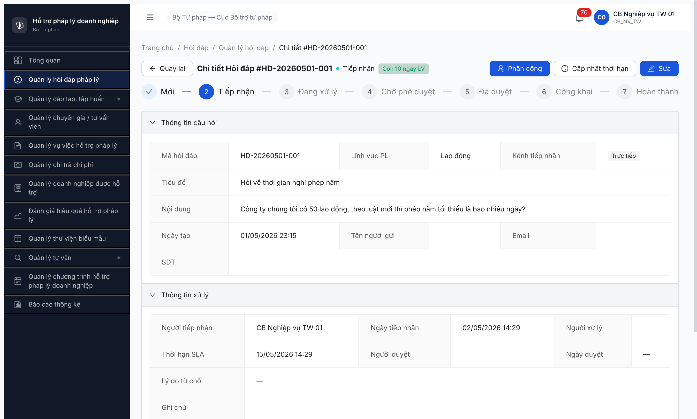
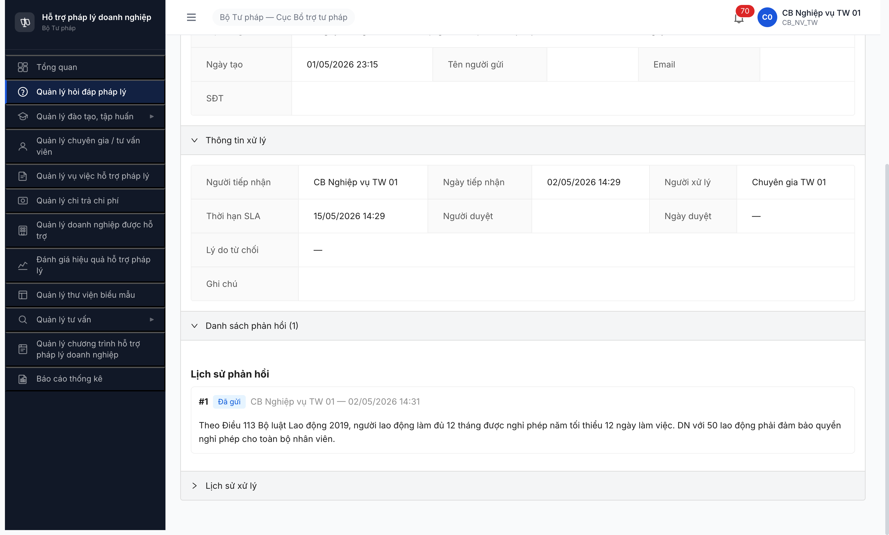
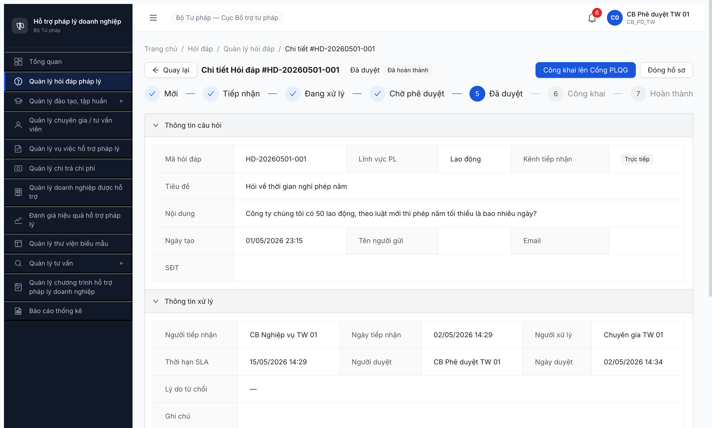
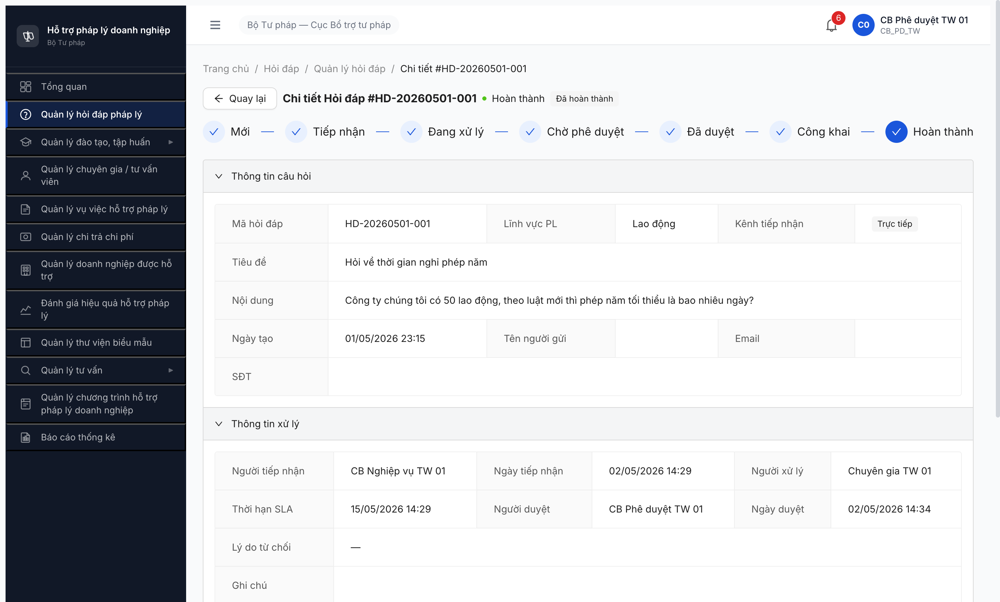
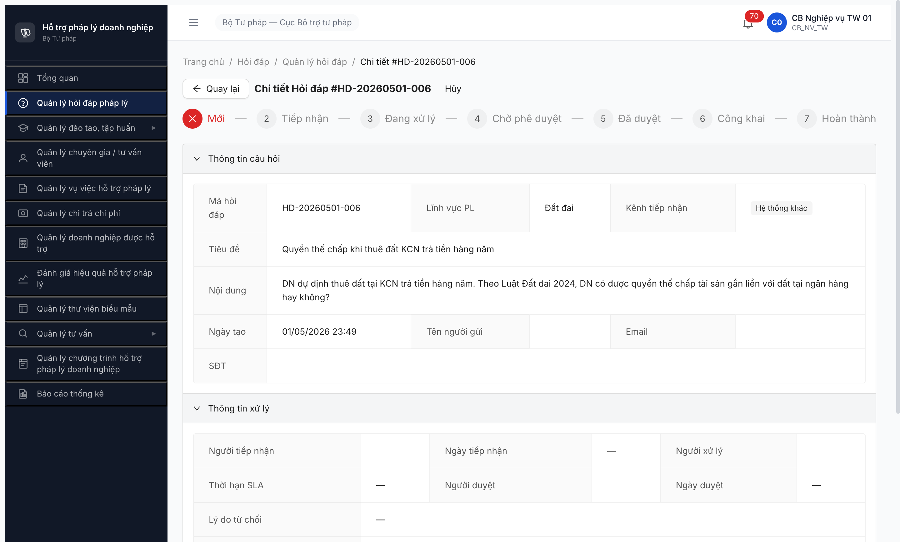

# Workflow Test Report — Hỏi đáp Pháp lý (FR-02)

> **Module:** Hỏi đáp Pháp lý (FR-02 · Nhóm II) · **SRS:** [`02-thu-tu-module.md §⑦ FR-02`](../../../../input/quy-trinh-nghiep-vu/02-thu-tu-module.md) · **Round:** R11 · **Date:** 2026-05-02 · **Tester:** QA Automation
> **Bug:** [`bug-report-flow-hoidap.md`](../bug-reports/bug-report-flow-hoidap.md)

---

## Kết luận

✅ **PASS-WITH-NOTE — 11/11 transition manual PASS**. Workflow E2E happy + reject + cancel chạy đúng SRS. 1 finding gap UI: dropdown chọn Mẫu phản hồi (SRS row "Khối Nội dung phản hồi" line 450) thiếu — app dùng 3 textarea freeform thay dropdown MAU_PHAN_HOI. Root cause: DM `MAU_PHAN_HOI` rỗng vì R6.1.5 chưa re-execute (chuyển vai trò seed sang `cb_nv_tw_01` theo SRS §3.4.2 + FR-II-NEW-02 Mô hình B; BUG-FUNC-MPH-001 cũ Closed/Invalid).

---

## R11 (LATEST) — 2026-05-02

**Accounts:** `cb_nv_tw_01` (Secret@123) · `cb_pd_tw_01` (Secret@123) · OTP `666666` bypass.
**Records test:** HD-20260501-001 (LV Lao động, TVV cg_tw_01) · HD-20260501-002 (LV Thuế, TVV cg_tw_05) · HD-20260501-006 (cancel).

### Bảng kiểm tra workflow

| # | Bước (transition) | Actor | Sample | Status | Bug / Note |
|:-:|---|---|---|:-:|---|
| 1 | `— → MOI` (UC10 nhập tay CMS) | cb_nv_tw_01 | HD-001..006 | ✅ | Seeded R6.3.1 — 6/6 PASS |
| 2 | `MOI → TIEP_NHAN` ([Tiếp nhận]) | cb_nv_tw_01 | HD-001 | ✅ | SLA 10 ngày LV auto-tính (2026-05-15) |
| 3 | `TIEP_NHAN → DANG_XU_LY` (Phân công UC15) | cb_nv_tw_01 | HD-001 → cg_tw_01<br>HD-002 → cg_tw_05 | ✅ | Modal SCR-II-03 OK. Suggest 2 candidates per LV. cg_tw_01 (LV LĐ) + cg_tw_05 (LV Thuế) |
| 4 | `DANG_XU_LY → DA_TRA_LOI` (tích "Đã trả lời") | cb_nv_tw_01 (đại diện) | HD-001 + HD-002 | ✅ | ERR-PH-01 enforce khi nội dung rỗng. Modal "Bạn không phải người được phân công" phụ trợ |
| 5 | `DA_TRA_LOI → CHO_PHE_DUYET` (System auto BR-FLOW-01) | System | HD-001 + HD-002 | ✅ | Auto-trigger ngay sau B4. Toast "hồ sơ chuyển sang Chờ phê duyệt" |
| 6 | `CHO_PHE_DUYET → DA_DUYET` ([Phê duyệt]) | cb_pd_tw_01 | HD-001 | ✅ | BR-AUTH-05 cùng cấp TW. Người duyệt + ngày duyệt update |
| 7 | `CHO_PHE_DUYET → DANG_XU_LY` ([Từ chối], lý do ≥10) | cb_pd_tw_01 | HD-002 | ✅ | BR-FLOW-04 enforce textarea bắt buộc. Lý do save vào field `ly_do_tu_choi` |
| 8 | `DA_DUYET → CONG_KHAI` ([Công khai lên Cổng PLQG]) | cb_pd_tw_01 | HD-001 | ✅ | Toast "Đã gửi yêu cầu đồng bộ lên Cổng PLQG" — push API outbound |
| 9 | `CONG_KHAI → DA_DUYET` ([Hủy công khai]) | cb_pd_tw_01 | HD-001 | ✅ | Toast "Phản hồi này sẽ bị gỡ khỏi Cổng PLQG" |
| 10 | `DA_DUYET / CONG_KHAI → HOAN_THANH` ([Đóng hồ sơ]) | cb_pd_tw_01 | HD-001 | ✅ | Toast "Đã đóng hồ sơ — chuyển sang trạng thái Hoàn thành". Read-only sau B10 |
| 11 | `MOI → HUY` ([Hủy hồ sơ]) | cb_nv_tw_01 | HD-006 | ✅ | Modal confirm "không thể tiếp nhận lại". Không cần lý do (SRS không yêu cầu) |

> Icon: ✅ pass · ❌ fail · ⏭ skip · 🚫 blocked · — chưa test

### Quan sát phụ (không vi phạm SRS)

- **Khối Nội dung phản hồi:** UI có 3 textarea (Nội dung phản hồi `*` / Văn bản pháp luật / Gợi ý cho doanh nghiệp). SRS line 450 chỉ có 1 textarea + dropdown `MAU_PHAN_HOI`. Dropdown MPH thiếu vì DM `MAU_PHAN_HOI` rỗng — R6.1.5 chuyển sang `cb_nv_tw_01` seed theo SRS §3.4.2 + FR-II-NEW-02 Mô hình B (chưa execute). Workflow vẫn chạy được do textarea freeform.
- **Modal "Bạn không phải người được phân công"** xuất hiện khi cb_nv_tw_01 (assigner, không phải `nguoi_xu_ly`) gửi phản hồi. Đúng SRS line 450 condition: "user là người được phân công xử lý **hoặc** CB NV cùng đơn vị". Modal là UX courtesy, không block.
- **Action [Công khai] / [Đóng hồ sơ]:** cb_pd_tw_01 cũng có quyền (verify trên HD-001). SRS line 478-480 actor = `cb_nv_<cap>_01 / cb_pd_<cap>_01` cho [Công khai], `cb_nv_<cap>_01` cho [Hủy công khai] và [Đóng]. Cb_pd làm cả 3 bước → pass theo SRS.

---

## Bằng chứng (R11 key states)







```text
B3 API call (verified network panel):
GET /api/v1/tu-van-viens?trangThai=HOAT_DONG&loaiTvv=...&linhVucIds=<UUID> → 200 (suggest list)

B4 ERR-PH-01 trigger (verified UI toast):
"Nội dung phản hồi không được để trống (ERR-PH-01)" — match SRS line 474

B7 lý do từ chối validation (verified):
Empty textarea → invalid="true" + helptext "Vui lòng nhập lý do từ chối." — match SRS BR-FLOW-04 (`ly_do ≥10 ký tự`)

B8 Cổng PLQG outbound:
Toast "Đã gửi yêu cầu đồng bộ lên Cổng PLQG. Đang xử lý..." — match SRS line 478 push API
```

---

## Lịch sử round

| Round | Date | Kết quả tóm tắt |
|---|---|---|
| R11 | 02/05 | PASS 11/11 transition. R6.4.A4 ✅. 1 note: dropdown MPH thiếu (DM rỗng — R6.1.5 chưa re-execute bằng `cb_nv_tw_01`) |

---

*R11 | QA Automation via Claude Code*
