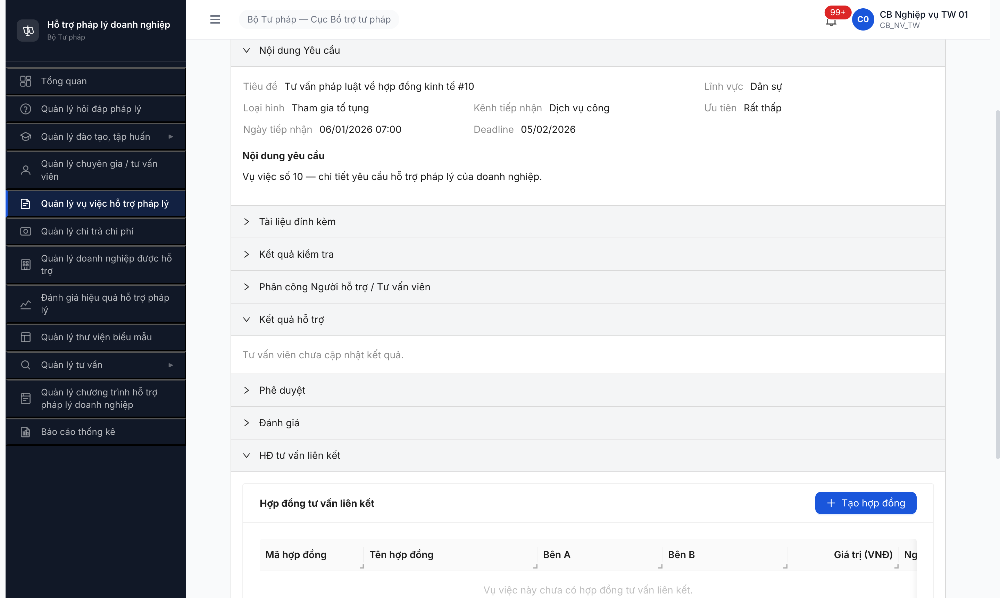
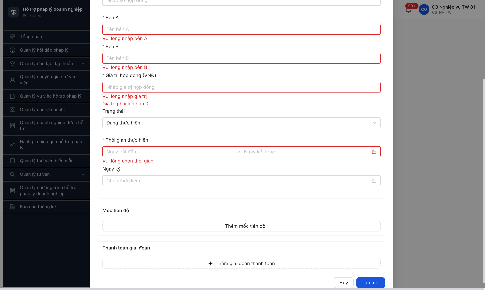
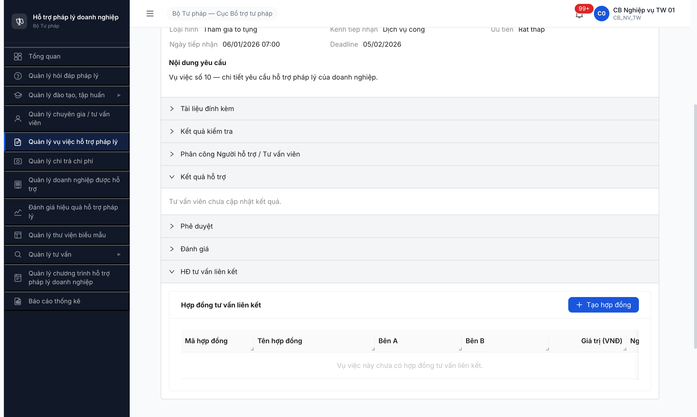
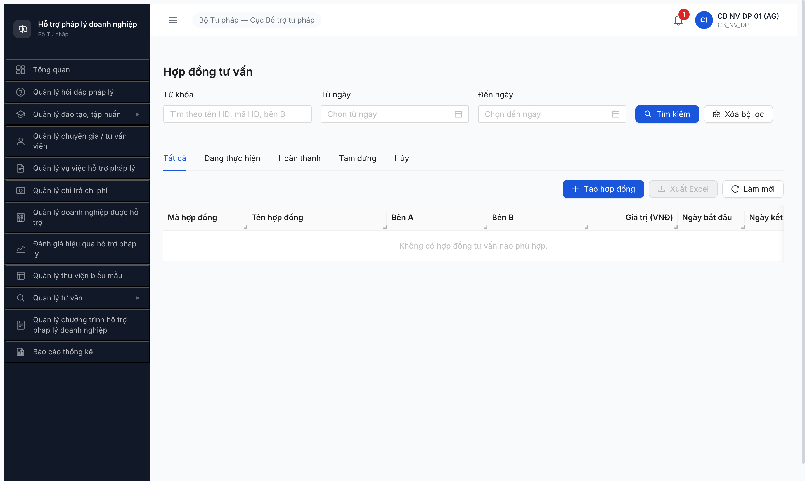
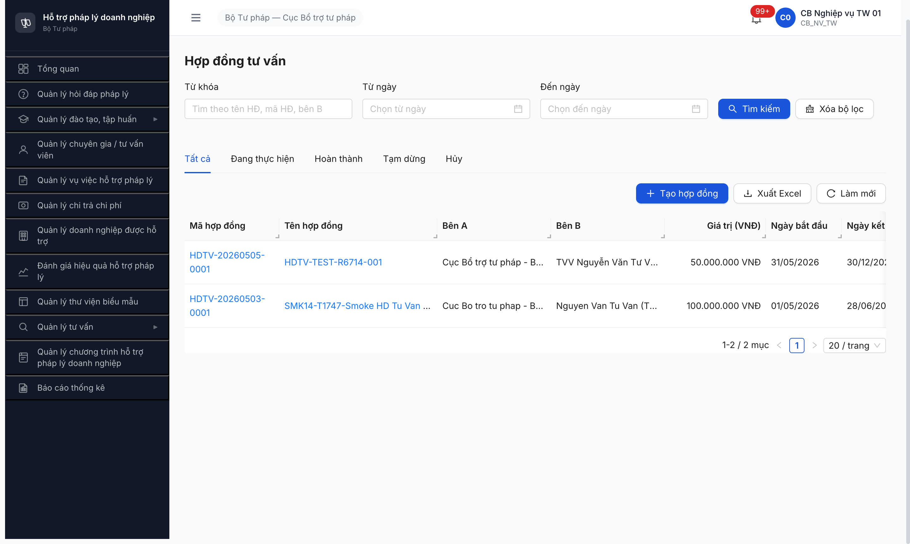

# Workflow Test Report — Hợp đồng Tư vấn (R6.7.14)

> **Module:** Quản lý Hợp đồng Tư vấn (FR-X.3-01 / FR-X.3-02 — UC163, UC163e) · **SRS:** [`srs-fr-14-hop-dong-tv.md`](../../../../input/srs-v3/srs-fr-14-hop-dong-tv.md) · **Round:** R6 · **Date:** 2026-05-05 · **Tester:** QA Automation (Claude Code via MCP Chrome DevTools)
> **Bug:** [`bug-report-flow-hop-dong.md`](../bug-reports/bug-report-flow-hop-dong.md)

---

## Verdict

⚠️ **PASS-WITH-NOTE — 5/9 step PASS, 4 bug Active.**

App có render section sub-resource v2.1 đúng vị trí (path 1 — VV detail). BE validate đúng các error code. Tuy nhiên FE thiếu hiển thị error message + thiếu FK link với VV/TVV → tab "HĐ tư vấn" trong TVV detail và section trong VV detail luôn empty.

> **TODO ambiguity SRS — cần BA confirm:** Path 2 spec v2.1 ghi "TVV detail MH-04.3 → tab 'Lịch sử' → HĐ" nhưng app render tab "HĐ tư vấn" RIÊNG (sibling với "Lịch sử hỗ trợ"). Cần BA xác nhận intent.

---

## R6 (LATEST) — 2026-05-05 09:35-09:50 — Path 1 + Path 2 + 5 error code + permission

### Accounts dùng

| Vai trò | Account | Đơn vị |
|---|---|---|
| CB NV TW | `cb_nv_tw_01` | BTP-TW (Cục BTTP) |
| CB NV ĐP | `cb_nv_dp_01` | STP-AG (Sở Tư pháp An Giang) |

### Bảng kiểm tra workflow

| # | Bước | Actor | Sample test | Status | Bug / Note |
|:-:|---|---|---|:-:|---|
| 1 | Path 1: Mở VV detail (VV000010) → render section "HĐ tư vấn liên kết" | cb_nv_tw_01 | VV000010 (Đang xử lý) | ✅ | Section render đầy đủ: header + button [Tạo hợp đồng] + table 10 cột + empty state |
| 2 | Path 1: Click [Tạo hợp đồng] → modal form render | cb_nv_tw_01 | — | ✅ | Modal render với 8 field + accordion Mốc tiến độ + Thanh toán giai đoạn |
| 3 | ERR-HDTV-01: Submit form trống → FE block + show "Vui lòng nhập tên hợp đồng" | cb_nv_tw_01 | Empty form | ✅ | Wording khác SRS (SRS: "Tên hợp đồng là bắt buộc") nhưng cùng intent — FE block, không POST |
| 4 | ERR-HDTV-05: giaTri=0 → FE block + show "Giá trị phải lớn hơn 0" | cb_nv_tw_01 | giaTri=0 | ✅ | FE validation client-side đúng |
| 5 | ERR-HDTV-03: Tổng TT (100M) > giá trị HĐ (50M) → BE return ERR-HDTV-03 | cb_nv_tw_01 | giaTri=50M, soTien=100M | ⚠️ | BE return 400 đúng SRS (`ERR-HDTV-03 — Tổng thanh toán vượt quá giá trị hợp đồng`). **Nhưng FE KHÔNG hiển thị toast/notification** → user click không thấy phản hồi → log `BUG-HDTV-001` |
| 6 | Happy path Create: form valid, submit → POST 201 + sinh mã HDTV-{YYYYMMDD}-{SEQ} | cb_nv_tw_01 | giaTri=50M, soTien=30M | ✅ | `HDTV-20260505-0001` sinh đúng BR-DATA-04. Response trả full entity |
| 7 | Verify HD vừa tạo có link về VV nguồn (VV010) | cb_nv_tw_01 | Re-mở VV010 → section HD | ❌ | Section vẫn hiển thị "Vụ việc này chưa có hợp đồng tư vấn liên kết." Payload POST không gửi `vuViecIds` → log `BUG-HDTV-002` |
| 8 | Path 2: TVV detail (TVV-BTP-TW-0001) → tab "HĐ tư vấn" | cb_nv_tw_01 | Nguyễn Văn Tư Vấn | ⚠️ | Tab tồn tại nhưng RIÊNG, không nested trong "Lịch sử". Tab empty: "Tư vấn viên này chưa có hợp đồng tư vấn nào." dù form Bên B đã ghi tên TVV → log `BUG-HDTV-003` |
| 9 | Permission scope đơn vị: cb_nv_dp_01 (AG) xem danh sách HD | cb_nv_dp_01 | URL /hop-dong-tv/danh-sach | ✅ | List trả empty (không thấy HDTV-20260505-0001 của TW). BE filter đơn vị đúng |
| 10 | Vi phạm SRS v2.1 §3: tồn tại menu/route `/hop-dong-tv/danh-sach` riêng | cb_nv_tw_01 | After Create | ❌ | Sau click [Tạo mới], app navigate sang `/hop-dong-tv/danh-sach` (page list độc lập) — vi phạm v2.1 "không còn là mục menu riêng" → log `BUG-HDTV-004` |

> Icon: ✅ pass · ❌ fail · ⚠️ pass-with-note · ⏭ skip

### Phát hiện R6

**1. UI sub-resource render đúng v2.1 (path 1):** VV detail có accordion "HĐ tư vấn liên kết" (collapsed default), expand → render đủ button + 10 cột table + empty state đúng tone "Vụ việc này chưa có hợp đồng tư vấn liên kết." → match SRS line 241 `Truy cap tu: (1) Chi tiet Vu viec MH-05.3 -> tab/section "HD tu van lien ket"`.

**2. BE validate sạch theo SRS Error Handling table:**
- `ERR-HDTV-03`: payload `soTien=100M, giaTri=50M` → BE response 400 `{"success":false,"error":{"code":"ERR-HDTV-03","message":"Tổng thanh toán vượt quá giá trị hợp đồng"}}` (verified reqid=363 + reqid=368). Match SRS line 158.

**3. Happy path Create endpoint:**
- `POST /api/v1/hop-dong-tu-vans` returns 201 + entity full (id UUID + maHopDong auto-gen + tienDoTt=0 + version=1).
- Sinh mã `HDTV-{YYYYMMDD}-{SEQ}` đúng BR-DATA-04.
- Response embed nested `mocTienDos`, `thanhToans` → backend support sub-entity inline (không cần endpoint riêng cho mốc/TT).

**4. Form sub-fields KHÔNG match SRS Inputs row 5/9/10/11/12:**
- Thiếu dropdown TVV (`tvv_id` FK) — UI là text input "Bên B" → free text, không link entity.
- Thiếu trường `noi_dung` (text long), `ghi_chu`, `file_dinh_kem` (multi upload), `vu_viec_ids` (multi-select VV).
- Có thêm field `Số hợp đồng`, `Trạng thái` (DANG_THUC_HIEN default), `Ngày ký` — không có trong SRS Inputs nhưng không phải bug (extra field hợp lý).

**5. Permission scope đơn vị đúng:** `cb_nv_dp_01` (AG) thấy danh sách HD trống, không leak HD `HDTV-20260505-0001` của TW. BE filter `donViId` đúng.

**6. Issue: ngay tao HDTV-20260503-0001 cũ tồn tại** (do smoke test session 2026-05-03). Cb_nv_tw_01 thấy 2 HD trong danh sách: `HDTV-20260505-0001` (test này) + `HDTV-20260503-0001` (smoke cũ). Cả 2 đều `Vụ việc: 0`.

### Bằng chứng R6

**#1 Path 1 — VV010 detail có section "HĐ tư vấn liên kết":**



**#3 ERR-HDTV-01 + ERR-HDTV-05 — FE block validation submit form trống:**



**#5 ERR-HDTV-03 BE response (reqid=368):**

```json
{
  "success": false,
  "error": {
    "code": "ERR-HDTV-03",
    "message": "Tổng thanh toán vượt quá giá trị hợp đồng",
    "timestamp": "2026-05-05T02:43:55.524Z",
    "requestId": "cd0fa6f7-1b85-4da4-b45a-9d87b4188040"
  }
}
```

**#6 Happy path Create — PASS, sinh mã HDTV-20260505-0001 (reqid=370):**

```json
{
  "success": true,
  "data": {
    "id": "d4f44e17-d044-4647-9efb-9b1114bcf58f",
    "maHopDong": "HDTV-20260505-0001",
    "tenHopDong": "HDTV-TEST-R6714-001",
    "giaTriHopDong": 50000000,
    "trangThai": "DANG_THUC_HIEN",
    "tienDoTt": 0,
    "donViId": "00000000-0000-4000-8000-000000000001",
    "version": 1,
    "thanhToans": [{"giaiDoan":"Giai đoạn 1","soTien":30000000,"trangThaiTt":"CHUA_THANH_TOAN"}]
  }
}
```

**#7 BUG — Section trong VV010 vẫn empty sau khi tạo HD:**



**#8 Path 2 — TVV detail tab "HĐ tư vấn" RIÊNG, empty:**


**#9 Permission OK — cb_nv_dp_01 (AG) thấy danh sách HD trống:**



**#10 BUG — Sau Create, app điều hướng sang menu/route riêng `/hop-dong-tv/danh-sach` (vi phạm v2.1):**



---

## Test scope còn lại — DEFER

| Item | Lý do defer |
|---|---|
| ERR-HDTV-02 (ngày bắt đầu > kết thúc) | Date picker UI block input invalid range (range picker validate 2 chiều). API direct test fail vì auth in-memory token (Bearer JWT không lưu localStorage). |
| ERR-HDTV-04 (xóa HD có VV liên kết) | Block bởi BUG-HDTV-002 — FE không gửi `vuViecIds` payload, không tạo được HD link VV qua UI. Cần dev fix BUG-002 trước hoặc seed manual qua DB. |
| Edit HD (PATCH/PUT) | Defer R7 — focus R6.7.14 happy path Create + 5 error code đã đủ scope tracker todo. |
| Delete HD không VV (soft delete) | Defer R7 — SRS Bước 7 BR-DATA-01. |
| Mốc tiến độ CRUD | Defer R7 — sub-entity test riêng. |

---

## Lịch sử round

| Round | Date | Kết quả tóm tắt |
|---|---|---|
| R6 | 05/05 | PASS-WITH-NOTE 5/9. Path 1 OK, BE validate đúng. 4 bug active (FE không show error + tạo HD không link VV/TVV + tồn tại menu riêng vi phạm v2.1). |

---

*R6 | QA Automation via Claude Code MCP Chrome DevTools | 2026-05-05 09:50*
