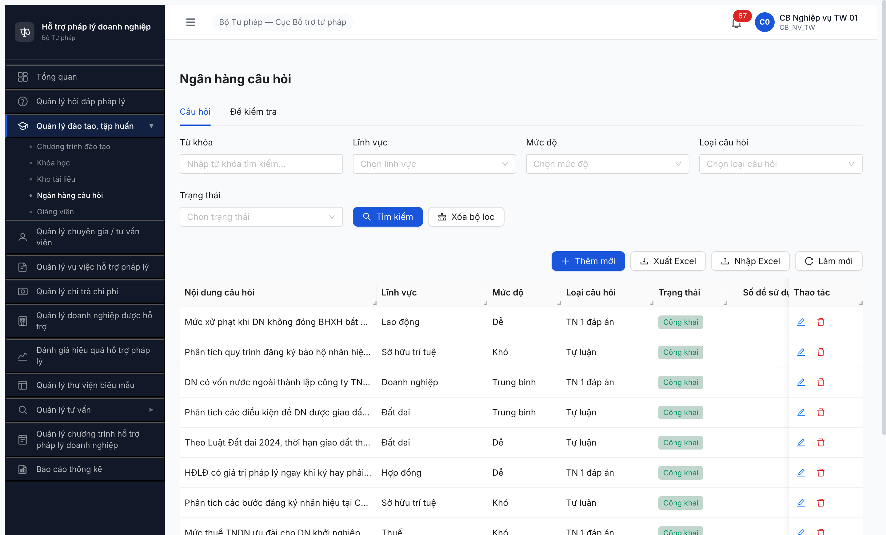
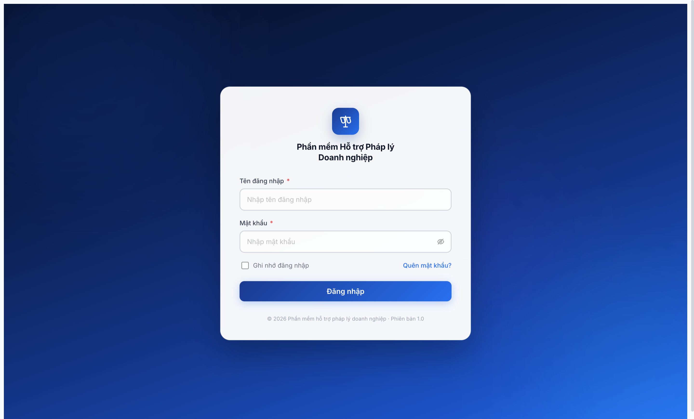
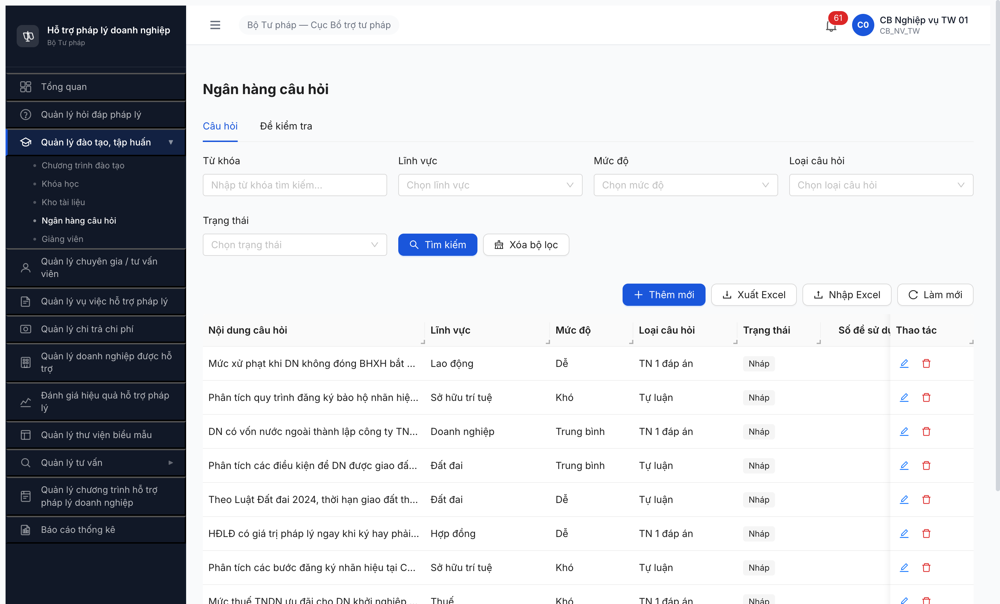

# Workflow Test Report — Ngân hàng câu hỏi (Publish Nháp → Công khai)

> **Module:** R6.4.B5b — Trụ B (Đào tạo) · **SRS:** [`FR-III-09 Quản lý ngân hàng câu hỏi`](../../../../input/srs-v3/srs-fr-03-dao-tao.md#L685) · **Round:** R6.4 · **Date:** 2026-05-02 · **Tester:** QA Automation (Claude Code MCP)
> **Bug:** Không có bug cần log — UI + API hoạt động đúng spec FR-III-09. Có **1 SRS ambiguity** (entity §3.4.3.21 vs FR-III-09 enum khác nhau) ghi ở mục "Lưu ý SRS" bên dưới.

---

## Kết luận

✅ **PASS — 10/10 NHCH transition `NHAP → CONG_KHAI`**. Per-filter downstream PASS toàn bộ (DE 4 / TRUNG_BINH 3 / KHO 3 / TRAC_NGHIEM_MOT 6 / TU_LUAN 4). UI list reload xác nhận trạng thái "Công khai" cho 10/10. Đồng thời unblock seed `NGAU_NHIEN` cho R6.3.8b ĐKT.

> **TODO ambiguity SRS:** Entity `NGAN_HANG_CAU_HOI` §3.4.3.21 row 9 quy định `trang_thai CHECK IN ('KICH_HOAT','VO_HIEU_HOA') DEFAULT 'KICH_HOAT'` ([srs-v3.md:1824](../../../../input/srs-v3/srs-v3.md#L1824)) nhưng FR-III-09 Inputs row 7 quy định `NHAP / CONG_KHAI / AN` ([srs-fr-03-dao-tao.md:710](../../../../input/srs-v3/srs-fr-03-dao-tao.md#L710)). BE + UI dùng enum FR-III-09. Cần BA confirm — nghi entity table copy-paste sai từ DANH_MUC. Không log bug, chỉ note để BA align.

---

## Bảng kiểm tra workflow

> Workflow NHCH publish chỉ có 1 transition `NHAP → CONG_KHAI` qua field `trang_thai` trong drawer Edit (FR-III-09 Inputs row 7). Không có button "Publish" riêng — dùng dropdown `Trạng thái` + nút `Cập nhật`. Bonus test: dropdown options.

| # | Bước (transition) | Actor | Sample test | Status | Bug / Note |
|:-:|---|---|---|:-:|---|
| 1 | Pre-check: `GET /api/v1/ngan-hang-cau-hois?trangThai=NHAP` trả 10 record | cb_nv_tw_01 | 10 IDs (seqId 1-10) | ✅ | — |
| 2 | UI: open Edit drawer, dropdown `Trạng thái` hiển thị 3 options (Nháp / Công khai / Ẩn) | cb_nv_tw_01 | seqId 10 (BHXH) | ✅ | Match FR-III-09 enum |
| 3 | API: `PATCH /api/v1/ngan-hang-cau-hois/{id}` body `{trangThai:'CONG_KHAI', version:N}` × 10 | cb_nv_tw_01 | 10/10 IDs | ✅ | Tất cả 200 OK, response `data.trangThai='CONG_KHAI'` |
| 4 | Verify `GET ?trangThai=NHAP` = 0 record | cb_nv_tw_01 | filter | ✅ | Pool Nháp đã rỗng |
| 5 | Verify `GET ?trangThai=CONG_KHAI` = 10 record | cb_nv_tw_01 | filter | ✅ | Pool Công khai full |
| 6 | Per-filter downstream: `?trangThai=CONG_KHAI&mucDo=DE` ≥ 1 | cb_nv_tw_01 | mucDo=DE | ✅ | 4 record |
| 7 | Per-filter downstream: `?trangThai=CONG_KHAI&mucDo=TRUNG_BINH` ≥ 1 | cb_nv_tw_01 | mucDo=TRUNG_BINH | ✅ | 3 record |
| 8 | Per-filter downstream: `?trangThai=CONG_KHAI&mucDo=KHO` ≥ 1 | cb_nv_tw_01 | mucDo=KHO | ✅ | 3 record |
| 9 | Per-filter downstream: `?trangThai=CONG_KHAI&loaiCauHoi=TRAC_NGHIEM_MOT` ≥ 1 | cb_nv_tw_01 | loai=TN1 | ✅ | 6 record |
| 10 | Per-filter downstream: `?trangThai=CONG_KHAI&loaiCauHoi=TU_LUAN` ≥ 1 | cb_nv_tw_01 | loai=TL | ✅ | 4 record |
| 11 | UI list reload: 10/10 row hiển thị badge "Công khai" | cb_nv_tw_01 | full list | ✅ | Screenshot inline |

> Icon: ✅ pass · ❌ fail · ⏭ skip (defer external/cron) · 🚫 blocked (cascade upstream) · — chưa test

---

## Per-filter verify cho NGAU_NHIEN ĐKT downstream

| Filter (R6.3.8b ĐKT cần) | Count CONG_KHAI | Pass (≥1) |
|---|:---:|:---:|
| `mucDo=DE` | 4 | ✅ |
| `mucDo=TRUNG_BINH` | 3 | ✅ |
| `mucDo=KHO` | 3 | ✅ |
| `loaiCauHoi=TRAC_NGHIEM_MOT` | 6 | ✅ |
| `loaiCauHoi=TU_LUAN` | 4 | ✅ |
| Tổng CONG_KHAI | 10 | ✅ |

→ R6.3.8b NGAU_NHIEN config đủ pool theo `mucDo` matrix (DE/TB/KHO mỗi mức ≥1 → random_config sẽ chạy). Unblock confirmed.

---

## Lịch sử round

| Round | Date | Kết quả tóm tắt (1 dòng) |
|---|---|---|
| R6.3.8a | 2026-05-02 10:06 | Seed 10 NHCH state Nháp PASS (R6.3.8a) |
| R6.4.B5b | 2026-05-02 10:42 | Publish 10/10 → Công khai PASS qua API + verify UI |

---

## Bằng chứng

**1. UI list — 10/10 entries badge "Công khai" sau publish**



**2. Edit drawer — Trạng thái dropdown 3 options (Nháp/Công khai/Ẩn)**



**3. State trước publish — UI list 10/10 trạng thái "Nháp"**



---

## API request/response — đại diện (seqId=10)

```http
POST /api/v1/auth/refresh                        → 200, accessToken (HttpOnly cookie sticky)

PATCH /api/v1/ngan-hang-cau-hois/63ab812a-fef9-4f9e-b7b5-0a212ccfbee0
Authorization: Bearer <token>
Content-Type: application/json

{ "trangThai": "CONG_KHAI", "version": 2 }

→ 200 { "success": true, "data": { ..., "trangThai": "CONG_KHAI", "version": 3 } }
```

**Optimistic locking:** PATCH yêu cầu field `version` (số hiện tại của entity). Thiếu `version` → 422 `ERR-VAL-SYS-00-01 "version must be a number conforming to the specified constraints"`. Không phải bug, là design BE.

**PUT /api/v1/ngan-hang-cau-hois/{id}:** trả 404 `ERR-SYS-00-04-01 "Cannot PUT ..."` — BE chỉ expose PATCH cho update partial. Không phải bug.

---

## Lưu ý vận hành (không bug)

1. **JWT revoke aggressive ~2 phút** (memory `qa_htpldn_jwt_revoke_aggressive` known pattern). Workaround: chain refresh + list + PATCH × 10 trong **1 evaluate_script** để token còn hiệu lực.
2. **Không có button "Publish" riêng** — workflow `Nháp → Công khai` đi qua field `Trạng thái` trong drawer Edit hoặc PATCH API. Khớp với SRS (FR-III-09 Inputs row 7 cho phép `trang_thai` là field input editable). Không phải bug, là UX choice — BA confirm nếu cần button publish dedicated.
3. **Không có confirm dialog khi publish** — đổi `Trạng thái` xong bấm `Cập nhật` là apply ngay. SRS không yêu cầu confirm step → không phải bug.

---

*R6.4.B5b | QA Automation via Chrome DevTools MCP | 2026-05-02 10:42*
