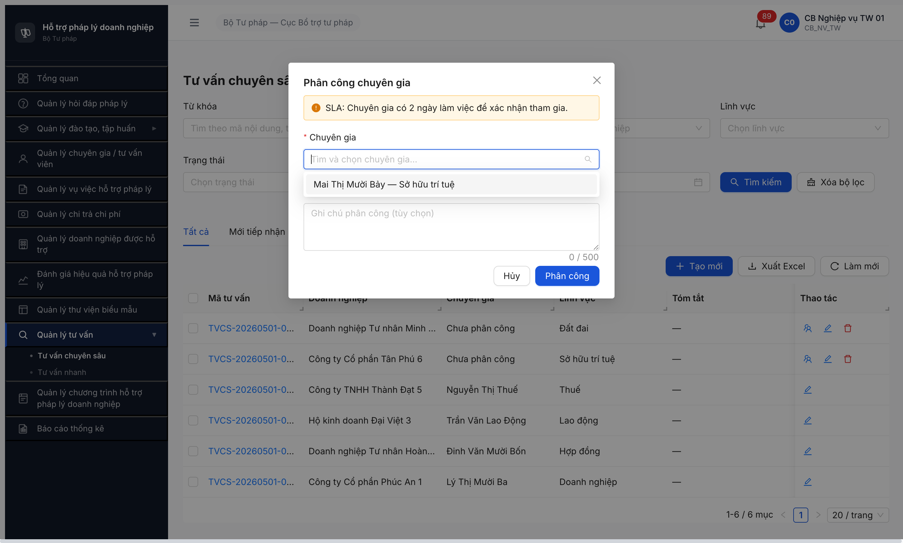
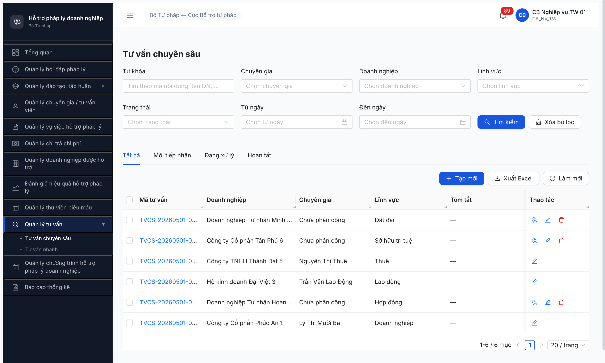
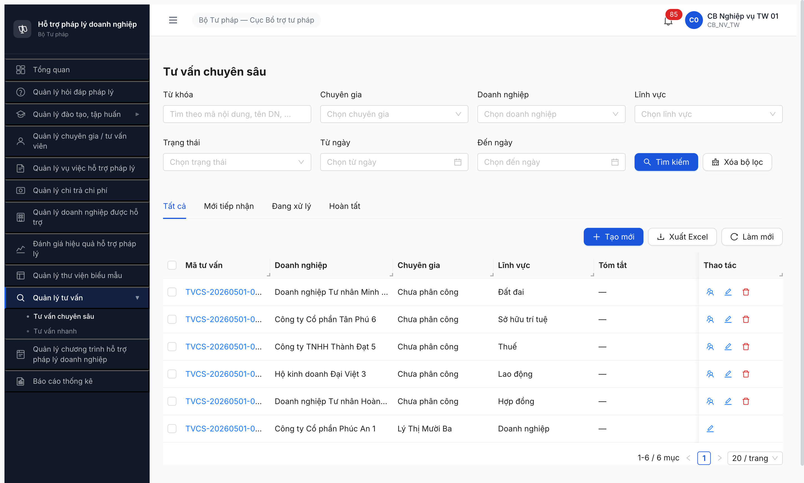

# Workflow Test Report — Tư vấn Chuyên sâu (FR-12)

> **Module:** Tư vấn Chuyên sâu (FR-12 · Nhóm X.1) · **SRS:** [`srs-fr-12-tv-chuyen-sau.md`](../../../../input/srs-v3/srs-fr-12-tv-chuyen-sau.md) + [`02-thu-tu-module.md §⑧ FR-12`](../../../../input/quy-trinh-nghiep-vu/02-thu-tu-module.md) · **Round:** R17 · **Date:** 2026-05-04 · **Tester:** QA Automation
> **Bug:** [`bug-report-flow-tvcs.md`](../bug-reports/bug-report-flow-tvcs.md) · **Observations:** [`observations-flow-tvcs.md`](../bug-reports/observations-flow-tvcs.md)

---

## Kết luận R17 (LATEST — TVCS-002 FIXED, FK gap còn)

⚠️ **PARTIAL 3/11 PASS — bug TVCS-002 đã fix.** Improvement vs R15/R16 (2/11 PASS). Bug button [Hủy yêu cầu] đã landed:

- ✅ **B10 PASS:** Login `cb_nv_tw_01` → TVCS-20260501-0001 (PHAN_CONG) → button "Hủy yêu cầu" hiện ở footer (style outline đỏ). Click → modal "Hủy nội dung tư vấn" với field "Lý do hủy" required (max 1000) + 2 button [Quay lại]/[Xác nhận hủy]. Nhập lý do → submit → toast "Nội dung tư vấn đã bị hủy" + state badge `Phân công → Hủy`, field Trạng thái cập nhật. Transition B10 đúng SRS line 541 + 1199. **BUG-FUNC-TVCS-002 → CLOSED.**
- ❌ **FK gap chưa fix:** `cg_tw_01` GET `/api/v1/noi-dung-tu-van-cs?page=1&pageSize=20` HTTP 200 trả `{"data":[],"meta":{"total":0}}`. Inbox CG vẫn rỗng. B3/B4/B6/B11 giữ BLOCKED.

**Verdict R17:** 3/11 PASS (B1+B2 6/6 LV, B10), 4 BLOCKED (B3/B4/B6/B11 do FK), 2 BLOCKED cascade (B8/B9), 2 EXTERNAL (B5/B7).

**Pool impact R17:** TVCS-20260501-0001 đã chuyển state `PHAN_CONG → HUY` (terminal) sau test B10. Còn 5 TVCS state PHAN_CONG (TVCS-0002..0006) sample test khác. R14 thêm TVCS-20260504-0001 BG (do test session khác).

Evidence R17:
- [r17-a5-tvcs-0001-cancel-btn-fixed.png](../screenshots/r17-a5-tvcs-0001-cancel-btn-fixed.png) — Detail TVCS-0001 PHAN_CONG với button [Hủy yêu cầu] outline đỏ ở footer
- [r17-a5-tvcs-0001-cancel-modal-filled.png](../screenshots/r17-a5-tvcs-0001-cancel-modal-filled.png) — Modal "Hủy nội dung tư vấn" với field Lý do hủy đã nhập
- [r17-a5-tvcs-0001-state-huy-success.png](../screenshots/r17-a5-tvcs-0001-state-huy-success.png) — Sau submit: state badge "Hủy" + banner "Nội dung tư vấn đã bị hủy"

```text
=== R17 B10 transition trace (cb_nv_tw_01, 2026-05-04 23:25) ===
Pre-state: TVCS-20260501-0001 PHAN_CONG, CG=Lý Thị Mười Ba
Action: Click [Hủy yêu cầu] → Modal mở → fill "Lý do hủy" → click [Xác nhận hủy]
Post-state: TVCS-20260501-0001 HUY (terminal)
UI: stepper biến mất, button [Hủy yêu cầu] biến mất, banner success.

=== R17 FK gap probe (cg_tw_01 token fresh) ===
GET /api/v1/noi-dung-tu-van-cs?page=1&pageSize=20
HTTP 200 → {"data":[],"meta":{"total":0}}
→ FK gap chưa fix
```

---

## Kết luận R16

❌ **FAIL — không có thay đổi vs R15.** Dev claim fix lần 2 nhưng cả 2 vấn đề vẫn nguyên:

- **BUG-FUNC-TVCS-002 (Major) chưa fix:** Login `cb_nv_tw_01` → mở detail TVCS-20260501-0001 (PHAN_CONG) → expand cả 5 accordion → DOM scan 0 button match `/Hủy/i`. Main area chỉ có 1 button "Quay lại danh sách" + 5 accordion header. Cải tiến nhỏ: label "Hình thức" hiện "Hồ sơ" thay vì "HO_SO" — không phải bug fix.
- **FK gap chưa fix:** Login `cg_tw_01` → API `GET /api/v1/noi-dung-tu-van-cs?page=1&pageSize=20` HTTP 200 trả `{"data":[],"meta":{"total":0}}`. Inbox CG vẫn rỗng → B3/B4/B6/B11 giữ BLOCKED.

R16 verdict giống R15: 2/11 PASS (B1+B2 6/6 LV), 1 FAIL UI (B10), 6 BLOCKED (B3/B4/B6/B8/B9/B11), 2 EXTERNAL (B5/B7).

Evidence R16:
- [r16-a5-tvcs-0001-detail-still-no-cancel-btn.png](../screenshots/r16-a5-tvcs-0001-detail-still-no-cancel-btn.png) — Detail TVCS-0001 PHAN_CONG, 5 accordion expanded, không có button [Hủy yêu cầu]

```text
=== R16 FK gap probe (cg_tw_01 token fresh, 2026-05-04 22:14) ===
GET /api/v1/noi-dung-tu-van-cs?page=1&pageSize=20
HTTP 200
{"success":true,"data":[],"meta":{"page":1,"pageSize":20,"total":0,"totalPages":0}}
→ Inbox CG vẫn rỗng (FK tai_khoan_id chưa link)
```

---

## Kết luận R15

❌ **FAIL — không có thay đổi vs R14.** Dev claim fix nhưng cả 2 vấn đề chính giữ nguyên:

- **BUG-FUNC-TVCS-002 (Major) chưa fix:** Login `cb_nv_tw_01` → mở detail TVCS-20260501-0001 (PHAN_CONG) → DOM scan 0 button match `/Hủy/i`, main area chỉ có 1 button "Quay lại danh sách". Bug giữ Open.
- **FK gap chưa fix:** Login `cg_tw_01` → `/tv-chuyen-sau/danh-sach` → "Không có nội dung tư vấn chuyên sâu nào." API `GET /api/v1/noi-dung-tu-van-cs?page=1&pageSize=20` trả `{"data":[],"meta":{"total":0}}`. JWT permissions có `read_noi_dung_tu_van_cs` (= filter data, không phải perm). Inbox vẫn rỗng → B3/B4/B6/B11 giữ BLOCKED.

R15 verdict giống R14: 2/11 PASS (B1+B2 6/6 LV), 1 FAIL UI (B10), 6 BLOCKED (B3/B4/B6/B8/B9/B11), 2 EXTERNAL (B5/B7).

Evidence R15:
- [r15-a5-tvcs-0001-detail-still-no-cancel-btn.png](../screenshots/r15-a5-tvcs-0001-detail-still-no-cancel-btn.png)
- [r15-a5-cg-tw-01-inbox-still-empty.png](../screenshots/r15-a5-cg-tw-01-inbox-still-empty.png)

---

## Kết luận R14

⚠️ **PARTIAL 2/11 PASS** + 1 FAIL UI + 6 BLOCKED + 2 EXTERNAL. B2 mở rộng coverage **6/6 LV** (DN/HĐ/LĐ/Thuế/SHTT/ĐĐ).

**Test coverage thực tế R14 verify (Wave 1 — không cần dev fix):**
- ✅ **2 PASS:** B1 seed (R6.3.3) + B2 phân công CG (R14 thêm 3 cycle HĐ/SHTT/ĐĐ → tổng 6/6 LV cover end-to-end).
- ❌ **1 FAIL UI:** B10 thiếu button [Hủy yêu cầu] — **BUG-FUNC-TVCS-002 Major** (vi phạm `srs-fr-12 line 933` + `line 1199`). Chưa re-verify R14, giữ status R13.
- 🚫 **4 BLOCKED data setup gap:** B3/B4/B6/B11 — FK `TU_VAN_VIEN.tai_khoan_id` chưa link cho 6 cg_tw. KHÔNG phải bug app (SRS `srs-fr-04 line 1057` FK Nullable=Y, không có UC link FK qua UI). Xem [OBS-FLOW-TVCS-003](../bug-reports/observations-flow-tvcs.md).
- 🚫 **2 BLOCKED cascade:** B8/B9 dep B6/B7 (cần state CHO_PHE_DUYET).
- ⏭ **2 EXTERNAL out of CMS scope:** B5 cron auto-banner (System) + B7 system auto BR-FLOW-01 (BE).

---

## Bảng kiểm tra workflow R14 — đầy đủ 11 transition theo SRS

| # | Bước (transition) | Actor | Sample | Status | Note |
|:-:|---|---|---|:-:|---|
| 1 | `— → TIEP_NHAN` (UC147 nhập tay CMS) | cb_nv_tw_01 | TVCS-0001..0006 | ✅ | Seed R6.3.3 cover 6 LV |
| 2 | `TIEP_NHAN → PHAN_CONG` ([Phân công CG]) | cb_nv_tw_01 | TVCS-0001..0006 | ✅ | **R14 hoàn tất 6/6 LV.** 6 cycle PASS: DN→TVV-0009, HĐ→TVV-0010, LĐ→TVV-0013, Thuế→TVV-0014, SHTT→TVV-0011, ĐĐ→TVV-0012. Toast "Đã phân công chuyên gia" mỗi lần. Dropdown filter `loaiTvv=CG ∧ trangThai=DANG_HOAT_DONG ∧ linhVucIds` đúng SRS line 533. |
| 3 | `PHAN_CONG → DANG_TU_VAN` ([Chấp nhận]) | cg_tw_01 | TVCS-0001 | 🚫 | **BLOCKED data gap.** cg_tw_01 login OK + role CG nhưng inbox TVCS rỗng (`GET /api/v1/noi-dung-tu-van-cs` BE filter theo FK `tai_khoan_id` = NULL). Xem [OBS-FLOW-TVCS-003](../bug-reports/observations-flow-tvcs.md). |
| 4 | `PHAN_CONG → TIEP_NHAN` ([Từ chối] CG) | cg_tw_01 | TVCS-0001/0003/0004 | 🚫 | Same data gap as B3 |
| 5 | `PHAN_CONG → banner cảnh báo` (Auto cron 2 ngày LV) | System | — | ⏭ | External cron BE — out of CMS test scope. SRS line 537 spec rõ "System". |
| 6 | `DANG_TU_VAN → HOAN_THANH` (CG tích HT + ≥1 file VB TVPL) | cg_tw_01 | — | 🚫 | Cascade dep B3 — không reach DANG_TU_VAN |
| 7 | `HOAN_THANH → CHO_PHE_DUYET` (Auto BR-FLOW-01) | System | — | ⏭ | System auto BE — out of CMS UI scope. Verified gián tiếp qua A4 HD R11 BR-FLOW-01 PASS. |
| 8 | `CHO_PHE_DUYET → DA_DUYET` ([Phê duyệt]) | cb_pd_tw_01 | — | 🚫 | Cascade dep B6/B7 — không reach CHO_PHE_DUYET. cb_pd_tw_01 ready (verified A4 HD R11). |
| 9 | `CHO_PHE_DUYET → DANG_TU_VAN` ([Từ chối] lý do ≥10) | cb_pd_tw_01 | — | 🚫 | Cascade dep B6/B7 |
| 10 | `PHAN_CONG → HUY` ([Hủy yêu cầu], guard CG chưa xác nhận) | cb_nv_tw_01 | TVCS-0001 | ✅ | **R17 PASS.** Button [Hủy yêu cầu] xuất hiện đúng footer detail PHAN_CONG. Click → modal "Hủy nội dung tư vấn" với field "Lý do hủy" required → submit thành công → state PHAN_CONG → HUY + banner "Nội dung tư vấn đã bị hủy". BUG-FUNC-TVCS-002 closed. |
| 11 | `DANG_TU_VAN → HUY` (DN yêu cầu hủy + cb_pd duyệt) | cb_nv + cb_pd + Portal DN | — | 🚫 | Cascade dep B3 + Portal DN external (out of CMS scope) |

> Icon: ✅ pass · ❌ fail (UI gap, SRS đã spec) · ⏭ skip (external cron / system auto) · 🚫 blocked (data setup gap hoặc cascade upstream)

---

## Per-LV coverage B2 (R14 hoàn tất 6/6)

| LV | TVCS sample | CG khả dụng (DANG_HOAT_DONG ∧ loaiTvv=CG) | Status B2 |
|---|---|---|:-:|
| Doanh nghiệp | TVCS-0001 | TVV-0009 (Lý Thị Mười Ba) | ✅ verified end-to-end (R12) |
| Hợp đồng | TVCS-0002 | TVV-0010 (Đinh Văn Mười Bốn) | ✅ verified end-to-end (R14) |
| Lao động | TVCS-0003 | TVV-0013 (Trần Văn Lao Động — bonus seed R12) | ✅ verified end-to-end (R13) |
| Thuế | TVCS-0004 | TVV-0014 (Nguyễn Thị Thuế — bonus seed R12) | ✅ verified end-to-end (R13) |
| Sở hữu trí tuệ | TVCS-0005 | TVV-0011 (Mai Thị Mười Bảy) | ✅ verified end-to-end (R14) |
| Đất đai | TVCS-0006 | TVV-0012 (Hồ Văn Mười Tám) | ✅ verified end-to-end (R14) |

**Pool CG đầy đủ: 6/6 LV cover. B2 acceptance đạt 100%.**

---

## Phương án xử lý (để A5 PASS 9/11)

1. **Dev script DB link FK** `tai_khoan_id` cho 6 cg_tw_01..06 ↔ TVV-0009..0014 (giống đã làm cho NHT R6.2.8). Không cần code app, ~1h dev work. Sau bước này: B3/B4/B6/B11 unblock.
2. **Dev fix BUG-FUNC-TVCS-002** — bổ sung button `[Hủy yêu cầu]` trên detail TVCS state PHAN_CONG (đúng srs-fr-12 line 933) + modal confirm + lý do. Sau: B10 PASS-able.
3. **Re-test A5 R14** với 9/11 transition (loại trừ 2 external B5+B7):
   - 6 cycle B2 cover 6/6 LV (DN/HĐ/SHTT/ĐĐ + LĐ/Thuế bonus)
   - 4 cycle B3-B6-B7-B8 (TVCS-0001 happy path full)
   - 1 cycle B4 (CG từ chối)
   - 1 cycle B9 (cb_pd từ chối phê duyệt)
   - 1 cycle B10 (cb_nv hủy guard)
   - 1 cycle B11 (DN yêu cầu hủy + cb_pd duyệt — cần Portal DN seed)

---

## Bằng chứng R14





```text
B2 R14 (3 cycle HĐ/SHTT/ĐĐ — append vs R13):
GET /api/v1/tu-van-viens?pageSize=100&trangThai=DANG_HOAT_DONG&loaiTvv=CG&linhVucIds=efd984f2-...  [200]
→ Mỗi cycle dropdown render đúng 1 CG khớp LV (filter SRS line 533).
POST /api/v1/noi-dung-tu-van-cs/{id}/phan-cong { chuyenGiaId } → HTTP 200
Toast: "Đã phân công chuyên gia" × 3 lần
State 3 TVCS chuyển TIEP_NHAN → PHAN_CONG, cột Chuyên gia hiện đúng tên CG.

B3/B4/B6/B11 (BLOCKED data gap — chưa retest R14, status giữ R13):
cg_tw_01 inbox TVCS rỗng do FK TU_VAN_VIEN.tai_khoan_id = NULL.
Cần dev script DB link FK 6 cg_tw ↔ TVV-0009..0014 (như R6.2.8 đã làm cho NHT).

B10 (FAIL UI — chưa retest R14, status giữ R13):
DOM scan: 0 button match /Hủy/i trên detail TVCS PHAN_CONG.
SRS srs-fr-12 line 933 + line 1199: button [Hủy yêu cầu] + transition PHAN_CONG→HUY actor CB NV guard "CG chưa xác nhận".
```

---

## Lịch sử round

| Round | Date | Kết quả tóm tắt |
|---|---|---|
| R17 | 04/05 | ⚠️ Retest sau dev claim fix lần 3 — TVCS-002 button [Hủy yêu cầu] FIXED. Click + modal + submit + transition PHAN_CONG→HUY end-to-end PASS. 3/11 PASS (B1+B2+B10). FK gap chưa fix → B3/B4/B6/B11 giữ BLOCKED. |
| R16 | 04/05 | ❌ Retest sau dev claim fix lần 2 — VẪN không fix. Button [Hủy yêu cầu] vẫn 0 sau khi expand 5 accordion. FK gap cg_tw_01 inbox `data:[]` total=0. Cải tiến nhỏ: label "Hình thức" thân thiện hơn (HO_SO → Hồ sơ). Verdict giữ R15. |
| R15 | 04/05 | ❌ Retest sau dev claim fix — KHÔNG fix. BUG-TVCS-002 button [Hủy yêu cầu] vẫn 0 trên detail PHAN_CONG. FK gap vẫn nguyên (cg_tw_01 inbox `data:[]`). Verdict giữ R14: 2/11 PASS, 1 FAIL UI, 6 BLOCKED, 2 EXTERNAL. |
| R14 | 02/05 | ⚠️ Wave 1 — B2 cover 6/6 LV (thêm 3 cycle HĐ/SHTT/ĐĐ). B3/B4/B6/B10/B11 giữ status R13 (chờ dev fix FK + button [Hủy yêu cầu]). |
| R13 | 02/05 | ⚠️ Re-verify FK gap + B10 button — không có thay đổi vs R12. Final: 2 PASS / 1 FAIL UI / 6 BLOCKED / 2 EXTERNAL. |

---

# Lifecycle archive — older rounds

## R13 — archived

⚠️ **PARTIAL 2/11 PASS** + 1 FAIL UI + 6 BLOCKED + 2 EXTERNAL.

**Test coverage R13:**
- ✅ B1 seed (R6.3.3) + B2 phân công CG (3 cycle DN/LĐ/Thuế end-to-end).
- ❌ B10 thiếu button [Hủy yêu cầu] — BUG-FUNC-TVCS-002 Major.
- 🚫 B3/B4/B6/B11 — FK gap (data setup, không phải bug app).
- 🚫 B8/B9 cascade dep B6/B7.
- ⏭ B5/B7 external (cron + system auto BR-FLOW-01).

**Bằng chứng R13:**



![R13 — Detail TVCS-0001 PHAN_CONG: stepper 6 bước nhưng KHÔNG có button [Hủy yêu cầu]](../screenshots/r6-tvcs-0001-detail-no-cancel-btn.png)

---

*R17 | QA Automation via Claude Code*
