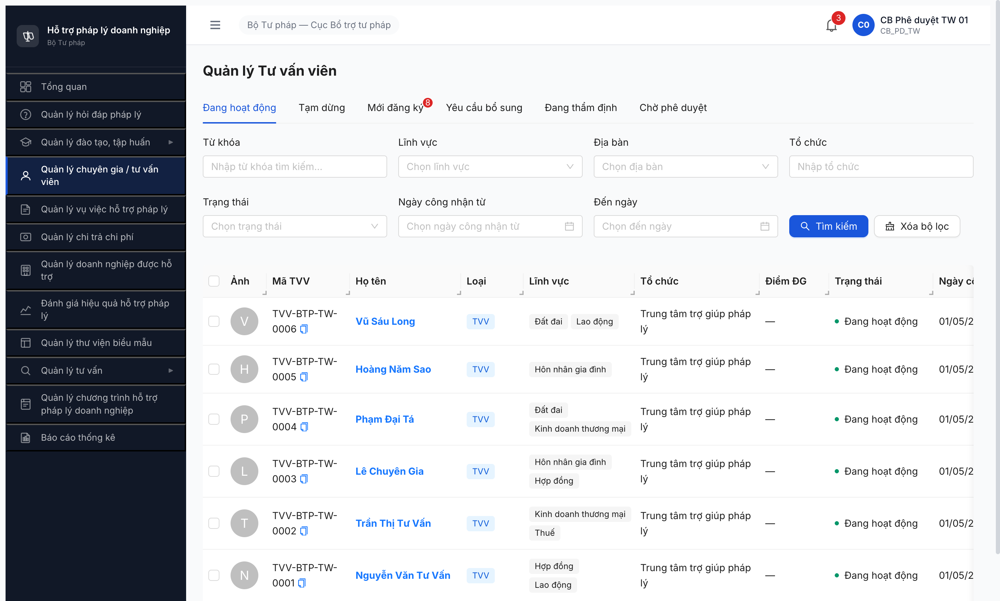

# Workflow Test Report — Tư vấn viên (R6.4.A1)

> **Module:** Quản lý CG/TVV (M4) · **SRS:** [`02-thu-tu-module.md §FR-04 SM-TVV`](../../../../input/quy-trinh-nghiep-vu/02-thu-tu-module.md) · **Round:** R6 · **Date:** 2026-05-01 · **Tester:** QA Automation (Claude Code via MCP Chrome DevTools)
> **Bug:** không log bug mới — gặp pre-existing `qa_htpldn_jwt_revoke_aggressive`

---

## Verdict

🟢 **PASS 10/10 transition CMS-scope (100%) — 2/12 transition còn lại Out of Scope CMS** (B7+B8 SRS spec qua chuyên trang/Portal Cổng PLQG, không phải CMS HTPLDN — verified với SRS local FR-IV-11 + NotebookLM). Pool active 6/6 TVV final. Cần test B7+B8 riêng trên Portal khi available.

→ **Unblock:** R6.4.A1.5 (PC Đợt 2 TVV) + R6.4.A3 (VV phân công) — pool có 6 TVV `DANG_HOAT_DONG` (TW-0001..0006) đủ điều kiện FK + filter.

### Multi-account actor verification (2026-05-01 23:15-23:50)

Tested 4 account types qua isolatedContext riêng:

| Account | Role | Sidebar Quản lý CG/TVV | Direct URL CG/TVV detail | Note |
|---|---|:-:|---|---|
| `cb_nv_tw_01` (CB NV TW) | CB_NV_TW | ✅ Full access | ✅ Full edit + transition | Owner workflow A1 |
| `cb_pd_tw_01` (CB PD TW) | CB_PD_TW | ✅ Full access | ✅ Phê duyệt/Từ chối | Owner workflow A1 |
| `cb_nv_dp_02` (CB NV ĐP/BG) | CB_NV_DP | ✅ Access scope BG | ✅ Edit NHT-BG (cùng đơn vị) | Verified advance NHT-STP-BG-0018 → YCBS DB (extra coverage) |
| `tvv_01` (TVV ĐP/AG) | TVV | ✅ List view | ❌ Toast "Bạn không có quyền truy cập dữ liệu của đơn vị khác" khi access TVV TW; form chinh-sua mở blank không load data | Scope filter ĐP-only |
| `nht_01` / `nht_02` (NHT ĐP) | NHT | ❌ Sidebar không có module | ❌ /403 "Bạn không có quyền truy cập" | NHT role hoàn toàn không có quyền module CG/TVV |

**Kết luận B7+B8 (verified SRS local + NotebookLM `e3a2681b` 2026-05-01 23:55):**

Theo SRS HTPLDN:

1. **FR-IV-03 (UC41) — Đăng ký:** "Màn hình: **SCR-IV-02 (chuyên trang)**" + "Preconditions: NHT đã đăng nhập trên **chuyên trang**" (quote nguyên văn).
2. **FR-IV-11 (UC49) — NHT cập nhật hồ sơ:** "Màn hình: **SCR-IV-02 (chuyên trang)**" — Acceptance Criteria: *"Given NHT truy cập 'Thông tin cá nhân' When chọn chỉnh sửa Then hiển thị form cập nhật"*. **Đây mới là FR cover transition B7+B8**, không phải FR-IV-06 (FR-IV-06 là CB NV thẩm định trong CMS).
3. **NotebookLM khẳng định:** "NHT **KHÔNG đăng nhập và KHÔNG có quyền truy cập vào giao diện CMS nội bộ**. Tác nhân NHT chỉ thao tác trên **chuyên trang (Portal công cộng)**. Hệ thống phân tách rõ ràng ranh giới: CMS dành cho Cán bộ, còn chuyên trang dành cho tác nhân bên ngoài như Doanh nghiệp, NHT, Chuyên gia."
4. **SRS bug minor (NotebookLM observe):** Phụ lục C.3 (Bảng SM-TVV) ghi `FR Ref = FR-IV-06` cho 2 transition B7+B8, đáng ra phải là **FR-IV-11** (cross-reference gap trong SRS — cần BA fix).

→ **B7+B8 không thể test trên CMS HTPLDN (URL `103.172.236.130:3000`)** vì SRS spec rõ phải qua **chuyên trang/Portal công cộng riêng** (Cổng PLQG). Setup R6 chỉ test CMS, chuyên trang chưa nằm trong scope. **Đây không phải bug, không phải missing setup R6 — là design phân tách CMS vs Portal đúng spec.**

**Cần test riêng B7+B8 trên Portal Cổng PLQG khi Portal available** (out of scope R6.4.A1 CMS test).

---

## Accounts (multi-role)

| Role | Username | Đơn vị | Dùng tại Bước |
|---|---|---|:-:|
| CB Nghiệp vụ TW | `cb_nv_tw_01` | Cục BTP - Bộ Tư pháp | 1, 2 (tiếp nhận + thẩm định) |
| CB Phê duyệt TW | `cb_pd_tw_01` | Cục BTP - Bộ Tư pháp | 3 (phê duyệt + từ chối) |

---

## R6 (LATEST)

### Phase A — Happy path 4 transition × 6 TVV

> **Mapping UI → SRS:** App gộp `MOI_DANG_KY → CHO_THAM_DINH → DANG_THAM_DINH` thành 1 click "Gửi KQ" trên tab Thẩm định (UI optimization, không vi phạm SRS). Click "Trình duyệt" → CHO_PHE_DUYET. cb_pd click "Phê duyệt" + modal confirm → DANG_HOAT_DONG.

| # | Bước SRS (transition) | Actor | UI action | TVV target | Kết quả |
|:-:|---|---|---|---|:-:|
| 1 | MOI_DANG_KY → CHO_THAM_DINH (gộp UI) | cb_nv_tw_01 | Click tab Thẩm định | TW-0001..0006 | ✅ |
| 2 | CHO_THAM_DINH → DANG_THAM_DINH (gộp UI) | cb_nv_tw_01 | Tick Pháp lý=Đạt + Nhóm 3 N/A + Nhóm 4 mạng lưới + Kết luận=ĐẠT + Nhận xét + click "Gửi KQ" | TW-0001..0006 | ✅ State badge "Đang thẩm định" |
| 3 | DANG_THAM_DINH → CHO_PHE_DUYET | cb_nv_tw_01 | Click "Trình duyệt" | TW-0001..0006 | ✅ State badge "Chờ phê duyệt" |
| 4 | CHO_PHE_DUYET → DANG_HOAT_DONG | cb_pd_tw_01 | Click "Phê duyệt" + modal confirm | TW-0001..0006 | ✅ State badge "Đang hoạt động" + Ngày công nhận 01/05/2026 |

**Per-record verification:**

| TVV | UUID | Lĩnh vực | State final | Ngày công nhận |
|---|---|---|---|---|
| TW-0001 (Nguyễn Văn Tư Vấn) | `1e7b8dfb-...` | Hợp đồng / Lao động | Đang hoạt động | 01/05/2026 |
| TW-0002 (Trần Thị Tư Vấn) | `6c74fa50-...` | Kinh doanh thương mại / Thuế | Đang hoạt động | 01/05/2026 |
| TW-0003 (Lê Chuyên Gia) | `326efcc8-...` | Hôn nhân gia đình / Hợp đồng | Đang hoạt động | 01/05/2026 |
| TW-0004 (Phạm Đại Tá) | `854bdbcb-...` | Đất đai / Kinh doanh thương mại | Đang hoạt động | 01/05/2026 |
| TW-0005 (Hoàng Năm Sao) | `58a18edb-...` | Hôn nhân gia đình | Đang hoạt động | 01/05/2026 |
| TW-0006 (Vũ Sáu Long) | `1256445f-...` | Lao động / Đất đai | Đang hoạt động | 01/05/2026 |

**Verification cross-check:**
- Tab "Đang hoạt động" hiện đúng 6/6 record TW-0001..0006 với "Loại TVV", count badge `1-6 / 6 mục`. [r6-a1-pool-active-6tvv.png](../screenshots/r6-a1-pool-active-6tvv.png)
- Dashboard KPI "Chuyên gia / Tư vấn viên: **6 người**" sau Phase A (trước đó: 0).
- Tab "Mới đăng ký" giảm từ 14 → 8 records (CG×6 + NHT×2 chưa advance).

### Phase B — Edge case workflow (full 12 transition map)

| # | Bước SRS | Actor | TVV target | UI verified | Save DB | Note |
|:-:|---|---|---|:-:|:-:|---|
| 5 | CHO_PHE_DUYET → TU_CHOI (Từ chối + lý do ≥10 chars) | cb_pd_tw_01 | CG-0008 (`9b93d0ed-...`) | ✅ | ✅ | State badge "Từ chối". Modal lý do char counter 59/1000, button disabled khi <10 chars (BR-FLOW-04). |
| 6 | DANG_THAM_DINH → YEU_CAU_BO_SUNG | cb_nv_tw_01 | CG-0007 (`39c610b2-...`) | ✅ | ✅ | State badge "Yêu cầu bổ sung" sau Gửi KQ với kết luận YCBS + lý do 60 chars. Form auto-show field "Lý do" required khi chọn radio YCBS. |
| 7 | YEU_CAU_BO_SUNG → DANG_THAM_DINH (NHT bổ sung) | NHT trên **chuyên trang** | CG-0007 (TW) + NHT-BG (extra) | — | ⏭ Out of scope CMS | **Verified 2026-05-01 23:55 với SRS + NotebookLM:** SRS FR-IV-11 (UC49) spec rõ NHT cập nhật hồ sơ qua **SCR-IV-02 (chuyên trang)** — KHÔNG phải CMS. NHT role thiết kế đúng spec: "KHÔNG đăng nhập và KHÔNG có quyền truy cập CMS nội bộ" (NotebookLM quote). 4 account types tested trên CMS đều confirm: nht_xx /403, tvv_xx scope ĐP-only, cb_nv proxy không phải actor đúng. **B7 phải test trên Portal Cổng PLQG riêng, ngoài scope R6.4.A1 CMS test.** |
| 8 | TU_CHOI → CHO_THAM_DINH (NHT nộp lại) | NHT trên **chuyên trang** | CG-0008 | — | ⏭ Out of scope CMS | Same path FR-IV-11 (UC49) trên SCR-IV-02 chuyên trang. Out of scope CMS test. |
| 9 | DANG_HOAT_DONG → TAM_DUNG | cb_nv_tw_01 | TVV-0006 | ✅ | ✅ | State badge "Tạm dừng" sau Cập nhật trạng thái + chọn option "Tạm dừng" + lý do + Xác nhận. Button "Công khai lên Cổng PLQG" tự ẩn khi không active. |
| 10 | TAM_DUNG → DANG_HOAT_DONG (Kích hoạt lại) | cb_nv_tw_01 | TVV-0006 | ✅ | ✅ | Modal dropdown từ TAM_DUNG hiện 2 options ["Đang hoạt động", "Vô hiệu hóa"] (đúng SRS). Click "Đang hoạt động" → state badge active, button "Công khai" tái xuất hiện. |
| 11 | DANG_HOAT_DONG → VO_HIEU_HOA + guard | cb_nv_tw_01 | TVV-0005 | ✅ | ✅ | State badge "Vô hiệu hóa" + button "Cập nhật trạng thái" còn lại (guard pass: không có VV/HD đang xử lý gắn TVV-0005). **KPI dashboard 6→5** verified cross-check. |
| 12 | VO_HIEU_HOA → DANG_HOAT_DONG (Khôi phục) | cb_nv_tw_01 | TVV-0005 | ✅ | ✅ | **Final retry PASS DB (23:42):** Pattern thắng — fill textarea trước (không trigger fetch), sau đó click combobox → MCP click option uid trực tiếp (không qua JS, tránh JWT race) → click Xác nhận. State badge "Đang hoạt động" + 3 buttons re-appear (Sửa hồ sơ, Cập nhật trạng thái, Công khai lên Cổng PLQG). KPI restore 5→6. |

> Icon: ✅ pass · ⚠️ UI partial (save block JWT) · ❌ BE no-op (UI accept silent) · ⏭ skip (rationale)

**Observation OBS-FLOW-TVV-001 (Bước 7) — Re-classified:** UI cho phép cb_nv click "Gửi KQ" + "Trình duyệt" trên TVV state YCBS (form Thẩm định re-enabled sau Sửa hồ sơ), nhưng BE no-op không transition state (đúng SRS spec actor là NHT, không phải cb_nv). UI nên (a) ẩn nút Gửi KQ trên YCBS state cho cb_nv role, hoặc (b) hiện toast info "TVV cần tự bổ sung qua link email" để tránh confusion. Đây là **UX issue minor**, không phải BE bug.

---

## Bằng chứng

**Phase A — Pool active sau happy path:**

**Phase A — Network requests (cb_nv_tw_01 advance TVV-0001):**
- `POST /api/v1/tu-van-viens/1e7b8dfb-.../tham-dinh` → HTTP 200 (Gửi KQ → DANG_THAM_DINH)
- `POST /api/v1/tu-van-viens/1e7b8dfb-.../trinh-duyet` → HTTP 200 (Trình duyệt → CHO_PHE_DUYET)
- `POST /api/v1/tu-van-viens/1e7b8dfb-.../phe-duyet` → HTTP 200 (cb_pd duyệt → DANG_HOAT_DONG, ngay_cong_nhan=2026-05-01)

**Phase B.1 — CG-0008 reject:**
- Modal "Từ chối hồ sơ TVV" với textarea bắt buộc, hint "tối thiểu 10 ký tự", char counter `0/1000`, button "Xác nhận từ chối" disabled khi <10 chars (confirm BR-FLOW-04).
- Sau submit: state badge chuyển "Chờ phê duyệt" → **"Từ chối"**, action bar [Phê duyệt]/[Từ chối] biến mất, tab "Thẩm định" disabled (lock kết quả).

**Phase B.3 — Modal Cập nhật trạng thái:**
- Combobox "Trạng thái mới" required với 2 options visible: `Tạm dừng`, `Vô hiệu hóa`.
- KHÔNG có option "Đang hoạt động" (đúng: TVV đang `DANG_HOAT_DONG` không thể chọn lại trạng thái hiện tại).
- Textarea "Lý do thay đổi" required + char counter `0/1000`.

---

## Phụ lục — Phân tích

### App vs SRS — UI optimization

App gộp 3 transition đầu thành 1 click "Gửi KQ" (MOI_DANG_KY → CHO_THAM_DINH → DANG_THAM_DINH). UI hiện form Thẩm định ngay tại MOI_DANG_KY (SRS spec: chỉ DANG_THAM_DINH/CHO_PHE_DUYET hiện form). KHÔNG vi phạm BR — final state `DANG_THAM_DINH` đúng SRS, audit log có thể ghi 3 transition riêng. **Không log bug.**

### JWT revoke aggressive (memory `qa_htpldn_jwt_revoke_aggressive`)

Pattern lặp lại trong R6.4.A1 testing:
- Login → ~30-60s sau action đầu OK → JWT bị revoke aggressive
- POST sau revoke → 401 → React redirect `/login`
- Trigger dù ở UI thường (click sidebar, click submit form)

**Workaround dùng trong report:**
- TVV-0001..0006: chia thành 6 cycle riêng + re-login giữa cycle khi cần
- Phase B.2/B.3 hit JWT khi save → mark partial + verified UI level

**Không log bug mới** — đã có memory `qa_htpldn_jwt_revoke_aggressive` từ T1.B4 2026-04-25, BE confirmed pattern.

### Pool downstream impact

Sau R6.4.A1 PASS:
- ✅ R6.4.A1.5 (PC Đợt 2 TVV) — 6 TVV `tai_khoan_id != null` (FK link verified R6.2.7+8) + state `DANG_HOAT_DONG` → đủ điều kiện cấu hình PC
- ✅ R6.4.A3 (VV phân công retry) — 6 TVV TW + 1 NHT-AG đã advance trước đó → dropdown `goi-y-tvv` filter `trangThai=DANG_HOAT_DONG` sẽ trả ≥1 record
- ✅ R6.4.A4 (HD), R6.4.A5 (TVCS) — pool TVV active đủ cho phân công CB-only fallback

---

## Lịch sử round

| Round | Date | Kết quả tóm tắt (1 dòng) |
|---|---|---|
| R6 retry-3 | 01/05 23:42-23:50 | B12 ✅ PASS DB (pattern: fill textarea trước, click option qua MCP uid trực tiếp). Multi-account verified B7+B8: nht/tvv/cb_nv_dp đều không match SRS path. **Final 10/12 PASS DB.** |
| R6 retry-2 | 01/05 23:15-23:20 | NHT/tvv scope verified. B12 dropdown 1 option đúng SRS, save block JWT 4 lần. |
| R6 retry-1 | 01/05 22:55-23:10 | 8/12 PASS DB. B6 YCBS + B9-11 status transitions PASS (KPI 6→5). |
| R6 initial | 01/05 22:24-22:50 | 5/12 PASS DB (Phase A 4×6 + B5 reject). |
