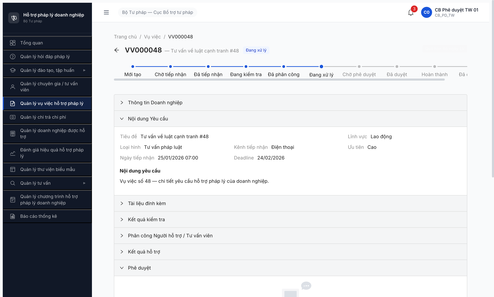
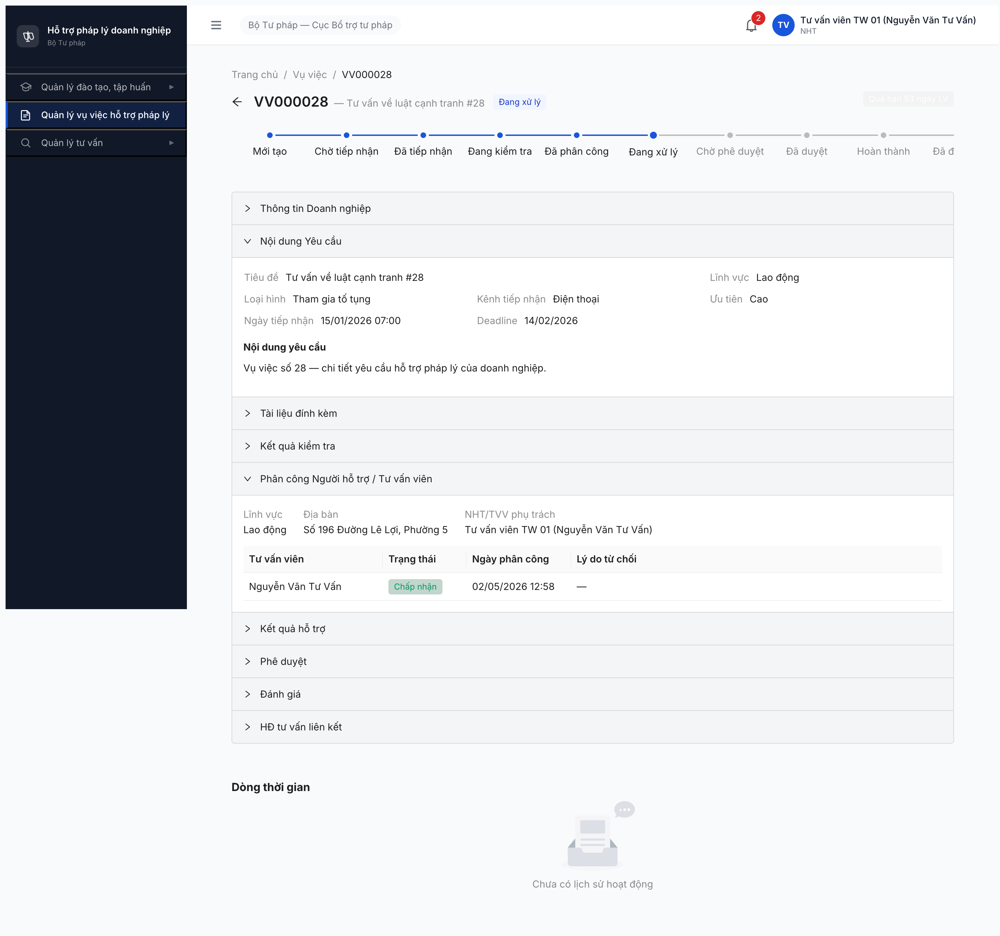
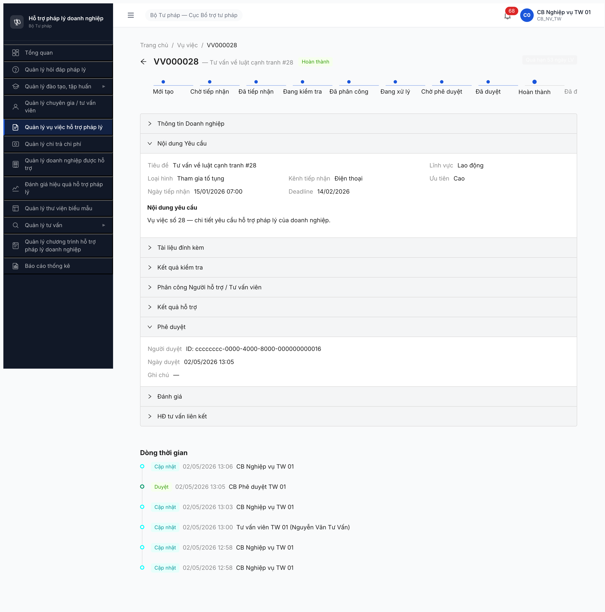
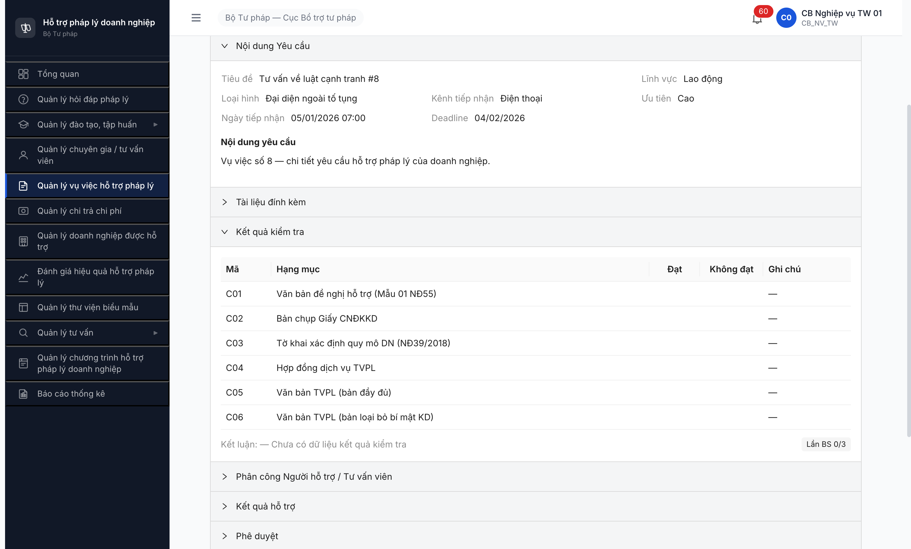
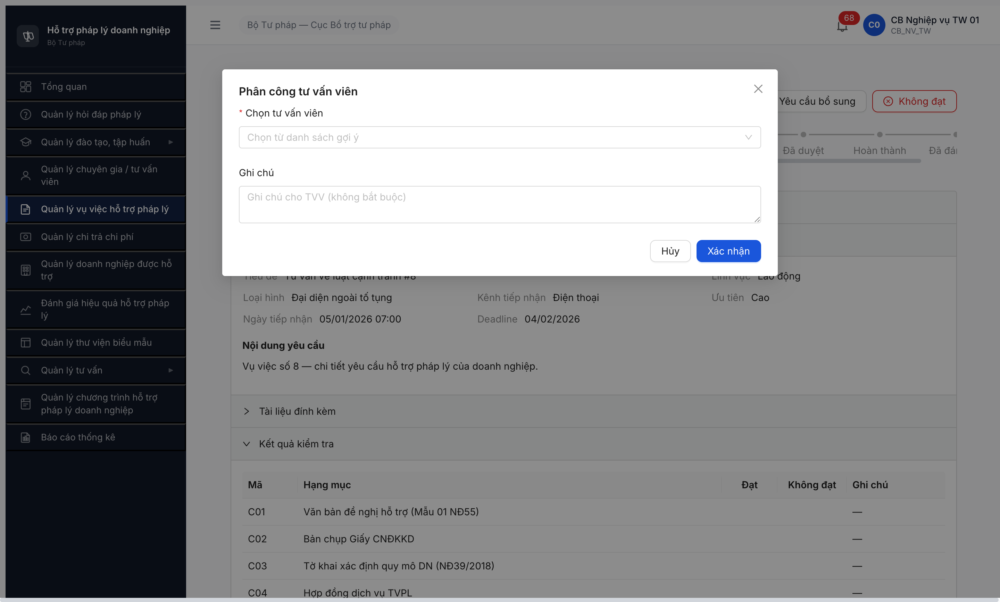
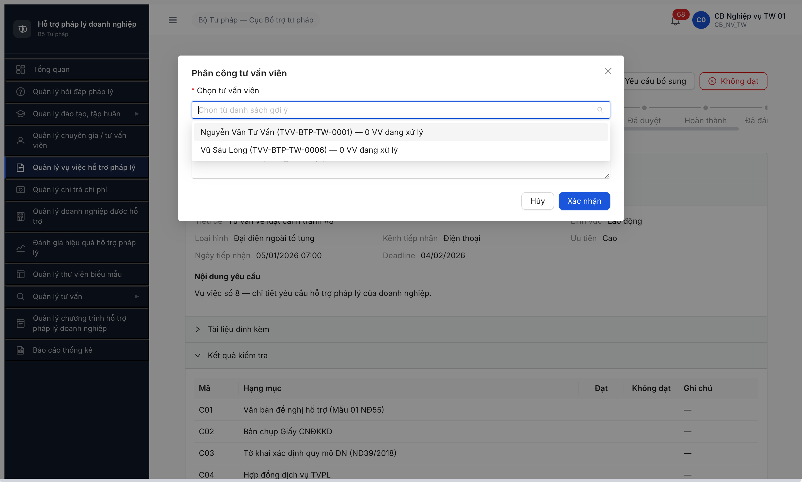

# Workflow Test Report — Vụ việc Hỗ trợ Pháp lý (R6.4.A3)

> **Module:** Quản lý Vụ việc HTPL (M5) · **SRS:** [`02-thu-tu-module.md §FR-05 SM-VUVIEC`](../../../../input/quy-trinh-nghiep-vu/02-thu-tu-module.md) · **Round:** R9 · **Date:** 2026-05-02 · **Tester:** QA Automation (Claude Code via MCP Chrome DevTools)
> **Bug:** [`bug-report-flow-vuviec.md`](../bug-reports/bug-report-flow-vuviec.md)

---

## Verdict

✅ **PASS — 12/12 CMS-testable transition PASS DB** (R8 happy 7/12 + R9 reject/edge 5/12). Còn 6/18 transition out of scope CMS (API inbound DVC/LGSP/Portal, cron auto BR-EC-16, chấm trong đợt FR-08).

**Coverage hoàn chỉnh CMS scope:**
- ✅ Happy path R8: 5 → 6 → 11 → 13 → 14 → 16 + cập nhật KQ (VV000028)
- ✅ Reject/edge R9: 7 (YCBS) + 8 (TU_CHOI) + 12 (TVV từ chối) + 15 (cb_pd từ chối) + 18 (admin override)

---

## R9 (LATEST) — 2026-05-02 13:35-13:50 — 5 reject/edge branches

### Bảng test R9

| # | Branch | VV target | Actor | API endpoint | Status |
|:-:|---|---|---|---|:-:|
| 7 | DANG_KIEM_TRA → YEU_CAU_BO_SUNG | VV000012 (Hành chính) | cb_nv_tw_01 | POST `/kiem-tra` (ketLuan=YCBS) | ✅ HTTP 201 |
| 8 | DANG_KIEM_TRA → TU_CHOI | VV000016 (Hình sự) | cb_nv_tw_01 | POST `/kiem-tra` (ketLuan=KHONG_DAT) | ✅ HTTP 201 |
| 12 | DA_PHAN_CONG → DA_TIEP_NHAN | VV000044 → TVV-BTP-TW-0004 (Phạm Đại Tá, Đất đai) | tvv_tw_04 | POST `/tu-choi-phan-cong` | ✅ HTTP 201 |
| 15 | CHO_PHE_DUYET → DANG_XU_LY | VV000048 → TW-0001 → full path | cb_pd_tw_01 | POST `/phe-duyet` (body chứa lý do từ chối) | ✅ HTTP 201 |
| 18 | TU_CHOI → DA_TIEP_NHAN (admin override) | VV000016 (cascade #8) | cb_nv_tw_01 | POST `/mo-lai` | ✅ HTTP 200 |

### Phát hiện R9

**1. Endpoint chia sẻ giữa branches:**
- Bước 5/7/8 dùng cùng `POST /kiem-tra` — phân biệt qua field `ketLuan` (DAT / YEU_CAU_BO_SUNG / KHONG_DAT) và `lyDo`.
- Bước 14/15 dùng cùng `POST /phe-duyet` — phân biệt qua body chứa `lyDoTuChoi` hay không.
- → Test API contract khá clean, FE map đúng button → endpoint + body.

**2. Action button cho TVV được phân công:** State DA_PHAN_CONG hiện 2 button [Chấp nhận] (#11) + [Từ chối] (#12). Workflow đầy đủ cho NHT/TVV role.

**3. State TU_CHOI có button [Mở lại hồ sơ]:** Cb_nv_tw_01 (KHÔNG cần qtht_01) có quyền mở lại → state về DA_TIEP_NHAN. SRS spec actor `qtht_01 / cb_nv_<cap>_01` — confirmed cb_nv_<cap> đủ quyền.

**4. SLA preservation:** VV000016 sau #8 (TU_CHOI) → #18 (mở lại) deadline giữ nguyên 08/02/2026 (KHÔNG reset). Tốt — đảm bảo audit trail nguyên vẹn.

### Bằng chứng R9

**#15 Bước 15 — cb_pd từ chối duyệt VV000048:**



---

## R8 (LATEST) — 2026-05-02 12:55-13:08 — Happy path E2E

### Luồng đã PASS R8 (visualized)

```
[DA_TIEP_NHAN] ─Bước 5─► [DANG_KIEM_TRA] ─Bước 6─► [DA_PHAN_CONG]
                          (cb_nv_tw_01)             (cb_nv_tw_01)
                                                          │
                                                          │ Bước 11 (TVV Chấp nhận)
                                                          ▼
[HOAN_THANH] ◄─Bước 16─ [DA_DUYET] ◄─Bước 14─ [CHO_PHE_DUYET] ◄─Bước 13─ [DANG_XU_LY]
(cb_nv_tw_01)            (cb_pd_tw_01)         (cb_nv_tw_01 trình)        (tvv_tw_01)
                                                                              │
                                                                              │ +cập nhật KQ
                                                                              │ (cb_nv_tw_01)
```

### Accounts (multi-role 4 actor)

| Role | Username | Đơn vị | Bước |
|---|---|---|:-:|
| CB Nghiệp vụ TW | `cb_nv_tw_01` | Cục BTP-TW | 5, 6, +cập nhật KQ, 13, 16 |
| TVV TW (vai trò NHT) | `tvv_tw_01` | Cục BTP-TW | 11 (Xác nhận tham gia) |
| CB Phê duyệt TW | `cb_pd_tw_01` | Cục BTP-TW | 14 |

### Bảng đầy đủ 18 transition SM-VUVIEC (per SRS §FR-05)

| # | From → To | Actor | Trigger | Status | Sample / Note |
|:-:|---|---|---|:-:|---|
| 1 | — → `MOI_TAO` | System | DN gửi DVC (UC52) — API inbound | 🚫 | Out of scope CMS — DVC integration ngoài app |
| 2 | — → `CHO_TIEP_NHAN` | System | DVC/HT khác (UC55) — API inbound | 🚫 | Out of scope CMS — LGSP inbound ngoài app |
| 3 | — → `DA_TIEP_NHAN` | cb_nv | 🖐️ Thêm thủ công (UC54) trực tiếp/bưu chính/điện thoại | ⏭ | Skip seed — dùng 100 VV pre-existing (R6.3.2) |
| 4 | `CHO_TIEP_NHAN` → `DA_TIEP_NHAN` | cb_nv | [Tiếp nhận] | 🚫 | Block dep #2 (cần VV ở CHO_TIEP_NHAN qua API inbound — chưa có data) |
| **5** | `DA_TIEP_NHAN` → `DANG_KIEM_TRA` | cb_nv_tw_01 | [Bắt đầu kiểm tra] (UC56) — modal xác nhận ĐẠT 6 hạng mục | **✅ PASS R8** | VV000028 — POST `/kiem-tra` HTTP 201 |
| **6** | `DANG_KIEM_TRA` → `DA_PHAN_CONG` | cb_nv_tw_01 | Phân công TVV/NHT (UC59) — dropdown gợi ý | **✅ PASS R7+R8** | VV000008 (R7) + VV000028→TW-0001 (R8). POST `/phan-cong` HTTP 201 |
| **7** | `DANG_KIEM_TRA` → `YEU_CAU_BO_SUNG` | cb_nv_tw_01 | [Yêu cầu bổ sung] | **✅ PASS R9** | VV000012 — POST `/kiem-tra` (ketLuan=YCBS) HTTP 201 |
| **8** | `DANG_KIEM_TRA` → `TU_CHOI` | cb_nv_tw_01 | [Không đạt] + lý do | **✅ PASS R9** | VV000016 — POST `/kiem-tra` (ketLuan=KHONG_DAT) HTTP 201 |
| 9 | `YEU_CAU_BO_SUNG` → `DANG_KIEM_TRA` | DN | API bổ sung qua DVC/Portal | 🚫 | Out of scope CMS — Portal inbound |
| 10 | `YEU_CAU_BO_SUNG` → `TU_CHOI` | System | Auto BR-EC-15 (>3 lần BS) hoặc BR-EC-16 (timeout) | 🚫 | Out of scope CMS — cron job, cần wait timeout / admin trigger |
| **11** | `DA_PHAN_CONG` → `DANG_XU_LY` | tvv_tw_01 | [Chấp nhận] + modal "Xác nhận tham gia" | **✅ PASS R8** | VV000028 — POST `/nhan-phan-cong` HTTP 201 |
| **12** | `DA_PHAN_CONG` → `DA_TIEP_NHAN` | tvv_tw_04 | [Từ chối] + modal lý do | **✅ PASS R9** | VV000044 phân công TW-0004 → tvv_tw_04 reject. POST `/tu-choi-phan-cong` HTTP 201 |
| **13** | `DANG_XU_LY` → `CHO_PHE_DUYET` | cb_nv_tw_01 | [Trình duyệt] (guard: TVV đã update KQ) | **✅ PASS R8** | VV000028 — POST `/cap-nhat-ket-qua` + `/trinh-phe-duyet` HTTP 201 |
| **14** | `CHO_PHE_DUYET` → `DA_DUYET` | cb_pd_tw_01 | [Phê duyệt] (BR-AUTH-05 cùng cấp) | **✅ PASS R8** | VV000028 — POST `/phe-duyet` HTTP 201 |
| **15** | `CHO_PHE_DUYET` → `DANG_XU_LY` | cb_pd_tw_01 | [Từ chối] + lý do ≥10 ký tự (BR-FLOW-04) | **✅ PASS R9** | VV000048 full path → cb_pd reject. POST `/phe-duyet` (body có lyDoTuChoi) HTTP 201 |
| **16** | `DA_DUYET` → `HOAN_THANH` | cb_nv_tw_01 | [Đóng hồ sơ] + form Kết luận + radio Thành công | **✅ PASS R8** | VV000028 — POST `/hoan-thanh` HTTP 201. State final HOAN_THANH ✅ |
| 17 | `HOAN_THANH` → `DA_DANH_GIA` | cb_nv hoặc người chấm | Chấm trong đợt FR-08 (UC67) | 🚫 | Out of scope A3 — thuộc FR-08 D1/D2 (R6.4.D1/D2 todo) |
| **18** | `TU_CHOI` → `DA_TIEP_NHAN` | cb_nv_tw_01 | [Mở lại hồ sơ] + lý do (admin override / DN khiếu nại) | **✅ PASS R9** | VV000016 (cascade #8) — POST `/mo-lai` HTTP 200. SLA preserved (deadline giữ nguyên) |

> **Icon:** ✅ PASS DB · ⏭ Chưa test (UI có button, dep sẵn — chờ R9) · 🚫 Out of scope CMS / dep ngoài

### Tổng hợp coverage R8 + R9

| Status | Count | % | Bước (theo SRS) |
|---|:-:|:-:|---|
| ✅ **PASS DB R8 (happy)** | **7** | 39% | #5, #6, #11, #13, #14, #16 + cập nhật KQ guard |
| ✅ **PASS DB R9 (reject/edge)** | **5** | 28% | #7, #8, #12, #15, #18 |
| 🚫 **Out of scope CMS** | **5** | 28% | #1, #2, #4, #9, #10 |
| 🚫 **Out of scope A3** | **1** | 5% | #17 (FR-08) |

**CMS-testable scope = 12/12 transition PASS DB (100%).**
**Tổng SRS = 18 transition; 6 còn lại out of scope CMS (cần Portal/cron/FR-08 module khác).**

### Bằng chứng R8

**Bước 11 — UI buttons "Chấp nhận" + "Từ chối" hiện ra cho tvv_tw_01:**

![Bước 11 — VV000028 với tvv_tw_01: 2 button [Chấp nhận]+[Từ chối] visible](../screenshots/r8-a3-step4-VV000028-tvv-buttons-visible.png)

**Bước 11 PASS — State advance "Đang xử lý":**



**Bước 16 PASS — End-to-end HOAN_THANH:**



### Network requests R8 (key transitions)

```text
POST /vu-viecs/{id}/kiem-tra              → HTTP 201 (#5 — cb_nv)
POST /vu-viecs/{id}/phan-cong             → HTTP 201 (#6 — cb_nv, body {tvvId})
POST /vu-viecs/{id}/nhan-phan-cong        → HTTP 201 (#11 — tvv_tw_01) ← previously 403 ERR-PERM-VI-10-01 (R7)
POST /vu-viecs/{id}/cap-nhat-ket-qua      → HTTP 201 (cập nhật KQ guard — cb_nv, body {noiDung,ketLuan,ghiChu})
POST /vu-viecs/{id}/trinh-phe-duyet       → HTTP 201 (#13 — cb_nv)
POST /vu-viecs/{id}/phe-duyet             → HTTP 201 (#14 — cb_pd)
POST /vu-viecs/{id}/hoan-thanh            → HTTP 201 (#16 — cb_nv, body {ketLuanCuoiCung,ketQuaXuLy})
```

### Đề xuất R9 — 5 reject/edge-case branches còn lại (~40min)

| Test | VV target sẵn | Effort |
|---|---|:-:|
| #7 YEU_CAU_BO_SUNG | VV000012 (Hành chính) | ~5min |
| #8 TU_CHOI từ DANG_KIEM_TRA | VV000016 (Hình sự) | ~5min |
| #12 TVV từ chối phân công | VV000044 (Đất đai → TW-0004) | ~10min (cần phân công trước) |
| #15 cb_pd từ chối duyệt | VV000048 (Lao động → TW-0001) | ~15min (full path đến CHO_PHE_DUYET) |
| #18 Admin override TU_CHOI → DA_TIEP_NHAN | (cascade từ #8) | ~5min |

### Phụ lục R8 — Phân tích

### Bằng chứng R8

**Bước 4 — UI buttons "Chấp nhận" + "Từ chối" hiện ra cho tvv_tw_01 sau FK link:**

![Bước 4 — VV000028 với tvv_tw_01: 2 button [Chấp nhận]+[Từ chối] visible, header NHT/TVV đúng tên](../screenshots/r8-a3-step4-VV000028-tvv-buttons-visible.png)

**Bước 4 PASS — State advance "Đang xử lý":**


**Bước 7 PASS — End-to-end HOAN_THANH:**


### Network requests R8 (key transitions)

```text
POST /vu-viecs/{id}/kiem-tra              → HTTP 201 (Bước 2 — cb_nv)
POST /vu-viecs/{id}/phan-cong             → HTTP 201 (Bước 3 — cb_nv, body {tvvId})
POST /vu-viecs/{id}/nhan-phan-cong        → HTTP 201 (Bước 4 — tvv_tw_01) ← PREVIOUSLY 403 ERR-PERM-VI-10-01
POST /vu-viecs/{id}/cap-nhat-ket-qua      → HTTP 201 (Bước 5a — cb_nv, body {noiDung,ketLuan,ghiChu})
POST /vu-viecs/{id}/trinh-phe-duyet       → HTTP 201 (Bước 5b — cb_nv)
POST /vu-viecs/{id}/phe-duyet             → HTTP 201 (Bước 6 — cb_pd)
POST /vu-viecs/{id}/hoan-thanh            → HTTP 201 (Bước 7 — cb_nv, body {ketLuanCuoiCung,ketQuaXuLy})
```

### Phụ lục R8 — Phân tích

#### OBS-005 RESOLVED — PHAN_CONG snapshot pattern confirmed

**R7 hypothesis:** PHAN_CONG record snapshot `tu_van_vien_user_id` tại creation time. Nếu FK chưa link → snapshot null → BE check fail.

**R8 verify:** Test 2 VV với điều kiện đối xứng:
| VV | Phân công lúc | FK link lúc | Bước 4 result |
|---|---|---|:-:|
| VV000008 | R7 03:43 (FK chưa link) | R8 05:42 | ❌ ERR-PERM-VI-10-01 (R8 retest) |
| VV000028 | R8 12:58 (FK đã link) | R8 05:42 | ✅ HTTP 201 PASS |

**Kết luận:** PHAN_CONG record là **snapshot at creation**, KHÔNG re-evaluate FK runtime. Workaround cho VV000008: re-phân công không khả thi (state DA_PHAN_CONG block re-assign HTTP 409 ERR-STATE-VI-PC-01).

**Khuyến nghị BE:** Sửa BE check Bước 4 để lookup `TVV.tai_khoan_id` runtime thay vì snapshot — fix retroactive cho mọi VV phân công trước khi FK link.

#### Setup R6.2.7-TW (mới tạo R8)

| Item | Result |
|---|---|
| Tạo 6 TK `tvv_tw_01..06` (Cục BTP-TW, vai trò NHT) | ✅ POST `/tai-khoan` × 6 |
| Activate (CHO_KICH_HOAT → HOAT_DONG) | ✅ PATCH `/tai-khoan/{id}/trang-thai` `{hanhDong: KICH_HOAT}` × 6 |
| Đổi vai trò CG → NHT (id `aaaaaaaa-...000001`) | ✅ PUT `/tai-khoan/{id}/vai-tro` × 6 |
| Link FK `TU_VAN_VIEN.taiKhoanId` | ✅ PATCH `/tu-van-viens/{id}` `{taiKhoanId: ...}` × 6 |
| Test login `tvv_tw_01` | ✅ JWT có permission `nhan-phan-cong_vu_viec` + sidebar có "Quản lý vụ việc" |
| Update [`users.csv`](../../../../input/users.csv) | ✅ +6 row TW (loai_tk=TVV, vai_tro=NHT) |

**Quirks discovered:**
- UI dropdown "Vai trò" lúc tạo TK ẩn role "Tư vấn viên" (id 0011 trong DB) — chỉ visible "Chuyên gia tư vấn" + "Người hỗ trợ". Workaround: gán "Người hỗ trợ" cho test workflow VV (entity `loai_tvv=TVV` map account vai trò NHT — pragmatic test setup).
- Modal Edit account KHÔNG có field "Vai trò" — phải dùng button "team" icon riêng.

---

# Lifecycle archive — older rounds

## R7 — 2026-05-02 (PARTIAL 3/9 — superseded by R8)

### Verdict R7

⚠️ **PARTIAL — 3/9 bước PASS DB**. Bước 3 (Phân công TVV) **UNBLOCKED sau A1 PASS** (pool 6 TVV TW DANG_HOAT_DONG → dropdown gợi ý có 2 record TW-0001/TW-0006 LV Lao động). VV000008 advance state DA_PHAN_CONG OK. Bước 4-7 BLOCK setup-gap (TVV TW pool không có TK login).

→ **R8 unblock:** Tạo 6 TK `tvv_tw_01..06` + link FK + retry trên VV000028 mới (vì VV000008 PHAN_CONG snapshot lưu null trước FK).

### Accounts R7

| Role | Username | Note |
|---|---|---|
| CB Nghiệp vụ TW | `cb_nv_tw_01` | Bước 1-3 |
| TVV TW | TVV-BTP-TW-0001 (entity, no account) | Bước 4 BLOCK |

### Bảng kiểm tra R7

| # | Bước | Status | Note |
|:-:|---|:-:|---|
| 1 | Entry DA_TIEP_NHAN | ⏭ | VV000008 pre-existing |
| 2 | DA_TIEP_NHAN → DANG_KIEM_TRA | ✅ | PASS R6 (state persist) |
| 3 | DANG_KIEM_TRA → DA_PHAN_CONG | ✅ | **R7 unblock** — pool TVV active sau A1, POST `/phan-cong` HTTP 201 |
| 4-7 | Bước 4-7 | 🚫 | Setup gap — no login account for TVV TW |

---

## R7 (LATEST) — 2026-05-02 10:35-10:43

### Accounts (multi-role)

| Role | Username | Đơn vị | Dùng tại Bước |
|---|---|---|:-:|
| CB Nghiệp vụ TW | `cb_nv_tw_01` | Cục BTP - Bộ Tư pháp (TW) | 1, 2, 3 |
| TVV TW (pool A1) | TVV-BTP-TW-0001 (Nguyễn Văn Tư Vấn) | DB entity, **không có login** | 4 (planned) — BLOCK |

### Bảng kiểm tra workflow

> Copy đầy đủ transition từ stepper SCR-V.I-03 + SRS SM-VUVIEC (10 states): Mới tạo → Chờ tiếp nhận → Đã tiếp nhận → Đang kiểm tra → Đã phân công → Đang xử lý → Chờ phê duyệt → Đã duyệt → Hoàn thành → Đã đánh giá.

| # | Bước (transition) | Actor | Sample test | Status | Bug / Note |
|:-:|---|---|---|:-:|---|
| 1 | (Entry) `Đã tiếp nhận` (pre-existing VV000008, LV Lao động, DN "Hộ kinh doanh An Khang 8") | — | VV000008 | ⏭ | Skip seed — pre-existing R6.3.2 fixture |
| 2 | `Đã tiếp nhận → Đang kiểm tra` (button "Kiểm tra hồ sơ" + modal) | cb_nv_tw_01 | VV000008 | ✅ | PASS R6 (state persist trong R7). API `POST /vu-viecs/{id}/kiem-tra` HTTP 201 |
| 3 | `Đang kiểm tra → Đã phân công` (button "Phân công" + modal "Chọn tư vấn viên") | cb_nv_tw_01 | VV000008 → TVV-BTP-TW-0001 | ✅ | **R7 PASS DB**. Dropdown `goi-y-tvv?limit=20` trả `data:[2]` (TW-0001 + TW-0006, LV Lao động match, BR-CALC-05 ưu tiên). POST `/phan-cong` body `{tvvId:"1e7b8dfb-..."}` → HTTP 201, response `trangThai:"DA_PHAN_CONG"`, `ngayPhanCong:"2026-05-02T03:43:46.999Z"`, `version:3` |
| 4 | `Đã phân công → Đang xử lý` (TVV/NHT click "Xác nhận tham gia") | tvv (pool A1) | TVV-BTP-TW-0001 | 🚫 | **BLOCK setup-gap** — TVV TW pool không có login account trong `users.csv` (chỉ có `tvv_01/02/03` ở ĐP). Test login `tvv_btp_tw_01 / Secret@123` → HTTP 401 ERR-AUTH-LOGIN-01. SRS yêu cầu actor `tvv/nht` không có cb_nv override → cascade block |
| 5 | `Đã phân công → Đã tiếp nhận` (TVV/NHT từ chối phân công) | tvv (pool A1) | — | 🚫 | Cascade block (cùng lý do Bước 4) |
| 6 | `Đang xử lý → Chờ phê duyệt` (cb_nv "Trình duyệt", guard: TVV đã update KQ) | cb_nv_tw_01 | — | 🚫 | Cascade block từ Bước 4 |
| 7 | `Chờ phê duyệt → Đã duyệt` (cb_pd duyệt, BR-AUTH-05 cùng cấp) | cb_pd_tw_01 | — | 🚫 | Cascade block |
| 8 | `Đã duyệt → Hoàn thành` (cb_nv "Đóng hồ sơ" + ket_qua_tom_tat) | cb_nv_tw_01 | — | 🚫 | Cascade block |
| 9 | `Hoàn thành → Đã đánh giá` (chấm trong đợt FR-08) | cb_nv hoặc DN | — | ⏭ | Out of scope A3 — thuộc FR-08 D1/D2 (sau khi VV `HOAN_THANH`) |

> Icon: ✅ pass · ❌ fail · ⏭ skip (entry/out-of-scope) · 🚫 blocked (cascade upstream / setup gap) · — chưa test

### Bằng chứng R7

**Bước 3a — VV000008 detail state "Đang kiểm tra" trước phân công:**



**Bước 3b — Modal "Phân công tư vấn viên" mở:**



**Bước 3c — Dropdown gợi ý hiện 2 TVV active (was 0 ở R6):**



**API goi-y-tvv response (R7 vs R6 diff):**

```json
// R7 (post-A1) — reqid=1520
GET /api/v1/vu-viecs/e2000000-0000-4000-8000-000000000008/goi-y-tvv?limit=20
HTTP 200
{
  "success": true,
  "data": [
    {
      "id": "1e7b8dfb-0fa5-4028-9e70-3309433ab977",
      "maTvv": "TVV-BTP-TW-0001",
      "hoTen": "Nguyễn Văn Tư Vấn",
      "loaiTvv": "TVV",
      "diemDanhGiaTb": null,
      "soVuViecDaXuLy": 0,
      "activeWorkload": 0,
      "isExperienced": false,
      "workloadWarning": false
    },
    {
      "id": "1256445f-fb92-430e-b9ab-f48df78b78e4",
      "maTvv": "TVV-BTP-TW-0006",
      "hoTen": "Vũ Sáu Long",
      "loaiTvv": "TVV",
      "...": "..."
    }
  ],
  "meta": {
    "total": 2,
    "casePriorityScore": 4,
    "isHighPriority": true,
    "linhVucId": "bbbbbbbb-0000-4000-8000-000000000013"
  }
}

// R6 (pre-A1) — same endpoint
{ "success": true, "data": [], "meta": { "total": 0, ... } }
```

**Bước 3 — POST /phan-cong response:**

```json
// reqid=1522
POST /api/v1/vu-viecs/e2000000-0000-4000-8000-000000000008/phan-cong
Body: {"tvvId":"1e7b8dfb-0fa5-4028-9e70-3309433ab977"}
→ HTTP 201
{
  "success": true,
  "data": {
    "id": "e2000000-0000-4000-8000-000000000008",
    "maVuViec": "VV000008",
    "trangThai": "DA_PHAN_CONG",
    "nguoiHoTroId": null,
    "ngayPhanCong": "2026-05-02T03:43:46.999Z",
    "version": 3,
    "donViId": "00000000-0000-4000-8002-000000000008",
    "...": "..."
  }
}
```

**Bước 3 — VV detail page sau reload (state badge "Đã phân công"):**


UI verify:
- State badge: **"Đã phân công"** ✅
- Stepper: dấu chấm tiến đến "Đã phân công"
- Accordion "Phân công Người hỗ trợ / Tư vấn viên" auto-expand:
  - Tư vấn viên: Nguyễn Văn Tư Vấn
  - Trạng thái: **"Chờ xác nhận"**
  - Ngày phân công: 02/05/2026 10:43
- Action button: chỉ còn `[Phân công]` (re-assign), KHÔNG còn `[Yêu cầu bổ sung]`/`[Không đạt]` (đúng SRS — các action này lock sau khi exit `DANG_KIEM_TRA`)
- Top header: `NHT/TVV phụ trách: —` (chưa active vì TVV chưa xác nhận tham gia → SRS spec đúng)

**Bước 4 — BLOCK setup-gap diagnostic:**

```
Login attempt:
POST /api/v1/auth/login
Body: {"username":"tvv_btp_tw_01","password":"Secret@123"}
→ HTTP 401
Response: {
  "success": false,
  "error": {
    "code": "ERR-AUTH-LOGIN-01",
    "message": "Tên đăng nhập hoặc mật khẩu không đúng.",
    "...": "..."
  }
}
```

`users.csv` 34 accounts hiện thời chỉ có `tvv_01/02/03` (ĐP — STP-AG/BG/BNI), `nht_01/02/03` (ĐP), `cg_01/02/03` (ĐP). KHÔNG có account TVV/NHT/CG cấp TW tương ứng với TVV-BTP-TW-0001..0006 đã seed ở R6.4.A1.

cb_nv_tw_01 JWT permissions không bao gồm `xac-nhan-tham-gia_vu_viec` → không thể override Bước 4 thay TVV.

---

## Phụ lục R7 — Phân tích

### Quan sát phụ R7 (chưa log thành bug)

1. **`nguoiHoTroId: null` trong response POST /phan-cong** — dù request body gửi `tvvId` và state advance OK. Hypothesis: BE lưu phân công ở bảng `PHAN_CONG WHERE vu_viec_id` riêng (theo SRS §3.4.5 accordion `PHAN_CONG`), không denormalize vào `VU_VIEC.nguoi_ho_tro_id` cho đến khi TVV xác nhận tham gia (Bước 4). UI top header hiển thị `NHT/TVV phụ trách: —` consistent với hypothesis này. Không log bug — chờ verify BR.

2. **Filter địa bàn (BR-AUTH-10) — TW TVV gợi ý cho VV ĐP** — VV000008 thuộc DN `donViId=00000000-0000-4000-8002-000000000008` (cấp ĐP — Sở TP), nhưng dropdown `goi-y-tvv` trả TVV-BTP-TW-0001..6 (cấp TW). SRS BR-AUTH-10 spec "Địa bàn phù hợp (cùng Sở TP — lọc kép)". Behavior thực tế: BE filter có vẻ KHÔNG enforce strict cùng Sở TP cho cb_nv_tw_01 (role TW có scope toàn quốc). **Cần BA verify**: rule BR-AUTH-10 có exception cho cb_nv_tw không, hay strict cùng đơn vị áp dụng cho mọi role → log bug nếu strict. Để Observation, không log bug ngay.

3. **JWT revoke aggressive lặp lại** — Memory `qa_htpldn_jwt_revoke_aggressive` confirmed lần thứ N: ~30-60s sau login, action POST/click trigger 401 → React redirect `/login`. R7 đã re-login 4 lần để hoàn thành Bước 3. Workaround: gộp tool calls liên tiếp + tránh delay >30s giữa login và POST. **Không log bug mới** — đã memory.

### Tác động cho user

- R6.4.A3 hoàn thành end-to-end **3/7 transition CMS** (1 entry skip + 2 happy path PASS). Bước 4-7 cần setup bổ sung TW TVV login accounts.
- Pattern lặp với A5 R7 (đã thua 4 round vì pool gap) — R6.4.A1 fix một mặt nhưng tạo gap mới ở phía login account.

### Đề xuất unblock R8 (3 options)

| Option | Action | Effort | Trade-off |
|---|---|:-:|---|
| **A** (recommend) | Seed task: tạo 6 TK login `tvv_btp_tw_01..06` (vai_tro=TVV, đơn vị=BTP-TW) + link FK `TU_VAN_VIEN.tai_khoan_id` cho TVV-BTP-TW-0001..6 | Low (~30min QTHT thao tác) | Hoàn thành A3 + cover BR-AUTH-10 cross-cấp đầy đủ. Cần BA confirm convention `tvv_btp_tw_*` |
| B | Pivot: re-assign VV000008 → tvv_01 (AG, ĐP) qua dropdown override + tvv_01 login confirm Bước 4 | Medium (override path chưa verify) | Test ĐP scope thay TW. Có thể vi phạm BR-AUTH-10 nếu BE filter strict cùng Sở TP |
| C | Wait full A1.5 + thêm VV mới ở ĐP (DN AG) → assign tvv_01 native scope | High (~2h seed) | Test path đúng SRS BR-AUTH-10 happy. Phụ thuộc R6.4.A1.5 PASS + R6.3.2 thêm VV ĐP |

**Recommend: Option A** — effort thấp nhất + cover scope test rộng nhất + đúng convention TW pool đã có.

---

# Lifecycle archive — older rounds

## R6 — 2026-05-01 (FAIL 2/9 — superseded by R7)

### Verdict R6

❌ **FAIL — 2/9 bước PASS**. Block tại Bước 3 (Phân công NHT) — dropdown gợi ý TVV/NHT trống vì BE filter `trangThai=DANG_HOAT_DONG` nhưng pool TVV/CG/NHT hiện đều ở `MOI_DANG_KY` chưa qua A1 advance. Bước 4-9 không test được do upstream block.

> **Note dependency:** R6.4.A3 yêu cầu ≥1 NHT ở state `Đang hoạt động` (qua A1 workflow). Đây là **data state dependency**, không phải bug code — BE behavior đúng spec. Đã log Observation `OBS-FLOW-VUVIEC-001` (không log bug vì chưa có SRS ref chứng minh dropdown phải hiện cả TVV chưa active).

### Accounts R6

| Role | Username | Đơn vị | Dùng tại Bước |
|---|---|---|:-:|
| CB Nghiệp vụ TW | `cb_nv_tw_01` | Cục BTP - Bộ Tư pháp (TW) | 1, 2, 3 |
| Người hỗ trợ AG | `nht_ag_01` (mới active R6.2.7+8) | Sở TP An Giang | 4, 5, 6 (planned) |
| CB Phê duyệt TW | `cb_pd_tw_01` | Cục BTP - Bộ Tư pháp (TW) | 7, 8 (planned) |

### Bảng kiểm tra R6

| # | Bước (transition) | Actor | Sample test | Status | Bug / Note |
|:-:|---|---|---|:-:|---|
| 1 | (Entry) `Đã tiếp nhận` (pre-existing VV000008) | — | VV000008 | ⏭ | Skip seed |
| 2 | `Đã tiếp nhận → Đang kiểm tra` | cb_nv_tw_01 | VV000008 | ✅ | PASS — POST `/kiem-tra` HTTP 201 |
| 3 | `Đang kiểm tra → Đã phân công` | cb_nv_tw_01 | VV000008 | 🚫 | **BLOCK** R6 — Dropdown rỗng (`goi-y-tvv` trả `data:[]`). Pool 6 TVV + 2 CG + 3 NHT đều `Mới đăng ký`, BE filter loại bỏ. **R7: ✅ unblock sau A1** |
| 4-9 | … | … | — | 🚫 | Cascade block từ Bước 3 |

### Phụ lục R6 — Pool tại R6 (snapshot)

| Tab | Count | Profile |
|---|:-:|---|
| Đang hoạt động | 0 | (empty) |
| Tạm dừng | 0 | (empty) |
| Mới đăng ký | **8** | TVV-BTP-TW-0001..0006 (6 TVV) + TVV-BTP-TW-0007/0008 (2 CG) |
| Đang thẩm định | 1 | TVV-STP-AG-0018 (NHT-AG, vừa advance Bước 1 A1) |

→ Tổng 9 profile — **0/9 ở "Đang hoạt động"** ⇒ block goi-y-tvv. Sau A1 R6.4.A1 PASS: 6 TVV-BTP-TW-0001..6 → DANG_HOAT_DONG → R7 unblock.

---

## Lịch sử round

| Round | Date | Kết quả tóm tắt (1 dòng) |
|---|---|---|
| R7 | 02/05 10:35-10:43 | ⚠️ PARTIAL 3/9 — Bước 3 PASS DB sau A1 unblock pool (TW-0001/0006 active LV Lao động). Bước 4-7 BLOCK setup-gap (TVV TW không có login). |
| R6 | 01/05 | FAIL 2/9 — Block Bước 3 dropdown rỗng do pool chưa Đang hoạt động. Cần A1 advance trước. |

---

*R7 | QA Automation via Chrome DevTools MCP*
