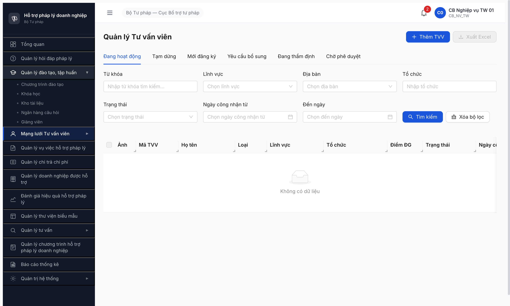
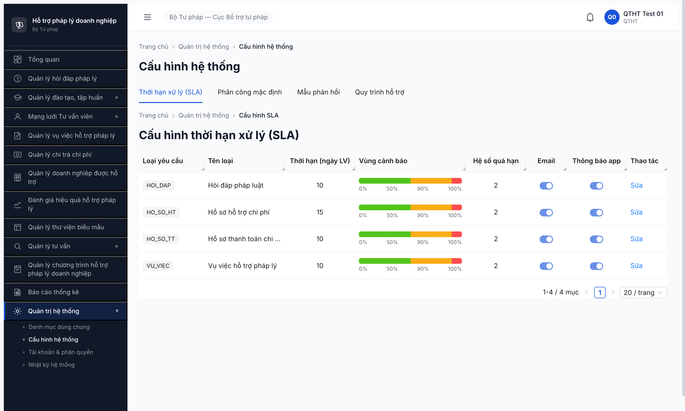
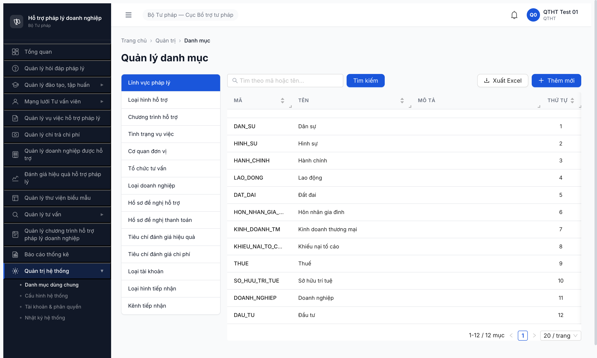
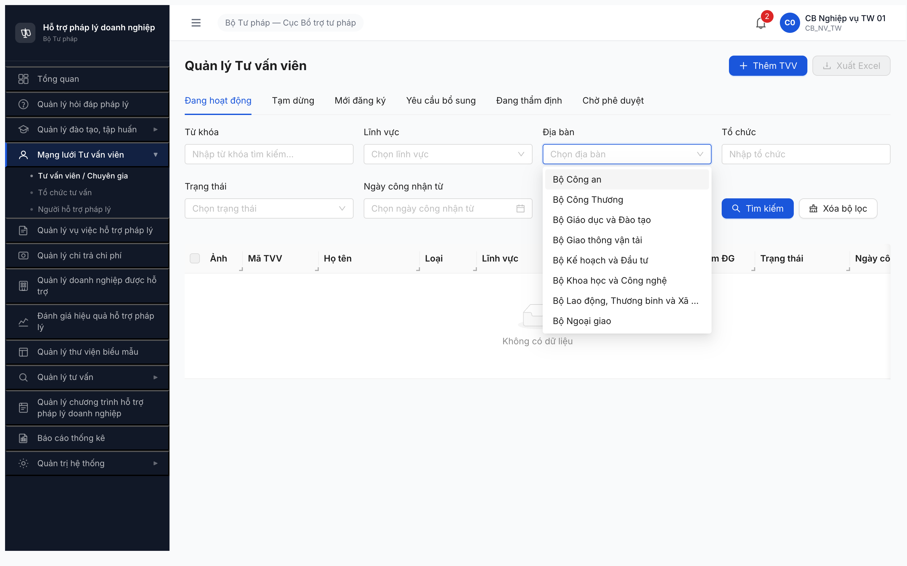
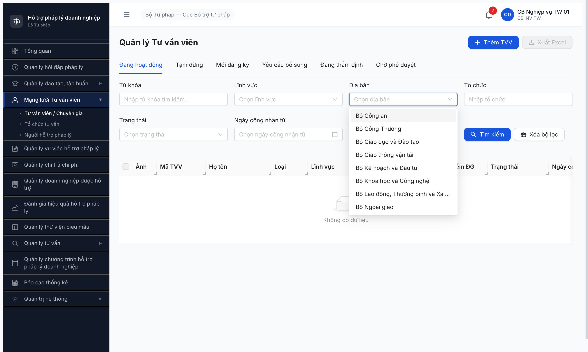

# Bug Report — Deploy Gap SRS Update 2026-05-05

| Thông tin | Giá trị |
|-----------|---------|
| **Dự án** | PM HTPLDN |
| **Môi trường** | http://103.172.236.130:3000/ |
| **Người test** | QA Automation (Claude Code via MCP) |
| **Ngày** | 2026-05-06 |
| **Loại test** | Pre-test deploy verification |
| **Round** | R7 (post SRS update 2026-05-05) |
| **Tài liệu tham chiếu** | [plan-r7-trigger.md](../../../../../tasks/plan-r7-trigger.md) · [_DELTA-MAP-FR03/04/10](../../../../../input/srs-update-2026-5-5/) · [todo.md R7.0.2](../../../../../tasks/todo.md) |

---

## Tổng hợp

Verify 8 deploy gap items từ plan-r7-trigger.md ngày 2026-05-06. Sau khi retest với đúng role permission per SCR (CB_NV_TW + QTHT), kết luận:
- **6 bug confirmed** (log dưới đây)
- **2 bug DROPPED** — false positive: sub-menu "Tổ chức tư vấn" + "Người hỗ trợ pháp lý" đã deploy đầy đủ. Lần verify đầu dùng `qtht_01` (không có quyền per SCR-IV-01 line 1474-1477) nên không thấy. Retest với `cb_nv_tw_01` → 2 sub-menu hiện đầy đủ. Bài học: [`tasks/lessons-learned.md` 2026-05-06](../../../../../tasks/lessons-learned.md)

### Severity breakdown

| Tổng | Critical | Major | Medium | Minor | Trivial |
|------|----------|-------|--------|-------|---------|
| 6    | 0        | 3     | 2      | 1     | 0       |

## Bug Summary Table

| Bug ID | Severity | Priority | Type | TC Ref | **SRS Reference** | Title | Status |
|--------|----------|----------|------|--------|-------------------|-------|--------|
| DEPLOY-001 | Major | P1 | Workflow | — | `srs-update-2026-5-5/srs-fr-04-chuyen-gia-tvv.md:1260-1374` (FR-IV-NHT-01/02/03) | Entity NGUOI_HO_TRO BE chưa deploy — `/api/v1/nguoi-ho-tros` 404 | Open |
| DEPLOY-002 | Major | P1 | Workflow | — | `srs-update-2026-5-5/srs-fr-03-dao-tao.md` §HOC_VIEN entity (Mô hình A) | Entity HOC_VIEN BE chưa deploy — `/api/v1/hoc-viens` 404 | Open |
| DEPLOY-003 | Major | P1 | UI/UX | — | `srs-update-2026-5-5/srs-fr-03-dao-tao.md` (FR-III-22 Lịch học, FR-III-NEW-01/02/03 Đề KT, KE_HOACH_DAO_TAO, HOC_VIEN) | 4 sub-menu Đào tạo mới chưa thêm vào sidebar | Open |
| DEPLOY-004 | Medium | P2 | UI/UX | — | `srs-update-2026-5-5/srs-fr-10-quan-tri.md:1376-1436` (FR-VIII-29) | UI Quản lý ngày lễ chưa có ở cả 2 option SRS | Open |
| DEPLOY-005 | Minor | P3 | UI/UX | — | `srs-update-2026-5-5/srs-fr-04-chuyen-gia-tvv.md:1496` (SCR-IV-01 row 12) | Filter TVV label "Địa bàn" sai spec "Đơn vị quản lý" | Open |
| DEPLOY-006 | Medium | P2 | UI/UX | — | `srs-update-2026-5-5/srs-fr-04-chuyen-gia-tvv.md:1490` (SCR-IV-01 row 6) | Tab "Chờ thẩm định" thiếu trên SCR-IV-01 — web 6 tab, SRS quy định 7 tab | Open |

---

## DEPLOY-001 — Entity NGUOI_HO_TRO BE chưa deploy (`/api/v1/nguoi-ho-tros` 404)

### Mô tả

Endpoint REST cho entity `NGUOI_HO_TRO` (Người hỗ trợ pháp lý — entity owned mới theo NĐ 55/2019 Đ.7) trả 404 Not Found. Sub-menu UI "Người hỗ trợ pháp lý" trong sidebar Mạng lưới TVV đã deploy (verified với `cb_nv_tw_01`), nhưng BE chưa expose endpoint → click vào sub-menu sẽ block CRUD NHT.

### Các bước tái hiện

1. Curl `http://103.172.236.130:3000/api/v1/nguoi-ho-tros` (hoặc truy cập sub-menu "Người hỗ trợ pháp lý" trong web).
2. Quan sát: HTTP 404 (cross-check `/api/v1/tu-van-viens` trả 401 — confirm BE alive, chỉ endpoint NHT chưa deploy).

### Kết quả mong đợi

- `GET /api/v1/nguoi-ho-tros` trả HTTP 401 (chưa auth) hoặc 200 (có auth) — entity deployed theo FR-IV-NHT-01/02/03.
- `srs-update-2026-5-5/srs-fr-04-chuyen-gia-tvv.md:1260-1374` quy định 3 FR cho NGUOI_HO_TRO entity owned mới.

### Kết quả thực tế

```
$ curl -s -o /dev/null -w "HTTP %{http_code}\n" http://103.172.236.130:3000/api/v1/nguoi-ho-tros
HTTP 404

$ curl -s -o /dev/null -w "HTTP %{http_code}\n" http://103.172.236.130:3000/api/v1/tu-van-viens
HTTP 401
```

### Bằng chứng

**1. Curl output:** xem block code Kết quả thực tế.

**2. Screenshot:** sub-menu UI có nhưng route không có data (verified `cb_nv_tw_01` thấy sub-menu nhưng click sẽ 404).



---

## DEPLOY-002 — Entity HOC_VIEN BE chưa deploy (`/api/v1/hoc-viens` 404)

### Mô tả

Endpoint REST cho entity `HOC_VIEN` (Học viên — entity owned mới theo Mô hình A 3 cấp KH năm → CTĐT → KH) trả 404. Block toàn bộ workflow đào tạo R7 cho FR-III-22 + FR-III-NEW-01/02/03.

### Các bước tái hiện

1. Curl `http://103.172.236.130:3000/api/v1/hoc-viens`.
2. Quan sát: HTTP 404.

### Kết quả mong đợi

- `GET /api/v1/hoc-viens` trả HTTP 401 hoặc 200 — entity deployed theo SRS FR-03 update §HOC_VIEN owned + 1:1 với TAI_KHOAN qua `tai_khoan_id`.

### Kết quả thực tế

```
$ curl -s -o /dev/null -w "HTTP %{http_code}\n" http://103.172.236.130:3000/api/v1/hoc-viens
HTTP 404
```

### Bằng chứng

Curl output ở block code Kết quả thực tế. Cross-check baseline: `/api/v1/ke-hoach-dao-taos` 401 (deployed), `/api/v1/ngay-le` 401 (deployed), chỉ HOC_VIEN 404.

---

## DEPLOY-003 — 4 sub-menu Đào tạo mới chưa thêm vào sidebar

### Mô tả

Theo SRS FR-03 update (Mô hình A 3 cấp + 5 FR mới), sidebar "Quản lý đào tạo, tập huấn" cần 9 sub-menu (5 cũ + 4 mới: Kế hoạch năm, Lịch học, Đề kiểm tra, Học viên). Hiện UI chỉ thấy 5 sub-menu cũ với role CB_NV_TW (role nghiệp vụ TW cao nhất).

### Các bước tái hiện

1. Login `cb_nv_tw_01 / Secret@123 / OTP 666666` qua MCP.
2. Click "Quản lý đào tạo, tập huấn" trong sidebar → expand sub-menu.
3. Đếm sub-menu visible.

### Kết quả mong đợi

- Sidebar "Quản lý đào tạo, tập huấn" có 9 sub-menu: Chương trình đào tạo, **Kế hoạch năm**, Khóa học, **Lịch học**, **Đề kiểm tra**, Kho tài liệu, Ngân hàng câu hỏi, **Học viên**, Giảng viên.
- SRS FR-03 Mô hình A: KE_HOACH_DAO_TAO → CHUONG_TRINH_DAO_TAO → KHOA_HOC + LICH_HOC per buổi + HOC_VIEN entity riêng + Đề KT (FR-III-NEW-01/02/03).

### Kết quả thực tế

Sidebar chỉ hiện 5 sub-menu cũ (verify bằng `evaluate_script` đếm `aside button.nav-subitem` visible):

```json
["Chương trình đào tạo","Khóa học","Kho tài liệu","Ngân hàng câu hỏi","Giảng viên"]
```

Thiếu 4 sub-menu: Kế hoạch năm, Lịch học, Đề kiểm tra, Học viên.

### Bằng chứng


---

## DEPLOY-004 — UI Quản lý ngày lễ chưa có (cả 2 option SRS)

### Mô tả

FR-VIII-29 (Quản lý ngày lễ) — `srs-update-2026-5-5/srs-fr-10-quan-tri.md:1382` quy định "**Màn hình:** SCR-VIII-06 hoặc màn hình riêng (danh mục con)". Verify cả 2 option:
- Option 1: SCR-VIII-06 (Cấu hình HT MH-10.7) — chỉ 4 tab cố định (SLA / Phân công / Mẫu / Quy trình), KHÔNG có tab Ngày lễ.
- Option 2: Danh mục dùng chung — 14 sub-tab, KHÔNG có "Ngày lễ".

BE endpoint `/api/v1/ngay-le` trả 401 (deployed) → BE-UI gap. SLA tính trừ ngày lễ (BR-CALC-03) phụ thuộc UI này để QTHT seed dữ liệu.

### Các bước tái hiện

1. Login `qtht_01 / Secret@123 / OTP 666666` qua MCP.
2. Vào "Quản trị hệ thống" → "Cấu hình hệ thống". Quan sát số tab.
3. Vào "Quản trị hệ thống" → "Danh mục dùng chung". Quan sát 14 sub-tab bên trái.
4. Curl `/api/v1/ngay-le` → 401 (deployed).

### Kết quả mong đợi

- Cấu hình HT có 5 tab gồm "Quản lý ngày lễ" HOẶC Danh mục dùng chung có sub-tab "Ngày lễ" (theo `srs-update-2026-5-5/srs-fr-10-quan-tri.md:1382` "hoặc").
- QTHT thực hiện được Acceptance Criteria FR-VIII-29 `srs-update-2026-5-5/srs-fr-10-quan-tri.md:1432-1434`: thêm/import file Excel/xem lịch ngày lễ.

### Kết quả thực tế

- Cấu hình HT 4 tab: Thời hạn xử lý (SLA) / Phân công mặc định / Mẫu phản hồi / Quy trình hỗ trợ. Không có tab Ngày lễ.
- Danh mục dùng chung 14 sub-tab: Lĩnh vực pháp lý / Loại hình hỗ trợ / Chương trình hỗ trợ / Tình trạng vụ việc / Cơ quan đơn vị / Tổ chức tư vấn / Loại doanh nghiệp / Hồ sơ đề nghị hỗ trợ / Hồ sơ đề nghị thanh toán / Tiêu chí đánh giá hiệu quả / Tiêu chí đánh giá chi phí / Loại tài khoản / Loại hình tiếp nhận / Kênh tiếp nhận. Không có Ngày lễ.

### Bằng chứng





---

## DEPLOY-005 — Filter TVV label "Địa bàn" sai spec "Đơn vị quản lý"

### Mô tả

SRS update v3.1 line 42 + line 150 bỏ field `dia_ban_ids[]` của TU_VAN_VIEN, filter trên SCR-IV-01 chuyển sang lọc theo `don_vi_id`. SCR-IV-01 line 1496 quy định label filter mới là "Đơn vị quản lý" (row 12). Web hiện vẫn dùng label cũ "Địa bàn" mặc dù data source đã đúng (load list `Bộ Công an / Bộ Công Thương / Bộ Giáo dục...` — DON_VI entity, không phải DM_DIA_BAN cũ).

### Các bước tái hiện

1. Login `cb_nv_tw_01` qua MCP.
2. Vào "Mạng lưới Tư vấn viên" → "Tư vấn viên / Chuyên gia".
3. Click filter "Địa bàn" (row filter thứ 2).
4. Quan sát label ở UI vs spec.

### Kết quả mong đợi

- Filter row 12 SCR-IV-01 hiển thị label "**Đơn vị quản lý**" theo `srs-update-2026-5-5/srs-fr-04-chuyen-gia-tvv.md:1496`.

### Kết quả thực tế

- UI hiển thị label "**Địa bàn**" (text + placeholder "Chọn địa bàn").
- Data source đã đúng (load DON_VI entity), chỉ label sai → Minor UI copy bug.

### Bằng chứng



---

## DEPLOY-006 — Tab "Chờ thẩm định" thiếu trên SCR-IV-01 (web 6 tab thay vì 7 tab)

### Mô tả

SCR-IV-01 (`srs-update-2026-5-5/srs-fr-04-chuyen-gia-tvv.md:1471 + 1487-1493`) quy định "Danh sách 7 tab" theo trạng thái lifecycle TVV. Web hiện chỉ render 6 tab — thiếu tab "**Chờ thẩm định**" (CHO_THAM_DINH state — hồ sơ đã tiếp nhận, chờ Cán bộ Nghiệp vụ bắt đầu thẩm định).

> **Note:** Plan-r7-trigger.md gốc ghi nhầm "Tab SM-TVV 'Chờ kích hoạt' chưa thêm" — sai. CHO_KICH_HOAT là DB enum trong SM-TVV (`srs-update-2026-5-5/srs-fr-04-chuyen-gia-tvv.md:1410`) nhưng KHÔNG phải tab UI trong SCR-IV-01. Tab UI thiếu thực sự = "Chờ thẩm định".

### Các bước tái hiện

1. Login `cb_nv_tw_01`.
2. Vào "Mạng lưới Tư vấn viên" → "Tư vấn viên / Chuyên gia".
3. Đếm tab ngang trên cùng table.

### Kết quả mong đợi

7 tab theo `srs-update-2026-5-5/srs-fr-04-chuyen-gia-tvv.md:1487-1493`:
1. Đang hoạt động
2. Tạm dừng
3. Mới đăng ký
4. **Chờ thẩm định**
5. Đang thẩm định
6. Yêu cầu bổ sung
7. Chờ phê duyệt

### Kết quả thực tế

6 tab visible (thiếu "Chờ thẩm định"):
1. Đang hoạt động
2. Tạm dừng
3. Mới đăng ký
4. Yêu cầu bổ sung
5. Đang thẩm định
6. Chờ phê duyệt

→ Workflow A2 mới (FR-IV-13) có transition `MOI_DANG_KY → CHO_THAM_DINH` không có tab để CB NV theo dõi state này.

### Bằng chứng



---

## Phụ lục — Môi trường test

| Thành phần | Giá trị |
|------------|---------|
| URL ứng dụng | http://103.172.236.130:3000/ |
| OTP login | `666666` (bypass) |
| MailHog (OTP inbox) | http://103.172.236.130:8025 |
| API base | http://103.172.236.130:3000/api/v1 |
| Frontend | React + Vite + Ant Design |
| Xác thực | JWT + OTP (sessionStorage) |
| Tool test | Chrome DevTools MCP |
| Account verify | `qtht_01` (Quản trị HT) + `cb_nv_tw_01` (Cán bộ Nghiệp vụ TW) |

---

*Bug report generated: 2026-05-06 | QA Automation via Claude Code MCP*
