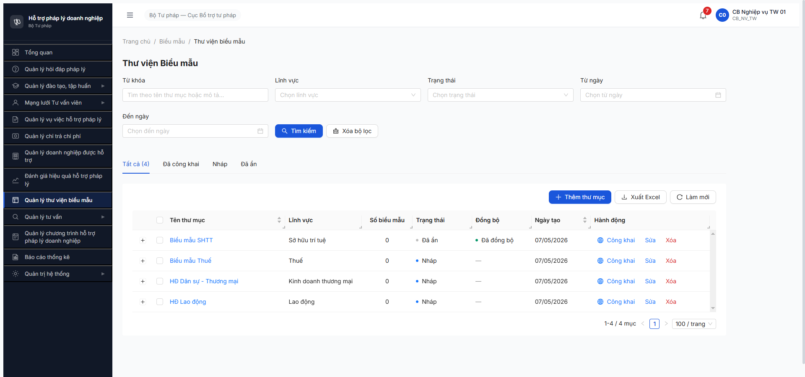
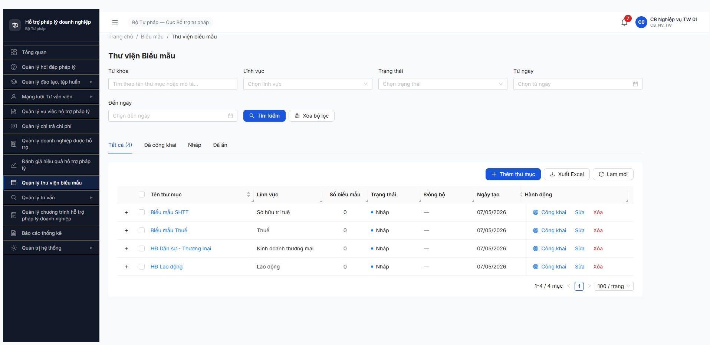

# Bug Report — Thư viện Biểu mẫu (FR-VII v3.5) — R7.4.C1 Workflow

| Thông tin | Giá trị |
|-----------|---------|
| **Dự án** | PM HTPLDN |
| **Môi trường** | http://103.172.236.130:3000/ |
| **Người test** | QA Automation (Claude Code MCP) |
| **Ngày** | 2026-05-07 |
| **Loại test** | Workflow (SM-BIEUMAU 3 transition + 4 trường công khai + BR-PUBLIC-01/02/03) |
| **Round** | R7.4.C1 |
| **Tài liệu tham chiếu** | [`srs-update-2026-5-5/_DELTA-MAP-FR09.md`](../../../../../input/srs-update-2026-5-5/_DELTA-MAP-FR09.md) · [`srs-update-2026-5-5/CHANGELOG-v3-to-v3.5.md`](../../../../../input/srs-update-2026-5-5/CHANGELOG-v3-to-v3.5.md) line 1010-1117 · [`srs-fr-12-tv-chuyen-sau.md`](../../../../../input/srs-update-2026-5-5/srs-fr-12-tv-chuyen-sau.md) line 1597-1613 (BR-PUBLIC-01/02/03 canonical) |

---

## Tổng hợp

Phát hiện **6** lỗi vi phạm SRS v3.5 FR-VII (Thay đổi 1 + 3 BR mới) trong workflow công khai Thư viện Biểu mẫu.

### Severity breakdown

| Tổng | Critical | Major | Medium | Minor | Trivial |
|------|----------|-------|--------|-------|---------|
| 6    | 2        | 2     | 2      | 0     | 0       |

## Bug Summary Table

| Bug ID | Severity | Priority | Type | TC Ref | **SRS Reference** | Title | Status |
|--------|----------|----------|------|--------|-------------------|-------|--------|
| BUG-BM-001 | Critical | P0 | UI/UX | R7.4.C1 / R7.7.10 | `_DELTA-MAP-FR09.md §1 Áp CR-01` + `CHANGELOG-v3-to-v3.5.md line 1029-1032` (SCR-VII-02 + FR-VII-04 Inputs) | Form Thêm/Sửa Biểu mẫu thiếu 4 trường công khai (Switch + Ảnh + Mô tả CK + File CK) | Open (partial fix R8) |
| ~~BUG-BM-002~~ | Critical | P0 | Workflow | R7.4.C1 | `BR-PUBLIC-02` (`srs-fr-12-tv-chuyen-sau.md` line 1603-1607) | Khi BM chuyển sang `AN`, `ngayCongKhai` KHÔNG clear về NULL | Closed (R8) |
| ~~BUG-BM-003~~ | Major | P1 | Data | R7.4.C1 | `_DELTA-MAP-FR09.md §1 Thay đổi 1.1` + `CHANGELOG-v3-to-v3.5.md line 1034` (BIEU_MAU bảng attributes rename) | BE BIEU_MAU entity chưa rename `laCongKhai → congKhai` + `ngayCongKhai → thoiGianDangTai` | Closed (R8) |
| ~~BUG-BM-004~~ | Major | P1 | Data | R7.4.C1 | `_DELTA-MAP-FR09.md §1 Thay đổi 1.4-1.6` + `CHANGELOG-v3-to-v3.5.md line 1034` (BIEU_MAU + 4 row mới) | BE BIEU_MAU entity thiếu 3 fields công khai (`anhDaiDien`, `moTaCongKhai`, `fileDinhKemCongKhai`) | Closed (R8) |
| BUG-BM-005 | Medium | P2 | UI/UX | R7.4.C1 | `FR-VII-03 §Error Handling E1` (ERR-CK-01 "Thư mục chưa có biểu mẫu, không thể công khai") | UI silent fail — BE trả 409 ERR-CK-01 nhưng KHÔNG hiện toast/notification cho user | Open |
| BUG-BM-006 | Medium | P2 | Data | R7.4.C1 | `FR-VII-01 §Outputs row 4` (`so_bieu_mau auto đếm`) + `SCR-VII-01 row 11` | Cột "Số biểu mẫu" trên list Thư mục không cập nhật sau khi thêm BM (vẫn 0 dù API đã có 1 BM) | Open |

---

## BUG-BM-001 — Form Thêm/Sửa Biểu mẫu thiếu 4 trường công khai theo SRS v3.5

> **Re-test 2026-05-08 R8:** ⚠️ **PARTIAL FIX**. Account `cb_nv_tw_02`. Form `/bieu-mau/them-moi` đã thêm heading "Nội dung công khai trên Cổng PLQG" với 3/4 trường: Ảnh đại diện ✅, Mô tả công khai ✅, File đính kèm công khai ✅. **Vẫn thiếu Switch "Công khai trên Cổng PLQG"** (`evaluate_script` đếm `button[role="switch"]` + `.ant-switch` = 0). Bug giữ Open chờ FE add Switch. Evidence: `screenshots/r8-verify-2026-05-08-bm-001-form-them-bm.png`.

### Mô tả

Theo SRS v3.5 (Thay đổi 1, FR-VII-04 + SCR-VII-02), form Thêm/Sửa Biểu mẫu phải có thêm **4 trường công khai chuyên trang**: (1) Switch "Công khai trên Cổng PLQG", (2) Ảnh đại diện công khai, (3) Mô tả công khai (text), (4) File đính kèm công khai (file[]). Form hiện tại (cả Thêm + Sửa) chỉ có 7 fields v3 cũ, không có bất kỳ field nào trong 4 trường mới → CB Nghiệp vụ không thể bật/tắt công khai cho từng BM, cũng không thể nhập thông tin riêng cho người ngoài đọc.

### Các bước tái hiện

1. Login `cb_nv_tw_01` / `Secret@123` (OTP `666666`).
2. Vào "Quản lý thư viện biểu mẫu" → click thư mục bất kỳ (vd "Biểu mẫu SHTT").
3. Click `[+ Thêm biểu mẫu]` → form tại `/bieu-mau/them-moi`.
4. Quan sát: form có 7 fields (Thư mục*, Tên biểu mẫu*, Lĩnh vực, Loại hình, Mô tả, Thứ tự hiển thị, File biểu mẫu*).
5. Lưu BM, mở list, click `[Sửa]` trên 1 BM → form `/bieu-mau/{id}/sua` cũng có cùng 7 fields.

### Kết quả mong đợi

Form Thêm/Sửa Biểu mẫu phải bao gồm thêm:
- Switch "Công khai trên Cổng PLQG" (control `cong_khai`).
- Ảnh đại diện (`anh_dai_dien` — binary upload).
- Mô tả công khai (`mo_ta_cong_khai` — text, KHÁC trường Mô tả nội bộ hiện có).
- File đính kèm công khai (`file_dinh_kem_cong_khai` — file[]).

### Kết quả thực tế

Cả 2 form Thêm + Sửa đều dùng nguyên schema v3 (7 fields), không có Switch và 3 file/text mới. Cũng không có hiển thị `thoi_gian_dang_tai` (read-only field, đáng lẽ hiển thị khi BM đã công khai).

### Bằng chứng


---

## ~~BUG-BM-002~~ — BR-PUBLIC-02 vi phạm: ngayCongKhai không clear khi BM chuyển sang AN [CLOSED]

> **Re-test 2026-05-08 R8:** ✅ **CLOSED**. Account `cb_nv_tw_02`. Workflow: tạo BM `Test BM R8 verify` (id `d3143771-...`) trong TM "Biểu mẫu Thuế" → Công khai TM (BM `congKhai=true`, `thoiGianDangTai="2026-05-08T00:00:29.805Z"`) → Ẩn TM. API GET `/api/v1/bieu-maus/d3143771-...` trả: `trangThai="AN"`, `congKhai=false`, `thoiGianDangTai=null`. BR-PUBLIC-02 đã enforce.

### Mô tả

Theo BR-PUBLIC-02 ("Khi set `cong_khai = 0`: clear `thoi_gian_dang_tai` về NULL; gọi API gỡ khỏi Cổng PLQG; ghi audit"), khi BM chuyển trạng thái sang `AN` (cờ công khai tắt), trường `ngayCongKhai`/`thoiGianDangTai` phải reset về NULL. Thực tế BE giữ nguyên timestamp lần bật cuối — vi phạm rule "lần bật mới nhất" của BR-PUBLIC-03 (vì khi bật lại timestamp có thể không refresh do điều kiện so sánh).

### Các bước tái hiện

1. Login `cb_nv_tw_01`, vào thư mục "Biểu mẫu SHTT" có 1 BM (`BM-20260507-001`) ở NHAP.
2. Quay ra list Thư viện, click `[Công khai]` trên row "Biểu mẫu SHTT" → confirm.
3. Quan sát: TM + BM cascade sang `CONG_KHAI`, BM `ngayCongKhai = "2026-05-07T11:26:54.611Z"` (auto-fill OK).
4. Click `[Ẩn]` trên cùng row → confirm. TM hiện "Đã ẩn".
5. Query GET `/api/v1/bieu-maus/0f425c10-8bfd-4dcd-ac34-e724135a2872`:
   ```json
   { "trangThai": "AN", "laCongKhai": false, "ngayCongKhai": "2026-05-07T11:26:54.611Z" }
   ```

### Kết quả mong đợi

Sau bước 4 (Ẩn), API response phải có `ngayCongKhai: null` (hoặc field mới `thoiGianDangTai: null`) — theo BR-PUBLIC-02. Kết hợp gọi API Cổng PLQG gỡ + ghi audit `UNPUBLISH`.

### Kết quả thực tế

`laCongKhai` đã flip về `false` ✅ nhưng `ngayCongKhai` giữ nguyên timestamp lần bật cuối ❌. Field không được reset → vi phạm BR-PUBLIC-02.

### Bằng chứng


```text
GET /api/v1/bieu-maus/0f425c10-8bfd-4dcd-ac34-e724135a2872 (sau khi Ẩn TM)
Response:
{
  "id": "0f425c10-8bfd-4dcd-ac34-e724135a2872",
  "trangThai": "AN",
  "laCongKhai": false,
  "ngayCongKhai": "2026-05-07T11:26:54.611Z",   ← phải NULL theo BR-PUBLIC-02
  "syncStatus": "SUCCESS"
}
```

---

## ~~BUG-BM-003~~ — BE BIEU_MAU chưa rename `laCongKhai → congKhai` + `ngayCongKhai → thoiGianDangTai` [CLOSED]

> **Re-test 2026-05-08 R8:** ✅ **CLOSED**. Account `cb_nv_tw_02`. API GET `/api/v1/bieu-maus/{id}` keys: có `congKhai` + `thoiGianDangTai` (mới), KHÔNG còn `laCongKhai` + `ngayCongKhai` (cũ). BE đã rename xong.

### Mô tả

SRS v3.5 Thay đổi 1.1 yêu cầu rename 2 cột trong entity BIEU_MAU + THU_MUC_BIEU_MAU: `la_cong_khai → cong_khai` và `ngay_cong_khai → thoi_gian_dang_tai`. Đây là rename mass impact (FR-09 + FR-16 outbound API + ERD master). BE response hiện tại vẫn dùng tên cũ.

### Các bước tái hiện

1. Login `cb_nv_tw_01`, seed 1 BM, công khai TM cha.
2. Query GET `/api/v1/bieu-maus/{id}` qua DevTools console:
   ```js
   await fetch('/api/v1/bieu-maus/0f425c10-8bfd-4dcd-ac34-e724135a2872', {credentials:'include'}).then(r=>r.json())
   ```
3. Inspect response keys.

### Kết quả mong đợi

Response BIEU_MAU phải có:
- `congKhai: boolean` (KHÔNG phải `laCongKhai`).
- `thoiGianDangTai: datetime` (KHÔNG phải `ngayCongKhai`).

### Kết quả thực tế

Response trả về `laCongKhai` và `ngayCongKhai` (tên v3 cũ). Không có key `congKhai` hoặc `thoiGianDangTai` nào.

### Bằng chứng

```text
GET /api/v1/bieu-maus/0f425c10-8bfd-4dcd-ac34-e724135a2872
Response (keys liên quan):
{
  "trangThai": "CONG_KHAI",
  "laCongKhai": true,           ← phải đổi thành "congKhai"
  "ngayCongKhai": "2026-05-07T11:26:54.611Z",  ← phải đổi thành "thoiGianDangTai"
  ...
}
```

(Không có ảnh chụp riêng — bug ở response payload, dùng inspector của ảnh BUG-BM-002.)



---

## ~~BUG-BM-004~~ — BE BIEU_MAU entity thiếu 3 fields công khai mới [CLOSED]

> **Re-test 2026-05-08 R8:** ✅ **CLOSED**. Account `cb_nv_tw_02`. API GET `/api/v1/bieu-maus/{id}` response có 3 field mới: `anhDaiDien=null`, `moTaCongKhai=null`, `fileDinhKemCongKhai=null`. BE đã add fields theo SRS v3.5.

### Mô tả

SRS v3.5 Thay đổi 1.4-1.6 yêu cầu thêm 3 cột mới cho BIEU_MAU: `anh_dai_dien` (binary), `mo_ta_cong_khai` (text), `file_dinh_kem_cong_khai` (file[]). Phục vụ form Switch công khai + nội dung soạn riêng cho người ngoài Cổng PLQG. BE response không có 3 keys này.

### Các bước tái hiện

1. Như BUG-BM-003, query BM detail.
2. Check `Object.keys(response.data)` có chứa 3 trường mới không.

### Kết quả mong đợi

Response BIEU_MAU phải có thêm 3 keys: `anhDaiDien`, `moTaCongKhai`, `fileDinhKemCongKhai`.

### Kết quả thực tế

```js
{
  anhDaiDien: false,           // missing
  moTaCongKhai: false,         // missing
  fileDinhKemCongKhai: false   // missing
}
```

3 fields đều `'fieldName' in obj === false`.

### Bằng chứng

```text
GET /api/v1/bieu-maus/0f425c10-8bfd-4dcd-ac34-e724135a2872
Verify (DevTools console):
{
  "fields_present_4cong_khai": {
    "anhDaiDien": false,
    "moTaCongKhai": false,
    "fileDinhKemCongKhai": false
  }
}
```


---

## BUG-BM-005 — UI silent fail khi BE trả 409 ERR-CK-01 (Công khai thư mục rỗng)

### Mô tả

Theo FR-VII-03 §Error Handling E1, khi user công khai thư mục rỗng, hệ thống phải báo "Thư mục chưa có biểu mẫu, không thể công khai" (mã `ERR-CK-01`). BE trả đúng response 409 với message tiếng Việt, nhưng FE KHÔNG hiển thị toast / notification → user bấm xong không biết tại sao thư mục vẫn ở NHAP.

### Các bước tái hiện

1. Login `cb_nv_tw_01`, vào "Quản lý thư viện biểu mẫu". Đảm bảo thư mục target rỗng (vd "Biểu mẫu SHTT" lúc chưa seed BM).
2. Click `[Công khai]` trên row → popconfirm "Công khai thư mục này lên Cổng PLQG?" → click `[Công khai]`.
3. Quan sát UI: thư mục vẫn ở "Nháp", không có toast / message gì.
4. Kiểm tra Network tab: POST `/api/v1/thu-muc-bieu-maus/{id}/cong-khai` → 409 với body `{"success":false,"error":{"code":"ERR-CK-01","message":"Thư mục rỗng — không thể công khai khi chưa có biểu mẫu"}}`.
5. `evaluate_script` query `.ant-message`, `.ant-notification`, `[role="alert"]` → toastCount = 0.

### Kết quả mong đợi

FE phải bắt 409 ERR-CK-01 và hiển thị toast lỗi đỏ với nội dung từ `error.message` (hoặc fallback message tiếng Việt mapped theo `error.code`). Pattern này đã chuẩn ở các module khác (vd Vụ việc).

### Kết quả thực tế

UI không react gì sau khi popconfirm đóng. User thấy thư mục vẫn ở Nháp nhưng không hiểu lý do. Console chỉ log generic "Failed to load resource: 409 Conflict" của browser.

### Bằng chứng



```text
POST /api/v1/thu-muc-bieu-maus/59f01d24-447b-4195-9841-d7240e91be9e/cong-khai
Request body: {}
Response 409:
{
  "success": false,
  "error": {
    "code": "ERR-CK-01",
    "message": "Thư mục rỗng — không thể công khai khi chưa có biểu mẫu",
    "timestamp": "2026-05-07T11:21:40.306Z",
    "requestId": "req-1778152900465-p505m0jd"
  }
}

DOM check sau request:
{ toastCount: 0, errCount: 0, bodyHasError409Text: false }
```

---

## BUG-BM-006 — Cột "Số biểu mẫu" trên list Thư mục không cập nhật sau khi thêm BM

### Mô tả

Theo FR-VII-01 §Outputs row 4 + SCR-VII-01 row 11, cột "Số biểu mẫu" phải auto đếm số BM thuộc thư mục. Sau khi seed thành công 1 BM (BM-20260507-001) vào thư mục "Biểu mẫu SHTT", quay lại list thư mục, cột "Số biểu mẫu" vẫn hiển thị `0`. Nhấn "Làm mới" cũng không update.

### Các bước tái hiện

1. Login `cb_nv_tw_01`, vào thư mục "Biểu mẫu SHTT" (đang 0 BM).
2. Click `[+ Thêm biểu mẫu]` → upload file .docx 917B + tên "Biểu mẫu SHTT - test R7.4.C1" → click `[Tạo biểu mẫu]`.
3. Verify BM-20260507-001 hiện trong list BM (1/1 mục).
4. Quay về list Thư viện (click breadcrumb "Biểu mẫu") → cột "Số biểu mẫu" của row "Biểu mẫu SHTT" = `0` (sai).
5. Click `[Làm mới]` → counter vẫn = `0`.
6. Sau công khai TM → counter vẫn = `0` dù BE trả `version: 4` cho TM.

### Kết quả mong đợi

Cột "Số biểu mẫu" phải = `1` (số BM chưa xóa của thư mục). API GET `/api/v1/thu-muc-bieu-maus` cần trả thêm `soBieuMau` (auto đếm) hoặc FE phải compute từ `/bieu-maus?thuMucId=`.

### Kết quả thực tế

Counter đứng yên `0` sau cả 3 lần verify (sau seed, sau Làm mới, sau cong-khai). Response GET `/thu-muc-bieu-maus` không có key `soBieuMau`.

### Bằng chứng


```text
GET /api/v1/thu-muc-bieu-maus?page=1&pageSize=100&sortBy=ngayTao&sortOrder=DESC (sau seed BM)
Response: {
  "data": [
    { "id": "59f01d24-...", "tenThuMuc": "Biểu mẫu SHTT", "trangThai": "CONG_KHAI", "version": 4 }
    /* không có key "soBieuMau" */
  ]
}

GET /api/v1/bieu-maus?thuMucId=59f01d24-447b-4195-9841-d7240e91be9e
Response: meta.total = 1   ← BM thực tế = 1
```

---

## Phụ lục — Môi trường test

| Thành phần | Giá trị |
|------------|---------|
| URL ứng dụng | http://103.172.236.130:3000/ |
| OTP login | `666666` (bypass) |
| MailHog (OTP inbox) | http://103.172.236.130:8025 |
| API base | http://103.172.236.130:3000/api/v1 |
| Frontend | React + Vite + Ant Design |
| Xác thực | Cookie `access_token` (JWT RS256) + OTP |
| Tool test | Chrome DevTools MCP (`mcp__chrome-devtools__*`) |

**Account dùng test:** `cb_nv_tw_01` (CB Nghiệp vụ TW, role `CB_NV_TW`, đơn vị `BTP-TW`).

**Test data tạo trong session:**
- TM "Biểu mẫu SHTT" id `59f01d24-447b-4195-9841-d7240e91be9e` (đã có sẵn từ R7.3.7).
- BM "Biểu mẫu SHTT - test R7.4.C1" id `0f425c10-8bfd-4dcd-ac34-e724135a2872` mã `BM-20260507-001` (seed mới qua UI, file 917B `.docx`).

---

*Bug report generated: 2026-05-07 18:30 | QA Automation via Claude Code MCP*

> **R7.7.10 functional bugs:** Xem file riêng [`bug-report-function-bm-r7-7-10.md`](bug-report-function-bm-r7-7-10.md) (BUG-BM-007 MinIO localhost broken preview+download · BUG-BM-008 silent reject upload).
