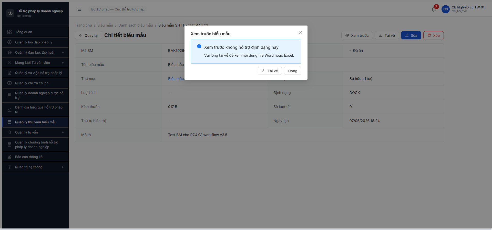

# Bug Report — Thư viện Biểu mẫu (FR-VII v3.5) — R7.7.10 Functional

| Thông tin | Giá trị |
|-----------|---------|
| **Dự án** | PM HTPLDN |
| **Môi trường** | http://103.172.236.130:3000/ |
| **Người test** | QA Automation (Claude Code MCP) |
| **Ngày** | 2026-05-07 |
| **Loại test** | Functional 47 TC (CRUD + filter + file upload + preview + download) |
| **Round** | R7.7.10 |
| **Tài liệu tham chiếu** | [`output/funtion/7.9-bieu-mau.md`](../../../../funtion/7.9-bieu-mau.md) (47 TC) · [`srs-update-2026-5-5/_DELTA-MAP-FR09.md`](../../../../../input/srs-update-2026-5-5/_DELTA-MAP-FR09.md) · [`functional-test-report-r7-7-10-bm.md`](../../functional/bieu-mau/functional-test-report-r7-7-10-bm.md) |

---

## Tổng hợp

Phát hiện **2** lỗi mới trong functional test R7.7.10 (preview/download MinIO config sai + UI silent reject upload file invalid). Các bug khác từ workflow đã log riêng tại [`bug-report-flow-bm-r7-4-c1.md`](bug-report-flow-bm-r7-4-c1.md) (6 bugs BUG-BM-001..006).

### Severity breakdown

| Tổng | Critical | Major | Medium | Minor | Trivial |
|------|----------|-------|--------|-------|---------|
| 2    | 1        | 0     | 1      | 0     | 0       |

## Bug Summary Table

| Bug ID | Severity | Priority | Type | TC Ref | **SRS Reference** | Title | Status |
|--------|----------|----------|------|--------|-------------------|-------|--------|
| BUG-BM-007 | Critical | P0 | Integration | BM-007 + BM-008 | `FR-VII-04 §Processing — Xem trực tuyến` + `§Processing — Tải về` | Preview + Download BM dùng MinIO presigned URL trỏ `localhost:9000` → user browser không kết nối được (`ERR_CONNECTION_REFUSED`) | Open (R8 confirmed) |
| BUG-BM-008 | Medium | P2 | UI/UX | BM-016 | `FR-VII-04 §Error Handling E1` (ERR-BM-01 "Chỉ chấp nhận file doc, docx, xls, xlsx") | Form Thêm BM upload file `.txt` → FE silent rejected (ẩn file khỏi upload list) nhưng KHÔNG hiển thị toast/error message → user không biết file không hợp lệ | Open |

---

## BUG-BM-007 — Preview + Download Biểu mẫu trỏ MinIO `localhost:9000` không reachable

> **Re-test 2026-05-08 R8:** ❌ **VẪN OPEN**. Account `cb_nv_tw_02`. Tạo BM mới + click Xem trước → BE redirect 302 đến `http://localhost:9000/htpldn/...?X-Amz-...` → `net::ERR_CONNECTION_REFUSED`. Cấu hình MinIO public host vẫn sai. Evidence: `screenshots/r8-verify-2026-05-08-bm-007-localhost-still.png` + network reqid 227-230.

### Mô tả

Khi user click "Xem trước" hoặc "Tải về" trên BM, FE gọi BE endpoint `/api/v1/bieu-maus/{id}/download` → BE trả 302 redirect đến MinIO presigned URL bắt đầu bằng `http://localhost:9000/htpldn/...?X-Amz-Algorithm=...`. Trên trình duyệt user thực, `localhost:9000` trỏ về máy user (không có MinIO), nên kết nối refused → preview hiện "Không kết nối được máy chủ", download thất bại. Cấu hình MinIO public host bị sai trên BE.

### Các bước tái hiện

1. Login `cb_nv_tw_01` → vào `/bieu-mau/danh-sach?thuMucId=...` (TM có ≥1 BM).
2. Click vào tên BM → mở chi tiết `/bieu-mau/{id}`.
3. Click `[Xem trước]` → modal "Xem trước biểu mẫu" mở, content area hiện thông báo lỗi "Không kết nối được máy chủ".
4. Click `[Tải về]` → không có file nào được tải. Network tab thấy `HEAD /api/v1/bieu-maus/{id}/download` → 302 → `HEAD http://localhost:9000/htpldn/00000000-0000-4000-8000-000000000001/2026/05/.../test-bm-r7-4-c1.docx?X-Amz-Algorithm=AWS4-HMAC-SHA256&...` → `net::ERR_CONNECTION_REFUSED`.

### Kết quả mong đợi

BE phải dùng MinIO public host (vd `http://103.172.236.130:9000/...` hoặc subdomain `s3.htpldn.local`) thay vì `localhost`. URL presigned phải reachable từ user browser. Preview + Download phải hoạt động cho cả file `.docx` (917B test).

### Kết quả thực tế

Preview hiện "Không kết nối được máy chủ" (kết quả của fetch fail). Download không trigger được file. Cả 2 chức năng broken cho mọi BM hiện có.

### Bằng chứng



```text
GET /api/v1/bieu-maus/0f425c10-8bfd-4dcd-ac34-e724135a2872/download
→ 302 Found
Location: http://localhost:9000/htpldn/00000000-0000-4000-8000-000000000001/2026/05/d303f3e8-162f-48f8-82a3-153d04db805e/test-bm-r7-4-c1.docx?X-Amz-Algorithm=AWS4-HMAC-SHA256&X-Amz-Credential=htpldn_minio%2F20260507%2Fus-east-1%2Fs3%2Faws4_request&X-Amz-Date=20260507T114850Z&X-Amz-Expires=300&X-Amz-SignedHeaders=host&X-Amz-Signature=cc448f4...

HEAD http://localhost:9000/...
→ net::ERR_CONNECTION_REFUSED  (browser của user, không có MinIO)
```

---

## BUG-BM-008 — Form Thêm BM silent reject file invalid (không có toast/error)

### Mô tả

Theo FR-VII-04 §Error Handling E1, khi user upload file sai định dạng (vd `.txt`, `.pdf`, `.exe`), hệ thống phải báo lỗi `ERR-BM-01` "Chỉ chấp nhận file doc, docx, xls, xlsx". Thực tế FE filter client-side: file invalid không xuất hiện trong upload list, nhưng KHÔNG hiển thị toast/notification/inline error nào → user không biết file đã bị reject, có thể nghĩ là upload chậm và bấm "Tạo biểu mẫu" → form lỗi 422 không clear cause.

### Các bước tái hiện

1. Login `cb_nv_tw_01` → vào `/bieu-mau/them-moi`.
2. Click vùng kéo-thả file (label "Kéo thả hoặc click để chọn file. Chỉ chấp nhận: .doc, .docx, .xls, .xlsx — Tối đa 20MB") → upload file `.txt` (vd `test-bm-invalid.txt` 36 bytes).
3. Quan sát: vùng upload trống, không có file item, không có toast lỗi, không có inline error message.
4. `evaluate_script` query `.ant-message`, `.ant-notification`, `.ant-upload-list-item` → toastCount=0, fileItems=[].

### Kết quả mong đợi

FE phải hiển thị toast/notification màu đỏ với message `ERR-BM-01` ("Chỉ chấp nhận file doc, docx, xls, xlsx") khi user upload file sai format. Tương tự cho file vượt 20MB → `ERR-BM-02`.

### Kết quả thực tế

UI không có feedback nào — file bị reject im lặng. Cùng pattern UI silent fail như [`BUG-BM-005`](bug-report-flow-bm-r7-4-c1.md#bug-bm-005--ui-silent-fail-khi-be-trả-409-err-ck-01-công-khai-thư-mục-rỗng) (server error 409 cũng silent).

### Bằng chứng


```text
DOM check sau upload .txt:
{
  toastCount: 0,
  toastTexts: [],
  errCount: 0,
  errTexts: [],
  fileItems: [],          ← file đã bị filter client-side
  bodyHasInvalid: true    ← chỉ là static label, không phải error msg
}
```

---

## Phụ lục — Môi trường test

| Thành phần | Giá trị |
|------------|---------|
| URL ứng dụng | http://103.172.236.130:3000/ |
| OTP login | `666666` (bypass) |
| MailHog (OTP inbox) | http://103.172.236.130:8025 |
| API base | http://103.172.236.130:3000/api/v1 |
| Frontend | React + Vite + Ant Design |
| Storage | MinIO (config sai — `localhost:9000` thay vì public host) |
| Tool test | Chrome DevTools MCP (`mcp__chrome-devtools__*`) |

**Account dùng test:** `cb_nv_tw_01` (CB Nghiệp vụ TW, role `CB_NV_TW`, đơn vị `BTP-TW`).

**Test data dùng:** BM-20260507-001 "Biểu mẫu SHTT - test R7.4.C1" id `0f425c10-8bfd-4dcd-ac34-e724135a2872` (file `test-bm-r7-4-c1.docx` 917B từ R7.4.C1) + file invalid `test-bm-invalid.txt` 36B (tạo riêng cho BM-016).

> **Liên quan:** Workflow bugs (BUG-BM-001..006) đã log tại [`bug-report-flow-bm-r7-4-c1.md`](bug-report-flow-bm-r7-4-c1.md). 10 TC CR-01 (BM-041..050) BLOCKED do BUG-BM-001 (form thiếu 4 trường công khai).

---

*Bug report generated: 2026-05-07 19:00 | QA Automation via Claude Code MCP*
