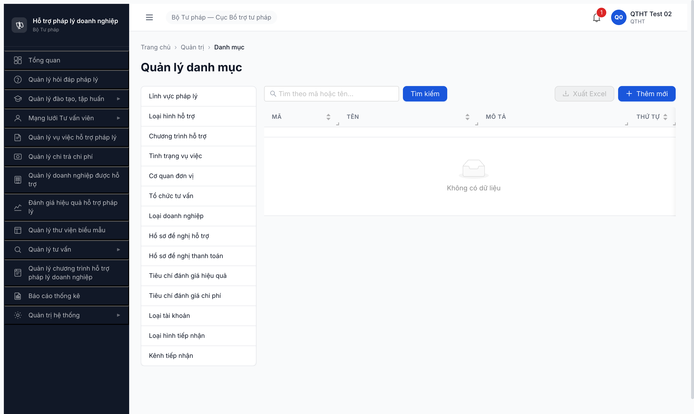
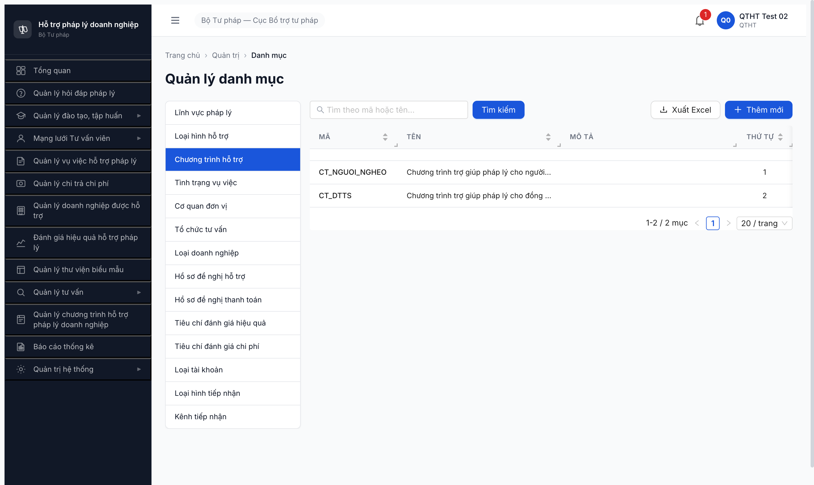
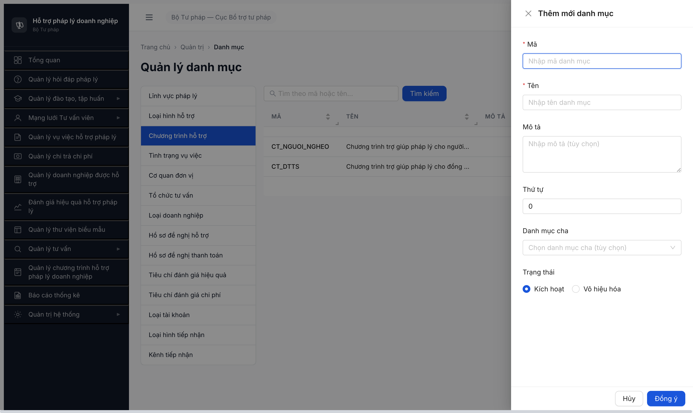
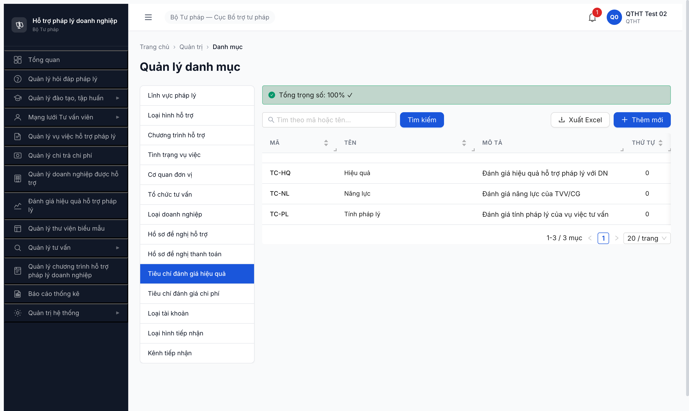

# Bug Report — R7.1.6 DM Chương trình hỗ trợ (FR-VIII-03)

| Thông tin | Giá trị |
|-----------|---------|
| **Dự án** | PM Hỗ trợ Pháp lý Doanh nghiệp |
| **Môi trường** | http://103.172.236.130:3000/quan-tri/danh-muc/CHUONG_TRINH_HT |
| **Người test** | QA Automation via Claude Code (qtht_02) |
| **Ngày** | 2026-05-06 |
| **Loại test** | Seed via UI (R7.1.6 Phase 1) |
| **Round** | Round 7 |
| **Tài liệu tham chiếu** | [SRS FR-VIII-03 line 236-258 srs-fr-10-quan-tri.md](../../../input/srs-update-2026-5-5/srs-fr-10-quan-tri.md) · [tasks/todo.md R7.1.6](../../../../tasks/todo.md) |
| **2-source verify** | ✅ NotebookLM Haizz-HTPLDN (id `a4ae45bf-...`) + grep SRS local — match 100% (xem Bằng chứng) |

---

## Tổng hợp

Phát hiện **2** lỗi khi seed DM Chương trình hỗ trợ qua UI SCR-VIII-01.

### Severity breakdown

| Tổng | Critical | Major | Medium | Minor | Trivial |
|------|----------|-------|--------|-------|---------|
| 2    | 0        | 2     | 0      | 0     | 0       |

## Bug Summary Table

| Bug ID | Severity | Priority | Type | TC Ref | **SRS Reference** | Title | Status |
|--------|----------|----------|------|--------|-------------------|-------|--------|
| BUG-DM-CTHT-001 | Major | P1 | UI/UX | R7.1.6 DM2 | `FR-VIII-03 §Inputs row 6` (line 256) | FE sub-tab "Chương trình hỗ trợ" routing key sai — navigate tới `/CHUONG_TRINH_HO_TRO` thay vì `/CHUONG_TRINH_HT` per SRS | Open |
| BUG-DM-CTHT-002 | Major | P1 | UI/UX | R7.1.6 DM2 | `FR-VIII-03 §Inputs row 3-5` (line 253-255) | Form Thêm mới thiếu 3 trường SRS: `thoi_gian_bat_dau` / `thoi_gian_ket_thuc` / `don_vi_chu_tri` | Open |

---

## BUG-DM-CTHT-001 — FE sub-tab routing key sai SRS (`CHUONG_TRINH_HO_TRO` thay vì `CHUONG_TRINH_HT`)

### Mô tả

Khi click sub-tab "Chương trình hỗ trợ" trong SCR-VIII-01, FE navigate tới URL `/quan-tri/danh-muc/CHUONG_TRINH_HO_TRO` và gửi `loaiDanhMuc=CHUONG_TRINH_HO_TRO` cho BE — KHÔNG đúng SRS spec. SRS FR-VIII-03 §Inputs row 6 quote chính xác `loai_danh_muc = 'CHUONG_TRINH_HT'`. Hậu quả: BE 422 reject (errCode `ERR-VAL-SYS-00-01`) → table empty + create fail. Khi navigate trực tiếp URL đúng `/quan-tri/danh-muc/CHUONG_TRINH_HT` thì BE 200 + DB hiện 2 record pre-existing (`CT_NGUOI_NGHEO`/`CT_DTTS`) — chứng minh BE đã đúng, FE config sai routing key.

### Các bước tái hiện

1. Login `qtht_02` / `Secret@123` / OTP `666666`.
2. Sidebar > Quản trị hệ thống > Danh mục dùng chung.
3. Click sub-tab "Chương trình hỗ trợ".
4. Quan sát URL bar = `/quan-tri/danh-muc/CHUONG_TRINH_HO_TRO`, table empty "Không có dữ liệu".
5. Network tab: `GET /api/v1/danh-muc?loaiDanhMuc=CHUONG_TRINH_HO_TRO&page=1&pageSize=20` → **422**.
6. Click [+ Thêm mới], fill mã/tên → Đồng ý.
7. Network: `POST /api/v1/danh-muc` body chứa `"loaiDanhMuc":"CHUONG_TRINH_HO_TRO"` → **422**.
8. So sánh: navigate trực tiếp `http://103.172.236.130:3000/quan-tri/danh-muc/CHUONG_TRINH_HT` → table render 2 record (`CT_NGUOI_NGHEO` + `CT_DTTS`).

### Kết quả mong đợi

- Click sub-tab "Chương trình hỗ trợ" → URL = `/quan-tri/danh-muc/CHUONG_TRINH_HT` (theo SRS FR-VIII-03 line 256: `loai_danh_muc = 'CHUONG_TRINH_HT'`).
- Payload `loaiDanhMuc=CHUONG_TRINH_HT` → BE 200 list + 200 create.

### Kết quả thực tế

- URL navigate sai: `/quan-tri/danh-muc/CHUONG_TRINH_HO_TRO`.
- BE 422 với errCode `ERR-VAL-SYS-00-01` field `loaiDanhMuc` message "loaiDanhMuc không hợp lệ" — BE whitelist enum đúng SRS, FE gửi value sai.

### Bằng chứng

**1. Ảnh chụp URL sai (table empty do BE 422):**



**2. Ảnh chụp URL đúng `/CHUONG_TRINH_HT` — table render 2 record pre-existing:**



**3. SRS local quote nguyên văn (`input/srs-update-2026-5-5/srs-fr-10-quan-tri.md` line 247-258):**

```
**Inputs — trường riêng:**

| # | Tên field | Kiểu logic | Bắt buộc | Ràng buộc | Mặc định | Nguồn |
|---|----------|-----------|----------|-----------|----------|-------|
| 1 | ma | text | Y | — | — | user input |
| 2 | ten | text | Y | — | — | user input |
| 3 | thoi_gian_bat_dau | date | Y | Ngày bắt đầu CT | — | user input |
| 4 | thoi_gian_ket_thuc | date | N | Ngày kết thúc CT | — | user input |
| 5 | don_vi_chu_tri | text | Y | Đơn vị chủ trì | — | user input |
| 6 | loai_danh_muc | text | Y (system) | = 'CHUONG_TRINH_HT' | CHUONG_TRINH_HT | system |
```

**4. NotebookLM verify (Haizz-HTPLDN id `a4ae45bf-cea0-4325-8fee-b1e0be702cf2`)** — query "verify enum constant `loai_danh_muc` chính xác là 'CHUONG_TRINH_HT' hay 'CHUONG_TRINH_HO_TRO'?" → AI trả lời:

> "Giá trị constant chính xác được hệ thống gán tự động là **`'CHUONG_TRINH_HT'`** (không phải `'CHUONG_TRINH_HO_TRO'`)" — citation source-id `e2d6294a-9f64-45c7-9932-b3a429418dfe`.

**Match status:** ✅ NotebookLM + SRS local match 100%.

**5. API response 422:**

```json
POST /api/v1/danh-muc 422
Request: {"ma":"CT2025-01","ten":"Hỗ trợ DNNVV 2025","moTa":"...","thuTu":0,"trangThai":"KICH_HOAT","danhMucChaId":null,"loaiDanhMuc":"CHUONG_TRINH_HO_TRO"}
Response: {"success":false,"error":{"code":"ERR-VAL-SYS-00-01","field":"loaiDanhMuc","message":"loaiDanhMuc không hợp lệ","timestamp":"2026-05-06T16:36:16.068Z","requestId":"115bd185-c867-434f-ac1f-28c9181f81e9"}}
```

---

## BUG-DM-CTHT-002 — Form Thêm mới thiếu 3 trường SRS yêu cầu

### Mô tả

Modal "Thêm mới danh mục" cho `CHUONG_TRINH_HT` chỉ render 6 trường chung TPL-DM-CRUD (Mã / Tên / Mô tả / Thứ tự / Danh mục cha / Trạng thái) — KHÔNG render 3 trường specific theo SRS FR-VIII-03 §Inputs row 3-5: `thoi_gian_bat_dau` (date, bắt buộc), `thoi_gian_ket_thuc` (date, tùy chọn), `don_vi_chu_tri` (text, bắt buộc). Form đã verify trên cả URL sai (`/CHUONG_TRINH_HO_TRO`) lẫn URL đúng (`/CHUONG_TRINH_HT`) — đều thiếu 3 trường này. So sánh: form DM6 `TIEU_CHI_DG_HIEU_QUA` cùng SCR-VIII-01 đã render đúng 3 trường specific (Trọng số / Min / Max) → FE có pattern conditional render theo loaiDanhMuc nhưng quên implement nhánh `CHUONG_TRINH_HT`.

### Các bước tái hiện

1. Login `qtht_02`.
2. Navigate URL đúng SRS: `http://103.172.236.130:3000/quan-tri/danh-muc/CHUONG_TRINH_HT`.
3. Click [+ Thêm mới] → modal mở.
4. Quan sát danh sách trường form.

### Kết quả mong đợi

- Form render 3 trường specific theo SRS FR-VIII-03 §Inputs row 3-5 (line 253-255 srs-fr-10-quan-tri.md):
  - `thoi_gian_bat_dau` — date picker, **bắt buộc** (Y).
  - `thoi_gian_ket_thuc` — date picker, **tùy chọn** (N) — cho chương trình open-ended.
  - `don_vi_chu_tri` — text input, **bắt buộc** (Y).

### Kết quả thực tế

- Form chỉ có 6 trường chung TPL-DM-CRUD: Mã (required) / Tên (required) / Mô tả / Thứ tự (number, default 0) / Danh mục cha (combobox optional) / Trạng thái (radio Kích hoạt/Vô hiệu hóa).
- Không có date picker, không có textbox đơn vị chủ trì.

### Bằng chứng

**1. Ảnh form trên URL đúng `/CHUONG_TRINH_HT` — chỉ có 6 trường chung:**



**2. So sánh form DM6 cùng SCR-VIII-01 render đúng 3 trường specific (Trọng số / Min / Max):**



**3. SRS local quote nguyên văn 3 trường thiếu (`input/srs-update-2026-5-5/srs-fr-10-quan-tri.md` line 253-255):**

```
| 3 | thoi_gian_bat_dau | date | Y | Ngày bắt đầu CT | — | user input |
| 4 | thoi_gian_ket_thuc | date | N | Ngày kết thúc CT | — | user input |
| 5 | don_vi_chu_tri | text | Y | Đơn vị chủ trì | — | user input |
```

**4. NotebookLM verify** — query "FR-VIII-03 có 3 trường thoi_gian_bat_dau/thoi_gian_ket_thuc/don_vi_chu_tri không?" → AI trả lời:

> "Có chính xác 3 trường này trong đặc tả với đúng kiểu dữ liệu và ràng buộc bắt buộc (Y) / không bắt buộc (N) như bạn đã nêu" — citation source-id `e2d6294a-9f64-45c7-9932-b3a429418dfe`.

**Match status:** ✅ NotebookLM + SRS local match 100%.

---

## Phụ lục — Môi trường test

| Thành phần | Giá trị |
|------------|---------|
| URL ứng dụng | http://103.172.236.130:3000/ |
| OTP login | `666666` bypass |
| MailHog | http://103.172.236.130:8025 |
| API base | http://103.172.236.130:3000/api/v1 |
| Frontend | React + Vite + Ant Design |
| Xác thực | JWT + OTP |
| Tool test | Chrome DevTools MCP |
| Account dùng | qtht_02 (vai trò QTHT, cấp TW) |
| NotebookLM | https://notebooklm.google.com/notebook/a4ae45bf-cea0-4325-8fee-b1e0be702cf2 |

---

*Bug report generated: 2026-05-06 | QA Automation via Claude Code | 2-source verify NotebookLM + SRS local*
