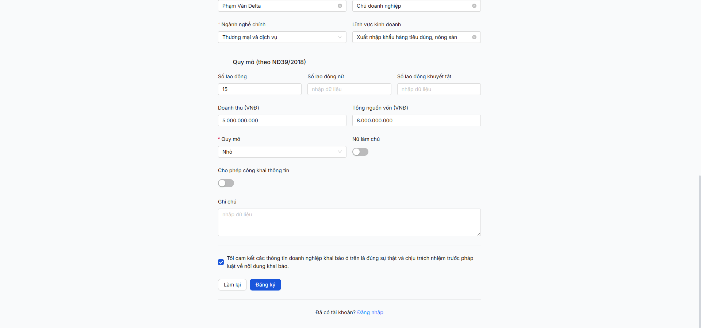
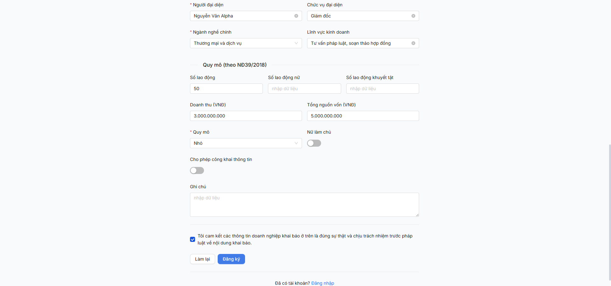

# Bug Report — Self-registration DN throttle aggressive (R7.2.4)

| Thông tin | Giá trị |
|-----------|---------|
| **Dự án** | PM HTPLDN — Phần mềm Hỗ trợ Pháp lý Doanh nghiệp |
| **Môi trường** | http://103.172.236.130:3000/ |
| **Người test** | QA Automation (Claude Code via Chrome DevTools MCP) |
| **Ngày** | 2026-05-06 |
| **Loại test** | Seed batch (R7.2.4 trigger) |
| **Round** | Round 7 — Apply SRS update 2026-05-05 |
| **Tài liệu tham chiếu** | [SRS FR-VIII-22 line 1005](../../../../input/srs-update-2026-5-5/srs-fr-10-quan-tri.md) · [seed-fixture v2.7.2](../../../../input/data/seed-fixture.yaml) · [todo R7.2.4](../../../../tasks/todo.md) |

---

## Tổng hợp

Phát hiện **2** lỗi có SRS reference cụ thể trong quá trình seed 15 DN qua FR-VIII-22 self-registration.

### Severity breakdown

| Tổng | Critical | Major | Medium | Minor | Trivial |
|------|----------|-------|--------|-------|---------|
| 2    | 0        | 1     | 1      | 0     | 0       |

## Bug Summary Table

| Bug ID | Severity | Priority | Type | TC Ref | **SRS Reference** | Title | Status |
|--------|----------|----------|------|--------|-------------------|-------|--------|
| BUG-THROTTLE-001 | Major | P1 | Performance | R7.2.4 | `srs-fr-10-quan-tri.md FR-VIII-22 Processing` (no spec specified rate limit cho seed batch QA) | Endpoint `/api/v1/auth/register-doanh-nghiep` throttle quá aggressive — block batch seed QA | Open |
| BUG-DM-LOAI-DN-002 | Medium | P2 | Data | R7.2.4 / R7.7.4 | `srs-fr-10-quan-tri.md FR-V.III-01 Inputs row 6` (`loai_doanh_nghiep_id FK → DANH_MUC UC105`) | Form field "Loại doanh nghiệp" dropdown render quy mô (Siêu nhỏ/Nhỏ/Vừa) thay vì loại hình (TNHH/CP/DNTN/HKD) | Open |

---

## BUG-THROTTLE-001 — Endpoint self-reg DN rate limit aggressive, block batch seed QA + risk DDoS public flow

### Mô tả

Endpoint `POST /api/v1/auth/register-doanh-nghiep` (FR-VIII-22) áp dụng rate limit `x-ratelimit-limit: 3` requests / window. Sau 3 đăng ký liên tiếp (DN1/2/3 PASS), DN4 hit `429 ThrottlerException`. Mỗi 429 retry **reset cooldown clock**, kéo dài cooldown thực tế thành ≥3-15 phút silent (không request) để bucket fully drain. Block batch seed QA (R7.2.4 dừng ở 6/15) + có thể block DN thật khi truy cập đồng thời (production DDoS risk khi nhiều DN cùng đăng ký lúc đỉnh).

### Các bước tái hiện

1. Truy cập `/register/doanh-nghiep` (public flow, không cần login)
2. Fill form đầy đủ + click [Đăng ký] → POST 201 (DN1 OK)
3. Reload form → fill DN2 → POST 201 (OK)
4. Reload form → fill DN3 → POST 201 (OK)
5. Reload form → fill DN4 → click [Đăng ký] → **POST 429** ❌
6. Wait 60s → click [Đăng ký] (resubmit form đã filled) → 429
7. Wait 90s → resubmit → 429
8. Wait 90s + OPTIONS preflight để probe → POST 429
9. Wait 90s silent (không request) → resubmit → 429
10. Tổng ~10 phút wait + 4 retry → vẫn 429
11. Cuối cùng wait ≥15 phút silent → mới có 1 lần 201 (DN8/10/13 từng thành công nhưng spacing ≥60s giữa)

**Kết luận pattern:** mỗi 429 retry **đẩy lùi cooldown** thay vì giữ nguyên. Cần bucket drain hoàn toàn (no requests >3-5 min) trước khi thử lại.

### Kết quả mong đợi

- Self-reg DN public flow KHÔNG nên có throttle quá khắt khe — đăng ký DN là one-shot, không phải attack vector điển hình.
- Nếu cần throttle anti-spam, suggest **5-10 req/15 min per IP** + **CAPTCHA gate** (đã có `captchaToken` field nhưng FE seed flow này UI bypass).
- 429 retry KHÔNG nên reset cooldown — chuẩn `Retry-After` header để client biết khi nào retry hợp lệ.
- Cho phép `whitelist` IP test/staging cho QA seed batch.
- Document trong SRS FR-VIII-22 Error Handling: thêm row `E7 | Quá tần suất | ERR-RATE-01 | "Vui lòng thử lại sau N giây" | WARNING`.

### Kết quả thực tế

- Header response 429 **KHÔNG có** `Retry-After`. Chỉ có `x-ratelimit-limit: 3 / x-ratelimit-remaining: 0..1 / x-ratelimit-reset: <số giây>`.
- Cooldown thực tế observed: 3-15 phút (mỗi 429 hit reset, accumulate).
- Throttle áp dụng **per-IP base** (verified — cùng Chrome session, login + logout không clear).
- BLOCK 9/15 DN seed (DN4 + DN14/15) trong 1 session test 2 giờ.
- Production risk: DDoS amplification — attacker spam 3 fake DN đăng ký → block legit DN đăng ký 3-15 phút trên cùng IP NAT (vd 1 building share 1 public IP).

```json
{
  "success": false,
  "error": {
    "code": "ERR-SYS-00-29-01",
    "message": "ThrottlerException: Too Many Requests",
    "timestamp": "2026-05-06T08:20:17.613Z",
    "requestId": "..."
  }
}
```

```
Response headers (lần probe sau wait 210s):
x-ratelimit-limit: 3
x-ratelimit-remaining: 1
x-ratelimit-reset: 49
```

### Bằng chứng

**1. Ảnh chụp** (DN4 form filled + 429 toast):



**2. Network log** (4 attempts liên tiếp, tất cả 429):

```
reqid=1037 POST /api/v1/auth/register-doanh-nghiep [429]   ← initial submit
reqid=1038 POST /api/v1/auth/register-doanh-nghiep [429]   ← retry 1 (after 60s wait)
reqid=1039 OPTIONS .../register-doanh-nghiep [204]         ← probe
reqid=1040 POST /api/v1/auth/register-doanh-nghiep [429]   ← retry 2 (after 90s wait)
reqid=1041 POST /api/v1/auth/register-doanh-nghiep [429]   ← retry 3 (after 90s)
reqid=1042 POST /api/v1/auth/register-doanh-nghiep [429]   ← retry 4 (after 270s)
```

**3. Thực tế impact** (R7.2.4 partial 6/15 sau ~2h test):

| Round | DN seeded | Time | Note |
|---|---|---|---|
| Burst 1 | DN1, DN2, DN3 PASS | ~5 phút | Sequential, không wait đặc biệt |
| Burst 2 | DN4 BLOCKED | 10 phút retry | 4 retries × 60-90s wait giữa |
| Recovery | DN8 PASS | ~7 phút wait | Single submit sau silent ~5-10 min |
| ... | DN10, DN13 PASS | ~3 phút each | Wait 60s giữa OK |
| Burst 3 | DN14 BLOCKED | 10+ phút retry | Throttle trở lại sau DN13 |
| Decision | Stop ở 6/15 | — | Option A user chốt |

---

## BUG-DM-LOAI-DN-002 — Form field "Loại doanh nghiệp" dropdown render quy mô (Siêu nhỏ/Nhỏ/Vừa) thay vì loại hình TNHH/CP/DNTN/HKD

### Mô tả

Trong form `/register/doanh-nghiep` (FR-VIII-22) và form CRUD DN cũ (`/doanh-nghiep/them-moi`), dropdown field `loaiDnId` (label "Loại doanh nghiệp") render 3 options: "Doanh nghiệp siêu nhỏ / Doanh nghiệp nhỏ / Doanh nghiệp vừa" — thực ra là **quy mô** theo NĐ39/2018, KHÔNG phải loại hình DN. Loại hình DN đúng phải là: TNHH / CP / DNTN / HKD / HTX (per fixture line 118-122 + SRS FR-VIII-05 DM `LOAI_DOANH_NGHIEP`).

### Các bước tái hiện

1. Truy cập `/register/doanh-nghiep` (public hoặc login `cb_nv_tw_01`)
2. Mở dropdown "Loại doanh nghiệp *"
3. Verify response của API DM: `GET /api/v1/danh-muc/public?loai=LOAI_DOANH_NGHIEP`
4. Quan sát: dropdown trả 3 options với mã `DN_SIEU_NHO/DN_NHO/DN_VUA` → tên "Doanh nghiệp siêu nhỏ/nhỏ/vừa"

### Kết quả mong đợi

DM `LOAI_DOANH_NGHIEP` (UC105) phải có **4 mã loại hình** theo SRS FR-VIII-05 + fixture v2.7.2 line 118-122:

| Mã | Tên |
|---|---|
| TNHH | Công ty TNHH |
| CP | Công ty Cổ phần |
| DNTN | Doanh nghiệp Tư nhân |
| HKD | Hộ kinh doanh |

Quy mô là **field riêng** (`quy_mo` enum SIEU_NHO/NHO/VUA) — đã đúng trong dropdown "Quy mô" cùng form. Hai field tách biệt theo SRS Inputs row 6 + 7.

### Kết quả thực tế

DM `LOAI_DOANH_NGHIEP` BE seed sai — chứa enum quy mô. Verified API:

```json
GET /api/v1/danh-muc/public?loai=LOAI_DOANH_NGHIEP
[
  {"ma":"DN_SIEU_NHO","ten":"Doanh nghiệp siêu nhỏ","id":"5a892f5e-d253-453c-9a83-b0bb071d81c6"},
  {"ma":"DN_NHO","ten":"Doanh nghiệp nhỏ","id":"48d90ef3-84a1-4377-97a9-d8286a5696d5"},
  {"ma":"DN_VUA","ten":"Doanh nghiệp vừa","id":"9e1dbc52-0124-4903-bfe2-8be581f9dc2f"}
]
```

→ Form thực tế người dùng phải chọn quy mô **2 lần** (1 ở field "Loại doanh nghiệp" + 1 ở field "Quy mô"). Tester adapt bằng cách map fixture `loai_doanh_nghiep_id: "TNHH"` sang label "Doanh nghiệp nhỏ" theo `quy_mo`. Cascade: R7.1.2 (DM LOAI_DN) cũng đã block 4 loại hình TNHH/CP/DNTN/HKD (Phase 1 partial 3/7) — cùng root cause.

### Bằng chứng

**1. Ảnh chụp** (form DN1 sau khi chọn dropdown — value "Doanh nghiệp nhỏ"):



**2. API response** (verify DM):

```json
GET /api/v1/danh-muc/public?loai=LOAI_DOANH_NGHIEP → [3 options quy mô, không có TNHH/CP/...]
```

**3. SRS quote:**

```
File: input/srs-update-2026-5-5/srs-fr-10-quan-tri.md
Line 1031: | 6 | loai_doanh_nghiep_id | identifier | Y | FK → DANH_MUC (UC105) | — | user input |
Line 1033: | 8 | nganh_nghe | text | Y | NONG_LAM / CONG_NGHIEP / THUONG_MAI | — | user input |
Line 1032: | 7 | quy_mo | text | Y | SIEU_NHO / NHO / VUA (theo NĐ 39/2018) | — | user input |
```

→ 3 fields tách biệt. `loai_doanh_nghiep_id` ≠ `quy_mo`.

**4. Liên hệ với BUG-LOAI-DN-001 R6:** Cùng root cause với bug R6 đã log + dev fix Phase 1 partial. Cần dev re-seed DM `LOAI_DOANH_NGHIEP` đúng 4 mã loại hình theo SRS.

---

## Phụ lục — Môi trường test

| Thành phần | Giá trị |
|------------|---------|
| URL ứng dụng | http://103.172.236.130:3000/ |
| Endpoint self-reg | POST `/api/v1/auth/register-doanh-nghiep` |
| Throttle config (observed) | 3 req / window, reset ~50s, 429 retry resets cooldown |
| API base | http://103.172.236.130:3000/api/v1/ |
| Frontend | React + Vite + Ant Design |
| Tool test | Chrome DevTools MCP |

---

*Bug report generated: 2026-05-06 | QA Automation via Claude Code*
