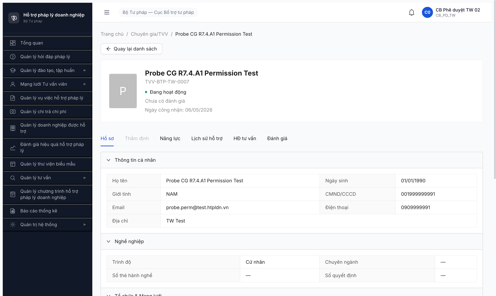

# Bug Report — TVV/CG Workflow R7.4.A1-CG

| Thông tin | Giá trị |
|-----------|---------|
| **Dự án** | PM HTPLDN |
| **Môi trường** | http://103.172.236.130:3000 |
| **Người test** | QA Automation (Chrome DevTools MCP) |
| **Ngày** | 2026-05-06 |
| **Loại test** | Workflow (R7.4.A1-CG) |
| **Round** | R7 |
| **Tài liệu tham chiếu** | [smoke/6.4-sm-tvv.md](../../smoke/6.4-sm-tvv.md) · [funtion/7.4-chuyen-gia-tvv.md](../../funtion/7.4-chuyen-gia-tvv.md) · [workflow/workflow-test-report-r7-4-a1-cg.md](../workflow/workflow-test-report-r7-4-a1-cg.md) |

---

## Tổng hợp

Phát hiện **1 bug Major** trong test R7.4.A1-CG advance state happy path. BE còn dùng tên state cũ + skip state mới `CHO_KICH_HOAT` mà SRS update v3.5 đã chèn.

### Severity breakdown

| Tổng | Critical | Major | Medium | Minor | Trivial |
|------|----------|-------|--------|-------|---------|
| 1    | 0        | 1     | 0      | 0     | 0       |

## Bug Summary Table

| Bug ID | Severity | Priority | Type | TC Ref | **SRS Reference** | Title | Status |
|--------|----------|----------|------|--------|-------------------|-------|--------|
| BUG-CG-A1-001 | Major | P0 | Workflow | TC-CG-A1-05 | `srs-update-2026-5-5/srs-fr-04-chuyen-gia-tvv.md:2011` + `smoke/6.4-sm-tvv.md` line 24-25, 76 + `funtion/7.4-chuyen-gia-tvv.md` TVV-011 | State sau phê duyệt = `DANG_HOAT_DONG`, spec yêu cầu `CHO_KICH_HOAT` | Open |

---

## BUG-CG-A1-001 — State sau CB PD phê duyệt sai spec v3.5 (`DANG_HOAT_DONG` vs `CHO_KICH_HOAT`)

### Mô tả

Sau khi CB PD POST `/api/v1/tu-van-viens/{id}/phe-duyet`, BE trả `trangThai: "DANG_HOAT_DONG"`. Theo SRS update 2026-05-05 §FR-IV-NEW-04 đã rename `DANG_HOAT_DONG → HOAT_DONG` và chèn state mới `CHO_KICH_HOAT` giữa `CHO_PHE_DUYET` và `HOAT_DONG`. State đúng phải là `CHO_KICH_HOAT` (chờ chủ TK click mail kích hoạt → `HOAT_DONG`). UI hiển thị badge "Đang hoạt động" sai trên TVV-BTP-TW-0007 ngay sau phê duyệt — cho phép phân công VV/HD ngay khi TK chưa kích hoạt.

### Các bước tái hiện

1. Login `cb_nv_tw_02`, seed 1 CG `MOI_DANG_KY` qua `POST /api/v1/tu-van-viens` (loaiTvv=CG, đầy đủ field cccd/email/diaChi/trinhDo/toChucChinhId/linhVucIds/donViQuanLyId).
2. POST `/api/v1/tu-van-viens/{id}/tham-dinh` body `{nhom1KetQua:true, nhom2Diem:80, nhom3Diem:null, nhom4ThamGia:true, ketLuan:"DAT", version:1, trinhDuyet:false}` → state `DANG_THAM_DINH`.
3. POST `/api/v1/tu-van-viens/{id}/tham-dinh` body `{...same..., version:2, trinhDuyet:true}` → state `CHO_PHE_DUYET`.
4. Login `cb_pd_tw_02`, POST `/api/v1/tu-van-viens/{id}/phe-duyet` body `{version:3}`.
5. Quan sát: Response `data.trangThai`. Cũng GET `/api/v1/tu-van-viens/{id}` xem state.
6. Mở UI `/chuyen-gia-tvv/{id}` xem badge state header.

### Kết quả mong đợi

- Response body POST `/phe-duyet`: `trangThai: "CHO_KICH_HOAT"` (theo SRS `srs-update-2026-5-5/srs-fr-04-chuyen-gia-tvv.md:2011` + SM `smoke/6.4-sm-tvv.md` line 25 "State mới CHO_KICH_HOAT chèn giữa CHO_PHE_DUYET và HOAT_DONG").
- Sau khi chủ TK click mail kích hoạt (FR-VIII-26) + đặt MK lần đầu → state TVV chuyển từ `CHO_KICH_HOAT` → `HOAT_DONG` (KHÔNG dùng tên `DANG_HOAT_DONG`).
- UI badge phải hiển thị "Chờ kích hoạt tài khoản" với màu xanh dương, không phải "Đang hoạt động" xanh lá.
- TVV ở `CHO_KICH_HOAT` KHÔNG nên xuất hiện trong dropdown phân công VV/HD (vì TK chưa kích hoạt).

### Kết quả thực tế

- Response body POST `/phe-duyet`: `trangThai: "DANG_HOAT_DONG"` (BE còn dùng tên cũ + skip CHO_KICH_HOAT trên TVV).
- GET `/api/v1/tu-van-viens/{id}` confirm `trangThai: "DANG_HOAT_DONG"` (TVV state) + `taiKhoanId` set.
- UI badge `"Đang hoạt động"` ngay sau phê duyệt, dù chủ TK chưa kích hoạt mail.

```json
{
  "id": "7cb207b8-eea1-44f2-835f-ebd923dbfbc2",
  "version": 4,
  "trangThai": "DANG_HOAT_DONG",
  "maTvv": "TVV-BTP-TW-0007",
  "taiKhoanId": "fdfafbed-a9f9-487f-abb3-3f97770f4491",
  "ngayCongNhan": "2026-05-06",
  "loaiTvv": "CG"
}
```

### Bằng chứng

**1. Ảnh chụp TVV-0007 sau phê duyệt — UI hiển thị "Đang hoạt động" thay vì "Chờ kích hoạt tài khoản":**



**2. Spec quote (`smoke/6.4-sm-tvv.md` line 19-25):**

```
| `CHO_KICH_HOAT` | Chờ kích hoạt tài khoản | TVV/CG đã được công nhận, có tài khoản nhưng chưa kích hoạt | Xanh dương |
| `HOAT_DONG` | Đang hoạt động | TVV/CG đã kích hoạt tài khoản, sẵn sàng nhận phân công | Xanh lá |

> **⚠️ Đổi tên** so với v3 cũ: `DANG_HOAT_DONG` → **`HOAT_DONG`** (đồng bộ enum CHECK constraint, cite `srs-update-2026-5-5/srs-fr-04-chuyen-gia-tvv.md:2011`).
> **⚠️ State mới** `CHO_KICH_HOAT` chèn giữa `CHO_PHE_DUYET` và `HOAT_DONG` — workflow tự cấp tài khoản qua FR-VIII-15 + kích hoạt qua FR-VIII-26.
```

**3. Functional spec quote (`funtion/7.4-chuyen-gia-tvv.md` line 78):**

```
| TVV-011 | UC45 | CB PD phê duyệt → state `CHO_KICH_HOAT` (KHÔNG phải `HOAT_DONG`); hệ thống tự cấp TK + gửi mail kích hoạt | Workflow | P0 |
```

---

## Phụ lục — Môi trường test

| Thành phần | Giá trị |
|------------|---------|
| URL ứng dụng | http://103.172.236.130:3000 |
| OTP login | `666666` bypass |
| MailHog inbox | http://103.172.236.130:8025 |
| Account thẩm định | `cb_nv_tw_02` / Secret@123 |
| Account phê duyệt | `cb_pd_tw_02` / Secret@123 |
| TVV evidence | TVV-BTP-TW-0007 (`7cb207b8-eea1-44f2-835f-ebd923dbfbc2`) |
| Endpoint phê duyệt | `POST /api/v1/tu-van-viens/{id}/phe-duyet` body `{version}` |
