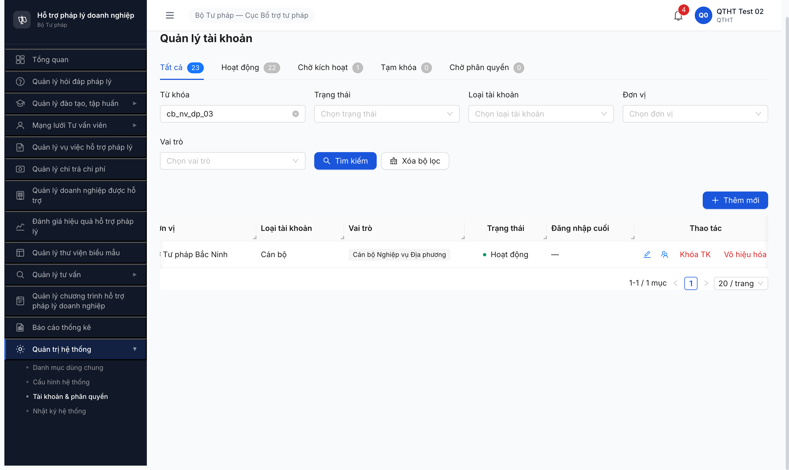

# Bug Report — R7.7.8a TAI_KHOAN State Machine (FR-VIII-15 + FR-VIII-26 + FR-VIII-19)

| Thông tin | Giá trị |
|-----------|---------|
| **Dự án** | PM Hỗ trợ Pháp lý Doanh nghiệp |
| **Môi trường** | http://103.172.236.130:3000/quan-tri/tai-khoan |
| **Người test** | QA Automation via Claude Code (qtht_02) |
| **Ngày** | 2026-05-07 |
| **Loại test** | Functional SM-TAIKHOAN R7.7.8a |
| **Round** | Round 7 |
| **2-source verify** | ✅ NotebookLM Haizz-HTPLDN (id `a4ae45bf-...`) + grep SRS local — match 100% |

---

## Tổng hợp

Phát hiện **2** lỗi khi test SM-TAIKHOAN (TP-TK-01..11) trên SCR-VIII-08.

> **Note:** BUG-TK-SM-001 (Form thiếu `mat_khau`) đã DROPPED 2026-05-07 — user chốt logic UI/BE đúng: hệ thống tự sinh MK tạm + gửi email + user đổi MK lần đăng nhập đầu (qua FR-VIII-26). SRS doc FR-VIII-15 §Inputs row 5 cần BA fix remove `mat_khau` field.

### Severity breakdown

| Tổng | Critical | Major | Medium | Minor | Trivial |
|------|----------|-------|--------|-------|---------|
| 2    | 0        | 1     | 0      | 1     | 0       |

## Bug Summary Table

| Bug ID | Severity | Priority | Type | TC Ref | **SRS Reference** | Title | Status |
|---|---|---|---|---|---|---|---|
| BUG-TK-SM-002 | Major | P1 | Workflow | TP-TK-05 sau TP-TK-07 | `SM-TAIKHOAN line 2117` + BR-AUTH-07 | so_lan_sai không reset khi QTHT mở khóa thủ công | Open |
| BUG-TK-SM-003 | Minor | P3 | UI/UX | TP-TK-09 verify | `SCR-VIII-08 + SM-TAIKHOAN 5 states` | Tabs SCR-VIII-08 thiếu "Vô hiệu hóa", thay bằng "Chờ phân quyền" (legacy state v3.5) | Open |

---

## BUG-TK-SM-002 — `so_lan_sai` không reset khi QTHT mở khóa thủ công (vi phạm BR-AUTH-07)

### Mô tả

QTHT mở khóa TK qua [Mở khóa] (TP-TK-07) chuyển state TAM_KHOA → HOAT_DONG trên UI thành công. Nhưng BE giữ counter `so_lan_sai` persist, không reset về 0 theo SRS BR-AUTH-07. Hậu quả: TK sau khi mở khóa, login sai 1 lần nữa → trigger LOCKED ngay (vì counter pre-test ≥4 + 1 = 5).

### Các bước tái hiện

1. Login `qtht_02`.
2. Khóa thủ công `cb_nv_dp_03` qua [Khóa TK] (TP-TK-06) → state TAM_KHOA, counter `so_lan_sai` BE = 5 (giả định trigger khóa).
3. Mở khóa qua [Mở khóa] (TP-TK-07) → state UI = HOAT_DONG, tab counter Tạm khóa 1→0.
4. Probe API `POST /api/v1/auth/login` với `cb_nv_dp_03` + MK sai 1 lần.
5. Quan sát: 401 ERR-AUTH-LOCKED-01 ngay attempt 1 + message "Tài khoản tạm khóa do đăng nhập sai quá nhiều lần".

### Kết quả mong đợi

- Sau TP-TK-07 mở khóa: BE reset `so_lan_sai = 0` theo SRS line 2117 quote.
- Login sai 1 lần đầu tiên: 401 ERR-AUTH-INVALID-CRED (sai MK) chứ KHÔNG ERR-AUTH-LOCKED-01.
- User cần sai 5 lần liên tiếp để trigger LOCKED.

### Kết quả thực tế

```json
POST /api/v1/auth/login {"username":"cb_nv_dp_03","password":"WrongPwd1!"}
Status: 401
Response: {"success":false,"error":{"code":"ERR-AUTH-LOCKED-01","message":"Tài khoản tạm khóa do đăng nhập sai quá nhiều lần."}}
```

→ Counter `so_lan_sai` persist từ test trước. UI mở khóa không trigger BE reset counter.

### Bằng chứng

**SRS local quote** (`srs-fr-10-quan-tri.md` line 2117 SM-TAIKHOAN bảng chuyển trạng thái):

```
| Từ | Đến | Trigger | Guard | Action | FR Ref | BR Ref |
| TAM_KHOA | HOAT_DONG | QTHT mở khóa | — | Reset so_lan_sai = 0 | FR-VIII-19 | BR-AUTH-07 |
```

**NotebookLM verify match 100%** (citation source-id `e2d6294a-...`): "TAM_KHOA → HOAT_DONG: QTHT mở khóa | Reset so_lan_sai = 0 | FR-VIII-19 | BR-AUTH-07".

**Severity:** Major — vi phạm BR-AUTH-07 explicit. UX confusion: TK đã được admin mở khóa nhưng user nhập sai 1 lần → bị lock lại liền (như chưa mở khóa).

### Test command (reproduce)

```javascript
// Sau TP-TK-06 + TP-TK-07
await fetch('/api/v1/auth/login', {
  method: 'POST',
  headers: {'Content-Type': 'application/json'},
  body: JSON.stringify({username: 'cb_nv_dp_03', password: 'WrongPwd!'})
})
// Expect 401 ERR-AUTH-INVALID-CRED
// Actual 401 ERR-AUTH-LOCKED-01
```

---

## BUG-TK-SM-003 — Tabs SCR-VIII-08 thiếu "Vô hiệu hóa", thay bằng "Chờ phân quyền"

### Mô tả

SCR-VIII-08 render 5 tabs filter theo trạng thái: Tất cả / Hoạt động / Chờ kích hoạt / Tạm khóa / **Chờ phân quyền**. Theo SM-TAIKHOAN (FR-VIII-15) có 5 states: CHO_KICH_HOAT / CHO_PHAN_QUYEN / HOAT_DONG / TAM_KHOA / **VO_HIEU_HOA**. UI thiếu tab "Vô hiệu hóa" — TK đã VO_HIEU_HOA chỉ thấy ở tab "Tất cả".

Note: Tab "Chờ phân quyền" có trong UI nhưng theo verified Q3 (NotebookLM + SRS line 1285), CHO_PHAN_QUYEN là legacy state cho migration data v2/v3, không có actor v3.5 modern flow → tab luôn count 0 trong production.

### Các bước tái hiện

1. Login `qtht_02` → `/quan-tri/tai-khoan`.
2. Quan sát 5 tabs filter top.
3. Vô hiệu hóa 1 TK (vd `cb_nv_dp_03` qua TP-TK-09) → state VO_HIEU_HOA.
4. Verify: TK không hiện ở tab "Hoạt động" (count -1), không có tab "Vô hiệu hóa" để filter, chỉ thấy ở "Tất cả".

### Kết quả mong đợi

- Tabs có "Vô hiệu hóa" để filter TK VO_HIEU_HOA.
- Hoặc remove tab "Chờ phân quyền" (legacy 0 count) thay bằng "Vô hiệu hóa".

### Kết quả thực tế

- 5 tabs: Tất cả / Hoạt động / Chờ kích hoạt / Tạm khóa / Chờ phân quyền.
- Workaround: dùng filter dropdown "Trạng thái" để filter VO_HIEU_HOA.

### Bằng chứng



**Tab counter quan sát:**
```
Tất cả 23 | Hoạt động 22 | Chờ kích hoạt 1 | Tạm khóa 0 | Chờ phân quyền 0
```
Sum tabs phụ = 22+1+0+0 = 23 chỉ khi không có TK VO_HIEU_HOA. Khi vô hiệu hóa 1 TK → sum = 22 ≠ Tất cả 23 (1 TK VO_HIEU_HOA "biến mất" khỏi tabs phụ).

**Severity:** Minor UX — không block functional, có workaround filter dropdown. Tuy nhiên "Chờ phân quyền" tab gần như dead code v3.5 (count always 0) → recommend BA review đổi tab.

---

## Phụ lục — Môi trường test

| Thành phần | Giá trị |
|---|---|
| URL | http://103.172.236.130:3000/quan-tri/tai-khoan |
| API | `/api/v1/auth/login` · `/api/v1/tai-khoan/*` |
| Account | qtht_02 (admin), cb_nv_dp_03 (lifecycle test target), qa_test_tk_r778a (dummy CHO_KICH_HOAT) |
| Tool | Chrome DevTools MCP |
| NotebookLM | https://notebooklm.google.com/notebook/a4ae45bf-cea0-4325-8fee-b1e0be702cf2 |

---

*Bug report generated: 2026-05-07 | QA Automation via Claude Code | 2-source verify NotebookLM + SRS local*
