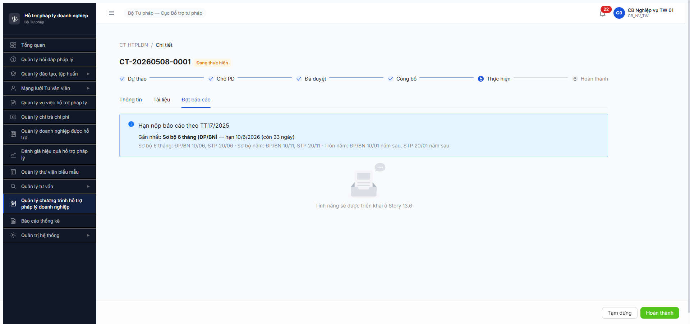

# Bug Report — Chương trình HTPLDN Giai đoạn 2 (FR-XI Đợt báo cáo)

| Thông tin | Giá trị |
|-----------|---------|
| **Dự án** | PM HTPLDN |
| **Môi trường** | http://103.172.236.130:3000/ |
| **Người test** | QA Automation (Claude Code via Chrome DevTools MCP) |
| **Ngày** | 2026-05-08 |
| **Loại test** | Workflow E2E (SM-DOT-BC) |
| **Round** | R7.6.5 R1 |
| **Tài liệu tham chiếu (v3.5)** | [`input/srs-update-2026-5-5/srs-v3.5.md`](../../../../input/srs-update-2026-5-5/srs-v3.5.md) (entity DOT_BAO_CAO §3.4.3.x SM 6 states) · [`input/srs-update-2026-5-5/CHANGELOG-v3-to-v3.5.md` line 149](../../../../input/srs-update-2026-5-5/CHANGELOG-v3-to-v3.5.md) (FR-15 không nâng cấp v3.5) · [`input/srs-v3/srs-fr-15-ct-htpldn.md`](../../../../input/srs-v3/srs-fr-15-ct-htpldn.md) FR-XI-05a..09 (line 442–784) · [`input/quy-trinh-nghiep-vu/02-thu-tu-module.md` ⑭-bis](../../../../input/quy-trinh-nghiep-vu/02-thu-tu-module.md) line 851–875 · [`workflow-test-report-r7-6-5-cthtpldn-gd2.md`](../../workflow/workflow-test-report-r7-6-5-cthtpldn-gd2.md) |

---

## Tổng hợp

R7.6.5 R1 (2026-05-08) phát hiện **2 bug NEW**, đều Major. UI tab Đợt báo cáo chưa build, BE endpoint tổng hợp BC missing → cascade deadlock TW CT + block BUG-CTHTPLDN-B10-001 R7.6.4.

### Severity breakdown

| Tổng | Critical | Major | Medium | Minor | Trivial |
|------|----------|-------|--------|-------|---------|
| 2    | 0        | 2     | 0      | 0     | 0       |

## Bug Summary Table

| Bug ID | Severity | Priority | Type | TC Ref | **SRS Reference** | Title | Status |
|--------|----------|----------|------|--------|-------------------|-------|--------|
| BUG-DOTBC-UI-001 | Major | P1 | UI miss feature | R7.6.5 toàn bộ | `02-thu-tu-module.md` line 325 (tab Đợt báo cáo) + `srs-fr-15-ct-htpldn.md` FR-XI-05a line 442 (SCR-XI-01 tab Đợt BC) | Tab "Đợt báo cáo" hiển thị placeholder "Tính năng sẽ được triển khai ở Story 13.6" — UI hoàn toàn chưa build, block toàn bộ CRUD đợt BC + 7 transitions SM-DOT-BC | **Open** |
| BUG-DOTBC-API-001 | Major | P1 | BE missing endpoint | R7.6.5 B7 + R7.6.4 B10 cascade | `02-thu-tu-module.md` line 875 (`DA_GUI_TW → DA_TONG_HOP \| cb_nv_tw_01 \| [Tổng hợp] (FR-XI-09)`) + `srs-fr-15-ct-htpldn.md` FR-XI-09 line 782 | BE thiếu endpoint chuyển ĐBC sang DA_TONG_HOP. TW CT deadlock vĩnh viễn ở DA_DUYET_KQ → block HOAN_THANH cascade BUG-CTHTPLDN-B10-001 R7.6.4 | **Open** |

---

## BUG-DOTBC-UI-001 — Tab "Đợt báo cáo" UI chưa build

### Mô tả

Vào CT chi tiết (`/ct-htpldn/{id}`) ở state `DANG_THUC_HIEN`, click tab "Đợt báo cáo" (uid tab 3 trong SCR-XI-01). UI hiển thị:
- Banner deadline TT17/2025 OK (đúng spec).
- Placeholder image "Trống" + text **"Tính năng sẽ được triển khai ở Story 13.6"**.
- KHÔNG có nút `[+ Tạo đợt mới]`, KHÔNG có bảng đợt BC, KHÔNG có form lập BC.

→ Hoàn toàn không thể thực hiện CRUD đợt BC qua UI hoặc tiến hành 7 transitions SM-DOT-BC qua giao diện.

### Các bước tái hiện

1. Login `cb_nv_tw_01` (hoặc bất kỳ role có quyền R trên CHUONG_TRINH_HTPL).
2. Vào module "Quản lý Chương trình HTPLDN" → click vào CT bất kỳ ở state `DANG_THUC_HIEN` hoặc `HOAN_THANH` (theo spec line 325 — nút `[+ Tạo đợt mới]` chỉ bật ở 2 state này, nhưng tab vẫn luôn hiển thị).
3. Click tab "Đợt báo cáo" trong header chi tiết CT.
4. **Quan sát:** Banner OK + ảnh "Trống" + text "Tính năng sẽ được triển khai ở Story 13.6". Tab Tài liệu cùng level cũng có thể trong cùng trạng thái — cần check riêng.

### Kết quả mong đợi

Theo [`02-thu-tu-module.md` line 325](../../../../input/quy-trinh-nghiep-vu/02-thu-tu-module.md):
> Banner nhắc deadline TT17/2025 + bảng các đợt báo cáo (cột: Mã / Tên / Kỳ BC / Hạn nộp / Trạng thái). Click vào đợt → drill-down sang form lập báo cáo. Tab luôn hiển thị; **nút [+ Tạo đợt mới] chỉ bật khi CT ở `DANG_THUC_HIEN` hoặc `HOAN_THANH`**.

Theo [`srs-fr-15-ct-htpldn.md` FR-XI-05a](../../../../input/srs-v3/srs-fr-15-ct-htpldn.md) line 442+:
- SCR-XI-01 tab Đợt báo cáo phải support: list ĐBC theo CT, action `[Tạo mới]` (UC195), form `[Bắt đầu lập BC]` (UC169 FR-XI-06), `[Trình duyệt KQ]` (UC170 FR-XI-07).

→ UI phải có ít nhất bảng ĐBC + nút Tạo mới khi CT ở `DANG_THUC_HIEN`.

### Kết quả thực tế

UI chỉ render placeholder "Tính năng sẽ được triển khai ở Story 13.6" — story FE rõ ràng chưa được dev hoàn thành.

### Tác động

- R7.6.5 toàn bộ KHÔNG thể test qua UI → fallback API (BE built).
- R7.7.15 functional 42 TC nhóm Đợt BC bị block (~12 TC).
- BUG-CTHTPLDN-B10-001 R7.6.4 không có entry-point UI để recover (user end không thể tạo đợt BC → tổng hợp → cho phép HOAN_THANH).
- Cascade block R7.7.13 Báo cáo (cần BC HTPLDN ready).

### Bằng chứng



### SRS verification (2 source — v3.5 + v3 legacy)

- [`input/srs-update-2026-5-5/srs-v3.5.md`](../../../../input/srs-update-2026-5-5/srs-v3.5.md) §3.4.3.x định nghĩa entity `DOT_BAO_CAO` với 6 state SM-DOT-BC và quan hệ FK `chuong_trinh_id → CHUONG_TRINH_HTPL`.
- [`input/srs-v3/srs-fr-15-ct-htpldn.md`](../../../../input/srs-v3/srs-fr-15-ct-htpldn.md) line 442 (FR-XI-05a) "Quản lý đợt báo cáo CT HTPLDN" định nghĩa rõ chức năng Tab Đợt BC.
- [`02-thu-tu-module.md` line 325](../../../../input/quy-trinh-nghiep-vu/02-thu-tu-module.md) yêu cầu UI render bảng + nút.

→ 2-source xác nhận UI phải có chức năng đầy đủ, nhưng FE chưa build.

---

## BUG-DOTBC-API-001 — BE thiếu endpoint /tong-hop, TW CT deadlock vĩnh viễn ở DA_DUYET_KQ

### Mô tả

Đợt BC đã đẩy đến state `DA_DUYET_KQ`. HATEOAS link forward duy nhất là `gui-tw` (`POST /api/v1/dot-bao-caos/{id}/gui-tw`). Tuy nhiên:
- Spec line 874: `gui-tw` chỉ áp BN/ĐP — TW user gọi → 403 `ERR-PERM-SYS-00-01` (đúng spec).
- Spec line 875 yêu cầu transition tiếp theo `DA_GUI_TW → DA_TONG_HOP` qua `[Tổng hợp]` cb_nv_tw_01, FR-XI-09 (UC172).
- **BE chưa expose endpoint** cho transition này. Probe 6 pattern (`/tong-hop`, `/tonghop`, `/consolidate`, `/aggregate`, `/finalize`, `/mark-tong-hop`, `/tw-tong-hop`, `/consolidate-bc`) đều trả 404 `ERR-SYS-00-04-01`.

### Các bước tái hiện

1. Tạo CT TW (cấp TW, donViId root) ở state DANG_THUC_HIEN — đã có sẵn CT-20260508-0001 từ R7.6.4 R2.
2. Login `cb_nv_tw_01`, qua API tạo Đợt BC mới → state TAO_DOT.
3. POST /start (soLieuTongHop mock) → DANG_LAP_BC.
4. POST /submit-bc → CHO_DUYET_KQ.
5. Login `cb_pd_tw_01`, POST /approve-bc với `{quyetDinh:"PHE_DUYET"}` → DA_DUYET_KQ.
6. Quay về `cb_nv_tw_01` (TW user). HATEOAS chỉ ra `gui-tw`. POST /gui-tw → **403 Forbidden** (đúng spec, BN/ĐP only).
7. Probe các endpoint candidate cho transition cuối → tất cả 404.
8. **CT bị deadlock**: ĐBC mãi mãi DA_DUYET_KQ, không thể đạt DA_TONG_HOP.

### Kết quả mong đợi

Theo [`02-thu-tu-module.md` line 875](../../../../input/quy-trinh-nghiep-vu/02-thu-tu-module.md): `DA_GUI_TW → DA_TONG_HOP | cb_nv_tw_01 | [Tổng hợp] (FR-XI-09)` — cần BE expose 1 endpoint POST cho `cb_nv_tw_01` thực hiện transition.

**Cho TW CT** (cấp TW gốc, không qua BN/ĐP), 2 option đều cần BA confirm:
- **Option A:** Auto-skip DA_GUI_TW. BE expose endpoint mới (vd `/tong-hop` hoặc `/finalize`) chấp nhận `DA_DUYET_KQ → DA_TONG_HOP` trực tiếp khi CT cấp TW.
- **Option B:** Cho `cb_nv_tw_01` được phép gọi `gui-tw` trên TW CT (loosen guard) — sau đó `tong-hop` từ DA_GUI_TW.

### Kết quả thực tế

- TW user gọi gui-tw → 403.
- 6 pattern candidate cho /tong-hop → 404.
- CT TW vĩnh viễn không HOAN_THANH được do BUG-CTHTPLDN-B10-001 R7.6.4 (BE check ALL ĐBC = DA_TONG_HOP).

### Bằng chứng

**Probe API:**

```text
GET /api/v1/dot-bao-caos/4b2615d6-.../  → 200, trangThai=DA_DUYET_KQ, _links={gui-tw}

POST /api/v1/dot-bao-caos/4b2615d6-.../gui-tw  Body: {"version":4}
Response 403: {"code":"ERR-PERM-SYS-00-01","message":"Forbidden"}

POST /api/v1/dot-bao-caos/4b2615d6-.../tong-hop      → 404 ERR-SYS-00-04-01
POST /api/v1/dot-bao-caos/4b2615d6-.../tonghop       → 404
POST /api/v1/dot-bao-caos/4b2615d6-.../consolidate   → 404
POST /api/v1/dot-bao-caos/4b2615d6-.../aggregate     → 404
POST /api/v1/dot-bao-caos/4b2615d6-.../finalize      → 404
POST /api/v1/dot-bao-caos/4b2615d6-.../mark-tong-hop → 404
POST /api/v1/dot-bao-caos/4b2615d6-.../tw-tong-hop   → 404
```

**Cascade verify với BUG-CTHTPLDN-B10-001 R7.6.4 (cùng session):**

```text
POST /api/v1/chuong-trinh-htpls/52fe225a-.../complete  Body: {"version":8}
Response 409: {"code":"ERR-VAL-XI-06-10","message":"Khong the hoan thanh: con 2/2 dot bao cao chua DA_TONG_HOP"}
```

→ BE đếm đúng (2 ĐBC chưa DA_TONG_HOP / 2 tổng) — confirm logic BE yêu cầu DA_TONG_HOP. Nhưng không có path để đạt DA_TONG_HOP → vĩnh viễn block.

### Tác động

- TW CT: vĩnh viễn không HOAN_THANH.
- BN/ĐP CT: chưa test (cần seed CT cấp BN/ĐP). Nhưng nếu BN/ĐP gửi TW thành công → DA_GUI_TW, vẫn thiếu endpoint cho TW tổng hợp → cũng deadlock.
- Cascade với BUG-DOTBC-UI-001: dù BE fix, FE vẫn không có UI để gọi → user không tự fix được.

### SRS verification (2 source)

- [`input/srs-v3/srs-fr-15-ct-htpldn.md` FR-XI-09 line 782+](../../../../input/srs-v3/srs-fr-15-ct-htpldn.md) "TW tổng hợp BC" — định nghĩa rõ action.
- [`02-thu-tu-module.md` line 875](../../../../input/quy-trinh-nghiep-vu/02-thu-tu-module.md) — chốt actor `cb_nv_tw_01` cho transition `DA_GUI_TW → DA_TONG_HOP`.
- v3.5 entity DOT_BAO_CAO trong [`srs-update-2026-5-5/srs-v3.5.md`](../../../../input/srs-update-2026-5-5/srs-v3.5.md) §3.4.3.x liệt kê đủ 6 state — DA_TONG_HOP là terminal state.

→ Spec rõ ràng yêu cầu endpoint, BE chưa implement.

---

## Phụ lục — Môi trường test

| Thành phần | Giá trị |
|------------|---------|
| URL ứng dụng | http://103.172.236.130:3000/ |
| API base | `/api/v1/dot-bao-caos` |
| Tool test | Chrome DevTools MCP `evaluate_script` (UI BLOCKED → fallback API) |

---

*Bug report generated: 2026-05-08 R1 R7.6.5 | QA Automation via Claude Code (Chrome DevTools MCP)*
