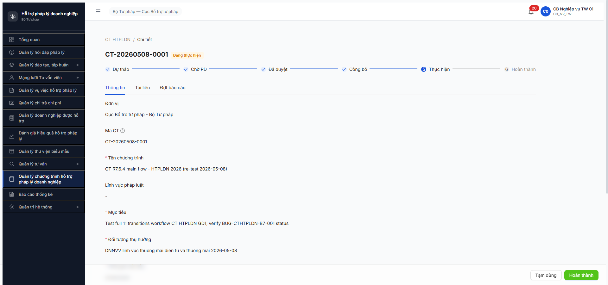
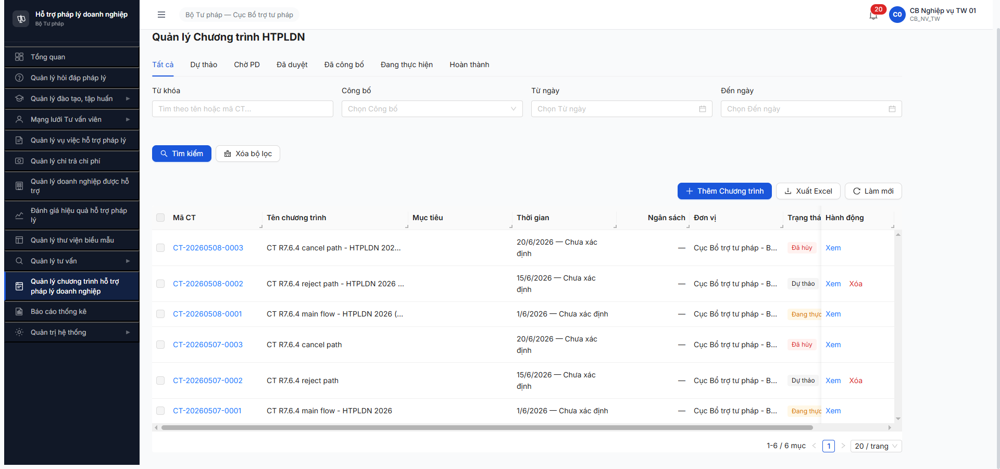

# Bug Report — Chương trình HTPLDN Giai đoạn 1 (FR-XI Workflow)

| Thông tin | Giá trị |
|-----------|---------|
| **Dự án** | PM HTPLDN |
| **Môi trường** | http://103.172.236.130:3000/ |
| **Người test** | QA Automation (Claude Code via Chrome DevTools MCP) |
| **Ngày** | 2026-05-08 (R2 re-test) — sửa từ 2026-05-07 (R1) |
| **Loại test** | Workflow E2E (SM-CHUONG_TRINH_HTPL) + Functional R7.7.15 (Option A P0 only) + Functional R7.7.15.b (Đợt BC SM-DOT-BC API-only) |
| **Round** | R7.6.4 R2 + R7.7.15 + R7.7.15.b (2026-05-08) |
| **Tài liệu tham chiếu (v3.5)** | [`input/srs-update-2026-5-5/srs-v3.5.md §3.4.3.10`](../../../../input/srs-update-2026-5-5/srs-v3.5.md) (entity SM 8 states) · [`input/srs-update-2026-5-5/CHANGELOG-v3-to-v3.5.md` line 149](../../../../input/srs-update-2026-5-5/CHANGELOG-v3-to-v3.5.md) (xác nhận FR-15 KHÔNG nâng cấp v3.5) · [`input/srs-v3/srs-fr-15-ct-htpldn.md`](../../../../input/srs-v3/srs-fr-15-ct-htpldn.md) (legacy v3, vẫn còn hiệu lực — line 903 action-bar) · [`workflow-test-report-r7-6-4-cthtpldn-gd1.md`](../../workflow/workflow-test-report-r7-6-4-cthtpldn-gd1.md) |

---

## Tổng hợp

R7.6.4 R2 (2026-05-08) phát hiện **1 bug NEW** và **đóng 1 bug R1**:
- **BUG-CTHTPLDN-B7-001** R1 (R1 2026-05-07): Major — BE chặn activate, ERR-VAL-XI-06-11 → **CLOSED-VERIFIED 2026-05-08** sau dev fix.
- **BUG-CTHTPLDN-B10-001** R2 (NEW 2026-05-08): Major — BE chặn complete, ERR-VAL-XI-06-10 với message "0/0" contradictory.

> **Rule log bug:** Bug log đúng có SRS reference cụ thể (FR-XI-01 line 903 srs-fr-15 v3 + entity §3.4.3.10 srs-v3.5).

### Severity breakdown (cumulative — 2026-05-08 EOD)

| Tổng | Critical | Major | Medium | Minor | Trivial |
|------|----------|-------|--------|-------|---------|
| 4    | 0        | 4     | 0      | 0     | 0       |

→ B7-001 Closed-verified, B10-001 Open, **DOTBC-UI-001 + DOTBC-API-002 NEW Open** (R7.7.15.b R2).

## Bug Summary Table

| Bug ID | Severity | Priority | Type | TC Ref | **SRS Reference** | Title | Status |
|--------|----------|----------|------|--------|-------------------|-------|--------|
| BUG-CTHTPLDN-B7-001 | Major | P1 | Workflow | R7.6.4 R1 B7 | `srs-fr-15-ct-htpldn.md` v3 row 903 + rows 887-898 | BE validation `ERR-VAL-XI-06-11` yêu cầu `ke_hoach_chi_tiet`+`don_vi_thuc_hien` không có trong spec → block transition `DA_DUYET → DANG_THUC_HIEN` | **Closed-verified 2026-05-08 R2** |
| BUG-CTHTPLDN-B10-001 | Major | P1 | Workflow | R7.6.4 R2 B10 | `srs-fr-15-ct-htpldn.md` v3 row 903 (action `[DANG_THUC_HIEN] Hoan thanh -> SET HOAN_THANH \| click \| -`) + `srs-v3.5.md` §3.4.3.10 (CHECK trang_thai 8 states không nêu pre-condition Đợt BC) | BE validation `ERR-VAL-XI-06-10` "Khong the hoan thanh: con 0/0 dot bao cao chua DA_TONG_HOP" → block `DANG_THUC_HIEN → HOAN_THANH` khi CT chưa có Đợt BC | **Open** |
| BUG-CTHTPLDN-DOTBC-UI-001 | Major | P1 | UI miss feature | R7.7.15.b (toàn Nhóm 3b) | `srs-v3.5.md` §3.4.3.10a entity DOT_BAO_CAO + §4.2.15 nhóm XI (UC169/170/171/172/195/196) đầy đủ spec | UI tab "Đợt báo cáo" hiện placeholder "Tính năng sẽ được triển khai ở Story 13.6" — toàn bộ workflow Đợt BC GĐ2 KHÔNG có UI, chỉ test được qua API | **Open NEW 2026-05-08** |
| BUG-CTHTPLDN-DOTBC-API-002 | Major | P1 | API design | R7.7.15.b R2 CT-038 | `srs-v3.5.md` §3.4.3.10a entity DOT_BAO_CAO (chưa document quan hệ với BAO_CAO_CT_HTPL); test plan CT-038 UC172 | POST `/api/v1/dot-bao-caos/tong-hop` field `baoCaoIds` expect BC entity IDs, GET endpoint pair lại trả DOT entity IDs — list candidates ≠ POST identity. Story 13.6 dev không thể integrate. | **Open NEW R7.7.15.b R2 2026-05-08** |

---

## BUG-CTHTPLDN-B7-001 — [CLOSED-VERIFIED 2026-05-08 R2]

### Mô tả gốc (R1 2026-05-07)

CB NV TW click `[Bắt đầu thực hiện]` trên CT ở trạng thái `DA_DUYET`, BE trả 409 với code `ERR-VAL-XI-06-11` message "Chỉ có thể kích hoạt khi có kế hoạch chi tiết và đơn vị thực hiện". Tuy nhiên SRS FR-XI-01 (rows 887-898 file `srs-fr-15-ct-htpldn.md`) định nghĩa form CT chỉ có 8 trường chính + Đơn vị auto từ user — **KHÔNG có trường `ke_hoach_chi_tiet` cũng không có `don_vi_thuc_hien` riêng biệt**. UI silent (không toast).

### Verify FIX (R2 2026-05-08 10:13)

- **Action:** Re-test B7 với CT-A mới (CT-20260508-0001) ở state DA_DUYET → click [Bắt đầu thực hiện] → modal "Bắt đầu thực hiện?" → Đồng ý.
- **Result:** State chuyển `DANG_THUC_HIEN` thành công. Stepper bước 4 ✓. Buttons: [Tạm dừng] + [Hoàn thành].
- **Network:** `POST /api/v1/chuong-trinh-htpls/52fe225a-1c38-4727-b587-4e505439eaec/activate` → **200 OK** (R1 trả 409 ERR-VAL-XI-06-11).
- **Bằng chứng:** [r7-6-4-r2-ct1-b7-dang-thuc-hien-PASS.png](../image/r7-6-4-r2-ct1-b7-dang-thuc-hien-PASS.png)

→ Bug fix verified. **Status: Closed-verified 2026-05-08.**

---

## BUG-CTHTPLDN-B10-001 — BE chặn complete CT khi không có Đợt BC, message "0/0" contradictory

### Mô tả

CB NV TW click `[Hoàn thành]` trên CT ở trạng thái `DANG_THUC_HIEN`, BE trả 409 với code `ERR-VAL-XI-06-10` message "Khong the hoan thanh: con 0/0 dot bao cao chua DA_TONG_HOP". Phân tích:
1. **Message logic sai:** "0/0 đợt báo cáo chưa DA_TONG_HOP" = không có đợt nào pending — mathematically đó là điều kiện pass, không phải fail.
2. **Hoặc BE đang yêu cầu pre-condition ≥1 Đợt BC DA_TONG_HOP** trước khi cho HOAN_THANH — nhưng pre-condition này **KHÔNG có trong SRS** FR-XI-01 line 903 `[DANG_THUC_HIEN] Hoan thanh ... -> SET HOAN_THANH | click | -` (cột "Điều kiện" rỗng `-`).

UI hiển thị toast lỗi đúng (fix vs UI silent của BUG-B7-001 R1). Toast message lặp nguyên văn BE: "Khong the hoan thanh: con 0/0 dot bao cao chua DA_TONG_HOP" (English leak — không Vietnamese-thuần).

### Các bước tái hiện

1. Login `cb_nv_tw_01` / `Secret@123` (OTP `666666`) → vào module Quản lý Chương trình HTPLDN.
2. Tạo CT mới (4 trường bắt buộc) → state `DU_THAO`.
3. [Đệ trình duyệt] → state `CHO_PHE_DUYET`.
4. Login phụ `cb_pd_tw_01` (cùng cấp TW) → [Phê duyệt] → modal Đồng ý → state `DA_DUYET`.
5. Quay lại `cb_nv_tw_01` → [Bắt đầu thực hiện] → modal Đồng ý → state `DANG_THUC_HIEN` (B7 PASS sau fix BUG-B7-001).
6. **KHÔNG tạo Đợt báo cáo nào.**
7. Click button `[Hoàn thành]`.
8. Modal "Hoàn thành chương trình?" hiện → click `[Đồng ý]`.
9. **Quan sát:** Modal đóng. Toast đỏ "Khong the hoan thanh: con 0/0 dot bao cao chua DA_TONG_HOP" hiện. State CT giữ nguyên `DANG_THUC_HIEN`. DevTools Network: `POST /api/v1/chuong-trinh-htpls/{id}/complete` → 409 với body lỗi `ERR-VAL-XI-06-10`.

### Kết quả mong đợi

**Option A** (theo SRS hiện tại — `srs-fr-15-ct-htpldn.md` line 903):
- Click `[Hoàn thành]` ở state `DANG_THUC_HIEN` → BE phải `SET HOAN_THANH` (không có pre-condition về Đợt BC trong cột Điều kiện = `-`).
- Stepper bước 6 "Hoàn thành" active, không còn action button.

**Option B** (nếu BE logic đúng — yêu cầu ≥1 Đợt BC DA_TONG_HOP):
- SRS FR-XI-01 line 903 + entity 3.4.3.10 trong `srs-v3.5.md` phải bổ sung pre-condition rõ ràng: "Cho phép HOAN_THANH chỉ khi tất cả Đợt BC liên quan ở DA_TONG_HOP, và CT phải có ≥1 Đợt BC".
- Message lỗi cần fix: "0/0" hiện đang vô nghĩa → đổi thành "Chương trình chưa có đợt báo cáo nào — vui lòng tạo và tổng hợp ≥1 đợt báo cáo trước khi hoàn thành."
- UI cần dịch tiếng Việt thuần (không "Khong the hoan thanh" English leak).

### Kết quả thực tế

- BE trả 409 với code `ERR-VAL-XI-06-10`, message "Khong the hoan thanh: con 0/0 dot bao cao chua DA_TONG_HOP".
- FE hiển thị toast đỏ — UX fix vs R1 (R1 silent).
- State CT giữ nguyên `DANG_THUC_HIEN` (verify trên Danh sách CT cột Trạng thái = "Đang thực hiện").
- Cascade: Nếu Option B đúng, R7.6.5 (GĐ2 Đợt BC) sẽ phải hoàn tất ≥1 Đợt BC DA_TONG_HOP trước khi quay lại verify B10.

### Bằng chứng

**1. Ảnh chụp:**





**2. API request / response (verified via evaluate_script trong session live):**

```
GET  /api/v1/chuong-trinh-htpls/52fe225a-1c38-4727-b587-4e505439eaec → 200
     {data: {trangThai: "DANG_THUC_HIEN", version: 8, ...}}

POST /api/v1/chuong-trinh-htpls/52fe225a-1c38-4727-b587-4e505439eaec/complete
Request body: {"version":8}
Response 409:
{
  "success": false,
  "error": {
    "code": "ERR-VAL-XI-06-10",
    "message": "Khong the hoan thanh: con 0/0 dot bao cao chua DA_TONG_HOP",
    "timestamp": "2026-05-08T03:20:11.248Z",
    "requestId": "41795bb0-fe7a-4373-b81b-91ffa09263e9"
  }
}
```

**SRS verification (2 source — v3.5 + v3 legacy):**

- **v3.5** [`srs-update-2026-5-5/srs-v3.5.md` §3.4.3.10 CHUONG_TRINH_HTPL line 2074]: trang_thai CHECK IN 8 states `('DU_THAO','CHO_PHE_DUYET','DA_DUYET','DA_CONG_BO','DANG_THUC_HIEN','TAM_DUNG','HOAN_THANH','HUY')` — **không nêu pre-condition transition DANG_THUC_HIEN → HOAN_THANH**.
- **v3.5** [`CHANGELOG-v3-to-v3.5.md` line 149]: "FR-15 KHÔNG nâng cấp lên A FULL" → FR-XI chi tiết không có file v3.5 update, vẫn dùng v3 làm authoritative.
- **v3 legacy** [`srs-v3/srs-fr-15-ct-htpldn.md` line 903 row action-bar]: `[DANG_THUC_HIEN] Hoan thanh -> SET HOAN_THANH | click -> complete | -` — cột Điều kiện = `-` (rỗng), không yêu cầu Đợt BC.

→ 2-source xác nhận BE đang tự thêm validation ngoài spec (giống pattern BUG-B7-001 R1). Cần BA confirm: BE giữ logic mới + cập nhật SRS, hoặc BE phải bỏ validation.

---

## BUG-CTHTPLDN-DOTBC-UI-001 — Major — UI Story 13.6 (Đợt BC tab) chưa build (NEW R7.7.15.b)

### Mô tả

Tab "Đợt báo cáo" trong detail CT (URL `/ct-htpldn/{id}` → click tab "Đợt báo cáo") hiện placeholder text **"Tính năng sẽ được triển khai ở Story 13.6"** + image `Trống`. Manual user workflow cho toàn bộ SM-DOT-BC (Tạo đợt → Lập BC → Trình duyệt → Duyệt/Từ chối → Gửi TW → Tổng hợp) hiện KHÔNG có UI. BE endpoints (`/dot-bao-caos`, `/start`, `/submit-bc`, `/approve-bc`, `/gui-tw`) đã hoạt động đầy đủ và verify được qua API trong R7.7.15.b.

Phân loại theo CLAUDE.md "Quy trình phân loại tab trống / empty state": text "Tính năng sẽ được triển khai" ≈ "Chức năng đang phát triển" → **BUG UI chưa build (miss feature, vi phạm spec + AC)**.

### Các bước tái hiện

1. Login `cb_nv_tw_01 / Secret@123` (OTP `666666`) → vào module Quản lý Chương trình HTPLDN.
2. Click vào CT-20260508-0001 (DANG_THUC_HIEN) → detail page hiện.
3. Click tab "Đợt báo cáo".
4. **Quan sát:** Tab content hiện info-box "Hạn nộp báo cáo theo TT17/2025" (info-box hoạt động OK — CT-023 partial PASS), **nhưng phần list/CRUD đợt BC chỉ có 1 image "Trống" + text "Tính năng sẽ được triển khai ở Story 13.6"**. Không có button [Thêm đợt báo cáo], không có table list, không có form.
5. API verify: `GET /api/v1/dot-bao-caos?chuongTrinhId={id}` trả 2 đợt BC (DOT-4-1 DA_DUYET_KQ + DOT-4-2 DANG_LAP_BC) — BE đã có data nhưng FE không render.

### Kết quả mong đợi

Theo SRS `srs-v3.5.md` §4.2.15 nhóm XI Kế hoạch thực hiện CT HTPLDN có 9 FR (UC160-170 + UC195/196), tab "Đợt báo cáo" phải hiển thị:

- List/table các đợt báo cáo theo CT (mã, tên, kỳ, hạn nộp, trạng thái, hành động)
- Button "Tạo đợt báo cáo" (FR-XI-05a)
- Form Lập BC theo mẫu 21a/21b với fields `soLieuTongHop` (UC169)
- Modal Trình duyệt KQ + Modal Duyệt/Từ chối KQ (UC170/UC196)
- Action "Gửi TW" cho đợt BC ở DA_DUYET_KQ (UC171, chỉ cấp BN/ĐP)
- Form "Tổng hợp BC" (UC172, chỉ cấp TW)
- Info-box deadline TT17/2025 (đã build PASS)

### Kết quả thực tế

- Tab content chỉ hiện info-box deadline + placeholder "Tính năng sẽ được triển khai ở Story 13.6"
- Manual user KHÔNG thực thi được nghiệp vụ Đợt BC qua UI
- BE đã sẵn sàng (verified R7.7.15.b API workflow 7/9 testable PASS)

### Bằng chứng

 (lưu tại [`functional/screenshots-r7-7-15/r7-7-15-b-dot-bc-tab-placeholder.png`](../../functional/screenshots-r7-7-15/r7-7-15-b-dot-bc-tab-placeholder.png))

### So sánh

- **R7.7.15 GĐ1 (CT entity):** UI build đầy đủ — list, form CRUD, workflow modal đều có. PASS 16/16 P0.
- **R7.7.15.b GĐ2 (DOT_BAO_CAO entity):** UI chưa build, chỉ có placeholder. BE đã sẵn sàng. → Story 13.6 chưa hoàn thành so với GĐ1.

→ Production-block cho FR-XI GĐ2 (Đợt báo cáo). Phải build Story 13.6 trước khi rollout.

---

## BUG-CTHTPLDN-DOTBC-API-002 — Major — POST /tong-hop expect BC IDs nhưng GET trả DOT IDs (NEW R7.7.15.b R2)

### Mô tả

API endpoint `POST /api/v1/dot-bao-caos/tong-hop` (mục đích: TW tổng hợp BC từ BN+ĐP — UC172) yêu cầu input field `baoCaoIds: <UUID[]>`. BE lookup vào table `BAO_CAO_CT_HTPL` (BC entity). Tuy nhiên endpoint pair `GET /api/v1/dot-bao-caos/tong-hop` (list candidates cho TW tổng hợp) lại trả về `DOT_BAO_CAO` records — `id` field là UUID của DOT, không phải BC. Dùng DOT IDs gọi POST → 404 `ERR-VAL-XI-09-05 "Khong tim thay bao cao voi ID..."`.

Không có endpoint công khai nào expose BC IDs:
- `/api/v1/bao-cao-cthtpl`, `/bao-cao-ct-htpl`, `/bao-caos`, `/bao-cao-cthtpls` → 404
- `GET /dot-bao-caos/{id}` (verbose/expand/include params) → response không nest `baoCaoId`
- `GET /dot-bao-caos/{id}/bao-cao(s)` → 404
- `audit-logs?entityType=BAO_CAO_CT_HTPL` → 404

→ Phân loại theo CLAUDE.md: **APP/BE BUG** — API design inconsistency, không phải selector outdated hay env down. Functional behavior wrong (list ≠ POST contract).

### Các bước tái hiện

1. Pre-condition: ≥1 BN CT + ≥1 ĐP CT ở DANG_THUC_HIEN, mỗi CT có 1 đợt BC ở DA_GUI_TW (cùng kỳ SO_BO_6_THANG, cùng MAU_21A). R7.7.15.b R2 đã setup DOT-8-1 (BN BKH) + DOT-9-1 (ĐP AG).
2. Login `cb_nv_tw_01` (CB_NV_TW).
3. `GET /api/v1/dot-bao-caos/tong-hop` (no body) → 200, trả `{success:true, data: [DOT-9-1, DOT-8-1], meta: {total:2}}`. Lấy `id` của 2 dots.
4. `POST /api/v1/dot-bao-caos/tong-hop` body `{baoCaoIds: [<dot-id-1>, <dot-id-2>]}` → **404 ERR-VAL-XI-09-05** "Khong tim thay bao cao voi ID: <dot-id-1>, <dot-id-2>".
5. Thử các tên field khác (`dotBaoCaoIds`, `dotIds`, `ids`) → tất cả 422 ERR-VAL-SYS-00-01 "each value in baoCaoIds must be a UUID" — BE lock vào field name `baoCaoIds`.
6. Thử thêm payload meta (`kyBaoCao`, `bieuMauSuDung`, `tuNgay`, `denNgay`, `soLieuTongHop`) cùng `baoCaoIds: dotIds` → cùng 404 ERR-VAL-XI-09-05 — không phải lỗi schema.

### Kết quả mong đợi

**Option (a) — Khuyến nghị:** Update GET `/dot-bao-caos/tong-hop` response schema thêm field `baoCaoId` (BC entity ID) per dot. Low-risk migration, chỉ thêm field. UI Story 13.6 dùng `baoCaoId` để gọi POST.

**Option (b):** POST endpoint auto-resolve BC từ DOT IDs — tức là rename field `baoCaoIds` thành `dotBaoCaoIds` và BE tự lookup BC từ `dot_bao_cao_id` JOIN.

**Option (c):** Thêm sub-resource `GET /dot-bao-caos/{id}/bao-cao` để lookup BC ID per DOT khi cần.

### Kết quả thực tế

POST trả 404 với tin nhắn "Khong tim thay bao cao voi ID: ..." — message hợp lý nếu BC entity tồn tại độc lập, nhưng không có cách nào client lấy được BC ID → endpoint effectively dead.

### Bằng chứng

Network sequence:
```
GET  /api/v1/dot-bao-caos/tong-hop                                  → 200 (data: [DOT-9-1, DOT-8-1])
POST /api/v1/dot-bao-caos/tong-hop {baoCaoIds: [DOT-9-1, DOT-8-1]}  → 404 ERR-VAL-XI-09-05
POST /api/v1/dot-bao-caos/tong-hop {dotBaoCaoIds: [...]}            → 422 (field name không match)
GET  /api/v1/dot-bao-caos/{id}/bao-cao                              → 404 ERR-SYS-00-04-01 (sub-resource không tồn tại)
GET  /api/v1/bao-cao-cthtpl                                          → 404
GET  /api/v1/bao-cao-ct-htpl                                         → 404
```

### Impact

- Story 13.6 UI dev không thể implement nút "Tổng hợp BC" — block phần lớn FR-XI GĐ2 dù BE workflow gửi TW đã hoạt động.
- Functional test CT-038 (P0) chỉ đạt PARTIAL — không thể chứng minh end-to-end FR-XI-09 (UC172 TW tổng hợp).
- BUG-CTHTPLDN-B10-001 cũng bị ảnh hưởng — không thể đạt state `DA_TONG_HOP` của đợt BC để verify pre-condition cho HOAN_THANH CT.

→ Production-block cho phần TW tổng hợp BC tại module CT HTPLDN. Cần BE fix trước Story 13.6 build.

---

## Observations (R7.7.15 + R7.7.15.b — không log thành Bug formal)

R7.7.15 functional test 16/16 P0 PASS — không phát hiện bug Critical/Major mới. Tuy nhiên ghi nhận 3 observation Minor cho dev review:

### OBS-CTHTPLDN-A — Counter "Số đợt BC" UI = 0 dù có 2 Đợt BC

| Trường | Giá trị |
|--------|---------|
| **Severity** | Minor |
| **TC Reference** | R7.7.15 CT-001 |
| **Mô tả** | UI list `/ct-htpldn/danh-sach` cột "Số đợt BC" hiển thị `0` cho TẤT CẢ 6 CT, nhưng API `GET /api/v1/dot-bao-caos?chuongTrinhId=52fe225a-1c38-4727-b587-4e505439eaec` trả total=2 (DOT-4-1 DA_DUYET_KQ + DOT-4-2 DANG_LAP_BC). |
| **Suggested Fix** | List endpoint cần JOIN COUNT từ `dot_bao_caos` group by `chuong_trinh_id`, hoặc denormalize counter trong CHUONG_TRINH_HTPL entity với event-driven update khi tạo/xóa Đợt BC. |

### OBS-CTHTPLDN-B — List CT thiếu filter scope theo cấp đơn vị (BN PD list được TW CT)

| Trường | Giá trị |
|--------|---------|
| **Severity** | Minor (UI inconsistency, metadata leak — không leak business data nhạy cảm) |
| **TC Reference** | R7.7.15 CT-202 |
| **Mô tả** | `cb_pd_bn_01` (BN level) gọi `GET /api/v1/chuong-trinh-htpls?page=1&size=20` → trả 6 TW CT (toàn bộ pool TW). GET detail by ID + POST /approve cùng UUID đều block 403 ERR-AUTH-VPD-00-02. List endpoint thiếu filter scope `donViId`/`cap`. |
| **Cross-ref** | Dự báo CT-201 (P1) "CB_NV_BN/ĐP chỉ thấy CT đơn vị mình" sẽ FAIL khi test thực tế cho NV BN/ĐP. |
| **Suggested Fix** | Align list endpoint với detail logic: filter theo `donViId` của user (TW thấy all, BN thấy donViId BN, ĐP thấy donViId ĐP). |

### OBS-CTHTPLDN-C — Error code generic vs SRS spec

| Trường | Giá trị |
|--------|---------|
| **Severity** | Minor |
| **TC Reference** | R7.7.15 CT-202, CT-204 |
| **Mô tả** | BE trả error code generic `ERR-AUTH-VPD-00-02` / `ERR-PERM-SYS-00-01` thay vì code business-specific `ERR-XI-04-03` (BR-AUTH-05) / `ERR-XI-08-02` (BR-FLOW-08) như SRS quy định. Functional behavior **đúng** (block thành công 403), nhưng error code không match spec → test automation/audit khó trace. |
| **Suggested Fix** | BE wrap permission errors thành business-domain error codes khi áp dụng cho CT_HTPL endpoints (giữ HTTP 403 nhưng đổi `error.code` body). |

### OBS-CTHTPLDN-D — Field naming inconsistency `lyDo` vs `lyDoTuChoi` vs `ghiChuPheDuyet` (NEW R7.7.15.b)

| Trường | Giá trị |
|--------|---------|
| **Severity** | Minor |
| **TC Reference** | R7.7.15.b CT-033, CT-109 |
| **Mô tả** | API contract Đợt BC reject (`POST /dot-bao-caos/{id}/approve-bc`) yêu cầu input field tên `lyDo` (không phải `lyDoTuChoi` như spec FR-XI-04 CT cha — vốn tỏng input `lyDoTuChoi` work cho /reject CT). BE error message text dùng "Ly do tu choi" (no diacritics). DB column lưu trong field `ghiChuPheDuyet`. → 3 tên khác nhau cho cùng 1 concept giữa CT vs Đợt BC. |
| **Suggested Fix** | Standardize input field name `lyDoTuChoi` cho input + storage consistency với FR-XI-04 CT (đã dùng `lyDoTuChoi` trong reject CT). |

### OBS-CTHTPLDN-E — `/start` Đợt BC accept số liệu rỗng `{fields:{}}` không validate (NEW R7.7.15.b)

| Trường | Giá trị |
|--------|---------|
| **Severity** | Minor |
| **TC Reference** | R7.7.15.b CT-027, CT-028 |
| **Mô tả** | BE endpoint `/start` chỉ require nested object `soLieuTongHop` có ít nhất key `fields`. Nội dung `fields` rỗng `{}` cũng được accept → DOT chuyển sang DANG_LAP_BC mà không có dữ liệu thực tế. Theo UC169 "Lập BC theo mẫu 21a: nhập số liệu các cột chỉ tiêu" — minimum 1 cột chỉ tiêu cần có. |
| **Suggested Fix** | BE bổ sung guard `BR-XI-06-02` validate `soLieuTongHop.fields` không rỗng. Hoặc UI Story 13.6 require user nhập ≥1 chỉ tiêu trước khi gọi /start. |

### Note — BE message English-leak (không log thành obs riêng)

BE error messages thiếu diacritics: "Chi duoc xoa", "Chi duoc cap nhat", "Khong the hoan thanh" — pattern xuất hiện ở cả BUG-CTHTPLDN-B10-001 và CT-104/CT-105 negative tests. R7.7.12.4 đã xác nhận FE-side tiếng Việt thuần OK — đây là **BE-side string** chưa accent. Suggest BE i18n localize sang "Chỉ được xóa", "Chỉ được cập nhật", "Không thể hoàn thành".

---

## Phụ lục — Môi trường test

| Thành phần | Giá trị |
|------------|---------|
| URL ứng dụng | http://103.172.236.130:3000/ |
| OTP login | `666666` bypass |
| MailHog (OTP inbox) | http://103.172.236.130:8025 |
| API base | `/api/v1/chuong-trinh-htpls` (số nhiều) |
| Frontend | React + Vite + Ant Design |
| Xác thực | JWT (cookie `access_token`) + OTP |
| Tool test | Chrome DevTools MCP |

---

*Bug report updated: 2026-05-08 R2 | QA Automation via Claude Code (Chrome DevTools MCP)*
