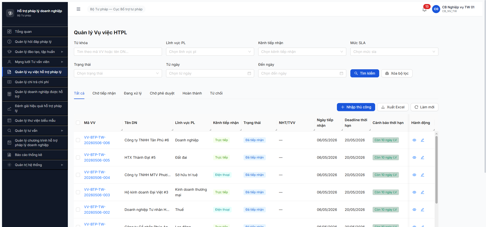

# Bug Report — Đánh giá Hiệu quả HTPLDN (FR-08) R7

| Thông tin | Giá trị |
|-----------|---------|
| **Dự án** | PM HTPLDN — Phần mềm Hỗ trợ Pháp lý Doanh nghiệp |
| **Môi trường** | http://103.172.236.130:3000/ |
| **Người test** | QA Automation (Claude Code via Chrome DevTools MCP) |
| **Ngày** | 2026-05-06 |
| **Loại test** | Workflow E2E |
| **Round** | Round 7 — Apply SRS update 2026-05-05 |
| **Tài liệu tham chiếu** | [`srs-fr-08-danh-gia.md`](../../../../../input/srs-v3/srs-fr-08-danh-gia.md) (FR-VI-01/02/03/04 + SCR-VI-01 + SM-DANHGIA), [workflow-test-report-DanhGiaHQ.md](../../workflow/workflow-test-report-DanhGiaHQ.md), [R6 reference](../../../round6-2026-05-01-postreset/bug-reports/bug-report-flow-danhgia.md) |

---

## Tổng hợp

R7 retest workflow ĐG HQ phát hiện **2 bug mới** + **5 bug R6 Closed** verified by dev fix. Workflow đạt 5/11 bước PASS — B6-B11 cascade block bởi BUG-FUNC-DG-006 (filter VV eligible empty mặc dù có 20 VV HOAN_THANH thực tế) + KPI mismatch BUG-FUNC-DG-007.

### Severity breakdown (R7 mới)

| Tổng | Critical | Major | Medium | Minor | Trivial |
|------|----------|-------|--------|-------|---------|
| 2    | 0        | 1     | 1      | 0     | 0       |

> **Rule log bug:** Bug chỉ log khi có SRS reference cụ thể (`FR-X`, `BR-X`, `SCR-X row Y`). 2 bug mới R7 đều có SRS ref đầy đủ.

## Bug Summary Table — R7 mới

| Bug ID | Severity | Priority | Type | TC Ref | **SRS Reference** | Title | Status |
|--------|----------|----------|------|--------|-------------------|-------|--------|
| BUG-FUNC-DG-006 | Major | P1 | Workflow | R7.4.D2 B6 | `srs-fr-08-danh-gia.md` FR-VI-05/06 (UC87 Chọn VV vào đợt) — chưa rõ filter spec đầy đủ | Endpoint `/vu-viec-eligible` trả empty list mặc dù có 20 VV state HOAN_THANH (3 VV trong date range đợt) — block B6 chọn VV | Open |
| BUG-FUNC-DG-007 | Medium | P2 | Data | R7.4.D2 (cross-module) | `srs-fr-08-danh-gia.md` Dashboard KPI-04 + `srs-fr-13-dashboard.md` (file chưa cụ thể) | Dashboard "Vụ việc hoàn thành: 0" khi /vu-viec/danh-sach Tab "Hoàn thành" hiện 20 records HOAN_THANH | Open |

## Bug Summary Table — R6 dev fix verified Closed

| Bug ID R6 | Severity | Priority | Type | TC Ref | **SRS Reference** | Title | R7 Status |
|-----------|----------|----------|------|--------|-------------------|-------|-----------|
| BUG-FUNC-DG-001 | Medium | P2 | UI/UX | R6.4.D2 B1 | `srs-fr-08-danh-gia.md` line 777 (SCR-VI-01 row 27) | Button [Lưu & Chuyển tiêu chí] không navigate Tab Tiêu chí | ✅ **Closed (R7.4.D1)** |
| BUG-FUNC-DG-002 | Critical | P0 | UI/UX | R6.4.D2 back-fill | `srs-fr-08-danh-gia.md` line 790 (SCR-VI-01 row 33) + line 186 (FR-VI-02 Processing) + line 192 (BR-CALC-04) | Tab Tiêu chí không có nút [+ Thêm tiêu chí] / [Nhập từ DM] | ✅ **Closed (R7.4.D1)** |
| BUG-FUNC-DG-003 | Critical | P0 | Workflow | R6.4.D2 B2 | `srs-fr-08-danh-gia.md` line 244 (FR-VI-03 Inputs row 2) + line 798 (SCR-VI-01 row 36 Tab 2) | Dropdown Người đánh giá gọi sai endpoint `/chuyen-gia-tvvs` 404 | ✅ **Closed (R7.4.D2 B2)** |
| BUG-FUNC-DG-004 | Major | P1 | Workflow | R6.4.D2 B2 | `srs-fr-08-danh-gia.md` line 246 (FR-VI-03 Inputs row 4) + line 798 (SCR-VI-01 row 36) | Dropdown Lĩnh vực gọi `/danh-mucs` 404 (sai path/param) | ✅ **Closed (R7.4.D2 B2)** |
| BUG-FUNC-DG-005 | Major | P1 | Workflow | R6.4.D2 B2 | `srs-fr-08-danh-gia.md` line 245 (FR-VI-03 Inputs row 3) + line 798 (SCR-VI-01 row 36) | Dropdown Vai trò render "Trống" thay 2 enum static | ✅ **Closed (R7.4.D2 B2)** |

> **Closed criteria:** Đã retest qua MCP UI 2026-05-06, network 200 OK, dropdown render đúng SRS, workflow advance được. Chi tiết evidence trong workflow-test-report-DanhGiaHQ.md (R7).

---

---

## BUG-FUNC-DG-006 — Endpoint /vu-viec-eligible trả empty list mặc dù tồn tại VV state HOAN_THANH match đợt

### Mô tả

Sau khi đợt ĐG HQ chuyển state `CHO_DUYET_PC` (B4 cb_pd duyệt PC OK), Tab "Thực hiện" hiển thị "0/0 VV - Không có vụ việc nào phù hợp". Endpoint `GET /api/v1/ke-hoach-danh-gias/{id}/vu-viec-eligible` trả 200 OK với data rỗng `[]`. Tuy nhiên `GET /api/v1/vu-viec?trangThai=HOAN_THANH` trả **20 VV state HOAN_THANH** trong system, trong đó ≥3 VV (VV000108, VV000105, VV000102) có ngày tiếp nhận `01/04/2026 ≤ ngày ≤ 12/04/2026` nằm trong **date range đợt 01/04 - 30/06/2026**. Lỗi block B6 (chọn VV) → cascade B7-B10.

### Các bước tái hiện

1. Tạo đợt ĐG HQ entry LAP_KE_HOACH với từ ngày `01/04/2026`, đến ngày `30/06/2026`, đối tượng `Vụ việc` (R7.4.D1 PASS — DG-20260506-0001)
2. Back-fill ≥4 tiêu chí từ DM `TIEU_CHI_DG_HIEU_QUA` (Σ trọng số = 100%) → PUT 200
3. Tab Phân công → Add 1 người ĐG (vd `cb_nv_tw_02` Trưởng nhóm, lĩnh vực `Lao động + Hôn nhân gia đình`) → POST 201
4. Trình phê duyệt (`cb_nv_tw_01`) → POST `/phan-congs/submit` 200 → state `PHAN_CONG`
5. Switch role `cb_pd_tw_01` → click [Phê duyệt] tại Tab Phân công → POST `/phan-congs/approve` 200 → state `CHO_DUYET_PC`
6. Reload đợt detail → click Tab "Thực hiện"
7. **Quan sát:** "Đã chọn: 0 / 0 vụ việc" + table empty "Không có vụ việc nào phù hợp"
8. Open new tab → /vu-viec/danh-sach → Tab "Hoàn thành" → quan sát 20 VV state HOAN_THANH visible

### Kết quả mong đợi

Tab Thực hiện trong đợt ĐG HQ phải render ≥3 VV candidates phù hợp:
- `VV000108` (12/04/2026 — Doanh nghiệp — DA_TIEP_NHAN dates trong range)
- `VV000105` (07/04/2026 — Kinh doanh thương mại)
- `VV000102` (03/04/2026 — Hành chính)

Nếu filter check linh_vuc của người ĐG (Lao động/HNGD), thì optional fallback: hiển thị tất cả VV match scope đơn vị + date range, người dùng tự chọn theo lĩnh vực phù hợp.

### Kết quả thực tế

```text
GET /api/v1/ke-hoach-danh-gias/6c8c40a2-d5b2-4fce-9db0-81e1642a7780/vu-viec-eligible
→ 200 OK
→ body: { data: [] }   (empty list)

UI render: "Không có vụ việc nào phù hợp"
```

→ Block B6 (chọn VV vào đợt) → cascade B7 (chấm điểm) + B8 (auto BAO_CAO) + B9 (trình BC) + B10 (duyệt BC) đều không thể test.

### Bằng chứng

**1. Ảnh chụp Tab Thực hiện empty + danh sách VV /vu-viec/danh-sach hiển thị 116 mục, 20 state Hoàn thành:**




**2. Network log:**

```text
Đợt info:
  GET /api/v1/ke-hoach-danh-gias/{id} → state=CHO_DUYET_PC, tu_ngay=2026-04-01, den_ngay=2026-06-30, doi_tuong=VU_VIEC

VV eligible API:
  GET /api/v1/ke-hoach-danh-gias/{id}/vu-viec-eligible [200] → []

VV list (verify VV HOAN_THANH tồn tại):
  GET /api/v1/vu-viec?trangThai=HOAN_THANH [200] → 20 records (VV000108..087, dates 16/03 - 12/04/2026)
  → ≥3 VV in date range đợt: VV000108 (12/04), VV000105 (07/04), VV000102 (03/04)
```

**3. SRS reference:** `srs-fr-08-danh-gia.md` FR-VI-05 (Chọn VV vào đợt) — spec hiện không cụ thể chi tiết filter logic. Cần BA/dev confirm:
- (a) Filter chỉ check date overlap — bug rõ ràng (3 VV match nhưng trả 0)
- (b) Filter còn check `linh_vuc match người ĐG` — partial bug (FE không pass linh_vuc người ĐG vào query?)
- (c) Filter check đơn vị scope (TW vs DP) — nếu VV ở DP thì TW user không thấy được. Verified: 20 VV state HOAN_THANH thuộc đơn vị nào? Cần investigate.

---

## BUG-FUNC-DG-007 — Dashboard KPI "Vụ việc hoàn thành: 0" sai vs thực tế 20 VV state HOAN_THANH

### Mô tả

Dashboard `/dashboard` hiển thị KPI "Vụ việc hoàn thành: 0 vụ việc" cho năm 2026 (Tất cả đơn vị, không filter). Nhưng `/vu-viec/danh-sach` Tab "Hoàn thành" hiện **20 VV state HOAN_THANH thực sự** (VV000087-108, dates 16/03 - 12/04/2026). KPI counter mismatch với raw data — có thể BE aggregation query có filter sai (vd: chỉ count VV completed in CURRENT month/quarter) hoặc FE truyền filter ngầm.

### Các bước tái hiện

1. Login bất kỳ role có quyền dashboard (vd `cb_nv_tw_01`)
2. Truy cập `/dashboard`
3. Xem block KPI "Vụ việc hoàn thành"
4. Quan sát: "0 vụ việc" mặc dù năm filter = 2026, đơn vị = Tất cả
5. Mở /vu-viec/danh-sach → Tab "Hoàn thành" → đếm rows = 20

### Kết quả mong đợi

KPI "Vụ việc hoàn thành" phải hiển thị `20` (hoặc số đúng theo filter Năm/Đơn vị/Date range nếu spec yêu cầu sub-filter).

### Kết quả thực tế

KPI = 0 (sai). Cảnh quan: nếu user dựa vào dashboard KPI để báo cáo lãnh đạo → undercount nghiêm trọng (20 VV → báo 0).

### Bằng chứng

```text
Dashboard /dashboard (Năm 2026, Tất cả đơn vị):
- Hỏi đáp mới: 6 ✓
- Vụ việc tiếp nhận: 76 ✓
- Vụ việc đang xử lý: 76 ✓
- Vụ việc hoàn thành: 0   ← SAI (thực tế 20)
- Đào tạo đang diễn ra: 0
- Đào tạo hoàn thành: 0
- Chuyên gia/Tư vấn viên: 0

VV list /vu-viec/danh-sach Tab "Hoàn thành": 20 records
```

**SRS reference:** `srs-fr-13-dashboard.md` (chưa grep cụ thể FR cho KPI VV hoàn thành — spec rule). Cần verify với BA xem KPI filter đúng theo spec hay không.

---

## Observations (không log thành bug)

### OBS-D2-001 — SM label "Chờ duyệt PC" hiện sau khi đã duyệt (counterintuitive)

App SM hiện thực:
- B3 cb_nv_tw_01 click [Trình phê duyệt] → POST `/phan-congs/submit` 200 → state badge `Phân công` (PHAN_CONG)
- B4 cb_pd_tw_01 click [Phê duyệt] → POST `/phan-congs/approve` 200 → state badge `Chờ duyệt PC` (CHO_DUYET_PC)

Counterintuitive: "Chờ duyệt PC" thường nghĩa "đang chờ ai đó phê duyệt phân công". Sau khi cb_pd đã duyệt, expected state nên là `THUC_HIEN` (Thực hiện) hoặc tương đương. Hiện tại app vẫn ở `CHO_DUYET_PC` mặc dù logic đã pass duyệt — possibly app SM definition đảo logic vs SRS or app dùng `CHO_DUYET_PC` ý "Chờ phê duyệt thông tin chấm điểm" (next phase). Cần BA/dev confirm SM canonical labels.

Defer log bug — chờ TODO ambiguity SRS resolved (SRS Master có 3 phiên bản SM khác nhau — DB ENUM 6 / Workflow Master Phụ lục C.6 7 / UI filter 9 trạng thái).

### OBS-D2-002 — Tab Phân công cell "Người đánh giá" hiển thị `—` thay vì tên user

Sau add 1 người ĐG (`cb_nv_tw_02 — CB Nghiệp vụ TW 02`), Tab Phân công table hiển thị cột "Người đánh giá" = `—` (dash) thay vì tên + email user. Cột "Lĩnh vực" cũng `—` mặc dù đã chọn `Lao động + Hôn nhân gia đình`. Tổng số "1 người - 1 Trưởng nhóm" đúng. Có vẻ FE thiếu join lookup khi render table sau POST. Defer — visual bug Minor, không block workflow advance.

### OBS-D2-003 — App stepper 9 step vs SRS workflow 11 bước

R6 báo cáo 11 bước workflow theo SRS. App R7 stepper render 9 step:
1. Lập kế hoạch / 2. Phân công / 3. Chờ duyệt PC / 4. Thực hiện / 5. Đang đánh giá / 6. Đã đánh giá / 7. Lập báo cáo / 8. Chờ phê duyệt / 9. Hoàn thành.

Difference: 11 bước SRS có cả reject paths (`B5: PC → PHAN_CONG` reject + `B11: BC → BAO_CAO` reject) — không chiếm step trong stepper UI (visual chỉ show happy path). Ngoài ra SRS có "BAO_CAO → CHO_PHE_DUYET" + "CHO_PHE_DUYET → HOAN_THANH" tách 2 bước, app gộp thành "Lập báo cáo → Chờ phê duyệt → Hoàn thành" 3 step. OK — visual stepper không cần khớp 1:1 với SRS workflow node count.

---

## Phụ lục — Môi trường test

| Thành phần | Giá trị |
|------------|---------|
| URL ứng dụng | http://103.172.236.130:3000/ |
| OTP login | `666666` (bypass) |
| MailHog | http://103.172.236.130:8025 |
| API base | http://103.172.236.130:3000/api/v1/ |
| Frontend | React + Vite + Ant Design |
| Xác thực | JWT + OTP (auth-store localStorage userInfo + HttpOnly cookie token) |
| Tool test | Chrome DevTools MCP |
| Sample test | DG-20260506-0001 (R7.4.D1 entity) |

---

*Bug report generated: 2026-05-06 | QA Automation via Claude Code*
