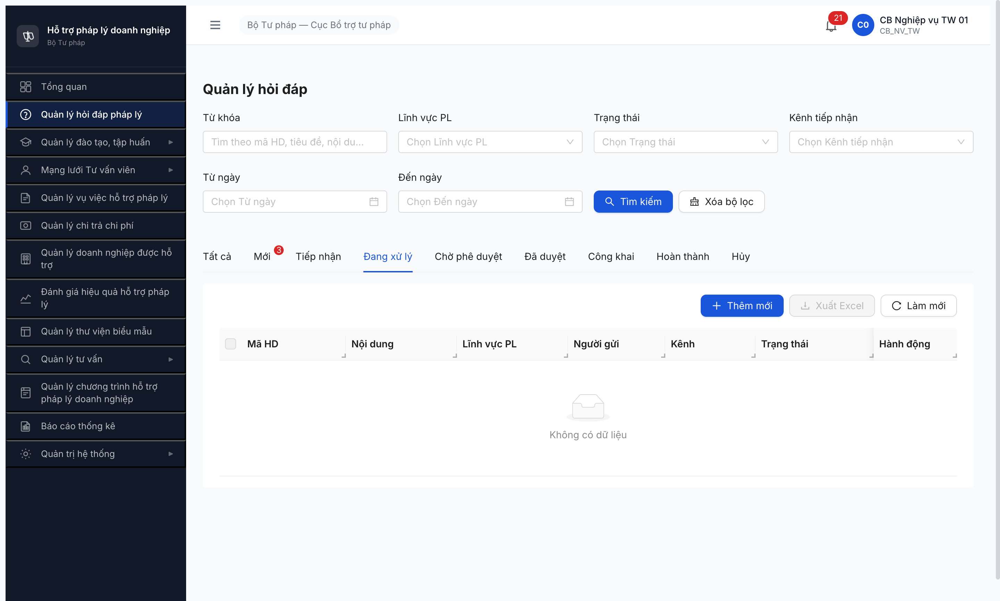

# Bug Report — Workflow Hỏi đáp pháp lý (FR-02 v3.5)

> **Module:** Hỏi đáp (`HOI_DAP`) · **Round:** R7 · **Date:** 2026-05-08 · **Tester:** QA Automation
> **Workflow report:** [workflow-test-report-flow-hoi-dap.md](../../workflow/hoi-dap/workflow-test-report-flow-hoi-dap.md)
> **Accounts dùng:** `cb_nv_tw_01` (CB được phân công) · `cb_nv_tw_02` (CB tiếp nhận)

## Bug Summary Table

| BUG-ID | Severity | Tiêu đề | Status |
|---|---|---|---|
| BUG-HD-001 | **Critical** | Detail Hỏi đáp state `DA_PHAN_CONG` thiếu button [Phản hồi]/[Bắt đầu xử lý] cho người được phân công — block toàn bộ workflow T3-T9 | Open |
| BUG-HD-002 | Major | Tab "Đang xử lý" trên SCR-II-01 rỗng dù có ≥3 record state `DA_PHAN_CONG` (filter sai vs spec `IN (TIEP_NHAN, DA_PHAN_CONG, DANG_XU_LY)`) | Open |

---

## BUG-HD-001 — Detail DA_PHAN_CONG thiếu button [Phản hồi] cho người được phân công

### Mô tả

Trên màn hình Chi tiết Hỏi đáp ở trạng thái `DA_PHAN_CONG`, người được phân công (`cb_nv_tw_01`) **không thấy button [Phản hồi]/[Bắt đầu xử lý]** để soạn phản hồi câu hỏi và đẩy state sang `DANG_XU_LY` → `CHO_PHE_DUYET` (BR-FLOW-01). Block toàn bộ T3-T9 của state machine SM-HOIDAP.

### Các bước tái hiện

1. Login `cb_nv_tw_02` (CB Nghiệp vụ TW 02) → Quản lý hỏi đáp pháp lý.
2. Click eye HD-20260507-001 (state Mới) → click [Tiếp nhận] → confirm. State → "Tiếp nhận".
3. Click [Phân công] → modal "Phân công xử lý" → chọn radio "CB Nghiệp vụ TW 01" → click [Phân công]. State → "Đã phân công", Người phân công = `cb_nv_tw_01`.
4. Logout `cb_nv_tw_02`. Login `cb_nv_tw_01` (người được phân công) qua isolated context.
5. Vào Chi tiết HD-20260507-001.

### Kết quả mong đợi

Theo SRS [`srs-fr-02-hoi-dap.md` line 519-589 §FR-II-04 Phản hồi]:
- Pre-condition: `HOI_DAP.trang_thai IN (DA_PHAN_CONG, DANG_XU_LY)`
- Người được phân công (assignee) thấy form "Phản hồi" hoặc button [Phản hồi]/[Soạn phản hồi]/[Bắt đầu xử lý] để nhập nội dung.
- Tích "Đã trả lời" → BR-FLOW-01 auto chuyển state CHO_PHE_DUYET.

### Kết quả thực tế

Trên detail page state `DA_PHAN_CONG` (URL `/hoi-dap/{id}`):
- Header chỉ có badge "Đã phân công" + "Còn 10 ngày LV", **không có** button action transition.
- Section "Danh sách phản hồi (0)" expanded, hiển thị "Chưa có phản hồi nào." nhưng **không có button [Thêm phản hồi]/[Soạn phản hồi]**.
- Section "Thông tin xử lý" chỉ readonly fields.
- Toàn DOM main content chỉ có button "Quay lại" (verify qua `evaluate_script` lọc `button` visible: chỉ 14 button trong đó 13 sidebar + 1 "Quay lại").

### Bằng chứng


```
evaluate_script:
  document.querySelectorAll('button, a').filter(text matches /phản hồi|trả lời|thêm|đang xử lý|chuyển/i)
  => actionBtns = [] (zero match)
  inputs = [] (zero textarea/input trong main detail)
```

---

## BUG-HD-002 — Tab "Đang xử lý" rỗng dù có 3 record DA_PHAN_CONG

### Mô tả

Tab "Đang xử lý" trên màn hình Quản lý hỏi đáp (SCR-II-01) hiển thị **"Không có dữ liệu"** trong khi pool có ≥3 record state `DA_PHAN_CONG` (HD-001/002/006) thuộc người đang đăng nhập (`cb_nv_tw_01`). Filter cứng theo SRS phải `IN (TIEP_NHAN, DA_PHAN_CONG, DANG_XU_LY)` — UI hiện chỉ filter `DANG_XU_LY` đơn lẻ.

### Các bước tái hiện

1. Login `cb_nv_tw_01` → sidebar "Quản lý hỏi đáp pháp lý".
2. Tab "Tất cả" hiển thị 7/7 records, trong đó: HD-001 (DA_PHAN_CONG), HD-002 (DA_PHAN_CONG), HD-006 (DA_PHAN_CONG) — đều assigned cho cb_nv_tw_01.
3. Click tab "Đang xử lý". URL chuyển sang `/hoi-dap?tab=DANG_XU_LY&page=1`.

### Kết quả mong đợi

Theo SRS [`srs-fr-02-hoi-dap.md` line 311-317 §FR-II-03 Đang xử lý]:
- `trang_thai_filter` cố định: `IN ('TIEP_NHAN','DA_PHAN_CONG','DANG_XU_LY')` (line 317)
- Tab phải hiển thị 3 record HD-001/002/006 (DA_PHAN_CONG).

### Kết quả thực tế

- Tab "Đang xử lý" empty: `image "Trống"` + `StaticText "Không có dữ liệu"`.
- URL params `tab=DANG_XU_LY` cho thấy FE chỉ gửi `trang_thai=DANG_XU_LY` đơn lẻ thay vì union 3 state.
- Buttons "Xuất Excel"/"Select all" disabled (do empty list).

### Bằng chứng



---

*R7 | QA Automation via Claude Code (Chrome DevTools MCP)*
