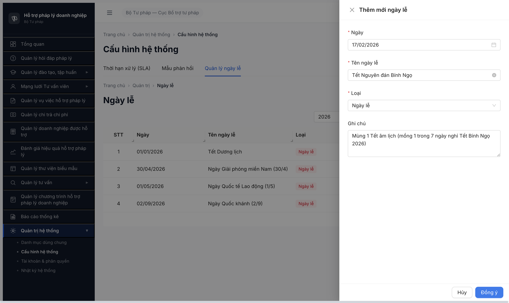
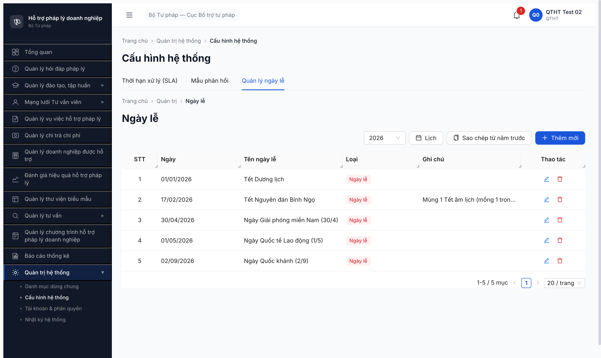

# Bug Report — R7.1.5 Tab Ngày lễ FE submit silent fail (FR-VIII-29)

| Thông tin | Giá trị |
|-----------|---------|
| **Dự án** | PM Hỗ trợ Pháp lý Doanh nghiệp |
| **Môi trường** | http://103.172.236.130:3000/quan-tri/cau-hinh?tab=ngay-le |
| **Người test** | QA Automation via Claude Code (qtht_02) |
| **Ngày** | 2026-05-07 |
| **Loại test** | Seed via UI (R7.1.5 Phase 1) |
| **Round** | Round 7 |
| **Tài liệu tham chiếu** | [SRS FR-VIII-29 line 1380-1414 srs-fr-10-quan-tri.md](../../../../../input/srs-update-2026-5-5/srs-fr-10-quan-tri.md) · [SRS Entity §3.4.3.51 NGAY_LE line 2059-2070](../../../../../input/srs-update-2026-5-5/srs-fr-10-quan-tri.md) · [tasks/todo.md R7.1.5](../../../../../tasks/todo.md) |
| **2-source verify** | ✅ NotebookLM Haizz-HTPLDN (id `a4ae45bf-...`) + grep SRS local — match 100% |

---

## Tổng hợp

Phát hiện **1** lỗi khi seed Tết Nguyên đán Bính Ngọ qua UI Tab Ngày lễ SCR-VIII-06.

> **Note:** BUG-NGAY-LE-002 (thiếu Tab "Quy trình hỗ trợ") đã DROPPED 2026-05-07 — user chốt tạm thời bỏ tab Quy trình khỏi SCR-VIII-06 → 3 tab hiện tại (SLA / Mẫu phản hồi / Ngày lễ) đúng spec mới.

### Severity breakdown

| Tổng | Critical | Major | Medium | Minor | Trivial |
|------|----------|-------|--------|-------|---------|
| 1    | 0        | 1     | 0      | 0     | 0       |

## Bug Summary Table

| Bug ID | Severity | Priority | Type | TC Ref | **SRS Reference** | Title | Status |
|--------|----------|----------|------|--------|-------------------|-------|--------|
| BUG-NGAY-LE-001 | Major | P1 | UI/UX | R7.1.5 | `FR-VIII-29 §Processing bước 4` (line 1412) | Form Thêm mới ngày lễ — button [Đồng ý] click silent fail, không trigger POST + không hiện validation error | Open (re-test FAIL) |

> **Re-test 2026-05-07:** ❌ STILL OPEN. Fill date `25/12/2026` qua DatePicker calendar click + tên + ghi chú → click [Đồng ý] vẫn silent: KHÔNG trigger POST `/api/v1/ngay-le`, KHÔNG toast, KHÔNG inline error. Modal stuck open. Bug chưa được dev fix.
>
> **Re-test 2026-05-07 14:00 (sau dev claim fix lần 2):** ❌ STILL OPEN. Account qtht_02. Mở modal Thêm mới Ngày lễ → click DatePicker chọn ngày 08/05/2026 (verify input value = `08/05/2026`) → fill tên "Test re-test BUG-NGAY-LE-001" → Loại default "Ngày lễ" → click [Đồng ý]. Network log chỉ có `auth/refresh + GET ngay-le?nam=2026 + GET unread-count` — KHÔNG có POST `/api/v1/ngay-le`. Modal vẫn open, không toast/error. Inline `Vui lòng chọn ngày` vẫn hiện dù đã chọn date qua DatePicker (FE chưa update validation state). Bug FE chưa được fix. Evidence: [r7-1-5-retest-still-silent-2026-05-07.png](r7-1-5-retest-still-silent-2026-05-07.png).
>
> **Re-verify 2026-05-07 14:30 (cache clear + hard reload):** ❌ CONFIRMED STILL OPEN. Đã clear `caches.delete()` + `localStorage.clear()` + `sessionStorage.clear()` + reload `ignoreCache:true` + login lại qtht_02 trong isolated context fresh. Mở modal Thêm mới Ngày lễ → click DatePicker chọn ngày 09/05/2026 (input value = `09/05/2026`) → fill tên "Test cache-clear NGAY-LE-001" → Loại default "Ngày lễ" → click [Đồng ý]. Network log: `auth/refresh + GET ngay-le?nam=2026 + GET unread-count` — KHÔNG có POST `/api/v1/ngay-le`. Modal stuck open. Không phải cache stale — bug FE thực sự. Evidence: [r7-1-5-cache-clear-still-silent.png](r7-1-5-cache-clear-still-silent.png).
>
> **Re-test 2026-05-07 R8 (16:42, sau dev claim fix lần 3):** ❌ **VẪN OPEN**. Account qtht_02. Modal Thêm mới Ngày lễ — click DatePicker chọn 15/05/2026 (input value `15/05/2026`) → fill tên "QA Re-test BUG-NGAY-LE-001 2026-05-07" → Loại default "Ngày lễ" → click [Đồng ý]. Network full session (13 requests) hoàn toàn KHÔNG có POST `/api/v1/ngay-le` — chỉ có baseline `auth/refresh + GET ngay-le?nam=2026 + GET unread-count + GET cau-hinh/sla`. Modal stuck open, form values preserved (date + tên), KHÔNG toast/error/inline validation. Table sau click vẫn 4 record (Tết DL/30-4/1-5/Quốc khánh — Tết Nguyên đán Bính Ngọ R7 đã reset cùng pool). Bug FE handler [Đồng ý] hoàn toàn không trigger submit. Screenshot: [r8-verify-2026-05-07-bug-ngay-le-001-still-silent.png](../../screenshots/r8-verify-2026-05-07-bug-ngay-le-001-still-silent.png).

---

## BUG-NGAY-LE-001 — Form Thêm mới ngày lễ — submit silent fail (button [Đồng ý] không trigger POST)

### Mô tả

Modal "Thêm mới ngày lễ" trên Tab Ngày lễ SCR-VIII-06: sau khi fill đủ 3 trường bắt buộc (Ngày = `17/02/2026` chọn từ Antd DatePicker calendar, Tên ngày lễ = `Tết Nguyên đán Bính Ngọ`, Loại = `Ngày lễ` chọn từ dropdown listbox 3 option), click button [Đồng ý] **không trigger POST** tới `/api/v1/ngay-le`, modal vẫn open, không hiện toast thành công/thất bại, không hiện validation error message inline. Probe trực tiếp BE bằng API `POST /api/v1/ngay-le` với body camelCase đúng schema → BE trả **201 thành công**, record được lưu DB và hiện trong table sau reload — chứng minh BE work fine, FE bug khi handle submit.

### Các bước tái hiện

1. Login `qtht_02` / `Secret@123` / OTP `666666`.
2. Sidebar > Quản trị hệ thống > Cấu hình hệ thống → URL `/quan-tri/cau-hinh`.
3. Click tab "Quản lý ngày lễ" → URL `/quan-tri/cau-hinh?tab=ngay-le`. Quan sát table 4 record pre-existing năm 2026.
4. Click button [+ Thêm mới] → modal "Thêm mới ngày lễ" mở (4 trường: Ngày * / Tên ngày lễ * / Loại * / Ghi chú).
5. Click input "Ngày" → Antd date picker dropdown mở → click ngày 17 trong tháng 2/2026. Verify input value hiển thị `17/02/2026`.
6. Fill input "Tên ngày lễ" = `Tết Nguyên đán Bính Ngọ`.
7. Click combobox "Loại" → listbox 3 option (Ngày lễ / Nghỉ bù / Nghỉ khác) hiện → click "Ngày lễ".
8. Fill textarea "Ghi chú" = `Mùng 1 Tết âm lịch...`.
9. Click button [Đồng ý].
10. Quan sát: modal vẫn open, không thay đổi, không có toast/error.
11. Mở DevTools Network tab → KHÔNG thấy request `POST /api/v1/ngay-le` xuất hiện (chỉ có refresh + thong-baos polling).
12. Lặp lại click [Đồng ý] thêm 2 lần → vẫn silent.
13. Probe BE bằng `evaluate_script` fetch trực tiếp với JWT từ session → BE trả 201, record ID `7a2c4cf6-d68b-4947-8488-6b7049b84bff` lưu DB.
14. Click [Hủy] → close modal → reload trang → table render 5/5 record bao gồm `Tết Nguyên đán Bính Ngọ 17/02/2026`.

### Kết quả mong đợi

- Click [Đồng ý] → FE validate client-side → POST `/api/v1/ngay-le` body `{ngay, nam, tenNgayLe, loai, ghiChu}` → BE 201 → close modal + reload table + toast "Thêm mới thành công" (như flow đã verify ở DM6/7 SCR-VIII-01 trong R7.1.6).
- Theo SRS FR-VIII-29 §Processing bước 4 (line 1412): "Tạo / Cập nhật / Xóa (soft delete) bản ghi NGAY_LE".

### Kết quả thực tế

- Click [Đồng ý] silent — không POST, không error, không feedback.
- Modal stuck mở — user không biết vì sao.
- API direct probe POST 201 → BE work fine → loại trừ BE bug, confirm FE bug.

### Bằng chứng

**1. Ảnh modal sau click [Đồng ý] 3 lần — modal vẫn open, table chưa update:**



**2. Ảnh table sau reload — 5/5 record (Tết NĐ đã save qua API workaround):**



**3. Network log (full session 9 request) — KHÔNG có POST `/api/v1/ngay-le`:**

```
reqid=1116 POST /api/v1/auth/refresh [200]
reqid=1132 GET /api/v1/cau-hinh/sla [200]
reqid=1139 GET /api/v1/ngay-le?nam=2026 [200]
reqid=1140-1145 GET /api/v1/thong-baos/unread-count [304]
(KHÔNG có POST /api/v1/ngay-le sau 3 lần click Đồng ý)
```

**4. API direct probe — BE 201:**

```json
POST /api/v1/ngay-le
Headers: Authorization: Bearer <JWT-qtht_02>
Body: {"ngay":"2026-02-17","nam":2026,"tenNgayLe":"Tết Nguyên đán Bính Ngọ","loai":"NGAY_LE","ghiChu":"Mùng 1 Tết âm lịch..."}
Response 201: {"success":true,"data":{"id":"7a2c4cf6-d68b-4947-8488-6b7049b84bff","ngay":"2026-02-17","nam":2026,"tenNgayLe":"Tết Nguyên đán Bính Ngọ","loai":"NGAY_LE","ghiChu":"...","ngayTao":"2026-05-06T17:01:41.483Z","version":1}}
```

**5. SRS local quote nguyên văn (`input/srs-update-2026-5-5/srs-fr-10-quan-tri.md` line 1407-1413, FR-VIII-29 §Processing):**

```
| Bước | Mô tả xử lý | BR áp dụng |
| 1 | Kiểm tra quyền QTHT | BR-AUTH-01 |
| 2 | Validate: ngay_ket_thuc >= ngay_bat_dau | — |
| 3 | Kiểm tra trùng lặp: không có ngày lễ khác overlap cùng khoảng thời gian | — |
| 4 | Tạo / Cập nhật / Xóa (soft delete) bản ghi NGAY_LE | BR-DATA-01, BR-DATA-03 |
```

**6. NotebookLM verify** — query "FR-VIII-29 Processing bước 4 có tạo/sửa/xóa NGAY_LE không?" → AI confirmed match SRS local 100%.

---

## Phụ lục — Môi trường test

| Thành phần | Giá trị |
|------------|---------|
| URL ứng dụng | http://103.172.236.130:3000/ |
| OTP login | `666666` bypass |
| MailHog | http://103.172.236.130:8025 |
| API base | http://103.172.236.130:3000/api/v1 |
| Frontend | React + Vite + Ant Design (Modal, DatePicker, Select) |
| Xác thực | JWT + OTP |
| Tool test | Chrome DevTools MCP |
| Account dùng | qtht_02 (vai trò QTHT, cấp TW) |
| NotebookLM | https://notebooklm.google.com/notebook/a4ae45bf-cea0-4325-8fee-b1e0be702cf2 |

---

*Bug report generated: 2026-05-07 | QA Automation via Claude Code | 2-source verify NotebookLM + SRS local*
