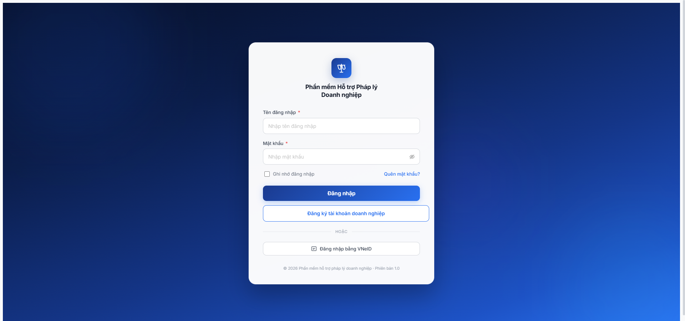

# Bug Report — Danh mục Lĩnh vực pháp lý (LINH_VUC_PL)

| Thông tin | Giá trị |
|-----------|---------|
| **Dự án** | PM HTPLDN — Phần mềm Hỗ trợ Pháp lý Doanh nghiệp |
| **Môi trường** | http://103.172.236.130:3000/ |
| **Người test** | QA Automation (Claude Code via Chrome DevTools MCP) |
| **Ngày** | 2026-05-06 |
| **Loại test** | Seed pre-check (R7.2.1 trigger) |
| **Round** | Round 7 — Apply SRS update 2026-05-05 |
| **Tài liệu tham chiếu** | [SRS FR-VIII-01 Seed Data line 204](../../../../../input/srs-update-2026-5-5/srs-fr-10-quan-tri.md) · [seed-fixture.yaml v2.7.2](../../../../../input/data/seed-fixture.yaml) · [todo.md R7.1.1](../../../../../tasks/todo.md) |

---

## Tổng hợp

Phát hiện **1** lỗi data có SRS reference cụ thể khi mở dropdown "Lĩnh vực pháp luật" trong modal Thêm mẫu phản hồi (R7.2.1 trigger).

### Severity breakdown

| Tổng | Critical | Major | Medium | Minor | Trivial |
|------|----------|-------|--------|-------|---------|
| 1    | 0        | 1     | 0      | 0     | 0       |

## Bug Summary Table

| Bug ID | Severity | Priority | Type | TC Ref | **SRS Reference** | Title | Status |
|--------|----------|----------|------|--------|-------------------|-------|--------|
| ~~BUG-DM-LVPL-001~~ | Major | P1 | Data | R7.1.1 / R7.2.1 | `srs-fr-10-quan-tri.md FR-VIII-01 Seed Data line 204` | Danh mục LINH_VUC_PL trong app không khớp 10 LV SRS — thiếu 3 (DOANH_NGHIEP/THUONG_MAI/DAU_TU) + thừa 3 non-SRS | Closed (R8) |

> **Re-test 2026-05-07 (sau dev claim fix):** ⚠️ PARTIAL FIX. Dev đã thêm `DOANH_NGHIEP` + `DAU_TU` (10→12 LV) nhưng vẫn **thiếu THUONG_MAI** (UI dùng `KINH_DOANH_TM` tên "Kinh doanh thương mại" — code mismatch fixture v2.7.2 yêu cầu `THUONG_MAI`). Mã `SHTT` fixture vs `SO_HUU_TRI_TUE` UI cũng mismatch. Thừa 3 non-SRS vẫn còn (HON_NHAN_GIA_DINH/KINH_DOANH_TM/KHIEU_NAI_TO_CAO). R7.2.1 vẫn block.
>
> **Re-test 2026-05-07 14:05 (sau dev claim fix lần 2):** ❌ REGRESSION. Account qtht_02. Mở Cấu hình → tab Mẫu phản hồi → click filter "Lĩnh vực PL" → dropdown render **10 options** (Dân sự / Hình sự / Hành chính / Lao động / Đất đai / **Hôn nhân gia đình** / **Kinh doanh thương mại** / **Khiếu nại tố cáo** / Thuế / Sở hữu trí tuệ). KHÔNG còn Doanh nghiệp + Đầu tư đã thêm trước đó (rollback?). Vẫn thiếu `Thương mại`/`Doanh nghiệp`/`Đầu tư` SRS line 204. Vẫn thừa 3 non-SRS. Evidence: [r7-1-1-retest-dropdown-lv-10-options-2026-05-07.png](r7-1-1-retest-dropdown-lv-10-options-2026-05-07.png).
>
> **Re-verify 2026-05-07 14:30 (cache clear + hard reload):** ⚠️ PARTIAL FIX **+ NEW SUB-BUG**. Đã clear `caches` + `localStorage` + `sessionStorage` + reload `ignoreCache:true` + fresh login isolated context.
> - **Layer 1 — DM master:** Mở `/quan-tri/danh-muc/LINH_VUC_PL` → table render **12 record** (KHÔNG phải 10 như verify trước — verify trước bị cache stale ở dropdown filter): DAN_SU/HINH_SU/HANH_CHINH/LAO_DONG/DAT_DAI/HON_NHAN_GIA_DINH/KINH_DOANH_TM/KHIEU_NAI_TO_CAO/THUE/SO_HUU_TRI_TUE/**DOANH_NGHIEP**/**DAU_TU**. Dev đã thêm `DOANH_NGHIEP` + `DAU_TU` (10→12 LV), KHÔNG rollback. Tuy nhiên **vẫn thiếu `THUONG_MAI`** (mã `KINH_DOANH_TM` tên "Kinh doanh thương mại" không phải mapping của THUONG_MAI per SRS). Vẫn thừa 3 non-SRS (HON_NHAN_GIA_DINH/KINH_DOANH_TM/KHIEU_NAI_TO_CAO). Evidence: [r7-1-1-cache-clear-12-lv-still-mismatch.png](r7-1-1-cache-clear-12-lv-still-mismatch.png).
> - **Layer 2 — FE dropdown filter MPH KHÔNG sync DM master** (NEW SUB-BUG): Mở Cấu hình → tab Mẫu phản hồi → click filter "Lĩnh vực PL" → dropdown render **vẫn chỉ 10 options** thiếu DOANH_NGHIEP + DAU_TU (FE hardcode list 10 LV cũ HOẶC API filter `/api/v1/danh-muc?loaiDanhMuc=LINH_VUC_PL` cho consumer khác response cho master). Hệ quả: dù dev đã thêm 2 LV vào DM master, dropdown consumer (MPH/HD/VV/TVCS/...) vẫn thiếu → cascade block seeding các entity với `linh_vuc_id=DOANH_NGHIEP/DAU_TU`. Evidence: [r7-1-1-cache-clear-dropdown-mph-still-10.png](r7-1-1-cache-clear-dropdown-mph-still-10.png).
> - **Action dev:** (1) Bổ sung `THUONG_MAI` vào DM master (mã + tên "Thương mại") + bỏ 3 non-SRS HON_NHAN_GIA_DINH/KINH_DOANH_TM/KHIEU_NAI_TO_CAO. (2) Sync FE dropdown LV ở tất cả consumer (MPH/HD/VV/TVCS/MLTV/HĐ TV/...) load từ DM master động, không hardcode.
>
> **Re-test 2026-05-07 R8 (16:41, sau dev claim fix lần 3):** ⚠️ **VẪN OPEN — PARTIAL FIX (không thay đổi từ R8 lần 1)**. Account qtht_02. Mở `/quan-tri/danh-muc/LINH_VUC_PL` → table render **12 record**: DAN_SU/HINH_SU/HANH_CHINH/LAO_DONG/DAT_DAI/HON_NHAN_GIA_DINH/KINH_DOANH_TM/KHIEU_NAI_TO_CAO/THUE/SO_HUU_TRI_TUE/DOANH_NGHIEP/DAU_TU. Pattern không đổi — vẫn thiếu mã `THUONG_MAI` (UI dùng `KINH_DOANH_TM` "Kinh doanh thương mại" không phải mapping của THUONG_MAI per SRS) + vẫn thừa 3 non-SRS (HON_NHAN_GIA_DINH/KINH_DOANH_TM/KHIEU_NAI_TO_CAO). 9/10 SRS LV match (THUE/LAO_DONG/DAT_DAI/DAN_SU/HINH_SU/HANH_CHINH/SHTT-tên/DOANH_NGHIEP/DAU_TU); 1 SRS LV thiếu (THUONG_MAI). Screenshot: [r8-verify-2026-05-07-dm-lvpl-12lv-still-mismatch.png](../../screenshots/r8-verify-2026-05-07-dm-lvpl-12lv-still-mismatch.png).
>
> **Re-test 2026-05-08 R8 lần 4 (sau dev fix dứt điểm):** ✅ **CLOSED**. Account qtht_02. **Layer 1 — DM master:** `/quan-tri/danh-muc/LINH_VUC_PL` table render **đúng 10 record SRS**: THUE/LAO_DONG/DAT_DAI/DAN_SU/**THUONG_MAI**/HINH_SU/HANH_CHINH/SHTT/DOANH_NGHIEP/DAU_TU (1-10/10 mục). Bỏ 3 LV non-SRS (HON_NHAN_GIA_DINH/KINH_DOANH_TM/KHIEU_NAI_TO_CAO), thêm THUONG_MAI. Match SRS line 204 100%. **Layer 2 — Dropdown filter MPH:** `/quan-tri/cau-hinh?tab=mau-phan-hoi` click filter "Lĩnh vực PL" → 10 options đúng SRS (Thuế/Lao động/Đất đai/Dân sự/**Thương mại**/Hình sự/Hành chính/Sở hữu trí tuệ/**Doanh nghiệp**/**Đầu tư**). Sub-bug Layer 2 cũng đóng — FE dropdown đã sync DM master. Cascade unblock R7.2.1/R7.2.2/R7.2.6/R7.2.11.

---

## ~~BUG-DM-LVPL-001~~ — Danh mục LINH_VUC_PL không khớp SRS line 204 — thiếu 3 LV chính + thừa 3 LV non-SRS [CLOSED]

### Mô tả

Khi mở modal Thêm mẫu phản hồi (Cấu hình hệ thống → Tab "Mẫu phản hồi" → button [Thêm mới]) bằng `cb_nv_tw_01`, dropdown "Lĩnh vực pháp luật *" chỉ render 10 LV nhưng **không khớp 10 LV được SRS chỉ định**. Kết quả: BLOCK seed R7.2.1 vì 3 LV bắt buộc theo fixture v2.7.2 (DOANH_NGHIEP, THUONG_MAI, DAU_TU) **không tồn tại** trong DM, đồng thời 3 LV xuất hiện trong dropdown **không có trong SRS** (Hôn nhân gia đình, Kinh doanh thương mại, Khiếu nại tố cáo). Cascade block các module dùng FK `linh_vuc_id` (HD/VV/TVCS/TVV/CG/MPH/HSPL/Đào tạo).

### Các bước tái hiện

1. Login `cb_nv_tw_01` / `Secret@123` / OTP `666666` → dashboard render
2. Click sidebar "Quản trị hệ thống" → submenu mở → click "Cấu hình hệ thống"
3. Trang `/quan-tri/cau-hinh` mở, tab "Mẫu phản hồi" auto-selected
4. Click button [Thêm mới] (`+`) → modal "Thêm mẫu phản hồi" mở
5. Click dropdown "Lĩnh vực pháp luật *" để xem options
6. **Quan sát:** dropdown trả về 10 options (ảnh chụp đính kèm)

### Kết quả mong đợi

DM `LINH_VUC_PL` phải có **đúng 10 LV theo SRS** (`srs-update-2026-5-5/srs-fr-10-quan-tri.md` FR-VIII-01 Seed Data line 204):

> Seed Data: Thuế, Lao động, Đất đai, Dân sự, Thương mại, Hình sự, Hành chính, Sở hữu trí tuệ, Doanh nghiệp, Đầu tư

10 mã LV chuẩn (theo convention `code` Inputs row 1 line 185 — VD: `THUE`, `LAO_DONG`):

| # | Mã | Tên |
|---|---|---|
| 1 | THUE | Thuế |
| 2 | LAO_DONG | Lao động |
| 3 | DAT_DAI | Đất đai |
| 4 | DAN_SU | Dân sự |
| 5 | THUONG_MAI | Thương mại |
| 6 | HINH_SU | Hình sự |
| 7 | HANH_CHINH | Hành chính |
| 8 | SHTT | Sở hữu trí tuệ |
| 9 | DOANH_NGHIEP | Doanh nghiệp |
| 10 | DAU_TU | Đầu tư |

### Kết quả thực tế

Dropdown render **10 LV nhưng không khớp SRS** — cụ thể có 3 mismatch (thiếu) + 3 mismatch (thừa):

**LV trong dropdown:** Dân sự · Hình sự · Hành chính · Lao động · Đất đai · Hôn nhân gia đình · Kinh doanh thương mại · Khiếu nại tố cáo · Thuế · Sở hữu trí tuệ

**Thiếu vs SRS (3):** Doanh nghiệp · Thương mại · Đầu tư

**Thừa non-SRS (3):** Hôn nhân gia đình · Kinh doanh thương mại · Khiếu nại tố cáo

| LV (Vietnamese) | SRS line 204 | App dropdown | Verdict |
|---|:-:|:-:|:-:|
| Thuế | ✅ | ✅ | ✓ Match |
| Lao động | ✅ | ✅ | ✓ Match |
| Đất đai | ✅ | ✅ | ✓ Match |
| Dân sự | ✅ | ✅ | ✓ Match |
| Hình sự | ✅ | ✅ | ✓ Match |
| Hành chính | ✅ | ✅ | ✓ Match |
| Sở hữu trí tuệ | ✅ | ✅ | ✓ Match |
| **Thương mại** | ✅ | ❌ | ❌ Thiếu |
| **Doanh nghiệp** | ✅ | ❌ | ❌ Thiếu |
| **Đầu tư** | ✅ | ❌ | ❌ Thiếu |
| Hôn nhân gia đình | ❌ | ✅ | ❌ Thừa non-SRS |
| Kinh doanh thương mại | ❌ | ✅ | ❌ Thừa non-SRS (gần "Thương mại" nhưng tên khác) |
| Khiếu nại tố cáo | ❌ | ✅ | ❌ Thừa non-SRS |

**Cascade block:**

- R7.2.1 MPH — 3/12 variants không seed được (variant 1 DOANH_NGHIEP, variant 2 THUONG_MAI, variant 7 BN-BKH DOANH_NGHIEP)
- R7.2.2 TC TV — 5/6 variants miss ít nhất 1 LV (1 có DOANH_NGHIEP, 1 có THUONG_MAI, 1 có 3 LV trong đó 2 miss, ...)
- R7.2.6 CG TW — tương tự, miss DOANH_NGHIEP/THUONG_MAI nhiều variants
- R7.2.11 PC Đợt 1 — 2/6 PC config block (DOANH_NGHIEP + THUONG_MAI)
- Downstream Phase 3-7 — toàn bộ filter theo `linh_vuc_id` lệch fixture canonical

### Bằng chứng

**1. Ảnh chụp** (dropdown LV trong modal Thêm mẫu phản hồi, account `cb_nv_tw_01`):



**2. SRS quote (authoritative):**

```
File: input/srs-update-2026-5-5/srs-fr-10-quan-tri.md
Line 204: **Seed Data:** Thuế, Lao động, Đất đai, Dân sự, Thương mại, Hình sự, Hành chính, Sở hữu trí tuệ, Doanh nghiệp, Đầu tư
```

**3. API endpoint response** (verify khi probing /api/v1/danh-muc — auth required):

```json
{
  "/api/v1/danh-muc?loaiDanhMuc=LINH_VUC_PL&size=50": {
    "status": 401,
    "body": {"error":{"code":"ERR-AUTH-SYS-00-01","message":"Authorization token is required"}}
  }
}
```

Endpoint exists (401 = auth gate, không phải 404). Cần dev verify trực tiếp content của DM bằng admin script + đối chiếu SRS line 204.

**4. Fixture impact** (`input/data/seed-fixture.yaml` v2.7.2):

QA đã update fixture v2.7.1 → v2.7.2 align Tier 0 `linh_vuc_phap_ly` với SRS (10 LV, replace `HOP_DONG` → `THUONG_MAI` ở mọi entity downstream). Nhưng app DM không khớp fixture mới → BLOCK toàn bộ Phase 2/3/4 seed cho LV `DOANH_NGHIEP`/`THUONG_MAI`/`DAU_TU`.

---

## Phụ lục — Môi trường test

| Thành phần | Giá trị |
|------------|---------|
| URL ứng dụng | http://103.172.236.130:3000/ |
| OTP login | `666666` (bypass dev mode) |
| MailHog (OTP inbox) | http://103.172.236.130:8025 |
| API base | http://103.172.236.130:3000/api/v1/ |
| Frontend | React + Vite + Ant Design |
| Xác thực | JWT + OTP (sessionStorage `auth-store`) |
| Tool test | Chrome DevTools MCP |

---

*Bug report generated: 2026-05-06 | QA Automation via Claude Code*
