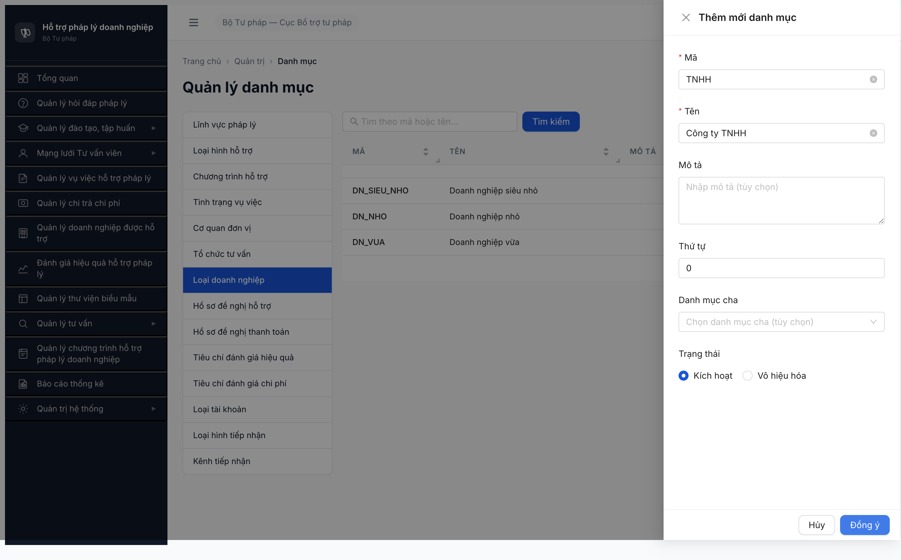
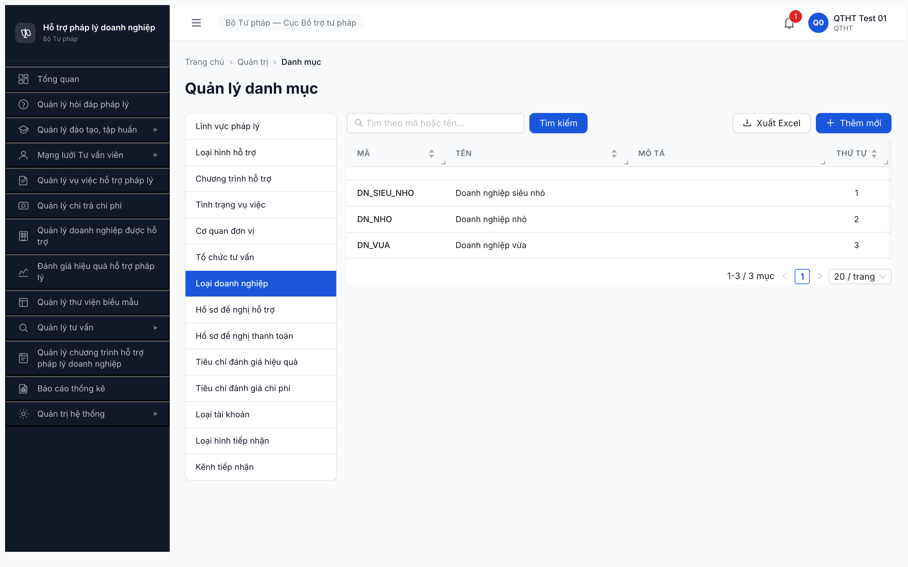

# Bug Report — DM Loại Doanh nghiệp (R7.1.2)

| Thông tin | Giá trị |
|-----------|---------|
| **Dự án** | PM HTPLDN |
| **Môi trường** | http://103.172.236.130:3000/ |
| **Người test** | QA Automation (huongttt) |
| **Ngày** | 2026-05-06 |
| **Loại test** | Seed / Functional |
| **Round** | Round 7 |
| **Tài liệu tham chiếu** | [todo R7.1.2](../../../../../tasks/todo.md) · [seed-checklist-r7-1-2-loai-dn](../../seed/qtht-danh-muc/seed-checklist-r7-1-2-loai-dn.md) · [SRS FR-VIII-07 line 382-399 (UC105)](../../../../../input/srs-update-2026-5-5/srs-fr-10-quan-tri.md) · [SRS FR-VII-01 row 6-7 + SCR-VII line 1746-1747](../../../../../input/srs-update-2026-5-5/srs-fr-07-doanh-nghiep.md) |

---

> **Re-test 2026-05-06 16:14 (sau dev claim "đã fix"):** ❌ FAIL — fix nửa chừng. Dev đã bỏ enum guard 422 (không còn message "Chỉ chấp nhận: DN_SIEU_NHO, DN_NHO, DN_VUA") nhưng BE giờ trả **500 Internal server error** cho mọi POST vào `LOAI_DOANH_NGHIEP` — kể cả pattern cũ `DN_LON`, `DN_TNHH` lẫn pattern fixture `TNHH/CP/DNTN/HKD`. Sanity check `LINH_VUC_PL` POST `TEST_LV` → 201 OK ⇒ endpoint chung không hỏng, chỉ riêng DM `LOAI_DOANH_NGHIEP` 500. Kết quả: vẫn 3/3 record (DN_SIEU_NHO/NHO/VUA), R7.2.4 vẫn block. **Kèm spec contradiction SRS FR-10 chưa giải quyết** (chi tiết §SRS verification ngay dưới Mô tả).

---

## Tổng hợp

Phát hiện **1** lỗi BE chặn seed 4 record loại hình DN (TNHH/CP/DNTN/HKD) cho danh mục `LOAI_DOANH_NGHIEP`. Sau dev fix lần 1 (2026-05-06 chiều), bug **chưa đóng** — chuyển từ 422 enum-guard sang 500 internal server error.

### Severity breakdown

| Tổng | Critical | Major | Medium | Minor | Trivial |
|------|----------|-------|--------|-------|---------|
| 1    | 0        | 1     | 0      | 0     | 0       |

## Bug Summary Table

| Bug ID | Severity | Priority | Type | TC Ref | **SRS Reference** | Title | Status |
|--------|----------|----------|------|--------|-------------------|-------|--------|
| ~~BUG-LOAI-DN-002~~ | Major | P1 | Data | R7.1.2 | `srs-update-2026-5-5/srs-fr-10-quan-tri.md` FR-VIII-07 line 393, 397, 399 (UC105 — DM `LOAI_DOANH_NGHIEP` seed = SIEU_NHO/NHO/VUA) + `srs-fr-07-doanh-nghiep.md` row 6-7 (DN entity 2 field tách `loai_doanh_nghiep_id` FK + `quy_mo` enum) + SCR-VII line 1746-1747 | BE 500 khi POST DM `LOAI_DOANH_NGHIEP` + spec contradiction FR-10 (DM = quy_mo) vs FR-07 + SCR-VII (DN field "Loại hình DN" FK → UC105) | **Closed** |

> **Re-test 2026-05-07:** ✅ PASS (Closed-verified). UI table có 4 record fixture chuẩn (TNHH/CP/DNTN/HKD). Probe POST `CTHD_TEST` qua UI [Thêm mới] → 201 thành công, list 4→5 mục. BE không 500. Phương án A (tách DM loại hình + quy_mo) áp dụng đúng.

---

## ~~BUG-LOAI-DN-002~~ [CLOSED] — BE chặn 4 loại hình DN (TNHH/CP/DNTN/HKD) cho DM Loại doanh nghiệp

### Mô tả

QTHT (`qtht_01`) thêm record `TNHH/Công ty TNHH` qua UI modal "Thêm mới danh mục" tại tab "Loại doanh nghiệp" (`/quan-tri/danh-muc/LOAI_DOANH_NGHIEP`). Lần đầu (sáng 2026-05-06): API `POST /api/v1/danh-muc` trả 422 với message `Mã 'TNHH' không hợp lệ cho loại danh mục 'LOAI_DOANH_NGHIEP'. Chỉ chấp nhận: DN_SIEU_NHO, DN_NHO, DN_VUA.` Sau dev fix lần 1 (chiều 2026-05-06): cùng request → đổi sang **500 Internal server error** — fix nửa chừng (dev đã bỏ enum-guard validator nhưng layer kế tiếp crash).

**Spec contradiction nội bộ SRS giữa FR-10 và FR-07** (cần BA xử lý trước khi đóng bug):

- `srs-fr-10-quan-tri.md` FR-VIII-07 (UC105): line 393 `ma | VD: SIEU_NHO, NHO, VUA`; line 397 `loai_danh_muc = 'LOAI_DOANH_NGHIEP'`; line 399 **Seed Data:** "DN siêu nhỏ, DN nhỏ, DN vừa (Luật DNNVV 2017 + NĐ39/2018)" → DM = quy_mo, KHÔNG chứa loại hình pháp lý.
- `srs-fr-07-doanh-nghiep.md` FR-VII-01: line 1031 `loai_doanh_nghiep_id` FK → DANH_MUC UC105; line 1032 `quy_mo` enum text SIEU_NHO/NHO/VUA. SCR-VII line 1746 nhãn UI "Loại hình doanh nghiệp" select từ UC105 → kỳ vọng UC105 chứa loại hình.
- Nghiệp vụ thực tế: quy mô (NĐ 39/2018) và loại hình pháp lý (Luật DN 2020) là 2 khái niệm độc lập — hiểu của dev "TNHH/CP/DNTN/HKD ≠ DN_SIEU_NHO/NHO/VUA" ĐÚNG. NHƯNG nhồi cả 2 vào cùng DM `LOAI_DOANH_NGHIEP` mâu thuẫn FR-VIII-07 line 393, 399.
- 2 phương án giải quyết — đợi BA chốt: **(A) tách 2 DM** (UC105 chứa loại hình TNHH/CP/DNTN/HKD; thêm UC mới `QUY_MO_DN` chứa SIEU_NHO/NHO/VUA; field row 7 `quy_mo` đổi thành FK; sửa FR-VIII-07 line 393, 399 + FR-VII-01 row 7), HOẶC **(B) giữ UC105 = quy_mo** (bỏ row 7 trùng; đổi tên row 6 `loai_doanh_nghiep_id` → `quy_mo_id`; đổi nhãn UI "Loại hình DN" → "Quy mô"; loại hình thành enum text trong DN; sửa FR-VII-01 row 6/7 + SCR-VII row 6).

### Các bước tái hiện

1. Login `qtht_01` / `Secret@123` → OTP `666666`.
2. Navigate sidebar `Quản trị hệ thống` > `Danh mục dùng chung` > tab "Loại doanh nghiệp".
3. Click `[+ Thêm mới]` → modal "Thêm mới danh mục" hiện.
4. Nhập `Mã = TNHH`, `Tên = Công ty TNHH`, giữ Trạng thái `Kích hoạt`.
5. Click `[Đồng ý]`.
6. Quan sát: toast đỏ "Dữ liệu không hợp lệ" + record không được tạo (table vẫn 1-3/3 mục).

### Kết quả mong đợi

- Theo `srs-update-2026-5-5/srs-fr-07-doanh-nghiep.md` line 103-104:
  - row 7 `loai_doanh_nghiep_id` (identifier) FK → DANH_MUC — không enum hardcode trong SRS, mã hợp lệ theo nghiệp vụ pháp lý VN: TNHH/CP/DNTN/HKD.
  - row 8 `quy_mo` (text) enum hardcode `SIEU_NHO/NHO/VUA` — đây mới là field gắn với DN_SIEU_NHO/DN_NHO/DN_VUA.
- BE phải chấp nhận record DM có `ma=TNHH/CP/DNTN/HKD` cho `loaiDanhMuc=LOAI_DOANH_NGHIEP`.
- Acceptance Criteria FR-VIII-01 §Outputs: thêm thành công → record xuất hiện trong list.

### Kết quả thực tế

**Lần đầu phát hiện 2026-05-06 sáng (R7.1.2 first run):**

- UI: toast đỏ `Dữ liệu không hợp lệ` sau click Đồng ý; table không thay đổi (1-3/3).
- API status **422** + `ERR-VAL-SYS-00-00` + message `Mã 'TNHH' không hợp lệ cho loại danh mục 'LOAI_DOANH_NGHIEP'. Chỉ chấp nhận: DN_SIEU_NHO, DN_NHO, DN_VUA.` Lặp `CP/DNTN/HKD` cùng kết quả.

**Re-test 2026-05-06 16:14 (sau dev claim "đã fix với separation quy_mo / loại doanh nghiệp"):**

- UI: modal click [Đồng ý] không có toast hiện rõ; table vẫn 1-3/3 (TNHH không được thêm).
- API: cùng request body → status đổi từ 422 → **500 Internal server error** (`ERR-SYS-00-00-01`, requestId `891b64d3-a508-4707-ba4d-32481225cfef`, time `2026-05-06T09:14:27Z`).
- Đã thử 4 biến thể payload (minimal; có `moTa`; có FR-VIII-07 fields `tieuChiDoanhThu`/`tieuChiLaoDong`; có `duLieuMoRong.phanLoai`) → đều 500.
- Đã thử pattern code `DN_LON`/`DN_TNHH` (theo style cũ DN_*) → cùng 500.
- Sanity check `LINH_VUC_PL` POST `TEST_LV` → 201 OK + cleanup ngay → endpoint chung OK, **chỉ riêng DM `LOAI_DOANH_NGHIEP` 500**.
- Hệ quả 1: BE 500 cho mọi POST mới vào DM `LOAI_DOANH_NGHIEP`. Dev đã bỏ enum-guard validator nhưng layer kế tiếp (DB write hoặc business logic) crash → fix chưa hoàn chỉnh.
- Hệ quả 2: `dn_variants[].loai_doanh_nghiep_id` fixture v2.7.1 (TNHH/CP/DNTN/HKD) vẫn không seed được → R7.2.4 (seed 15 DN) vẫn block FK validation downstream.

### Bằng chứng

**1. Ảnh chụp:**






**2. API response:**

```json
// Lần đầu (R7.1.2 first run):
POST /api/v1/danh-muc — body {"loaiDanhMuc":"LOAI_DOANH_NGHIEP","ma":"TNHH","ten":"Công ty TNHH","thuTu":4,"trangThai":"KICH_HOAT"}
→ 422 {"success":false,"error":{"code":"ERR-VAL-SYS-00-00","message":"Mã 'TNHH' không hợp lệ cho loại danh mục 'LOAI_DOANH_NGHIEP'. Chỉ chấp nhận: DN_SIEU_NHO, DN_NHO, DN_VUA.","timestamp":"2026-05-06T07:11:24Z"}}

// Re-test 2026-05-06 16:14 (sau dev fix lần 1):
POST /api/v1/danh-muc — body {"ma":"TNHH","ten":"Công ty TNHH","thuTu":0,"trangThai":"KICH_HOAT","danhMucChaId":null,"loaiDanhMuc":"LOAI_DOANH_NGHIEP"}
→ 500 {"success":false,"error":{"code":"ERR-SYS-00-00-01","message":"Internal server error","timestamp":"2026-05-06T09:14:27.298Z","requestId":"891b64d3-a508-4707-ba4d-32481225cfef"}}

// Sanity check (cùng JWT, cùng thời điểm):
POST /api/v1/danh-muc — body {"ma":"TEST_LV","ten":"Test LV","thuTu":99,"trangThai":"KICH_HOAT","loaiDanhMuc":"LINH_VUC_PL"}
→ 201 OK (đã cleanup) ⇒ chỉ DM `LOAI_DOANH_NGHIEP` 500.
```

---

## Phụ lục — Môi trường test

| Thành phần | Giá trị |
|------------|---------|
| URL ứng dụng | http://103.172.236.130:3000/ |
| OTP login | `666666` (bypass dev) |
| MailHog | http://103.172.236.130:8025 |
| API base | http://103.172.236.130:3000/api/v1 |
| Frontend | React + Vite + Ant Design |
| Xác thực | JWT Bearer + OTP |
| Tool test | Chrome DevTools MCP |

---

*Bug report generated: 2026-05-06 | QA Automation via Claude Code (huongttt)*
