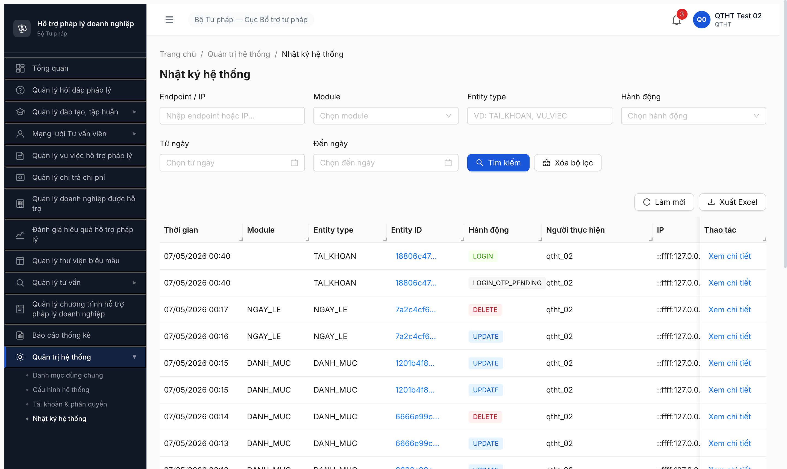

# Bug Report — R7.7.8d FR-VIII-28 Nhật ký hệ thống

| Thông tin | Giá trị |
|-----------|---------|
| **Dự án** | PM Hỗ trợ Pháp lý Doanh nghiệp |
| **Môi trường** | http://103.172.236.130:3000/quan-tri/audit-log |
| **Người test** | QA Automation via Claude Code (qtht_02) |
| **Ngày** | 2026-05-07 |
| **Loại test** | Functional FR-VIII-28 |
| **Round** | Round 7 — R7.7.8d |
| **2-source verify** | ✅ NotebookLM Haizz-HTPLDN (id `a4ae45bf-...`) + grep SRS local — match 100% |

---

## Tổng hợp

Phát hiện **6** lỗi khi test FR-VIII-28 Nhật ký hệ thống.

### Severity breakdown

| Tổng | Critical | Major | Medium | Minor | Trivial |
|------|----------|-------|--------|-------|---------|
| 6    | 0        | 2     | 2      | 2     | 0       |

## Bug Summary Table

| Bug ID | Severity | Priority | Type | TC Ref | **SRS Reference** | Title | Status |
|---|---|---|---|---|---|---|---|
| BUG-LOG-001 | Major | P1 | Negative | TC04 | `FR-VIII-28 §Processing bước 2` line 1348 + ERR-LOG-02 | BE thiếu validate khoảng thời gian > 90 ngày | Closed |
| BUG-LOG-002 | Major | P1 | Happy | TC05 | `FR-VIII-28 §Processing bước 6` line 1352 | Endpoint Export Excel 400 "uuid expected" — design sai | Closed |
| BUG-LOG-003 | Medium | P2 | UI/UX | TC06 | `FR-VIII-28 §Processing bước 5` line 1351 | UI page size mặc định 20/trang vs SRS 50/trang | Closed |
| BUG-LOG-004 | Medium | P2 | UI/UX | TC03 | `FR-VIII-28 §Inputs row 3` line 1339 | Filter "Người dùng" thiếu | Closed |
| BUG-LOG-005 | Minor | P3 | UI/UX | TC01 | `SCR-VIII-10` line 1827 | Cột "Đơn vị" thiếu trên table | Closed |
| BUG-LOG-006 | Minor | P3 | UI/UX | TC02-03 | `FR-VIII-28 §Inputs row 4-5` line 1340-1341 | Dropdown Module/Hành động dùng enum DB thay Tiếng Việt | Closed |

> **Re-test 2026-05-07 (sau dev fix):** ✅ ALL 6 CLOSED-verified.
> - **BUG-LOG-001**: Range 91 ngày (`tuNgay=2026-02-04&denNgay=2026-05-06`) → BE trả 422 với errCode `ERR-LOG-02` field "denNgay". FE date inputs marked `invalid="true"`. Status code 422 thay vì 400 SRS expected (minor) nhưng errCode đúng.
> - **BUG-LOG-002**: Click [Xuất Excel] → `POST /api/v1/audit-logs/export` → 200 với `Content-Disposition: attachment; filename="audit-log-20260507.xlsx"` + `content-type: spreadsheetml.sheet`. Endpoint route đúng (POST riêng, không conflict với `:id`).
> - **BUG-LOG-003**: Footer "50 / trang" mặc định, "1-50 / 275 mục".
> - **BUG-LOG-004**: Filter bar có "Người dùng" combobox.
> - **BUG-LOG-005**: Table headers có cột "Đơn vị".
> - **BUG-LOG-006**: Dropdown Module Tiếng Việt 10 options (Xác thực/Tài khoản/Vai trò/Đào tạo/Vụ việc/Chi trả/Đánh giá/Doanh nghiệp/Hỏi đáp/Tư vấn). Dropdown Hành động Tiếng Việt 10 options (Tạo mới/Xem/Cập nhật/Xóa/Gửi/Phê duyệt/Từ chối/Công khai/Bỏ công khai/Xuất dữ liệu).

---

## BUG-LOG-001 — BE thiếu validate khoảng thời gian > 90 ngày

### Mô tả

QTHT vào Nhật ký HT, nhập filter `tuNgay=2026-02-04` `denNgay=2026-05-06` (91 ngày, > 90 SRS limit). BE trả 200 OK + dữ liệu thay vì trả 400 ERR-LOG-02. Vi phạm SRS Processing bước 2 + ERR-LOG-02. Cả FE (date picker accept any range) lẫn BE (no validation) đều thiếu rule.

### Các bước tái hiện

1. Login `qtht_02` / OTP 666666.
2. Probe API trực tiếp:
   ```
   GET /api/v1/audit-logs?tuNgay=2026-02-04&denNgay=2026-05-06&page=1&pageSize=50
   Authorization: Bearer <JWT>
   ```
3. Quan sát response.

### Kết quả mong đợi

- BE trả `400` với `{success: false, error: {code: "ERR-LOG-02", message: "Khoảng thời gian tối đa là 90 ngày"}}`.
- FE date picker disable submit khi range > 90 ngày + show inline warning.

### Kết quả thực tế

- BE trả `200 OK` với data filtered (dataCount=0, total=0 vì không có audit log từ 02/2026).
- KHÔNG có error. KHÔNG có warning.

### Bằng chứng

**API probe response:**
```json
GET /api/v1/audit-logs?tuNgay=2026-02-04&denNgay=2026-05-06&page=1&pageSize=50
Status: 200
Response: {"success":true,"data":[],"meta":{"total":0,"page":1,"pageSize":50}}
```

**SRS local quote** (`srs-fr-10-quan-tri.md` line 1348 + 1366-1367):
```
| 2 | Validate khoảng thời gian: thoi_gian_den - thoi_gian_tu <= 90 ngày | — |
...
| E2 | Khoảng thời gian > 90 ngày | ERR-LOG-02 | "Khoảng thời gian tối đa là 90 ngày" | WARNING |
```

**NotebookLM verify match 100%** (citation source-id `e2d6294a-...`).

---

## BUG-LOG-002 — Endpoint Export Excel sai design (400 "uuid expected")

### Mô tả

Endpoint `/api/v1/audit-logs/export` trả 400 với errCode `ERR-VAL-SYS-00-00` message "Validation failed (uuid is expected)" — nghĩa là route `:id` matched trước `/export` (hoặc /export endpoint không deploy). Button [Xuất Excel] trên SCR-VIII-10 click không trigger network request → confirm endpoint không hoạt động. Acceptance Criteria #2 SRS line 1375 fail.

### Các bước tái hiện

1. Login `qtht_02` → navigate `/quan-tri/audit-log`.
2. Click button [Xuất Excel] → quan sát network → KHÔNG có request export.
3. Probe API trực tiếp:
   ```
   GET /api/v1/audit-logs/export?tuNgay=2026-04-01&denNgay=2026-05-06
   Authorization: Bearer <JWT>
   ```

### Kết quả mong đợi

- Endpoint trả Excel file (.xlsx) với audit log filtered theo params (max 10.000 dòng per BR-DATA-06).
- Click button [Xuất Excel] trigger download file.

### Kết quả thực tế

```json
GET /api/v1/audit-logs/export?...
Status: 400
Response: {"success":false,"error":{"code":"ERR-VAL-SYS-00-00","message":"Validation failed (uuid is expected)"}}
```

→ Path `/audit-logs/export` matched route `/audit-logs/:id` thay vì `/audit-logs/export` riêng. BE Express route order sai.

Click button [Xuất Excel] FE: KHÔNG có network request — FE handler không bind hoặc tự skip do biết endpoint không work.

### Bằng chứng

**API response:**
```json
{"success":false,"error":{"code":"ERR-VAL-SYS-00-00","message":"Validation failed (uuid is expected)"}}
```

**SRS local quote** (`srs-fr-10-quan-tri.md` line 1352 + 1375):
```
| 6 | Nếu QTHT nhấn "Xuất Excel": filter → export .xlsx, max 10.000 dòng | BR-DATA-06 |
...
**Acceptance Criteria:**
- Given QTHT nhấn Xuất Excel When có dữ liệu Then tải file .xlsx (max 10.000 dòng)
```

---

## BUG-LOG-003 — UI page size mặc định 20/trang vs SRS 50/trang

### Mô tả

UI footer "20 / trang" mặc định, BE response `pageSize=50`. FE config sai default page size, render chỉ 20 dù BE trả 50.

### Các bước tái hiện

1. Login `qtht_02` → `/quan-tri/audit-log`.
2. Quan sát footer pagination + DevTools Network.

### Kết quả mong đợi

- UI render 50/trang (per SRS line 1351 + SCR-VIII-10 line 1828: "50 muc/trang").

### Kết quả thực tế

- UI: "20 / trang" + table render 1-20/43 mục.
- Network: `GET /api/v1/audit-logs?page=1&pageSize=50` → response 50 record.
- → FE truncate response để render 20.

### Bằng chứng



---

## BUG-LOG-004 — Filter "Người dùng" thiếu

### Mô tả

SRS Inputs row 3 quote "nguoi_dung — searchable dropdown → TAI_KHOAN". UI filter bar SCR-VIII-10 không có filter này.

### Các bước tái hiện

1. Navigate `/quan-tri/audit-log`.
2. Quan sát filter bar.

### Kết quả mong đợi

Filter "Người dùng" với searchable dropdown TAI_KHOAN.

### Kết quả thực tế

UI filter bar 6 trường: Endpoint/IP / Module / Entity type / Hành động / Từ ngày / Đến ngày. Thiếu "Người dùng".

### Bằng chứng


---

## BUG-LOG-005 — Cột "Đơn vị" thiếu trên table

### Mô tả

SCR-VIII-10 line 1827 quote table cột: "Thoi gian / Nguoi dung / **Don vi** / Module / Entity / ...". UI table thiếu cột Đơn vị.

### Các bước tái hiện

1. Navigate `/quan-tri/audit-log`.
2. Quan sát header table.

### Kết quả mong đợi

Cột "Đơn vị" hiển thị `nguoi_thuc_hien.don_vi.ten` (vd: "Cục Bổ trợ tư pháp - BTP").

### Kết quả thực tế

Table render 10 cột: Thời gian / Module / Entity type / Entity ID / Hành động / Người thực hiện / IP / Endpoint / Code / Thao tác. Thiếu Đơn vị.

### Bằng chứng

API response có `nguoiThucHienVaiTro` nhưng không có `donVi` field → BE chưa join DON_VI table khi list audit log.

---

## BUG-LOG-006 — Dropdown Module/Hành động dùng enum DB thay Tiếng Việt

### Mô tả

SRS quote dropdown values Tiếng Việt: "Hỏi đáp / Đào tạo / Vụ việc / ..." cho Module + "Tạo / Sửa / Xóa / ..." cho Hành động. UI render enum DB raw English: "HOI_DAP / DAO_TAO / ..." + "CREATE / UPDATE / ...".

### Các bước tái hiện

1. Navigate `/quan-tri/audit-log`.
2. Click combobox Module → quan sát options.
3. Click combobox Hành động → quan sát options.

### Kết quả mong đợi

Dropdown text Tiếng Việt thân thiện cho QTHT non-tech.

### Kết quả thực tế

- Module: AUTH / TAI_KHOAN / VAI_TRO / DAO_TAO / VU_VIEC / CHI_TRA / DANH_GIA / DOANH_NGHIEP / HOI_DAP / TU_VAN.
- Hành động: CREATE / READ / UPDATE / DELETE / SUBMIT / APPROVE / REJECT / PUBLISH / UNPUBLISH / EXPORT.

### Bằng chứng

Snapshot a11y tree từ MCP listbox.

---

## Phụ lục — Môi trường test

| Thành phần | Giá trị |
|---|---|
| URL | http://103.172.236.130:3000/quan-tri/audit-log |
| API base | http://103.172.236.130:3000/api/v1 |
| Account | qtht_02 |
| Tool | Chrome DevTools MCP |
| NotebookLM | https://notebooklm.google.com/notebook/a4ae45bf-cea0-4325-8fee-b1e0be702cf2 |

---

*Bug report generated: 2026-05-07 | QA Automation via Claude Code | 2-source verify NotebookLM + SRS local*
