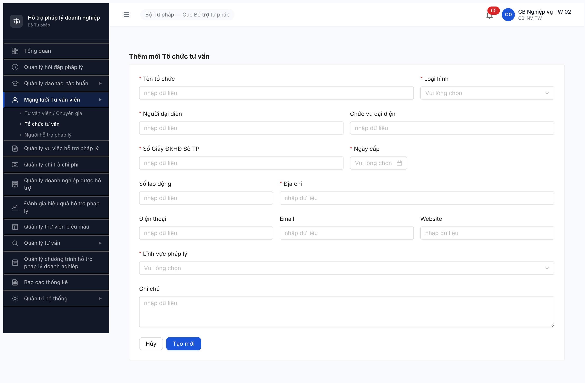
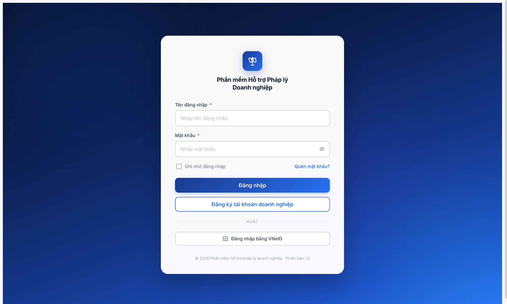

# Bug Report — TC TV form (R7.2.2-UI re-test) thiếu field + auto-logout

| Thông tin | Giá trị |
|-----------|---------|
| **Dự án** | PM HTPLDN |
| **Môi trường** | http://103.172.236.130:3000 |
| **Người test** | QA Automation (Chrome DevTools MCP) |
| **Ngày** | 2026-05-08 |
| **Loại test** | UI Seed re-test (R7.2.2 ⚠️ rule UI-only 2026-05-07) |
| **Round** | R7 |
| **Tài liệu tham chiếu** | [funtion/7.4b-to-chuc-tu-van.md](../../../../funtion/7.4b-to-chuc-tu-van.md) · `srs-update-2026-5-5/srs-fr-04-chuyen-gia-tvv.md` FR-IV-NEW-01 · [seed-checklist-r7-2-2-tc-tv.md](../../seed/to-chuc-tu-van/seed-checklist-r7-2-2-tc-tv.md) |

---

## Tổng hợp

Phát hiện **2 bug** khi re-test seed TC TV qua UI (rule UI-only 2026-05-07): **1 Critical** form thiếu field bắt buộc `Đơn vị quản lý` → không thể submit TC TV qua UI; **1 Major** FE auto-logout khi BE error 500 → mất session.

### Severity breakdown

| Tổng | Critical | Major | Medium | Minor | Trivial |
|------|----------|-------|--------|-------|---------|
| 2    | 1        | 1     | 0      | 0     | 0       |

## Bug Summary Table

| Bug ID | Severity | Priority | Type | TC Ref | **SRS Reference** | Title | Status |
|--------|----------|----------|------|--------|-------------------|-------|--------|
| BUG-TCTV-FE-002 | Critical | P0 | UI/UX | R7.2.2-UI | `srs-update-2026-5-5/srs-fr-04-chuyen-gia-tvv.md` FR-IV-NEW-01 §Inputs (TC TV bắt buộc `donViQuanLyId` UUID) | TC TV form thiếu field "Đơn vị quản lý" → không tạo được TC TV qua UI | Open |
| BUG-TCTV-FE-003 | Major | P1 | UI/UX | R7.2.2-UI | `srs-update-2026-5-5/srs-fr-04-chuyen-gia-tvv.md` FR-IV-NEW-01 §Error Handling (BE error không được kick session) | FE auto-logout sau BE response 500 trên submit TC TV form | Open |

---

## BUG-TCTV-FE-002 — TC TV form thiếu field "Đơn vị quản lý" → không tạo được TC TV qua UI

### Mô tả

Khi `cb_nv_tw_02` mở form Thêm mới Tổ chức tư vấn (`/chuyen-gia-tvv/to-chuc/tao-moi`), form chỉ render 13 field (Tên / Loại hình / Người ĐD / Chức vụ / Số ĐKHĐ / Ngày cấp / Số lao động / Địa chỉ / Điện thoại / Email / Website / Lĩnh vực pháp lý / Ghi chú) — **thiếu field "Đơn vị quản lý"** (cấp + đơn vị) bắt buộc theo SRS FR-IV-NEW-01. Payload submit không có `donViQuanLyId` → BE reject. User KHÔNG thể tạo TC TV qua UI dù điền đủ các field hiển thị.

### Các bước tái hiện

1. Login `cb_nv_tw_02 / Secret@123` + OTP `666666`
2. Sidebar → "Mạng lưới Tư vấn viên" → "Tổ chức tư vấn"
3. Click button "+ Thêm tổ chức tư vấn"
4. Form drawer mở → quan sát danh sách các field render
5. Đếm các field có label "*" (bắt buộc): Tên / Loại hình / Người ĐD / Số ĐKHĐ / Ngày cấp / Địa chỉ / Lĩnh vực pháp lý
6. Quan sát: KHÔNG có field nào liên quan "Đơn vị quản lý" / "Cấp đơn vị" / "Tên đơn vị quản lý" trong form
7. Điền đủ 7 field bắt buộc visible → click "Tạo mới" → submit fail (BE error vì payload thiếu `donViQuanLyId`)

### Kết quả mong đợi

- Form Thêm mới TC TV phải có field "Đơn vị quản lý" (dropdown / autocomplete cho phép chọn 1 đơn vị BTP/Sở TP/Phòng TP) — bắt buộc theo SRS FR-IV-NEW-01 §Inputs (TC TV thuộc 1 đơn vị quản lý).
- Khi user là CB_NV cấp TW (`cb_nv_tw_02`), field "Đơn vị quản lý" có thể default = đơn vị của user (TW Cục Bổ trợ TP) hoặc cho phép user pick các đơn vị thuộc scope quản lý của TW.
- Sau submit, payload phải có `donViQuanLyId` UUID hợp lệ → BE tạo TC TV state `MOI_DANG_KY` thành công.

### Kết quả thực tế

- Form chỉ render 13 field, không có field "Đơn vị quản lý".
- Khi điền đủ 7 field bắt buộc visible + click "Tạo mới" → BE response 500 (user bị FE redirect về login — xem BUG-TCTV-FE-003).
- So sánh seed via API (R7.2.2 trước đó): payload `POST /api/v1/to-chuc-tu-vans` BẮT BUỘC có `donViQuanLyId` UUID (vd `00000000-0000-4000-8002-000000000001` cho DP-HN); thiếu field này → BE reject.

### Bằng chứng

**1. Ảnh chụp form** *(13 field render, không có "Đơn vị quản lý")*:



**2. API contract reference** *(seed checklist R7.2.2 line 42-47, mapping fixture → payload UUID)*:

```yaml
# seed-checklist-r7-2-2-tc-tv.md §Đơn vị quản lý
| Variant | Fixture don_vi_quan_ly | Payload donViQuanLyId UUID                    |
| 1, 4    | DP-HN                  | 00000000-0000-4000-8002-000000000001          |
| 2       | DP-HP                  | 00000000-0000-4000-8002-000000000004          |
| 3       | DP-DN                  | 00000000-0000-4000-8002-000000000003          |
| 5, 6    | TW-CUC                 | 00000000-0000-4000-8000-000000000001          |
```

`donViQuanLyId` là field BẮT BUỘC trong payload BE — UI form thiếu = không cho phép user chọn → không submit được.

---

## BUG-TCTV-FE-003 — FE auto-logout sau BE response 500 trên submit TC TV form

### Mô tả

Sau khi user `cb_nv_tw_02` click "Tạo mới" trong form TC TV (form thiếu `donViQuanLyId` do BUG-TCTV-FE-002), BE response 500 (`ERR-SYS-00-00-01`). FE error handler tự động xóa session/JWT và redirect user về `/login` thay vì hiển thị error toast và giữ form state. User mất toàn bộ data đã điền + phải re-login + OTP. Workflow seed UI bị BLOCKED do mỗi attempt = mất 2-3 phút (re-login + nav + fill form).

### Các bước tái hiện

1. Login `cb_nv_tw_02` (đã có session JWT hợp lệ).
2. Mở form Thêm mới TC TV → điền đủ field visible → click "Tạo mới".
3. BE trả response 500 (`ERR-SYS-00-00-01`).
4. Quan sát: trong vòng 1-2s, page navigate về `/login`. Form state mất, session bị clear (`sessionStorage.auth-store` xóa). User phải nhập lại username/password + OTP.

### Kết quả mong đợi

- BE error 5xx: FE phải hiển thị toast error (`.ant-notification-error` hoặc `.ant-message-error`) với message dạng "Lỗi hệ thống, vui lòng thử lại" — KHÔNG kick session.
- Form state giữ nguyên để user có thể retry / sửa / cancel.
- Chỉ kick session khi BE trả 401 Unauthorized (token expired/revoked) — không phải 500.

### Kết quả thực tế

- BE 500 → FE clear session → redirect `/login`.
- User mất hết form data → phải làm lại từ đầu.
- Pattern này khác hẳn các module khác (vd Loại DN, Hỏi đáp): BE error 5xx hiện toast, giữ form state.

### Bằng chứng

**1. Ảnh chụp** *(sau click "Tạo mới" form TC TV → page redirect về /login)*:



**2. Network response BE error** *(observed in MCP `list_network_requests` session 2026-05-08)*:

```json
POST /api/v1/to-chuc-tu-vans
Status: 500
Response: {
  "success": false,
  "error": {
    "code": "ERR-SYS-00-00-01",
    "message": "Lỗi hệ thống"
  }
}
```

**3. Behavior khác module để so sánh:**

| Module | BE error | FE behavior |
|--------|----------|-------------|
| Loại DN form (R7.2.4) | 500 | Toast error, giữ form |
| Hỏi đáp form (R7.4.A4) | 500 | Toast error, giữ form |
| **TC TV form (R7.2.2)** | **500** | **Auto-logout, mất form (BUG)** |

---

## Phụ lục — Môi trường test

| Thành phần | Giá trị |
|------------|---------|
| URL ứng dụng | http://103.172.236.130:3000 |
| OTP login | `666666` bypass |
| Account test | `cb_nv_tw_02` / Secret@123 |
| Form path | `/chuyen-gia-tvv/to-chuc/tao-moi` |
| Endpoint submit | `POST /api/v1/to-chuc-tu-vans` |
| Tool test | Chrome DevTools MCP (`mcp__chrome-devtools__*`) |

---

*Bug report generated: 2026-05-08 | QA Automation via Claude Code (Chrome DevTools MCP)*
