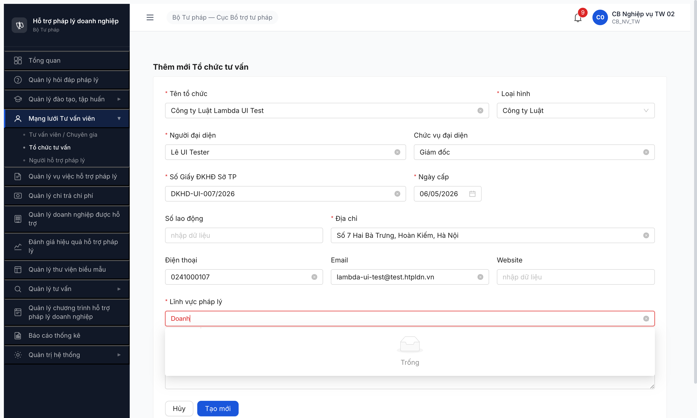

# Bug Report — TC TV form (R7.2.2-UI) Lĩnh vực dropdown empty

| Thông tin | Giá trị |
|-----------|---------|
| **Dự án** | PM HTPLDN |
| **Môi trường** | http://103.172.236.130:3000 |
| **Người test** | QA Automation (Chrome DevTools MCP) |
| **Ngày** | 2026-05-07 |
| **Loại test** | UI Workflow (R7.2.2-UI Plan B redo) |
| **Round** | R7 |
| **Tài liệu tham chiếu** | [funtion/7.4b-to-chuc-tu-van.md](../../../../funtion/7.4b-to-chuc-tu-van.md) · `srs-update-2026-5-5/srs-fr-04-chuyen-gia-tvv.md` FR-IV-NEW-01 · CLAUDE.md "Quy trình phân loại tab trống" iron rule |

---

## Tổng hợp

Phát hiện **1 bug Major** trong R7.2.2-UI: FE TC TV form gửi `loaiDanhMuc=LINH_VUC_PHAP_LY` cho BE nhưng BE chỉ có DM seeded dưới code `LINH_VUC_PL` → dropdown Lĩnh vực rỗng → user **không thể tạo TC TV qua UI**.

### Severity breakdown

| Tổng | Critical | Major | Medium | Minor | Trivial |
|------|----------|-------|--------|-------|---------|
| 1    | 0        | 1     | 0      | 0     | 0       |

## Bug Summary Table

| Bug ID | Severity | Priority | Type | TC Ref | **SRS Reference** | Title | Status |
|--------|----------|----------|------|--------|-------------------|-------|--------|
| BUG-TCTV-FE-001 | Major | P0 | UI/UX | R7.2.2-UI TC-CG-A1-02 | `srs-fr-10-quan-tri.md` FR-VIII-01 line 204 (DM LINH_VUC_PL 10 LV SRS) + `srs-fr-04-chuyen-gia-tvv.md` FR-IV-NEW-01 (TC TV form yêu cầu linhVucIds[] UUID) | FE TC TV form query `loaiDanhMuc=LINH_VUC_PHAP_LY` BE trả empty → dropdown LV rỗng | Open |

---

## BUG-TCTV-FE-001 — TC TV form gửi sai `loaiDanhMuc` query → dropdown LV rỗng

### Mô tả

Khi `cb_nv_tw_02` mở form Thêm mới Tổ chức tư vấn (`/chuyen-gia-tvv/to-chuc/tao-moi`) và click dropdown "Lĩnh vực pháp lý" để chọn LV, FE gửi request `GET /api/v1/danh-muc/tree?loaiDanhMuc=LINH_VUC_PHAP_LY`. BE trả 200 với `data: []` (empty array). Dropdown hiển thị "Trống — Chưa có dữ liệu". User KHÔNG THỂ pick LV → form validation block "Chọn ít nhất 1 lĩnh vực" → KHÔNG thể tạo TC TV qua UI. So sánh: TVV form query `loaiDanhMuc=LINH_VUC_PL` (cùng tiền tố nhưng SUFFIX khác) trả 12 records LV.

### Các bước tái hiện

1. Login `cb_nv_tw_02 / Secret@123` + OTP `666666`
2. Navigate `/chuyen-gia-tvv/to-chuc/tao-moi`
3. Fill form: Tên + Loại hình "Công ty Luật" + Người ĐD + Số ĐKHĐ + Ngày cấp + Địa chỉ + Email
4. Click dropdown "Lĩnh vực pháp lý"
5. Quan sát: dropdown mở, search input có focus, NHƯNG list options rỗng (chỉ icon "Trống" + text "Chưa có dữ liệu")
6. Type "Doanh" + Enter → vẫn rỗng
7. Click "Tạo mới" → FE block với message "Chọn ít nhất 1 lĩnh vực" (vì state form `linhVucIds=[]`)

### Kết quả mong đợi

- Dropdown "Lĩnh vực pháp lý" hiển thị 10 LV theo SRS `srs-fr-10-quan-tri.md` FR-VIII-01 line 204:
  Thuế / Lao động / Đất đai / Dân sự / Thương mại / Hình sự / Hành chính / Sở hữu trí tuệ / Doanh nghiệp / Đầu tư
- User pick được ≥1 LV → form `linhVucIds[]` chứa UUID → click "Tạo mới" tạo TC TV `MOI_DANG_KY` thành công.
- Behavior phải đồng nhất với TVV form (cũng FR-04, cũng UC59) đang query `loaiDanhMuc=LINH_VUC_PL` thành công.

### Kết quả thực tế

- FE gửi `GET /api/v1/danh-muc/tree?loaiDanhMuc=LINH_VUC_PHAP_LY` (suffix khác).
- BE trả 200 nhưng `data: []` (empty).
- Dropdown rỗng. Form không submit được.

```json
// Network request reqid=1116 (TC TV form):
GET /api/v1/danh-muc/tree?loaiDanhMuc=LINH_VUC_PHAP_LY
Status: 304 (cached empty)
Response: {"success":true,"data":[],"meta":null}

// Compare TVV form (R7.4.A1-CG earlier session, working):
GET /api/v1/danh-muc/tree?loaiDanhMuc=LINH_VUC_PL
Status: 200
Response: {"success":true,"data":[
  {"id":"bbbbbbbb-...0010","ma":"DAN_SU","ten":"Dân sự",...},
  ...12 records...
]}
```

### Bằng chứng

**Screenshot:** Dropdown "Lĩnh vực pháp lý" sau khi click + type "Doanh" — list rỗng "Trống / Chưa có dữ liệu":



**Network log evidence:** xem reqid=1116 trong session log MCP — query `LINH_VUC_PHAP_LY` returns empty array.

---

## Phụ lục — Môi trường test

| Thành phần | Giá trị |
|------------|---------|
| URL ứng dụng | http://103.172.236.130:3000 |
| OTP login | `666666` bypass |
| Account test | `cb_nv_tw_02` / Secret@123 |
| Form path | `/chuyen-gia-tvv/to-chuc/tao-moi` |
| Endpoint sai (FE) | `GET /api/v1/danh-muc/tree?loaiDanhMuc=LINH_VUC_PHAP_LY` |
| Endpoint đúng (TVV form) | `GET /api/v1/danh-muc/tree?loaiDanhMuc=LINH_VUC_PL` |
