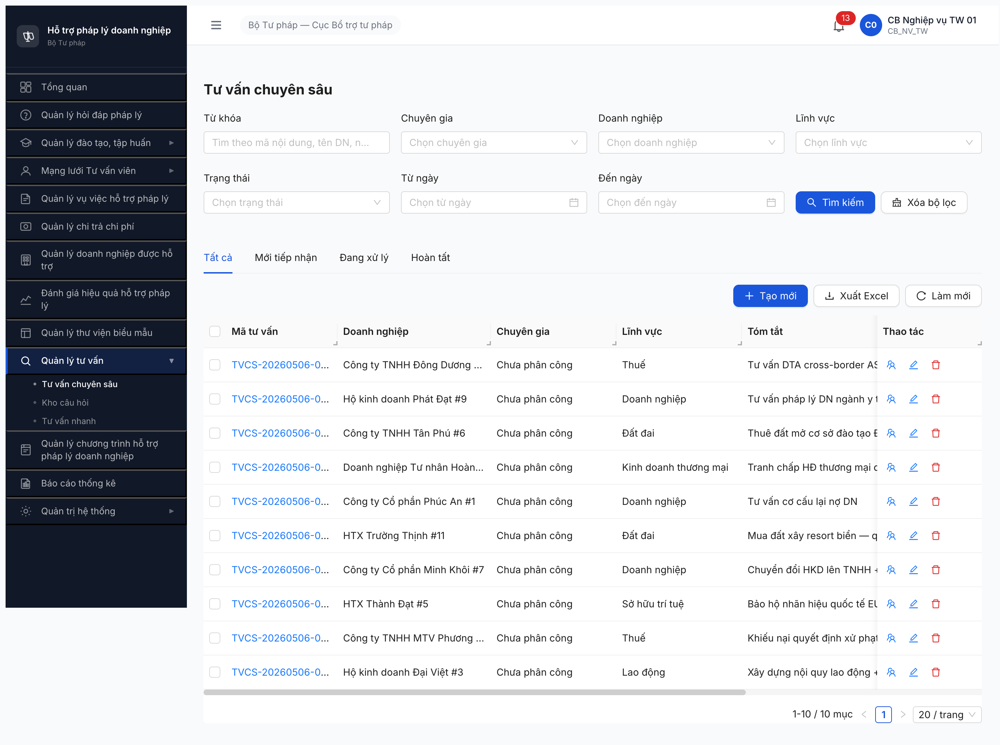

# Bug Report — TVCS hinhThucTv VIDEO_CALL 500 (R7.3.3)

| Thông tin | Giá trị |
|-----------|---------|
| **Dự án** | PM HTPLDN |
| **Môi trường** | http://103.172.236.130:3000 |
| **Người test** | QA Automation via Claude Code |
| **Ngày** | 2026-05-06 |
| **Loại test** | Seed (Negative API) |
| **Round** | Round 7 |
| **Tài liệu tham chiếu** | [seed-fixture.yaml v2.7.1 > tv_cs_variants](../../../../../input/data/seed-fixture.yaml) · [srs-fr-12-tv-chuyen-sau.md](../../../../../input/srs-update-2026-5-5/srs-fr-12-tv-chuyen-sau.md) |

---

## Tổng hợp

Phát hiện **1** bug có SRS reference cụ thể trong R7.3.3 seed TVCS.

### Severity breakdown

| Tổng | Critical | Major | Medium | Minor | Trivial |
|------|----------|-------|--------|-------|---------|
| 1    | 0        | 1     | 0      | 0     | 0       |

## Bug Summary Table

| Bug ID | Severity | Priority | Type | TC Ref | **SRS Reference** | Title | Status |
|--------|----------|----------|------|--------|-------------------|-------|--------|
| BUG-TVCS-VIDEO-CALL-001 | Major | P1 | Negative | R7.3.3 seed | `srs-update-2026-5-5/srs-fr-12-tv-chuyen-sau.md §Changelog line 18 + §3.4.3.9 line 1294` | POST `/api/v1/noi-dung-tu-van-cs` trả 500 khi `hinhThucTv=VIDEO_CALL` (BE chưa bỏ field orphan + chưa handle enum) | Open |

---

## BUG-TVCS-VIDEO-CALL-001 — POST TVCS trả 500 khi hinhThucTv=VIDEO_CALL

### Mô tả

CB Nghiệp vụ TW gọi `POST /api/v1/noi-dung-tu-van-cs` với payload `hinhThucTv=VIDEO_CALL` → BE trả `500 Internal Server Error`. Cùng payload đổi `HO_SO` hoặc `DIEN_THOAI` thì 201 OK. Per SRS update 2026-05-05 §Changelog line 18, field `hinh_thuc_tv` đã bị **bỏ** khỏi entity TU_VAN_CHUYEN_SAU (đẩy xuống `PHIEN_TU_VAN.hinh_thuc` cấp con — line 1294 enum cho phép `VIDEO_CALL/DIEN_THOAI/HO_SO/TRUC_TIEP`). BE chưa deploy SRS update — vẫn giữ field `hinhThucTv` trong DTO + lại không handle hết enum.

### Các bước tái hiện

1. Login `cb_nv_tw_01 / Secret@123` (OTP `666666`).
2. Gọi `POST /api/v1/noi-dung-tu-van-cs` với body `{doanhNghiepId, linhVucId, noiDung, tomTat, hinhThucTv: "VIDEO_CALL"}`.
3. Quan sát: BE trả `500` `Internal server error`.
4. Đổi `hinhThucTv` → `HO_SO` cùng payload còn lại → BE trả `201 Created`, mã `TVCS-20260506-XXXX` state `TIEP_NHAN`.
5. Đổi `hinhThucTv` → `DIEN_THOAI` → `201 Created`.
6. Bỏ field `hinhThucTv` (theo SRS update 2026-05-05) → cũng `201 Created`.

### Kết quả mong đợi

- **Theo SRS update 2026-05-05** (file `srs-fr-12-tv-chuyen-sau.md` §Changelog line 18): BE bỏ field `hinh_thuc_tv` khỏi entity TVCS, hình thức quản lý ở cấp `PHIEN_TU_VAN`. POST TVCS không nên nhận field `hinhThucTv` nữa, hoặc nếu giữ backward-compat phải accept đầy đủ enum 4 value `VIDEO_CALL/DIEN_THOAI/HO_SO/TRUC_TIEP` (line 1294) chứ không phép 500 trên 1 value.
- **Theo enum SRS line 1294** (`PHIEN_TU_VAN.hinh_thuc`): nếu giữ field thì `VIDEO_CALL` là value hợp lệ → BE phải `201 Created` như `HO_SO/DIEN_THOAI`.

### Kết quả thực tế

- BE trả `500 Internal server error` cho `VIDEO_CALL`, không có error code chi tiết, không có field validation hint.
- API response:
  ```json
  {"success":false,"error":{"code":"ERR-SYS-00-04-99","message":"Internal server error"}}
  ```
- 5/10 lần POST seed cùng phiên fail liên tiếp khi `hinhThucTv=VIDEO_CALL`. Chỉ pass với `HO_SO`/`DIEN_THOAI`.

### Bằng chứng

**1. Ảnh chụp**:



**2. API response trace** (5 lần fail liên tiếp khi `hinhThucTv=VIDEO_CALL`, 5 lần retry với `HO_SO` → pass):

```json
[
  {"status":500,"lv":"001a","err":"Internal server error","hinhThuc":"VIDEO_CALL"},
  {"status":500,"lv":"0016","err":"Internal server error","hinhThuc":"VIDEO_CALL"},
  {"status":201,"ma":"TVCS-20260506-0001","lv":"0013","hinhThuc":"HO_SO"},
  {"status":201,"ma":"TVCS-20260506-0002","lv":"0018","hinhThuc":"DIEN_THOAI"},
  {"status":201,"ma":"TVCS-20260506-0003","lv":"0019","hinhThuc":"HO_SO"},
  {"status":500,"lv":"0014","err":"Internal server error","hinhThuc":"VIDEO_CALL"},
  {"status":201,"ma":"TVCS-20260506-0004","lv":"001a","hinhThuc":"HO_SO"},
  {"status":500,"lv":"001a","err":"Internal server error","hinhThuc":"VIDEO_CALL"},
  {"status":201,"ma":"TVCS-20260506-0005","lv":"0014","hinhThuc":"DIEN_THOAI"},
  {"status":500,"lv":"0018","err":"Internal server error","hinhThuc":"VIDEO_CALL"}
]
```

**3. SRS quote**:

> File `input/srs-update-2026-5-5/srs-fr-12-tv-chuyen-sau.md` §Changelog line 18 (2026-05-05):
> "Bỏ field `hinh_thuc_tv` khỏi entity TU_VAN_CHUYEN_SAU (Section 4 ERD line 1179 + bảng thuộc tính 3.4.3.9). Lý do: field orphan — không có FR/Inputs/Processing/AC/Accordion nào trong Nhóm X.1 dùng."

> File `input/srs-update-2026-5-5/srs-fr-12-tv-chuyen-sau.md` §3.4.3.9 line 1294 (PHIEN_TU_VAN entity):
> "5 | hinh_thuc | text | Y | CHECK IN ('VIDEO_CALL','DIEN_THOAI','HO_SO','TRUC_TIEP') | — | Hình thức"

> Schema BE OpenAPI `/api/docs-json` `CreateNoiDungTuVanCsDto.hinhThucTv` vẫn còn field, type=string maxLength=15, không enum.

---

## Phụ lục — Môi trường test

| Thành phần | Giá trị |
|------------|---------|
| URL ứng dụng | http://103.172.236.130:3000/ |
| Login | `cb_nv_tw_01 / Secret@123` (OTP bypass `666666`) |
| API base | `http://103.172.236.130:3000/api/v1` |
| Endpoint POST | `/api/v1/noi-dung-tu-van-cs` |
| Tool test | Chrome DevTools MCP — fetch w/ JWT từ XHR interceptor |

---

*Bug report generated: 2026-05-06 14:55 | QA Automation via Claude Code*
