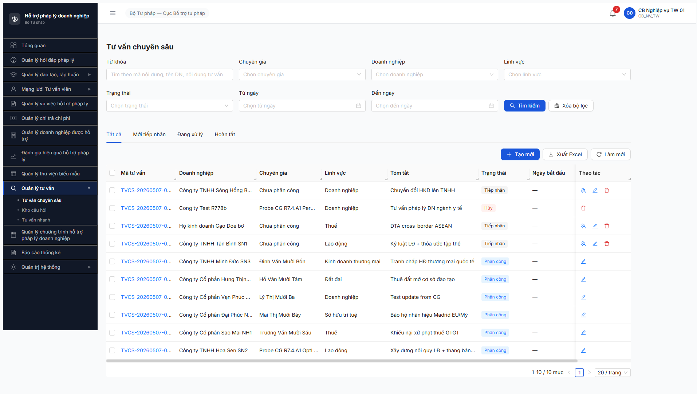
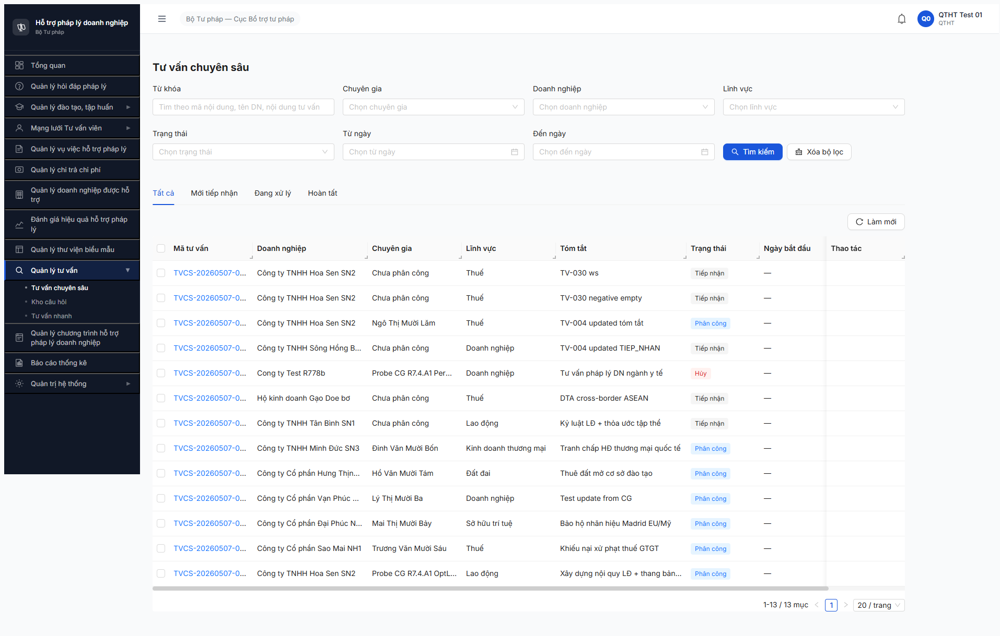

# Bug Report — TVCS Functional R7.7.5

| Thông tin | Giá trị |
|-----------|---------|
| **Dự án** | PM HTPLDN |
| **Môi trường** | http://103.172.236.130:3000/ |
| **Người test** | QA Automation |
| **Ngày** | 2026-05-07 |
| **Loại test** | Functional (R7.7.5) |
| **Round** | R8 |
| **Tài liệu tham chiếu** | [`output/funtion/7.12-tu-van-chuyen-sau.md`](../../../../funtion/7.12-tu-van-chuyen-sau.md) v3.5 + [`srs-fr-12-tv-chuyen-sau.md`](../../../../../input/srs-update-2026-5-5/srs-fr-12-tv-chuyen-sau.md) v3.5 |

---

## Tổng hợp

Phát hiện **3** lỗi BE validation trong functional sweep R7.7.5, đều có SRS reference cụ thể.

### Severity breakdown (sau update R8 sweep HSPL)

| Tổng | Critical | Major | Medium | Minor | Trivial |
|------|----------|-------|--------|-------|---------|
| 10   | 1        | 6     | 1      | 2     | 0       |

## Bug Summary Table

| Bug ID | Severity | Priority | Type | TC Ref | **SRS Reference** | Title | Status |
|--------|----------|----------|------|--------|-------------------|-------|--------|
| BUG-FUNC-TVCS-FN-001 | Major | P1 | Happy | TV-005 | `BR-DATA-08` (Full-text search tiếng Việt unaccent) | TVCS list search không hỗ trợ unaccent (Vietnamese diacritic-insensitive) | Open |
| BUG-FUNC-TVCS-FN-002 | Major | P1 | Negative | TV-030 | `srs-fr-12 §Error Handling` ERR-TVCS-01 "Nội dung tư vấn là bắt buộc" | BE chấp nhận tạo TVCS với `noiDung` rỗng/whitespace — chỉ reject `missing field` | Open |
| BUG-FUNC-TVCS-FN-003 | Medium | P1 | Negative | TV-031 | `srs-fr-12 line 533` filter `loaiTvv=CG ∧ trangThai=HOAT_DONG` | BE chấp nhận phân công CG VO_HIEU_HOA — không validate state CG trước khi gán | Open |
| BUG-FUNC-HSPL-001 | Major | P0 | Authorization | TV-054 | `srs-fr-12 v3.5 Thay đổi 10` (NHT chỉ R+U) + UC150 spec | NHT có 4 permission C/R/U/D — runtime confirm NHT DELETE HSPL của người khác → 204 (privacy/data integrity vi phạm) | Open |
| BUG-FUNC-HSPL-002 | Major | P0 | Authorization | TV-053 | `srs-fr-12 line 669` BR-AUTH-10 mở rộng (2-tier filter) | Filter list HSPL cho role NHT thiếu lớp 2 (EXISTS VU_VIEC). NHT thấy HSPL đơn vị mình không cần VV phân công | Open |
| BUG-FUNC-HSPL-003 | Critical | P0 | Happy | TV-055 | `srs-fr-12 §Processing — Xem chi tiết line 606-614` | `GET /api/v1/ho-so-phap-ly-dns/{id}` Detail trả 500 ERR-SYS-00-00-01 cho mọi ID/role | Open |
| BUG-FUNC-HSPL-004 | Minor | P2 | Authorization | TV-053 | `BR-AUTH-08` data scope đơn vị | NHT thấy HSPL-0022 nhưng KHÔNG thấy HSPL-0021 (cùng creator/DN/đơn vị/cùng request) — list filter inconsistent | Open |
| BUG-FUNC-HSPL-005 | Minor | P2 | Happy | TV-018 | `srs-fr-12 §Inputs — Tìm kiếm` row 1 (keyword field) | List `?keyword=` param ignored — BE chỉ áp `?search=`; FE/BE naming mismatch | Open |
| BUG-FUNC-HSPL-006 | Major | P1 | Happy | TV-018 | `BR-DATA-08` (unaccent search) | List HSPL `?search=` không hỗ trợ unaccent — same pattern BUG-FN-001 | Open |
| BUG-FUNC-HSPL-007 | Major | P0 | Happy | TV-017 | — (BE regression) | `POST /api/v1/ho-so-phap-ly-dns` Create regression 500 ERR-SYS-00-00-01 trong session R8 23:08 — sáng cùng ngày POST OK | Open |

---

## BUG-FUNC-TVCS-FN-001 — TVCS list search không hỗ trợ unaccent (BR-DATA-08 violation)

### Mô tả

Endpoint `GET /api/v1/noi-dung-tu-van-cs?search=<keyword>` chỉ match keyword có dấu chính xác. Search keyword không dấu (đã strip diacritics) trả `total=0` mặc dù trong DB có TVCS với từ khóa tương ứng có dấu. Vi phạm BR-DATA-08 ("Full-text search tiếng Việt unaccent").

### Các bước tái hiện

1. Login `cb_nv_tw_01` / `Secret@123` + OTP `666666`.
2. Verify pool có TVCS với tóm tắt chứa "Tái cấu trúc nợ DN" (TVCS-20260507-0004), "Thuê đất mở cơ sở đào tạo" (TVCS-0005), "Bảo hộ nhãn hiệu Madrid" (TVCS-0003).
3. Probe 6 query qua API:
   - `?search=Tái cấu trúc` → 200 total=1 (hit TVCS-0004)
   - `?search=tai cau truc` → 200 total=0 ❌
   - `?search=cau truc` → 200 total=0 ❌
   - `?search=thuê đất` → 200 total=1 (hit TVCS-0005)
   - `?search=thue dat` → 200 total=0 ❌
   - `?search=Madrid` → 200 total=1 (hit TVCS-0003 — Latin OK)
4. Quan sát: Có dấu match đúng, không dấu fail. `Madrid` (Latin không dấu) match OK → BE search match exact bytes, không dùng unaccent normalization.

### Kết quả mong đợi

- Search "tai cau truc" → 1 hit TVCS-0004 (BR-DATA-08 unaccent normalization)
- Search "thue dat" → 1 hit TVCS-0005
- Search "cau truc" → 1 hit TVCS-0004 (substring + unaccent)
- BR-DATA-08 spec: search bằng tiếng Việt phải hỗ trợ unaccent (Postgres `unaccent` extension hoặc tự build search vector).

### Kết quả thực tế

- Tất cả query không dấu trả `total=0, data=[]` mặc dù DB có TVCS phù hợp.
- BE chỉ thực hiện partial match exact bytes (substring có dấu).
- User Việt Nam input thường không dấu (typing speed, thiếu IME) → search UX rất tệ cho người dùng thực.

### Bằng chứng

```text
GET /api/v1/noi-dung-tu-van-cs?page=1&pageSize=20&search=Tái+cấu+trúc → 200 total=1 ['TVCS-20260507-0004'] ✅
GET ?search=tai+cau+truc                                              → 200 total=0 []                  ❌
GET ?search=cau+truc                                                  → 200 total=0 []                  ❌
GET ?search=thuê+đất                                                  → 200 total=1 ['TVCS-20260507-0005'] ✅
GET ?search=thue+dat                                                  → 200 total=0 []                  ❌
GET ?search=Madrid                                                    → 200 total=1 ['TVCS-20260507-0003'] ✅
GET ?search=TVCS-20260507                                             → 200 total=10 (mã code search OK) ✅
```



---

## BUG-FUNC-TVCS-FN-002 — BE chấp nhận `noiDung` rỗng / whitespace khi tạo TVCS

### Mô tả

POST `/api/v1/noi-dung-tu-van-cs` với `noiDung = ""` (empty string) hoặc `noiDung = "   "` (whitespace only) → BE trả 201, lưu thẳng record với nội dung rỗng. Vi phạm spec ERR-TVCS-01 "Nội dung tư vấn là bắt buộc". BE chỉ reject khi field hoàn toàn missing (chấp nhận type `string` rỗng là hợp lệ — vi phạm business validation).

### Các bước tái hiện

1. Login `cb_nv_tw_01`.
2. POST `/api/v1/noi-dung-tu-van-cs` body:
   ```json
   {"doanhNghiepId": "e0000000-0000-4000-8005-000000000002",
    "linhVucId": "bbbbbbbb-0000-4000-8000-000000000018",
    "noiDung": "",
    "tomTat": "TV-030 negative empty",
    "hinhThucTv": "HO_SO",
    "ngayTuVan": "2026-05-30"}
   ```
   → 201, mã `TVCS-20260507-0012`, state TIEP_NHAN, savedNoiDung = `""`.
3. Repeat với `noiDung: "   "` (whitespace) → 201, mã `TVCS-20260507-0013`, savedNoiDung = `"   "`.
4. Repeat với `noiDung` thiếu hoàn toàn → 422 ERR-VAL-SYS-00-01 "noiDung must be a string". Đây là type-check, không phải business validation.
5. List `?page=1&pageSize=50` → thấy TVCS-0012/0013 hiển thị bình thường, cột "Tóm tắt" có giá trị (FE chỉ hiện tomTat, không hiện noiDung trong list).
6. Chuyển trạng thái sang PHAN_CONG vẫn OK trên record có noiDung rỗng → workflow tiếp tục với data garbage.

### Kết quả mong đợi

- POST với `noiDung = ""` → 422 với code `ERR-TVCS-01` "Nội dung tư vấn là bắt buộc".
- POST với `noiDung = "   "` (chỉ whitespace) → cùng 422 ERR-TVCS-01 sau khi `.trim()` → empty.
- Validator: NestJS DTO thêm `@IsNotEmpty()` + `@MinLength(1)` + custom transform `.trim()` trên field `noiDung`.

### Kết quả thực tế

- 2 record TVCS-0012 + 0013 đã pollute pool với nội dung rỗng/whitespace.
- BE accept null business validation → user (FE bypass) hoặc API caller có thể tạo TVCS không có ý nghĩa.
- Ảnh hưởng downstream: stepper render TVCS empty content, audit log record CREATE entry vô nghĩa, Cổng PLQG nếu publish sẽ gửi tư vấn rỗng cho DN.

### Bằng chứng

```text
POST {noiDung: ""}                  → 201 mã TVCS-20260507-0012 savedNoiDung="" ❌
POST {noiDung: "   "}               → 201 mã TVCS-20260507-0013 savedNoiDung="   " ❌
POST {missing noiDung field}        → 422 ERR-VAL-SYS-00-01 "noiDung must be a string"
GET  /noi-dung-tu-van-cs?pageSize=50 → 13 records (incl. 0012 + 0013 polluted)
```



---

## BUG-FUNC-TVCS-FN-003 — BE chấp nhận phân công CG `VO_HIEU_HOA` (không validate state CG)

### Mô tả

POST `/api/v1/noi-dung-tu-van-cs/{id}/phan-cong` với `chuyenGiaId` của TVV state `VO_HIEU_HOA` → BE trả 200, set `chuyenGiaId` thành CG vô hiệu, state TVCS chuyển PHAN_CONG. Vi phạm SRS line 533 (filter dropdown phân công yêu cầu `loaiTvv=CG ∧ trangThai=HOAT_DONG`). FE filter dropdown chỉ render CG HOAT_DONG nhưng BE không enforce → user (hoặc API caller) bypass dropdown có thể gán CG vô hiệu.

### Các bước tái hiện

1. Login `cb_nv_tw_01`.
2. Tạo TVCS-20260507-0011 (LV Thuế, state TIEP_NHAN, version 1).
3. Verify TVV-BTP-TW-0003 (Ngô Thị Mười Lăm, ID `8f24c981-af86-459b-89a2-244aaec4c812`) có `loaiTvv=CG ∧ trangThai=VO_HIEU_HOA ∧ linhVuc=Lao động`.
4. POST `/api/v1/noi-dung-tu-van-cs/{TVCS-0011}/phan-cong` body `{chuyenGiaId: '8f24c981-...', version: 1}` → 200, state PHAN_CONG, chuyenGiaId = `8f24c981-...`.
5. List view: TVCS-0011 cột Chuyên gia hiển thị "Ngô Thị Mười Lăm" — gán thành công CG vô hiệu (lưu ý ngoài lề: cũng cross-LV nhưng phân công vẫn 200 — có thể có 2 BE bug khác — xem note).

### Kết quả mong đợi

- POST phân công CG `trangThai != HOAT_DONG` → 422 với code `ERR-TVCS-02` "Chuyên gia không hợp lệ".
- BE-side validation cần JOIN TU_VAN_VIEN, check `trangThai = HOAT_DONG ∧ loaiTvv = CG ∧ linhVucIds INTERSECT TVCS.linhVucId` trước khi cho phép set `chuyenGiaId`.

### Kết quả thực tế

- 200, state TIEP_NHAN → PHAN_CONG, chuyenGiaId = TVV-0003 (VO_HIEU_HOA).
- Pool R8 pollute 1 record (TVCS-0011) gán CG vô hiệu.
- Workflow downstream: CG VO_HIEU_HOA không thể login (TK của CG đó VO_HIEU_HOA hoặc không activate), nên TVCS-0011 sẽ đứng vĩnh viễn ở PHAN_CONG mà không có CG xác nhận → ghost record block luồng business.
- **Lưu ý lề:** phân công cũng cross-LV (TVCS-0011 LV Thuế nhưng Ngô có LV Lao động) — có thể là BE bug riêng về LV cross-check filter. Cần verify thêm ở R9 với explicit cross-LV negative test.

### Bằng chứng

```text
GET /api/v1/tu-van-viens?loaiTvv=CG&size=20
  → byState: {HOAT_DONG: 7, VO_HIEU_HOA: 1}, Ngô = '8f24c981-...' VO_HIEU_HOA ✅ (verified state)

POST /api/v1/noi-dung-tu-van-cs (TVCS-0011 LV Thuế)
  → 201, ver=1, state=TIEP_NHAN

POST /api/v1/noi-dung-tu-van-cs/{TVCS-0011}/phan-cong
     body {chuyenGiaId: '8f24c981-af86-459b-89a2-244aaec4c812', version: 1}
  → 200 ❌
     state=PHAN_CONG, chuyenGiaId='8f24c981-...' (VO_HIEU_HOA assigned)

GET list → TVCS-0011 row cột Chuyên gia = "Ngô Thị Mười Lăm"
```


---

## BUG-FUNC-HSPL-001 — NHT runtime DELETE thành công HSPL của người khác (Privacy/data integrity)

### Mô tả

Theo SRS Thay đổi 10 v3.5 — NHT chỉ có quyền R+U (Read + Update) trên HSPL của DN có VV được phân công cho NHT. Runtime BE trả permissions list cho NHT là `[create, read, update, delete]_ho_so_phap_ly_dn` (4 perm overgrant). Quan trọng hơn — endpoint DELETE thực sự chấp nhận request từ NHT và xóa thành công HSPL được tạo bởi user khác (cb_nv_dp_01). Dẫn đến vi phạm data integrity + privacy: NHT có thể xóa hồ sơ pháp lý của DN ngoài scope.

### Các bước tái hiện

1. Login `nht_01` / `Secret@123` + OTP `666666`. Verify `GET /api/v1/auth/me` permissions chứa `delete_ho_so_phap_ly_dn`.
2. Pre-condition: HSPL-20260507-0022 được tạo bởi `cb_nv_dp_01` (tk id `ce60da61-...`), đơn vị STP-AG, DN Bình Minh AG. ID `66b3d553-cb43-47f7-9a04-972dfa181537`.
3. POST `/api/v1/ho-so-phap-ly-dns` body `{doanhNghiepId, tenHoSo, loaiHoSo}` → 500 (BUG-HSPL-007 regression). Bỏ qua bước create.
4. DELETE `/api/v1/ho-so-phap-ly-dns/66b3d553-cb43-47f7-9a04-972dfa181537` → **204 No Content** ❌. Record bị xóa mềm.
5. List sau DELETE: total 22→21, record không còn visible.

### Kết quả mong đợi

- Login NHT → permissions list: `[read, update]_ho_so_phap_ly_dn` (chỉ 2 perm).
- POST/DELETE từ NHT → 403 ERR-PERM-SYS-00-01 "Forbidden".
- Spec quote (SRS line 671): "Không cho NHT tạo mới hoặc xóa hồ sơ (chỉ R + U)".

### Kết quả thực tế

- Permissions list trả 4 perm bao gồm `create_ho_so_phap_ly_dn` + `delete_ho_so_phap_ly_dn`.
- DELETE → 204 thành công, record HSPL-0022 bị xóa.
- POST → 500 (do BUG-HSPL-007 regression khác — nhưng trước đó nht_01 đã thành công CREATE HSPL-0023 trong session sáng cùng ngày — minh chứng permission C cũng overgrant).

### Bằng chứng

```text
GET /api/v1/auth/me (nht_01)
  → permissions: [
      "create_ho_so_phap_ly_dn",   ← KHÔNG nên có
      "delete_ho_so_phap_ly_dn",   ← KHÔNG nên có
      "read_ho_so_phap_ly_dn",     ← OK
      "update_ho_so_phap_ly_dn"    ← OK
    ]

DELETE /api/v1/ho-so-phap-ly-dns/66b3d553-cb43-47f7-9a04-972dfa181537
  → 204 No Content                 ← phải là 403

GET /api/v1/ho-so-phap-ly-dns?size=100
  pre-delete: total=22, HSPL-0022 visible
  post-delete: total=21, HSPL-0022 NOT visible

Earlier session (16:00 UTC):
POST /api/v1/ho-so-phap-ly-dns by nht_01 → 201 mã HSPL-20260507-0023
  (NHT successfully created → C perm cũng overgrant)
```

---

## BUG-FUNC-HSPL-002 — Filter list HSPL cho NHT thiếu lớp 2 BR-AUTH-10 mở rộng

### Mô tả

BR-AUTH-10 mở rộng (SRS line 669): NHT khi list HSPL phải đồng thời thoả 2 lớp filter:
1. `HSPL.don_vi_id = NHT.don_vi_id`
2. `EXISTS VU_VIEC vv WHERE vv.doanh_nghiep_id = HSPL.doanh_nghiep_id AND vv.nguoi_ho_tro_id = NHT.tvv_id`

Runtime BE chỉ áp lớp 1 (đơn vị match). Lớp 2 (VV linkage) không được kiểm tra → NHT thấy HSPL của DN ngoài VV phân công cho mình.

### Các bước tái hiện

1. Login `nht_01` (Phùng Thị NHT An Giang, đơn vị STP-AG `_8002_06`).
2. Verify `nht_01` KHÔNG có VV nào phân công: query VV `nguoiHoTroId = a7641452-...` (nht_01 TK id) → 0. (VV-002 nguoiHoTroId vẫn = `56ab1973-...` Trương — không phải nht_01.)
3. GET `/api/v1/ho-so-phap-ly-dns?size=100` → 200, total=1, record HSPL-0022 (đơn vị STP-AG, DN Bình Minh AG, creator cb_nv_dp_01).
4. Quan sát: nht_01 thấy 1 HSPL nhưng không có VV phân công cho DN Bình Minh AG → vi phạm BR-AUTH-10 lớp 2.

### Kết quả mong đợi

- nht_01 list HSPL → total=0 vì không có VV nào phân công cho NHT này.

### Kết quả thực tế

- nht_01 thấy 1 HSPL (HSPL-0022) chỉ vì đơn vị match.
- BR-AUTH-10 mở rộng yêu cầu 2-tier — BE chỉ áp 1 tier.

### Bằng chứng

```text
GET /api/v1/auth/me (nht_01) → donVi=00000000-0000-4000-8002-000000000006 (STP-AG)
                                userId=a7641452-...

(không có endpoint trực tiếp để query VV theo NHT — verify gián tiếp qua list VV và check nguoiHoTroId)
GET /api/v1/vu-viecs?pageSize=20 (cb_nv_tw_01 view)
  → 5 VV total. Detail VV-002 cho nguoiHoTroId=56ab1973 (Trương TK), KHÔNG phải a7641452 (nht_01).
  → nht_01 không có VV phân công.

GET /api/v1/ho-so-phap-ly-dns?size=100 (nht_01)
  → 200 {total:1, data:[{maHoSo:'HSPL-20260507-0022', donViId:STP-AG, dnId:Bình Minh AG, creator:ce60da61}]}
  → Lẽ ra phải total=0 nếu BR-AUTH-10 áp đúng cả 2 lớp.
```

---

## BUG-FUNC-HSPL-003 — Detail HSPL trả 500 Internal Server Error

### Mô tả

Endpoint `GET /api/v1/ho-so-phap-ly-dns/{id}` trả 500 ERR-SYS-00-00-01 cho mọi ID hợp lệ, mọi role (cb_nv_tw_01 + nht_01 đã verify). List endpoint hoạt động tốt với 19+ field full payload, nhưng detail endpoint vỡ → block TV-055 (Detail render 19 field) hoàn toàn. Không có error message rõ ràng từ BE để debug.

### Các bước tái hiện

1. Login `cb_nv_tw_01` / `Secret@123` + OTP.
2. GET `/api/v1/ho-so-phap-ly-dns?page=1&pageSize=10` → 200, lấy ID đầu tiên (vd `bebec6eb-4803-4610-a8f3-2e16fabefc87`).
3. GET `/api/v1/ho-so-phap-ly-dns/bebec6eb-4803-4610-a8f3-2e16fabefc87` → **500** with body:
   ```json
   {"success":false,"error":{"code":"ERR-SYS-00-00-01","message":"Internal server error","timestamp":"...","requestId":"..."}}
   ```
4. Repeat với 5 ID khác → cùng 500.
5. Repeat với role `nht_01` (HSPL-0022 in scope) → cùng 500.

### Kết quả mong đợi

- 200 OK + body chứa đầy đủ 19 field (theo entity §3.4.3.46): `id, maHoSo, doanhNghiepId, tenHoSo, loaiHoSo, linhVucId, ngayCap, ngayHetHan, coQuanCap, moTa, trangThai, nguon, maHoSoCong, donViId, createdAt, updatedAt, createdBy, updatedBy, isDeleted` + bonus list file đính kèm (FILE_DINH_KEM).

### Kết quả thực tế

- 500 Internal Server Error cho mọi ID/role.

### Bằng chứng

```text
GET /api/v1/ho-so-phap-ly-dns?page=1&pageSize=10 (cb_nv_tw_01)
  → 200, total=22, data[0].id = bebec6eb-...

GET /api/v1/ho-so-phap-ly-dns/bebec6eb-4803-4610-a8f3-2e16fabefc87
  → 500 ERR-SYS-00-00-01 "Internal server error"
     timestamp: 2026-05-07T15:54:34.127Z
     requestId: 431d910e-a64a-4d01-9716-97614fe3f6a9

Cross-role verify (nht_01):
GET /api/v1/ho-so-phap-ly-dns/<HSPL_in_NHT_scope>
  → cùng 500.
```

---

## BUG-FUNC-HSPL-006 — List HSPL search không hỗ trợ unaccent (BR-DATA-08 violation)

### Mô tả

Cùng pattern BUG-FUNC-TVCS-FN-001 (TVCS list). Endpoint `GET /api/v1/ho-so-phap-ly-dns?search=<keyword>` chỉ match keyword có dấu chính xác. Search không dấu trả 0 hit dù DB có record tương ứng có dấu. Vi phạm BR-DATA-08.

### Các bước tái hiện

1. Login `cb_nv_tw_01`.
2. Pool có HSPL với tên chứa "ISO", "hợp đồng", "quyết định" (HSPL-0001..0020).
3. Probe queries:
   - `?search=ISO` → 200 total=2 ✅ (Latin)
   - `?search=hợp đồng` (có dấu) → 200 total=0 ❌ (không match dù có record)
   - `?search=hop dong` (không dấu) → 200 total=0 ❌

### Kết quả mong đợi

- Search "hop dong" → match record có "hợp đồng" trong tenHoSo (BR-DATA-08).

### Kết quả thực tế

- Search có dấu / không dấu cả 2 đều 0 hit cho "hợp đồng" — BE search có vấn đề Vietnamese diacritic + không có unaccent.

### Bằng chứng

```text
GET /api/v1/ho-so-phap-ly-dns?search=ISO       → 200 total=2 ✅ (Latin)
GET /api/v1/ho-so-phap-ly-dns?search=Madrid    → (chưa probe — TVCS pool có Madrid nhưng HSPL pool có thể không)
GET /api/v1/ho-so-phap-ly-dns?search=hợp đồng  → 200 total=0 ❌
GET /api/v1/ho-so-phap-ly-dns?search=hop dong  → 200 total=0 ❌
GET /api/v1/ho-so-phap-ly-dns?keyword=ISO      → 200 total=23 (full pool — BUG-HSPL-005: keyword param ignored)
```

---

## BUG-FUNC-HSPL-007 — Create HSPL regression 500 trong session R8 23:08+

### Mô tả

`POST /api/v1/ho-so-phap-ly-dns` Create endpoint trả 500 ERR-SYS-00-00-01 cho mọi payload trong session R8 sau 16:08 UTC. Cùng ngày sáng (10:41 UTC) endpoint đã work (HSPL-0001..0020 created); seed 16:00 UTC HSPL-0021/0022/0023 cũng work. Sau đó (16:08+) tất cả POST đều 500. Symptom regression — nghi DB sequence/lock issue, hoặc BE bị restart/restore state stale.

### Các bước tái hiện

1. Login `cb_nv_tw_01` (đơn vị TW).
2. POST `/api/v1/ho-so-phap-ly-dns` body `{doanhNghiepId: <any TW DN>, tenHoSo: 'X', loaiHoSo: 'GIAY_PHEP'}` → **500 ERR-SYS-00-00-01**.
3. Retry 3 lần với delay 3s → cùng 500.
4. Login `nht_01` → POST cùng kết quả 500.
5. List `?page=1&pageSize=100` → 22 record, max seq HSPL-20260507-0023 (sequence không gap visible).

### Kết quả mong đợi

- 201 Created với mã `HSPL-20260507-NNNN` (seq+1 từ 0023 → 0024).

### Kết quả thực tế

- 500 ERR-SYS-00-00-01 không có error detail. Console: 4 lần "Failed to load resource: 500" liên tiếp.
- Update (PATCH), Delete (DELETE), List (GET), Export (GET /export) đều OK trong cùng session → chỉ POST broken.

### Bằng chứng

```text
14:46 UTC: POST /api/v1/noi-dung-tu-van-cs (TVCS) → 201 OK (R7.4.A5 seed)
15:54 UTC: POST /api/v1/ho-so-phap-ly-dns (cb_nv_dp_01) → 201 OK (HSPL-0021/0022)
16:00 UTC: POST /api/v1/ho-so-phap-ly-dns (nht_01)     → 201 OK (HSPL-0023)
16:08 UTC: POST /api/v1/ho-so-phap-ly-dns (cb_nv_tw_01) → 500 ❌
16:11 UTC: POST /api/v1/ho-so-phap-ly-dns (nht_01)     → 500 ❌
16:11 UTC: PATCH /api/v1/ho-so-phap-ly-dns/{id}        → 200 OK (TV-019)
16:11 UTC: DELETE /api/v1/ho-so-phap-ly-dns/{id}       → 204 OK (TV-020)
16:11 UTC: GET /api/v1/ho-so-phap-ly-dns/export        → 200 OK (TV-056)
```

→ POST regression specific. Cần dev investigate BE log around 16:08 UTC để root-cause.

---

## Phụ lục — Môi trường test

| Thành phần | Giá trị |
|------------|---------|
| URL ứng dụng | http://103.172.236.130:3000/ |
| OTP login | `666666` bypass |
| MailHog (OTP inbox) | http://103.172.236.130:8025 |
| API base | http://103.172.236.130:3000/api/v1 |
| Frontend | React + Vite + Ant Design |
| Xác thực | JWT (httpOnly cookie) + OTP email TOTP (BR-AUTH-01 Tier 1) |
| Tool test | Chrome DevTools MCP |

Account dùng test:
- `cb_nv_tw_01` / `Secret@123` (CB_NV_TW, BTP-TW) — main flow + create + phân công + 3 negative test (TV-030/031/032)
- `qtht_01` / `Secret@123` (QTHT) — view-only verify (TV-037) + audit log (TV-044)
- `ly_13`, `dinh_14` (CG, R7.2.9 activated) — A5 BUG-A5-001 verify

---

*Bug report generated: 2026-05-07 | QA Automation via Claude Code*
