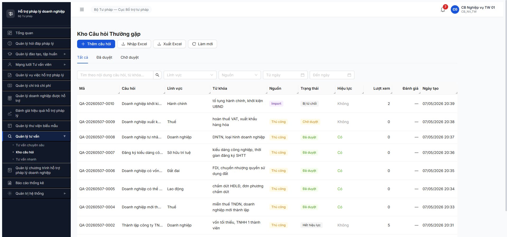

# Bug Report — Tư vấn Nhanh (FR-13) — R7.7.11 Functional

| Thông tin | Giá trị |
|-----------|---------|
| **Dự án** | PM-HTPLDN — Phần mềm Hỗ trợ Pháp lý Doanh nghiệp |
| **Môi trường** | http://103.172.236.130:3000/ |
| **Người test** | QA Automation (Chrome DevTools MCP) |
| **Ngày** | 2026-05-08 (R8 log + R9 update) |
| **Loại test** | Functional |
| **Round** | R8 (Kho Q&A) → **R9 (+2 bug mới TVN-004/005 sau test phiên TV nhanh)** |
| **Tài liệu tham chiếu** | [functional-test-report-r7-7-11-tvn.md](../../functional/tu-van-nhanh/functional-test-report-r7-7-11-tvn.md) · [srs-fr-13-tv-nhanh.md](../../../../../input/srs-v3/srs-fr-13-tv-nhanh.md) · [02-thu-tu-module.md §⑫ FR-13](../../../../../input/quy-trinh-nghiep-vu/02-thu-tu-module.md) |

---

## Tổng hợp

Phát hiện **5** lỗi có SRS reference cụ thể trong quá trình test R7.7.11 (R8 + R9).

### Severity breakdown

| Round | Tổng | Critical | Major | Medium | Minor | Trivial |
|-------|------|----------|-------|--------|-------|---------|
| R8 (initial) | 3 | 1 | 1 | 0 | 1 | 0 |
| **R9 (cumulative)** | **5** | **1** | **2** | **0** | **2** | **0** |

## Bug Summary Table

| Bug ID | Severity | Priority | Type | TC Ref | **SRS Reference** | Title | Status |
|--------|----------|----------|------|--------|-------------------|-------|--------|
| BUG-FUNC-TVN-001 | Critical | P0 | Permission | TVN-010, 011, 012 | `02-thu-tu-module.md §⑫ FR-13 line 784-786 (Transition CHO_DUYET → DA_DUYET / NHAP)` + `BR-AUTH-01` | CB NV TW (cb_nv_tw_01) approve/reject/bulk-approve Q&A thành công — vi phạm phân quyền chỉ cb_pd | Open |
| BUG-FUNC-TVN-002 | Major | P1 | Workflow | TVN-040, 041, 042, 043, 044 | `srs-fr-13 v3.5 FR-X.2-06 §Inputs/Processing line 411-457` + `BR-PUBLIC-01/02/03` + `BR-FLOW-05` | FR-X.2-06 (Công khai/Hủy công khai) chưa deploy — schema thiếu 4 field, endpoint 404 | Open |
| BUG-FUNC-TVN-003 | Minor | P2 | UI/UX | TVN-001 | `02-thu-tu-module.md §⑫ FR-13 line 766` + `srs-fr-13 SCR-X2-01 row 4` | Filter trạng thái dropdown thiếu trên UI list — chỉ có Lĩnh vực + Nguồn + dates | Open |
| **BUG-FUNC-TVN-004 (R9)** | **Major** | **P1** | **UI/UX** | **TVN-017, 018** | `srs-fr-13 FR-X.2-02 §Processing 3` + `SCR-X2-03 row 7-8 (Top 5 gợi ý từ KHO_CAU_HOI)` | **Top 5 gợi ý không render trên detail phiên DA_GOI_Y dù API trả `goiYTraLoi=[2 entries]`** | **Open** |
| **BUG-FUNC-TVN-005 (R9)** | **Minor** | **P2** | **Data** | **TVN-039** | `srs-fr-13 FR-X.2-01 §Postconditions` + `BR-DATA-05` + `7.13-tu-van-nhanh.md TVN-039 expected actions` | **Audit log action naming inconsistent (TU_CHOI vs REJECT_KHOCAUHOI; UPDATE vs TOGGLE_HIEU_LUC)** | **Open** |

---

## BUG-FUNC-TVN-001 — CB NV TW approve/reject/bulk-approve Q&A vi phạm phân quyền

### Mô tả

`cb_nv_tw_01` (vai trò CB_NV_TW, đơn vị BTP-TW) gọi 3 endpoint duyệt Kho Q&A đều thành công 200, hoàn tất chuyển trạng thái CHO_DUYET → DA_DUYET hoặc → NHAP. Spec `02-thu-tu-module.md §⑫ FR-13 line 784-786` chỉ định CB PD (`cb_pd_<cap>_01`) là role duy nhất có quyền [Duyệt] / [Từ chối] / [Duyệt hàng loạt]. CB NV chỉ được tạo (THU_CONG/IMPORT) + toggle hiệu lực (line 787). BE thiếu role guard trên 3 endpoint duyệt.

### Các bước tái hiện

1. Login `cb_nv_tw_01` / `Secret@123` + OTP `666666` → cookie session OK.
2. Tạo 1 Q&A CHO_DUYET (POST `/api/v1/kho-cau-hois`) — verify state CHO_DUYET, version=1.
3. Approve đơn lẻ:
   ```js
   fetch('/api/v1/kho-cau-hois/<id>/approve', {
     method:'POST', credentials:'include',
     headers:{'Content-Type':'application/json'},
     body: JSON.stringify({ version: 1 })
   })
   ```
   → expect 403 ERR-PERM-SYS-00-01, actual **200** + state CHO_DUYET → DA_DUYET, hieuLuc=true, ngayDuyet auto-fill, version=2.
4. Reject (CHO_DUYET khác):
   ```js
   fetch('/api/v1/kho-cau-hois/<id>/reject', {
     method:'POST', credentials:'include',
     headers:{'Content-Type':'application/json'},
     body: JSON.stringify({ ghiChu: 'Lý do test', version: 1 })
   })
   ```
   → expect 403, actual **200** + state CHO_DUYET → NHAP, ghiChuPheDuyet stored, version=2.
5. Bulk approve:
   ```js
   fetch('/api/v1/kho-cau-hois/approve-bulk', {
     method:'POST', credentials:'include',
     headers:{'Content-Type':'application/json'},
     body: JSON.stringify({ items: [{id:'...', version:1}, {id:'...', version:1}] })
   })
   ```
   → expect 403, actual **200** + `{ok:[id1,id2], failed:[]}` + cả 2 record CHO_DUYET → DA_DUYET.
6. Đối chiếu với QTHT (`qtht_01` cùng đơn vị): cả 3 endpoint trả 403 BR-AUTH-05 ✅ → BE đã có guard cho QTHT, chỉ thiếu cho CB_NV.

### Kết quả mong đợi

- BE phải kiểm tra role trước khi xử lý approve/reject/bulk-approve. cb_nv_tw_01 (CB_NV_TW) → 403 ERR-PERM-SYS-00-01 hoặc tương đương.
- Chỉ role CB_PD_TW / CB_PD_BN / CB_PD_DP (cùng cấp với người tạo theo BR-AUTH-05) mới được approve/reject.
- Spec line 784: `cb_pd_<cap>_01` [Duyệt] đơn lẻ. Line 785: `cb_pd_<cap>_01` [Duyệt hàng loạt]. Line 786: `cb_pd_<cap>_01` [Từ chối].

### Kết quả thực tế

- 3 endpoint approve/reject/approve-bulk đều trả 200 với cookie session cb_nv_tw_01.
- State chuyển đúng workflow (mechanics OK), nhưng skip hoàn toàn role check.
- Audit log trường `nguoiDuyetId` ghi nhận `0c039382-7162-49ce-b785-43dbd9f65c6d` (id của cb_nv_tw_01 — không phải CB PD).

```text
=== Trace cb_nv_tw_01 approve QA-20260508-0001 ===
POST /api/v1/kho-cau-hois/14b58c22-d84d-4dc6-9d6d-acba81ccb874/approve
     {version: 3}
→ 200 {success:true, data:{trangThai:'DA_DUYET', hieuLuc:true, version:4, nguoiDuyetId:'0c039382-...'}}

=== Trace cb_nv_tw_01 reject QA-20260507-0009 ===
POST /api/v1/kho-cau-hois/ebd06dfc-2788-4610-9bff-f92d181cb37f/reject
     {ghiChu:'Lý do từ chối: nội dung chưa rõ ràng cần biên tập lại theo quy định mới.', version:1}
→ 200 {success:true, data:{trangThai:'NHAP', ghiChuPheDuyet:'...', version:2}}

=== Trace cb_nv_tw_01 approve-bulk 2 records ===
POST /api/v1/kho-cau-hois/approve-bulk
     {items:[{id:'5e62...', version:1}, {id:'a061...', version:1}]}
→ 200 {success:true, data:{ok:['5e62...','a061...'], failed:[]}}

=== Đối chiếu qtht_01 cùng endpoint ===
POST /api/v1/kho-cau-hois/c7b8a1c2-.../approve  {version:1}
→ 403 {code:'BR-AUTH-05', message:'Khong co quyen thao tac tren don vi khac'}  ✅ guard OK

POST /api/v1/kho-cau-hois/c7b8a1c2-.../reject  {ghiChu:'...', version:1}
→ 403 BR-AUTH-05  ✅ guard OK
```

### Bằng chứng



```json
// Response approve thành công với cb_nv_tw_01
{
  "success": true,
  "data": {
    "id": "14b58c22-d84d-4dc6-9d6d-acba81ccb874",
    "maCauHoi": "QA-20260508-0001",
    "trangThai": "DA_DUYET",
    "hieuLuc": true,
    "nguoiDuyetId": "0c039382-7162-49ce-b785-43dbd9f65c6d",
    "ngayDuyet": "2026-05-07T17:25:54.349Z",
    "version": 3
  }
}
```

### So sánh (Comparison) — phân quyền theo role

| Role | Create | Update CHO_DUYET | Approve | Reject | Bulk Approve | Toggle hết hiệu lực | Read |
|------|:------:|:----------------:|:-------:|:------:|:------------:|:-------------------:|:----:|
| CB_NV_TW (spec) | ✅ | ✅ | ❌ | ❌ | ❌ | ✅ | ✅ |
| **CB_NV_TW (actual cb_nv_tw_01)** | ✅ | ✅ | **❌→ ✅ BUG** | **❌→ ✅ BUG** | **❌→ ✅ BUG** | ✅ | ✅ |
| CB_PD_TW (spec) | — | — | ✅ | ✅ | ✅ | — | ✅ |
| CB_PD_TW (actual) | — | — | (chưa verify, defer) | (chưa verify, defer) | (chưa verify, defer) | — | ✅ |
| QTHT (spec) | ❌ | ❌ | ❌ | ❌ | ❌ | ❌ | ✅ |
| **QTHT (actual qtht_01)** | ❌ 403 ✅ | ❌ 403 ✅ | ❌ 403 ✅ | ❌ 403 ✅ | ❌ 403 ✅ | ❌ 403 ✅ | ✅ |

---

## BUG-FUNC-TVN-002 — FR-X.2-06 (Công khai/Hủy công khai) chưa deploy

### Mô tả

FR-X.2-06 v3.5 (UC156) thêm action [Công khai] / [Hủy công khai] cho CB NV trên Q&A `trang_thai=DA_DUYET` — bao gồm 4 trường mới (`congKhai`, `thoiGianDangTai`, `moTaCongKhai`, `fileDinhKemCongKhai`), enum mới `CONG_KHAI` ở `KHO_CAU_HOI.trang_thai`, 3 BR mới (BR-PUBLIC-01/02/03), BR-FLOW-05 (gọi API Cổng PLQG). Schema `KHO_CAU_HOI` thực tế thiếu cả 4 trường; endpoint `/cong-khai`, `/publish`, `/dang-tai` đều 404; PATCH `{congKhai:true}` bị BE từ chối với 409 "Khong the cap nhat o trang thai 'DA_DUYET'". → BE chưa deploy migration v3.5.

### Các bước tái hiện

1. Login `cb_nv_tw_01` → mở 1 Q&A DA_DUYET (vd QA-20260508-0001).
2. Verify schema:
   ```js
   fetch('/api/v1/kho-cau-hois?page=1&pageSize=20').then(r=>r.json())
   ```
   → response data `[0]` chứa 21 field cũ: `id, nguoiTaoId, nguoiCapNhatId, ngayTao, ngayCapNhat, donViId, seqId, version, trangThai, nguoiGuiDuyetId, ngayGuiDuyet, nguoiDuyetId, ngayDuyet, ghiChuPheDuyet, maCauHoi, cauHoi, cauTraLoi, linhVucId, tuKhoa, nguon, hieuLuc, soLuotXem, soLuotSuDung, diemDanhGiaTb, linhVuc`. KHÔNG có `congKhai` / `thoiGianDangTai` / `moTaCongKhai` / `fileDinhKemCongKhai`.
3. Probe các endpoint công khai:
   - `POST /api/v1/kho-cau-hois/{id}/cong-khai` → 404 ERR-SYS-00-04-01 "Cannot POST"
   - `POST /api/v1/kho-cau-hois/{id}/publish` → 404
   - `POST /api/v1/kho-cau-hois/{id}/dang-tai` → 404
   - `PATCH /api/v1/kho-cau-hois/{id}` body `{congKhai:true, version:3}` → 409 ERR-BIZ-KCH-01 "Khong the cap nhat o trang thai 'DA_DUYET'"
4. Verify UI: trang `/tv-nhanh/kho-cau-hoi` toolbar không có Switch [Công khai] inline; detail panel cũng không có toggle.

### Kết quả mong đợi

- Schema KHO_CAU_HOI có thêm 4 field mới + enum CONG_KHAI ở trang_thai.
- Endpoint `POST /api/v1/kho-cau-hois/{id}/cong-khai` body `{moTaCongKhai, fileDinhKemCongKhai, version}` → BE gọi API Cổng PLQG (BR-FLOW-05). API thành công → SET trang_thai=CONG_KHAI + auto-fill `thoiGianDangTai` (BR-PUBLIC-03 dd/mm/yyyy hh:mm).
- Endpoint hủy công khai tương tự, set lại DA_DUYET + clear timestamp (BR-PUBLIC-02).
- UI có Switch [Công khai] inline tại row Q&A DA_DUYET, mở modal xác nhận với preview ảnh đại diện + mô tả + file đính kèm.
- 5 TC TVN-040..044 chạy được.

### Kết quả thực tế

- Schema thiếu 4 field công khai → không có chỗ store.
- 3 endpoint công khai 404 → BE controller chưa add.
- PATCH với `congKhai:true` bị block với 409 generic — BE không hiểu trường này.
- UI không có Switch / Modal công khai.

```json
// PATCH với congKhai → 409
{
  "success": false,
  "error": {
    "code": "ERR-BIZ-KCH-01",
    "message": "Khong the cap nhat o trang thai 'DA_DUYET'",
    "timestamp": "2026-05-07T17:27:48.222Z"
  }
}

// /cong-khai → 404
{
  "success": false,
  "error": {
    "code": "ERR-SYS-00-04-01",
    "message": "Cannot POST /api/v1/kho-cau-hois/.../cong-khai"
  }
}
```

### Bằng chứng

![BUG-FUNC-TVN-002 — UI list không có Switch [Công khai] / cột Công khai cho Q&A DA_DUYET](image/r7-7-11-tvn-001-list-tatca.png)

---

## BUG-FUNC-TVN-003 — Filter trạng thái dropdown thiếu trên UI list

### Mô tả

Spec `02-thu-tu-module.md §⑫ FR-13 line 766` quy định filter bar SCR-X2-01 phải có dropdown "Trạng thái" cover 5 enum NHAP/CHO_DUYET/DA_DUYET/CONG_KHAI/HET_HIEU_LUC. UI thực tế tại `/tv-nhanh/kho-cau-hoi` filter bar chỉ có Lĩnh vực + Nguồn + Từ ngày + Đến ngày. 3 tab (Tất cả/Đã duyệt/Chờ duyệt) chỉ cover được 3 state: tất cả / DA_DUYET-hieuLuc / CHO_DUYET. Thiếu lối tắt filter NHAP / HET_HIEU_LUC / CONG_KHAI riêng. API đã hỗ trợ `?trangThai=` (verified bằng API call), FE chưa expose dropdown.

### Các bước tái hiện

1. Login `cb_nv_tw_01` → mở `/tv-nhanh/kho-cau-hoi`.
2. Quan sát filter bar:
   ```
   [Search] [LĨNH VỰC ▼] [NGUỒN ▼] [Từ ngày 📅] [Đến ngày 📅]
   ```
3. Click dropdown để xem option — KHÔNG có "Trạng thái".
4. Verify API hỗ trợ:
   ```js
   fetch('/api/v1/kho-cau-hois?trangThai=NHAP') → 200 (filter works)
   fetch('/api/v1/kho-cau-hois?trangThai=HET_HIEU_LUC') → 200
   ```

### Kết quả mong đợi

- Filter bar có 4 dropdown: Lĩnh vực + Nguồn + **Trạng thái** + dates.
- Dropdown Trạng thái option: NHAP / CHO_DUYET / DA_DUYET / CONG_KHAI / HET_HIEU_LUC (5 enum) hoặc 4 cho v3 + 1 cho v3.5.
- Khi chọn option → call API `?trangThai=<value>` → reload table.

### Kết quả thực tế

- Filter bar chỉ có 3 dropdown (Lĩnh vực + Nguồn + dates) + searchbox.
- 3 tab cover hạn chế (Tất cả / Đã duyệt = DA_DUYET ∧ hieuLuc / Chờ duyệt = CHO_DUYET ∪ NHAP — see Observation).
- User không có lối filter trực tiếp NHAP / HET_HIEU_LUC qua UI.

### Bằng chứng


---

## BUG-FUNC-TVN-004 (R9) — Top 5 gợi ý không render trên detail phiên DA_GOI_Y

### Mô tả

Trên trang detail phiên TV nhanh `/tv-nhanh/{id}` (state DA_GOI_Y), panel "Top 5 gợi ý từ Kho câu hỏi" luôn hiển thị empty placeholder "Không tìm thấy gợi ý phù hợp. Vui lòng soạn thảo thủ công." dù API GET detail trả `goiYTraLoi=[2 entries score 85/75]`. Network trace cho thấy UI gọi `GET /api/v1/tu-van-nhanhs/{id}/goi-y` (200, `data:[]` empty) thay vì đọc field `goiYTraLoi` từ detail response. Hệ quả: TVN-018 (click [Chọn] gợi ý → auto-fill rich-text) BLOCKED hoàn toàn — CB NV phải soạn tay 100% trên 9/10 phiên DA_GOI_Y có sẵn gợi ý.

### Các bước tái hiện

1. Login `cb_nv_tw_01` / `Secret@123` + OTP `666666` → cookie session OK.
2. Mở `/tv-nhanh/danh-sach` → click tab "Đã gợi ý" → click button [message] hoặc [eye] trên row có badge "Đã gợi ý" (vd TVN-QA-20260426-0018).
3. Detail page render: heading + Stepper 5 state + thông tin DN + câu hỏi DN + panel "Top 5 gợi ý từ Kho câu hỏi" + form Soạn trả lời.
4. Quan sát panel "Top 5 gợi ý":
   - Hiển thị icon "Trống" + text "Không tìm thấy gợi ý phù hợp. Vui lòng soạn thảo thủ công."
   - KHÔNG có card gợi ý nào, KHÔNG có button [Chọn].
5. Verify API:
   ```js
   await fetch('/api/v1/tu-van-nhanhs/c913fc3e-ae2e-4472-9e84-b8da45bb22f9').then(r=>r.json())
   // → data.goiYTraLoi = [{score:85, cauHoi:'Câu hỏi tham chiếu #18A'}, {score:75, cauHoi:'Câu hỏi tham chiếu #18B'}]
   await fetch('/api/v1/tu-van-nhanhs/c913fc3e-ae2e-4472-9e84-b8da45bb22f9/goi-y').then(r=>r.json())
   // → data: [] (empty!)
   ```
6. Verify network: UI gọi 2 endpoint song song. Endpoint `/{id}` trả goiYTraLoi populated, endpoint `/{id}/goi-y` trả empty. UI render dựa endpoint /goi-y → empty state.

### Kết quả mong đợi

- Theo SRS FR-X.2-02 §Processing 3 + SCR-X2-03 row 8, panel "Top 5 gợi ý" phải:
  - Render TOP 5 cards với mỗi card: Mã Q&A / Câu hỏi (bold) / Câu trả lời / Score relevance % / button [Chọn]
  - Sắp theo relevance DESC
  - Click [Chọn] → auto-fill ô soạn trả lời (Rich Text C16)
- 9/10 phiên DA_GOI_Y có sẵn `goiYTraLoi[≥1 entries]` từ dev seed → expected ≥1 card mỗi phiên.

### Kết quả thực tế

- Panel render empty placeholder cho 100% phiên DA_GOI_Y, kể cả phiên có goiYTraLoi populated.
- TVN-018 BLOCKED — không có button [Chọn] để click.
- CB NV phải soạn tay toàn bộ — vi phạm core value FR-X.2-02 (gợi ý tự động giảm thời gian xử lý).

```text
=== R9 trace BUG-FUNC-TVN-004 (cb_nv_tw_01, 2026-05-08 01:15) ===
Sample: TVN-QA-20260426-0018 (id c913fc3e-ae2e-4472-9e84-b8da45bb22f9)

GET /api/v1/tu-van-nhanhs/c913fc3e-... → 200
   goiYTraLoi: [
     { score: 85, cauHoi: "Câu hỏi tham chiếu #18A" },
     { score: 75, cauHoi: "Câu hỏi tham chiếu #18B" }
   ]

GET /api/v1/tu-van-nhanhs/c913fc3e-.../goi-y → 200
   data: []  ❌ empty

UI render: "Không tìm thấy gợi ý phù hợp. Vui lòng soạn thảo thủ công."
   ❌ KHÔNG đọc detail.goiYTraLoi
   ❌ Hoặc /goi-y endpoint chưa SELECT từ KHO_CAU_HOI / chưa trả goiYTraLoi đã store

=== Pool stats ===
DA_GOI_Y phiên có goiYTraLoi populated: 9/10
DA_GOI_Y phiên có goiYTraLoi=[]: 1/10 (TVN-QA-20260427-0017 — đúng hiển thị empty)
```

### Bằng chứng

![BUG-FUNC-TVN-004 — Detail TVN-QA-20260426-0018: API có goiYTraLoi[2 entries] nhưng UI panel "Top 5 gợi ý" hiển thị "Không tìm thấy gợi ý phù hợp"](image/r7-7-11-tvn-017-goi-y-mismatch.png)

---

## BUG-FUNC-TVN-005 (R9) — Audit log action naming inconsistent

### Mô tả

Spec [`7.13-tu-van-nhanh.md TVN-039`](../../../../funtion/7.13-tu-van-nhanh.md) yêu cầu audit log ghi action với naming convention rõ: CREATE/UPDATE/DELETE_KHOCAUHOI, APPROVE/REJECT_KHOCAUHOI, IMPORT_EXCEL, TOGGLE_HIEU_LUC, CONG_KHAI, HUY_CONG_KHAI, GUI_TRA_LOI_TVNHANH, DANH_GIA_TVNHANH, AUTO_HET_HAN. Endpoint `/api/v1/audit-logs` trả naming inconsistent: (a) `TU_CHOI` (Vietnamese) cho reject thay vì `REJECT_KHOCAUHOI`; (b) generic `UPDATE` cho het-hieu-luc thay vì `TOGGLE_HIEU_LUC`; (c) `TRA_LOI` thay vì `GUI_TRA_LOI_TVNHANH`. Mechanism INSERT-only audit + ipAddress + sessionId + endpoint + responseCode đầy đủ ✅.

### Các bước tái hiện

1. Login `qtht_01` (cb_nv_tw_01 không có quyền xem audit, 403 ERR-PERM-SYS-00-01).
2. Test các action trên kho QA + phiên TV trước (xem TVN-010..013 + TVN-019).
3. Query audit log:
   ```js
   await fetch('/api/v1/audit-logs?entityType=KHO_CAU_HOI&pageSize=10').then(r=>r.json())
   await fetch('/api/v1/audit-logs?entityType=TU_VAN_NHANH&pageSize=10').then(r=>r.json())
   ```
4. Quan sát field `hanhDong` trên các events.

### Kết quả mong đợi

- hanhDong values match spec naming, ví dụ:
  - REJECT_KHOCAUHOI (cho /reject) ← actual `TU_CHOI`
  - TOGGLE_HIEU_LUC (cho /het-hieu-luc) ← actual `UPDATE`
  - GUI_TRA_LOI_TVNHANH (cho /tra-loi) ← actual `TRA_LOI`
- Naming cho phép kiểm toán nghiệp vụ theo action cụ thể (vd group by action để báo cáo "X lần từ chối Q&A" / "Y lần toggle hết hiệu lực").

### Kết quả thực tế

```json
// GET /api/v1/audit-logs?entityType=KHO_CAU_HOI sample events:
[
  { entityType:"KHO_CAU_HOI", hanhDong:"APPROVE",  endpoint:"POST /kho-cau-hois/approve-bulk", responseCode:200 },
  { entityType:"KHO_CAU_HOI", hanhDong:"CREATE",   endpoint:"POST /kho-cau-hois",              responseCode:201 },
  { entityType:"KHO_CAU_HOI", hanhDong:"UPDATE",   endpoint:"POST /kho-cau-hois/.../het-hieu-luc", responseCode:200 },  // ⚠️ should be TOGGLE_HIEU_LUC
  { entityType:"KHO_CAU_HOI", hanhDong:"TU_CHOI",  endpoint:"POST /kho-cau-hois/.../reject",    responseCode:200 },  // ⚠️ Vietnamese, should be REJECT_KHOCAUHOI
  { entityType:"KHO_CAU_HOI", hanhDong:"APPROVE",  endpoint:"POST /kho-cau-hois/.../approve",   responseCode:200 }
]

// GET /api/v1/audit-logs?entityType=TU_VAN_NHANH sample events:
[
  { entityType:"TU_VAN_NHANH", hanhDong:"TRA_LOI", endpoint:"POST /tu-van-nhanhs/.../tra-loi", responseCode:200 }  // ⚠️ should be GUI_TRA_LOI_TVNHANH
]
```

3 inconsistency confirmed. Action TOGGLE_HIEU_LUC, GUI_TRA_LOI_TVNHANH, IMPORT_EXCEL, CONG_KHAI/HUY_CONG_KHAI, DANH_GIA_TVNHANH, AUTO_HET_HAN chưa observable (1 phần BE chưa expose action specific, 1 phần feature chưa implement).

### Bằng chứng

```text
=== Audit log endpoint trace (qtht_01, 2026-05-08 01:25) ===
GET /api/v1/audit-logs (cb_nv_tw_01) → 403 ERR-PERM-SYS-00-01 ❌ (cần QTHT/admin)
GET /api/v1/audit-logs (qtht_01)     → 200 ✅ schema OK

Schema event:
  - id, entityType, entityId, hanhDong, nguoiThucHienId, systemActor, consumerId
  - thoiGian, ipAddress, endpoint, responseCode, sessionId, module

INSERT-only verify: không có endpoint PATCH/DELETE audit-logs (404).
```

---

## Phụ lục — Môi trường test

| Thành phần | Giá trị |
|------------|---------|
| URL ứng dụng | http://103.172.236.130:3000/ |
| OTP login | `666666` (bypass tạm thời) |
| MailHog (OTP inbox) | http://103.172.236.130:8025 |
| API base | `/api/v1` (note: plural endpoints `/kho-cau-hois`, `/tu-van-nhanhs` — KHÔNG có `s` trả 404) |
| Frontend | React + Vite + Ant Design (Modal + Form + Table + Tabs) |
| Xác thực | Cookie httpOnly session + OTP 6-digit (BR-AUTH-01 Tier 1). Session timeout ~5 phút idle. |
| Tool test | Chrome DevTools MCP + isolated browser context (qtht_01 vs cb_nv_tw_01 cùng lúc) |

---

*Bug report generated: 2026-05-08 | QA Automation via Claude Code*
