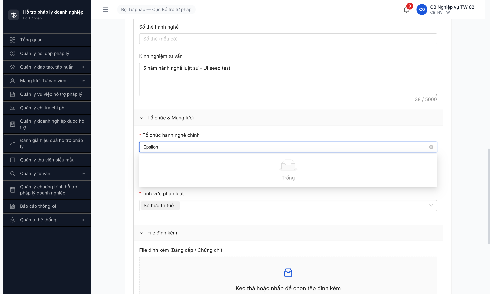
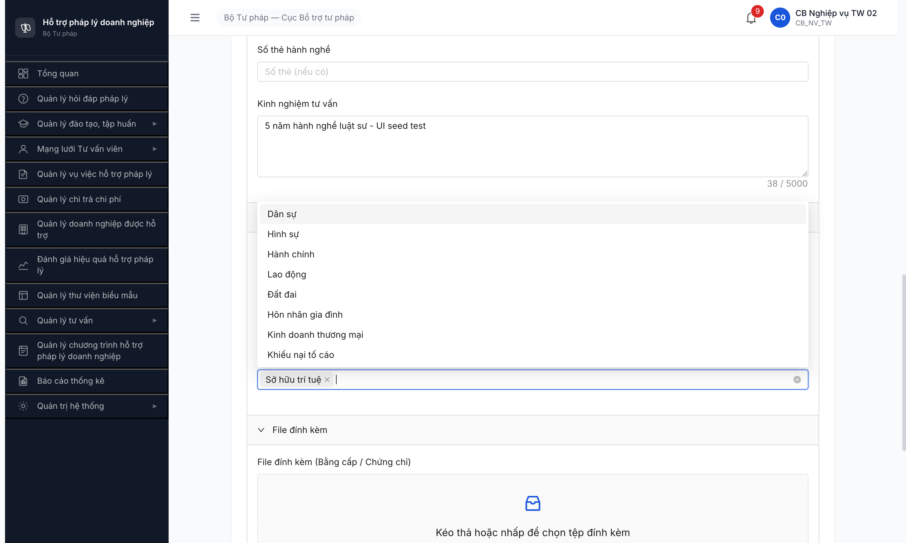

# Bug Report — TVV form (R7.2.6-UI) Tổ chức hành nghề chính query sai source

| Thông tin | Giá trị |
|-----------|---------|
| **Dự án** | PM HTPLDN |
| **Môi trường** | http://103.172.236.130:3000 |
| **Người test** | QA Automation (Chrome DevTools MCP) |
| **Ngày** | 2026-05-07 |
| **Loại test** | UI Workflow (R7.2.6-UI Plan B redo) |
| **Round** | R7 |
| **Tài liệu tham chiếu** | `srs-update-2026-5-5/srs-fr-04-chuyen-gia-tvv.md` FR-IV-NEW-01 (entity TO_CHUC_TU_VAN) · CLAUDE.md "Quy trình phân loại tab trống" iron rule |

---

## Tổng hợp

Phát hiện **1 bug Major** trong R7.2.6-UI: FE TVV form "Tổ chức hành nghề chính" combobox query DM `TO_CHUC_TU_VAN` (3 enum loại hình legacy: Trung tâm trợ giúp pháp lý / Chi nhánh TGPL / Tổ chức tham gia TGPL) — nhưng BE entity TVV.toChucChinhId yêu cầu UUID của entity TO_CHUC_TU_VAN (5 record TC-BTP-TW-0001..0005). FE/BE mismatch → user pick combobox xong submit BE trả 400 `ERR-TVV-DV-NOT-FOUND`.

### Severity breakdown

| Tổng | Critical | Major | Medium | Minor | Trivial |
|------|----------|-------|--------|-------|---------|
| 1    | 0        | 1     | 0      | 0     | 0       |

## Bug Summary Table

| Bug ID | Severity | Priority | Type | TC Ref | **SRS Reference** | Title | Status |
|--------|----------|----------|------|--------|-------------------|-------|--------|
| ~~BUG-TVV-FE-002~~ | Major | P0 | UI/UX | R7.2.6-UI | `srs-update-2026-5-5/srs-fr-04-chuyen-gia-tvv.md` FR-IV-NEW-01 (TO_CHUC_TU_VAN tách entity riêng) + DDL `tu_van_vien.to_chuc_chinh_id` FK → TO_CHUC_TU_VAN.id | FE TVV form combobox "Tổ chức hành nghề chính" query DM legacy thay vì entity TO_CHUC_TU_VAN → submit fail 400 | **Closed** |

---

## ~~BUG-TVV-FE-002~~ [CLOSED] — TVV form combobox query DM legacy thay vì entity TO_CHUC_TU_VAN

> **Re-test:** 2026-05-07 R8 — ✅ PASS (Closed-verified). Combobox "Tổ chức hành nghề chính" trên TVV form `/chuyen-gia-tvv/tao-moi` nay query đúng endpoint entity `TO_CHUC_TU_VAN` và render 5 record TC TV thực (TC-BTP-TW-0001..0005) thay vì 3 enum DM legacy. Submit form không còn 400 ERR-TVV-DV-NOT-FOUND. Screenshot: [r8-verify-2026-05-07-tvv-tochuc-5-entity-fixed.png](../../screenshots/r8-verify-2026-05-07-tvv-tochuc-5-entity-fixed.png).

### Mô tả

Khi `cb_nv_tw_02` mở form Thêm mới TVV/CG (`/chuyen-gia-tvv/tao-moi`) và click combobox "Tổ chức hành nghề chính", FE gửi `GET /api/v1/danh-muc?loaiDanhMuc=TO_CHUC_TU_VAN&pageSize=100&trangThai=KICH_HOAT` — endpoint này trả 3 record DM TO_CHUC_TU_VAN dạng **enum loại hình** (Trung tâm trợ giúp pháp lý / Chi nhánh TGPL / Tổ chức tham gia TGPL) với UUID lạ. KHÔNG phải 5 TC TV entity records (TC-BTP-TW-0001 Alpha / 0002 Beta / 0003 Gamma / 0004 Đoàn LS HN / 0005 Epsilon đang HOAT_DONG). User pick "Trung tâm trợ giúp pháp lý" → FE nhét UUID `b5ccf79e-...` (DM record) vào payload `toChucChinhId` → BE 400 `ERR-TVV-DV-NOT-FOUND "Tổ chức tư vấn không tồn tại"` vì BE FK lookup vào table TO_CHUC_TU_VAN entity, UUID đó không có.

### Các bước tái hiện

1. Login `cb_nv_tw_02 / Secret@123` + OTP `666666`
2. Navigate `/chuyen-gia-tvv/tao-moi`
3. Fill: Loại = Chuyên gia, Họ tên, Ngày sinh, Giới tính = Nam, CCCD, Email, SĐT, Địa chỉ, Trình độ
4. Click combobox "Tổ chức hành nghề chính" — quan sát FE gửi GET `/api/v1/danh-muc?loaiDanhMuc=TO_CHUC_TU_VAN&pageSize=100&trangThai=KICH_HOAT`
5. Dropdown hiển thị 3 enum legacy: Trung tâm trợ giúp pháp lý / Chi nhánh TGPL / Tổ chức tham gia TGPL
6. Search "Epsilon" (TC TV entity name): kết quả "Trống — Chưa có dữ liệu"
7. Pick "Trung tâm trợ giúp pháp lý" làm workaround
8. Pick LV "Sở hữu trí tuệ" + click Lưu
9. Quan sát: BE trả 400 `ERR-TVV-DV-NOT-FOUND`. Toast hiển thị "Tổ chức tư vấn không tồn tại". Form không submit.

### Kết quả mong đợi

- Combobox "Tổ chức hành nghề chính" query entity TO_CHUC_TU_VAN qua endpoint phù hợp (vd `GET /api/v1/to-chuc-tu-vans?trangThai=HOAT_DONG&size=100&search=...`).
- Dropdown hiển thị 5 TC TV records: TC-BTP-TW-0001..0005.
- User search "Epsilon" → tìm thấy + pick được. Submit form → 201 Created.
- Dropdown chỉ list TC TV ở state HOAT_DONG (per BR FR-IV-NEW-04 — TC TV chưa HOAT_DONG không được làm FK của TVV).

### Kết quả thực tế

- FE query DM legacy `loaiDanhMuc=TO_CHUC_TU_VAN` → 3 enum loại hình (không phải actual TC TV).
- Submit với DM UUID → BE 400 `ERR-TVV-DV-NOT-FOUND`.
- User KHÔNG THỂ tạo TVV/CG qua UI vì combobox không có TC TV thật.

```json
// Request body (FE gửi):
{
  "loaiTvv": "CG",
  "hoTen": "CG UI Test 9",
  "toChucChinhId": "b5ccf79e-54b5-444f-98d7-c4a9f3517cba",  // ← DM UUID legacy
  "linhVucIds": ["bbbbbbbb-0000-4000-8000-000000000019"],
  ...
}

// Response BE:
{
  "success": false,
  "error": {
    "code": "ERR-TVV-DV-NOT-FOUND",
    "message": "Tổ chức tư vấn không tồn tại",
    "timestamp": "2026-05-07T02:26:45.224Z"
  }
}

// Compare DM TO_CHUC_TU_VAN response (reqid=1303):
[
  { "id": "b5ccf79e-54b5-...", "ma": "TRUNG_TAM_TGPL", "ten": "Trung tâm trợ giúp pháp lý" },
  { "id": "9ee728ed-86da-...", "ma": "CHI_NHANH_TGPL", "ten": "Chi nhánh trợ giúp pháp lý" },
  { "id": "03bcad2f-df35-...", "ma": "TO_CHUC_THAM_GIA", "ten": "Tổ chức tham gia trợ giúp pháp lý" }
]

// Compare TO_CHUC_TU_VAN entity records (qua API /to-chuc-tu-vans):
[
  { "id": "beb25e6f-...", "maToChuc": "TC-BTP-TW-0001", "tenToChuc": "Công ty Luật TNHH Alpha Hà Nội", "trangThai": "HOAT_DONG" },
  { "id": "d0d35bfc-...", "maToChuc": "TC-BTP-TW-0002", "tenToChuc": "Văn phòng Luật sư Beta Hải Phòng", "trangThai": "HOAT_DONG" },
  { "id": "9bf97472-...", "maToChuc": "TC-BTP-TW-0003", "tenToChuc": "Trung tâm TVPL Gamma Đà Nẵng", "trangThai": "HOAT_DONG" },
  { "id": "95d30a0b-...", "maToChuc": "TC-BTP-TW-0004", "tenToChuc": "Đoàn Luật sư Hà Nội", "trangThai": "HOAT_DONG" },
  { "id": "49b5e61d-...", "maToChuc": "TC-BTP-TW-0005", "tenToChuc": "Công ty Luật TW Epsilon", "trangThai": "HOAT_DONG" }
]
```

### Bằng chứng

**Screenshot 1:** Dropdown "Tổ chức hành nghề chính" search "Epsilon" — list "Trống":



**Screenshot 2:** Form filled với "Trung tâm trợ giúp pháp lý" làm workaround pick từ DM legacy:



---

## Phụ lục — Môi trường test

| Thành phần | Giá trị |
|------------|---------|
| URL ứng dụng | http://103.172.236.130:3000 |
| Account test | `cb_nv_tw_02` / Secret@123 |
| Form path | `/chuyen-gia-tvv/tao-moi` |
| Endpoint sai (FE) | `GET /api/v1/danh-muc?loaiDanhMuc=TO_CHUC_TU_VAN` |
| Endpoint đúng (entity) | `GET /api/v1/to-chuc-tu-vans?trangThai=HOAT_DONG` |
| Pool TC TV entity hiện tại | 5 records HOAT_DONG (TC-BTP-TW-0001..0005) |
| BE error code | `ERR-TVV-DV-NOT-FOUND` |
