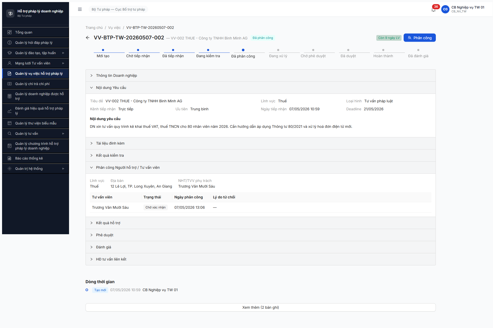
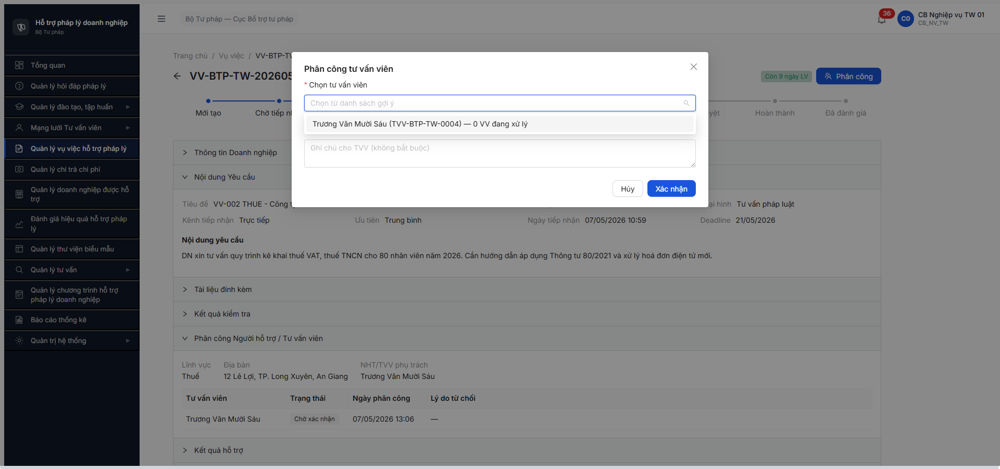

# Bug Report — Vụ việc HTPL — Phân công cascade chặn workflow A3-PUBLIC

| Thông tin | Giá trị |
|-----------|---------|
| **Dự án** | PM HTPLDN |
| **Môi trường** | http://103.172.236.130:3000/ |
| **Người test** | QA Automation (Claude Code via Chrome DevTools MCP) |
| **Ngày** | 2026-05-08 |
| **Loại test** | Workflow + Permission |
| **Round** | R8 (post-Round 7) |
| **Tài liệu tham chiếu** | [todo.md R7.4.A3-PUBLIC](../../../../tasks/todo.md#r7-4-a3-public) · [smoke 6.5-sm-vuviec.md](../../../smoke/6.5-sm-vuviec.md) · SRS `srs-fr-05-vu-viec.md:1765-1770` |

---

## Tổng hợp

Phát hiện **2** bug cascade chặn việc chạy R7.4.A3-PUBLIC khi cố advance VV-002 từ DA_PHAN_CONG → DANG_XU_LY. Cả 2 đều cần fix mới unblock được R7.4.A3 (workflow base) + tất cả task downstream của Trụ A.

> **Rule log bug (feedback 2026-04-23):** Bug có SRS reference cụ thể.

### Severity breakdown

| Tổng | Critical | Major | Medium | Minor | Trivial |
|------|----------|-------|--------|-------|---------|
| 2    | 1        | 1     | 0      | 0     | 0       |

## Bug Summary Table

| Bug ID | Severity | Priority | Type | TC Ref | **SRS Reference** | Title | Status |
|--------|----------|----------|------|--------|-------------------|-------|--------|
| BUG-VV-PC-001 | Critical | P0 | Permission | TP-VV-01 / TP-VV-10 | `srs-fr-05-vu-viec.md:1765 §SM Bảng chuyển trạng thái` (Đạt + chọn NHT) + `srs-fr-05-vu-viec.md:1768` (NHT/TVV xác nhận) | UI/BE phân công VV cho phép chọn CG (vai trò CG không có quyền `read_vu_viec` → entity được phân công không thể accept) | Open |
| BUG-VV-PC-002 | Major | P1 | Workflow | TP-VV-01 | `srs-fr-05-vu-viec.md:1765` (NHT đang hoạt động) | BE endpoint `/goi-y-tvv` filter chỉ trả 1 CG cho VV cấp TW; KHÔNG trả NHT-BTP-TW-0001 (CHO_KICH_HOAT) hoặc 3 NHT-STP-* (HOAT_DONG cấp ĐP) | Open |

> **Type:** `Permission` = phân quyền · `Workflow` = state machine transition.

---

## BUG-VV-PC-001 — UI/BE phân công VV cho phép chọn CG (entity sai vai trò) → CG không có quyền `read_vu_viec` để accept

### Mô tả

Khi CB NV phân công VV (transition `DANG_KIEM_TRA → DA_PHAN_CONG`), modal "Phân công tư vấn viên" trả entity loại **CG** (Chuyên gia, vai_tro `CG`). Sau khi phân công thành công, CG đăng nhập KHÔNG truy cập được VV vì vai trò CG không có permission `read_vu_viec` (BE trả 403 ERR-PERM-SYS-00-01). Hệ thống đang ở deadlock: VV state DA_PHAN_CONG, người được phân công không thể accept → KHÔNG có cách advance sang DANG_XU_LY qua UI.

### Các bước tái hiện

1. Login `cb_nv_tw_01 / Secret@123` → OTP `666666`
2. Mở "Quản lý Vụ việc HTPL" → click VV-002 (`VV-BTP-TW-20260507-002`, state "Đã phân công", NHT/TVV phụ trách = "Trương Văn Mười Sáu")
3. Click button **[Phân công]** (button duy nhất khả dụng ở state DA_PHAN_CONG) → modal "Phân công tư vấn viên" hiện ra
4. Click dropdown **"Chọn tư vấn viên"** → chỉ 1 option: `Trương Văn Mười Sáu (TVV-BTP-TW-0004) — 0 VV đang xử lý`
5. Tra cứu `TVV-BTP-TW-0004` qua R7.2.9 mail-kích-hoạt report → username `truong_16`, vai trò = `CG`
6. Logout → login `truong_16 / Secret@123` → OTP → landing `/403`. Sidebar chỉ 2 mục: "Quản lý đào tạo, tập huấn" + "Quản lý tư vấn" (TVCS — FR-V.II), KHÔNG có "Quản lý vụ việc"
7. Probe API trực tiếp: `GET /api/v1/vu-viecs?page=1&pageSize=20` → **403 ERR-PERM-SYS-00-01** "Forbidden"
8. Quan sát: vai trò `CG` thiếu permission `read_vu_viec` → CG được phân công VV nhưng KHÔNG truy cập được VV để xác nhận

### Kết quả mong đợi

Theo `srs-fr-05-vu-viec.md:1765` (Bảng chuyển trạng thái):
- `DANG_KIEM_TRA → DA_PHAN_CONG: Đạt + **chọn NHT** (Guard: NHT đang hoạt động)`

Theo `srs-fr-05-vu-viec.md:1768`:
- `DA_PHAN_CONG → DANG_XU_LY: NHT (TVV) xác nhận`

→ Modal phân công VV **CHỈ được phép chọn entity NHT (Mạng lưới Hỗ trợ)** + tùy interpretation v3.5 thêm TVV (loaiTvv=TVV); KHÔNG bao gồm CG. Ngoài ra entity được phân công phải có vai trò có permission `read_vu_viec` để có thể accept transition.

### Kết quả thực tế

- Modal phân công trả CG (loai_tvv=CG) làm gợi ý duy nhất.
- Vai trò `CG` không có `read_vu_viec` (verified qua login + API probe).
- VV-002 ở deadlock state — không advance được qua UI.

API response khi CG truy cập VV list:

```json
{
  "success": false,
  "error": {
    "code": "ERR-PERM-SYS-00-01",
    "message": "Forbidden",
    "timestamp": "2026-05-08T07:36:13.447Z",
    "requestId": "be6986ee-582c-4f4c-9603-6a2c340fe145"
  }
}
```

API response khi cb_nv_tw_01 query gợi ý phân công cho VV-002:

```json
{
  "success": true,
  "data": [{
    "id": "TVV-BTP-TW-0004",
    "hoTen": "Trương Văn Mười Sáu",
    "loaiTvv": "CG"
  }]
}
```

(BE chỉ trả 1 CG; xem chi tiết ở BUG-VV-PC-002)

### Bằng chứng




### So sánh (Comparison)

| Vai trò | `read_vu_viec` | `update_vu_viec` | Truy cập VV được phân công | Có thể accept VV (DA_PHAN_CONG → DANG_XU_LY) |
|---------|:-:|:-:|:-:|:-:|
| CB_NV_TW | ✅ | ✅ | ✅ | ❌ (spec — chỉ NHT/TVV trigger) |
| NHT | ✅ (cần verify) | — | ✅ | ✅ |
| **CG** | **❌ (BUG!)** | **❌** | **❌ 403** | **❌ — entity không hợp lệ theo spec** |
| TVV (loai_tvv=TVV) | cần verify | — | cần verify | ✅ |

---

## BUG-VV-PC-002 — BE endpoint `/goi-y-tvv` filter loại trừ NHT cho VV cấp TW

### Mô tả

Khi CB NV mở modal phân công VV-002 (cấp BTP-TW), BE endpoint `GET /api/v1/vu-viecs/{id}/goi-y-tvv?limit=20` chỉ trả về **1 entity loại CG** (truong_16 — TVV-BTP-TW-0004). KHÔNG trả về NHT-BTP-TW-0001 (state CHO_KICH_HOAT, đơn vị BTP-TW — phù hợp cấp) hoặc 3 NHT-STP-* (HOAT_DONG, cấp ĐP). Spec line 1765 chỉ định "**chọn NHT**, NHT đang hoạt động" — gợi ý phân công đáng lẽ phải đặt NHT là pool primary (không phải CG).

### Các bước tái hiện

1. Login `cb_nv_tw_01` → mở VV-002 → click [Phân công]
2. Quan sát Network tab: `GET /api/v1/vu-viecs/3be66862-e3fd-4755-89fb-340b8754cc81/goi-y-tvv?limit=20` → 200, response `data: [1 record CG]`
3. Probe NHT pool song song: `GET /api/v1/nguoi-ho-tro?size=100` → 200, returns ≥2 record:
   - `NHT-BTP-TW-0001` "NHT UI Test 04" (donViId BTP-TW = `00000000-0000-4000-8000-000000000001`, trangThai **CHO_KICH_HOAT**)
   - `NHT-STP-HP-0001` (cấp ĐP, HOAT_DONG)
4. Quan sát: NHT-BTP-TW-0001 đáng lẽ là gợi ý chính (cùng đơn vị BTP-TW + đúng loại entity); BE filter loại trừ.

### Kết quả mong đợi

Theo `srs-fr-05-vu-viec.md:1765` Bảng chuyển trạng thái:
> `DANG_KIEM_TRA → DA_PHAN_CONG: Đạt + chọn NHT` (Guard: **NHT đang hoạt động**)

Theo `srs-fr-05-vu-viec.md` BR-CALC-04 + BR-CALC-05 (gợi ý phân công):
> Pool gợi ý phân công gồm các NHT/TVV thoả mãn:
> - State HOAT_DONG (hoặc CHO_KICH_HOAT nếu có tham số config)
> - Cùng cấp đơn vị (BR-AUTH-04) — cấp TW pool TW; cấp BN/ĐP pool theo `don_vi_id`
> - Match `linh_vuc_phap_luat` (ưu tiên gợi ý)

→ BE phải trả ≥1 NHT trong pool gợi ý. Nếu không có NHT match → empty (cho phép CB NV chọn off-pool hoặc chờ activate).

### Kết quả thực tế

- BE chỉ trả 1 entity CG, KHÔNG trả NHT (mặc dù có ≥1 NHT-BTP-TW-0001 đúng cấp + đúng loại).
- Hậu quả: CB NV bị buộc chọn entity sai (CG) → cascade BUG-VV-PC-001.
- Đề xuất tách filter: `loaiTvv IN ('NHT', 'TVV')` + state HOAT_DONG (hoặc tuỳ config gồm CHO_KICH_HOAT). Nếu cần CG → tab/section riêng cho TVCS (FR-V.II), KHÔNG dùng cho VV (FR-V.I).

### Bằng chứng



API trace:

```
GET /api/v1/vu-viecs/3be66862-e3fd-4755-89fb-340b8754cc81/goi-y-tvv?limit=20 → 200
{ "success": true, "data": [{
  "maTvv": "TVV-BTP-TW-0004",
  "hoTen": "Trương Văn Mười Sáu",
  "loaiTvv": "CG"
}] }

GET /api/v1/nguoi-ho-tro?size=100 → 200
{ "success": true, "data": [
  { "maNht": "NHT-BTP-TW-0001", "donViId": "00000000-0000-4000-8000-000000000001", "trangThai": "CHO_KICH_HOAT" },
  { "maNht": "NHT-STP-HP-0001", ... },
  { "maNht": "NHT-STP-AG-0001", ... },
  { "maNht": "NHT-STP-DN-0001", ... }
] }
```

---

## Phụ lục — Môi trường test

| Thành phần | Giá trị |
|------------|---------|
| URL ứng dụng | http://103.172.236.130:3000/ |
| OTP login | `666666` bypass |
| MailHog (OTP inbox) | http://103.172.236.130:8025 |
| API base | http://103.172.236.130:3000/api/v1 |
| Frontend | React + Vite + Ant Design |
| Xác thực | JWT (refresh-token cookie HttpOnly) + OTP TOTP |
| Tool test | Chrome DevTools MCP |

---

*Bug report generated: 2026-05-08 | QA Automation via Claude Code*
